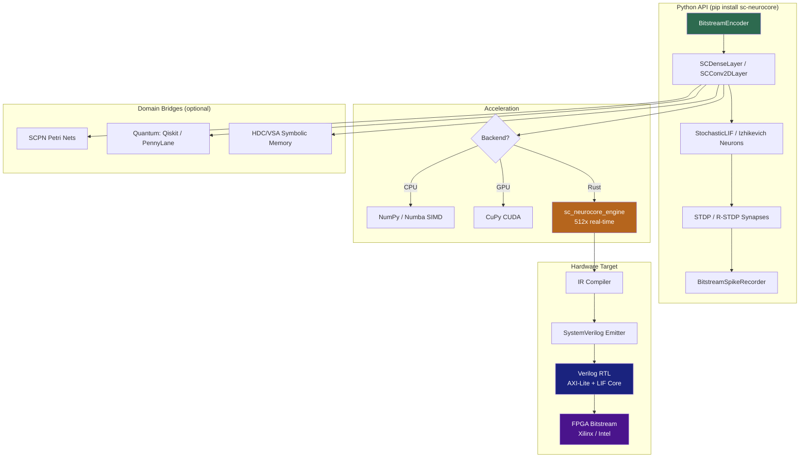

© 1998–2026 Miroslav Šotek. All rights reserved.
Contact: www.anulum.li | protoscience@anulum.li
ORCID: https://orcid.org/0009-0009-3560-0851
License: GNU AFFERO GENERAL PUBLIC LICENSE v3
Commercial Licensing: Available

# SC-NeuroCore

<p align="center">
  
</p>

[](https://github.com/anulum/sc-neurocore/actions/workflows/ci.yml)
[](https://github.com/anulum/sc-neurocore/releases)
[](https://github.com/anulum/sc-neurocore)
[](https://anulum.github.io/sc-neurocore/)
[](https://www.gnu.org/licenses/agpl-3.0)
[](https://www.python.org/downloads/)
[](https://www.rust-lang.org/)
[](https://www.bestpractices.dev/projects/12175)
[](https://scorecard.dev/viewer/?uri=github.com/anulum/sc-neurocore)
[](https://reuse.software/)
[](https://colab.research.google.com/github/anulum/sc-neurocore/blob/main/notebooks/quickstart_colab.ipynb)

**Version:** 3.10.0
**Status:** Production Core Verified | 1 451 Tests | 100% Coverage | CI/CD Active

<p align="center">
  
</p>

SC-NeuroCore is a deterministic stochastic computing framework for
neuromorphic hardware design and edge-AI deployment. It provides bit-true
Python simulation (digital twin environment) that matches Verilog RTL
cycle-exactly, a high-performance Rust engine (512x real-time), GPU-accelerated
inference, and a tiered module system from production FPGA targets to
research prototyping.

## Feature Comparison

| Feature | SC-NeuroCore | snnTorch | Norse | Lava | Brian2 |
|---------|:---:|:---:|:---:|:---:|:---:|
| Stochastic computing (bitstream) | **Yes** | — | — | — | — |
| Bit-true RTL co-simulation | **Yes** | — | — | — | — |
| Verilog / FPGA synthesis | **Yes** | — | — | Loihi only | — |
| IR compiler → SystemVerilog | **Yes** | — | — | — | — |
| Rust SIMD engine (512x) | **Yes** | — | — | — | — |
| Surrogate gradient training | Yes | Yes | Yes | Yes | — |
| GPU acceleration | CuPy | PyTorch | PyTorch | — | — |
| Neuron models (LIF, Izhikevich, …) | 7 | 11 | 6 | 3 | Arbitrary |
| Plasticity (STDP, R-STDP) | Yes | — | Yes | Yes | Yes |
| Hyperdimensional computing | Yes | — | — | — | — |
| Formal verification (SymbiYosys) | **7 modules** | — | — | — | — |
| PyPI package | Yes | Yes | Yes | Yes | Yes |
| License | AGPL-3.0 | MIT | LGPL-3.0 | BSD-3 | CeCILL-2.1 |

SC-NeuroCore's niche: **deterministic stochastic computing with FPGA co-design** — the only framework where Python simulation matches synthesisable RTL bit-for-bit.

## Quick Start

```bash
# Install from PyPI (core engine only — neurons, synapses, layers, HDL gen, compiler)
pip install sc-neurocore

# Or install with all research modules included
pip install sc-neurocore[full]

# GPU acceleration (requires CUDA)
pip install sc-neurocore[gpu]
```

### Development Setup

```bash
git clone https://github.com/anulum/sc-neurocore.git
cd sc-neurocore
pip install -e ".[dev]"    # editable install with all dev tools
make preflight             # verify setup (lint + 1451 tests)
```

## Docker

The Docker image ships with the full Rust engine (512x real-time performance):

```bash
# Build
make docker-build
# or: docker build -f deploy/Dockerfile -t sc-neurocore:latest .

# Run interactive Python shell
make docker-run
# or: docker run --rm -it sc-neurocore:latest

# Smoke test via docker compose
docker compose -f deploy/docker-compose.yml up
```

Pre-built images are published to GHCR on every release:

```bash
docker pull ghcr.io/anulum/sc-neurocore:latest
docker run --rm -it ghcr.io/anulum/sc-neurocore:latest
```

## Architecture

### Module Tiers

`pip install sc-neurocore` ships **Core + Simulation + Domain bridges** only.
Research and Frontier modules are available from source (`pip install -e ".[dev]"`).

| Tier | Modules | Ships in wheel | Status |
|------|---------|:--------------:|--------|
| **Core** | neurons, synapses, layers, sources, utils, recorders, accel, compiler, hdl_gen, hardware, cli, exceptions | Yes | Production-ready. 100% coverage. |
| **Simulation** | hdc, solvers, transformers, learning, graphs, ensembles, export, pipeline, profiling, models, math, spatial, verification, security | Yes | Stable. Import explicitly. |
| **Domain bridges** | quantum (Qiskit/PennyLane), adapters/holonomic (JAX), scpn (Petri nets) | Yes | Requires `pip install sc-neurocore[quantum]` or `[jax]` |
| **Research** | robotics, physics, bio, optics, chaos, sleep, interfaces | No | Tested. Available from source. |
| **Frontier** | generative, world_model, analysis, audio, dashboard, viz, swarm | No | Experimental. Available from source. |
| **Speculative** | `research/` (eschaton, exotic, meta, post_silicon, transcendent) | No | Theoretical. See `research/README.md`. |

### Architecture Diagram



### Core API (28 symbols)

```python
from sc_neurocore import (
    # Neurons
    StochasticLIFNeuron, FixedPointLIFNeuron, FixedPointLFSR,
    FixedPointBitstreamEncoder, HomeostaticLIFNeuron,
    StochasticDendriticNeuron, SCIzhikevichNeuron,
    # Synapses
    BitstreamSynapse, BitstreamDotProduct,
    StochasticSTDPSynapse, RewardModulatedSTDPSynapse,
    # Layers
    SCDenseLayer, SCConv2DLayer, SCLearningLayer,
    VectorizedSCLayer, SCRecurrentLayer, MemristiveDenseLayer,
    SCFusionLayer, StochasticAttention,
    # Utilities
    BitstreamEncoder, BitstreamAverager, RNG,
    generate_bernoulli_bitstream, generate_sobol_bitstream,
    bitstream_to_probability,
    # Sources & Recorders
    BitstreamCurrentSource, BitstreamSpikeRecorder,
)
```

### Hardware (Verilog RTL)

```
hdl/
  sc_bitstream_encoder.v      -- LFSR-based stochastic encoder (SEED_INIT param)
  sc_bitstream_synapse.v      -- AND-gate SC multiplier
  sc_dotproduct_to_current.v  -- Popcount -> fixed-point current
  sc_lif_neuron.v             -- Q8.8 leaky integrate-and-fire
  sc_firing_rate_bank.v       -- Spike rate estimator
  sc_dense_layer_core.v       -- Full dense layer pipeline (decorrelated seeds)
  sc_dense_matrix_layer.v     -- N×M weight matrix layer
  sc_neurocore_top.v          -- AXI-Lite configuration wrapper
  sc_axil_cfg.v               -- AXI-Lite register file
  sc_dense_layer_top.v        -- Dense layer top wrapper
  tb_sc_*.v (7 testbenches)   -- Self-checking simulation testbenches
  formal/ (7 modules)         -- SymbiYosys formal verification properties
```

### GPU Acceleration

```python
from sc_neurocore.accel import xp, HAS_CUPY, to_device, to_host
from sc_neurocore.accel.gpu_backend import gpu_vec_mac

# VectorizedSCLayer auto-detects GPU
layer = VectorizedSCLayer(n_inputs=32, n_neurons=64, length=1024)
output = layer.forward(input_values)  # GPU if CuPy available, else CPU
```

## Hardware-Software Co-Simulation

The co-sim flow verifies bit-exact equivalence between the Python model and
Verilog RTL:

```bash
# 1. Generate stimuli + expected results (Python golden model)
python scripts/cosim_gen_and_check.py --generate

# 2. Run Verilog simulation (requires Icarus Verilog)
iverilog -o tb_lif hdl/sc_lif_neuron.v hdl/tb_sc_lif_neuron.v
vvp tb_lif

# 3. Compare results
python scripts/cosim_gen_and_check.py --check
```

### Reproducibility

Every GitHub Release includes:

- **sdist** — source distribution (`dist/*.tar.gz`)
- **SBOM** — CycloneDX software bill of materials (`sbom.json`)
- **Changelog extract** — release notes from `CHANGELOG.md`

Co-simulation traces are generated deterministically from fixed LFSR seeds.
To reproduce a published benchmark:

```bash
git checkout v3.10.0
pip install -e ".[dev]"
python benchmarks/benchmark_suite.py --markdown > BENCHMARKS.md
```

For Verilog co-sim trace reproduction, see `scripts/cosim_gen_and_check.py`
and the seed constants in `hdl/sc_bitstream_encoder.v`.

### Key Technical Details

- **LFSR**: 16-bit maximal-length, polynomial x^16+x^14+x^13+x^11+1, period 65535
- **Seed strategy**: Input encoders `0xACE1 + i*7`, weight encoders `0xBEEF + i*13`
- **Fixed-point**: Q8.8 (DATA_WIDTH=16, FRACTION=8), signed two's complement
- **Overflow**: Explicit bit-width masking via `_mask()` function

## Examples

Runnable scripts in `examples/`:

| Script | Description |
|--------|-------------|
| `01_basic_sc_encoding.py` | Bernoulli & Sobol bitstream encoding/decoding |
| `02_sc_neuron_layer.py` | SCDenseLayer construction and forward pass |
| `03_ir_compile_demo.py` | IR graph building, verification, SystemVerilog emission (v3 Rust engine) |
| `04_vectorized_layer.py` | VectorizedSCLayer throughput benchmarking |
| `05_scpn_stack.py` | Full 7-layer SCPN consciousness stack with inter-layer coupling |
| `06_hdl_generation.py` | Verilog top-level generation from a network description |
| `07_ensemble_consensus.py` | Multi-agent ensemble orchestration and voting |
| `08_hdc_symbolic_query.py` | Hyper-Dimensional Computing symbolic memory (v3 Rust engine) |
| `09_safety_critical_logic.py` | Fault-tolerant Boolean logic with stochastic redundancy (v3 Rust engine) |
| `10_benchmark_report.py` | Head-to-head v2/v3 benchmark suite (v3 Rust engine) |
| `11_sc_training_demo.py` | Surrogate-gradient training of an SC dense layer (v3 Rust engine) |
| `mnist_fpga/demo.py` | MNIST classifier: train → quantise Q8.8 → SC simulate → Verilog export |
| `mnist_surrogate/train.py` | Surrogate gradient SNN training (FastSigmoid/SuperSpike/ATan, ~95% MNIST) |

```bash
PYTHONPATH=src:bridge python examples/01_basic_sc_encoding.py
```

Examples marked **(v3 Rust engine)** require the compiled `sc_neurocore_engine` wheel.
All other examples run with the pure-Python `sc_neurocore` package.

## CI/CD

12 GitHub Actions workflows (`.github/workflows/`), all SHA-pinned:

| Workflow | Purpose |
|----------|---------|
| **ci.yml** | Lint (black + ruff + bandit) + Test (Python 3.10/3.11/3.12, coverage = 100%) + Build |
| **v3-engine.yml** | Rust engine `cargo test` + `cargo clippy` |
| **v3-wheels.yml** | Cross-platform wheels (Linux, macOS, Windows × Python 3.10–3.12) |
| **docker.yml** | Build & push Docker image to GHCR on release tags |
| **docs.yml** | MkDocs → GitHub Pages |
| **publish.yml** | PyPI OIDC trusted publisher on release |
| **release.yml** | sdist + changelog extraction → GitHub Release |
| **benchmark.yml** | Performance regression tracking |
| **codeql.yml** | CodeQL security analysis (weekly + on push) |
| **scorecard.yml** | OpenSSF Scorecard |
| **pre-commit.yml** | Pre-commit hook validation |
| **stale.yml** | Auto-label and close stale issues |

## Benchmarks

Run the benchmark suite:

```bash
python benchmarks/benchmark_suite.py           # quick mode
python benchmarks/benchmark_suite.py --full    # thorough (10x)
python benchmarks/benchmark_suite.py --markdown # output BENCHMARKS.md
```

Sample results (CPU, quick mode):

| Operation | Throughput |
|-----------|-----------|
| LFSR step | 2.25 Mstep/s |
| Bitstream encoder | 1.88 Mstep/s |
| LIF neuron step | 1.15 Mstep/s |
| vec_and (1024 words) | 45.67 Gbit/s |
| gpu_vec_mac (64x32x16w) | 6.15 GOP/s |

## Documentation

**Live site**: [anulum.github.io/sc-neurocore](https://anulum.github.io/sc-neurocore/)

- [Getting Started](docs/guides/getting-started.md) — Installation & quickstart
- [**Tutorials**](https://anulum.github.io/sc-neurocore/tutorials/01_stochastic_computing_fundamentals/) — 7 hands-on guides (SC fundamentals → FPGA deployment → Brunel translation)
- [API Reference](docs/api/API_REFERENCE.md) — Python package API
- [Rust Engine API](https://anulum.github.io/sc-neurocore/rust-api/sc_neurocore_engine/) — Rust engine docs
- [Hardware Guide](docs/hardware/HARDWARE_GUIDE.md) — FPGA deployment workflow
- [Architecture](docs/architecture/architecture.md) — Package architecture
- [Benchmarks](docs/benchmarks/BENCHMARKS.md) — Performance measurements
- [CHANGELOG.md](CHANGELOG.md) — Version history

Build docs locally:
```bash
pip install mkdocs mkdocs-material mkdocstrings[python]
mkdocs serve
```

## Install Extras

```bash
pip install sc-neurocore              # core engine only (neurons, layers, compiler, HDL gen)
pip install sc-neurocore[accel]       # + Numba JIT acceleration
pip install sc-neurocore[gpu]         # + CuPy CUDA acceleration
pip install sc-neurocore[jax]         # + JAX backend for holonomic adapters
pip install sc-neurocore[quantum]     # + Qiskit + PennyLane quantum bridges
pip install sc-neurocore[research]    # + matplotlib, networkx, onnx, torch
pip install sc-neurocore[full]        # + numba, matplotlib, networkx, onnx, qiskit, pennylane
```

For development (includes all modules + research/frontier code from source):

```bash
pip install -e ".[dev]"               # editable install with pytest, mypy, black, hypothesis
```

Pinned dependency files for reproducible environments:

```bash
pip install -r requirements.txt       # runtime only
pip install -r requirements-dev.txt   # runtime + dev tools
```

## Community

- [GitHub Discussions](https://github.com/anulum/sc-neurocore/discussions) — questions, ideas, show & tell
- [Issue Tracker](https://github.com/anulum/sc-neurocore/issues) — bug reports and feature requests
- [Contributing Guide](CONTRIBUTING.md) — how to set up, test, and submit PRs

## Citation

If you use SC-NeuroCore in your research, please cite:

```bibtex
@software{sotek2026scneurocore,
  author    = {Šotek, Miroslav},
  title     = {SC-NeuroCore: A Deterministic Stochastic Computing Framework for Neuromorphic Hardware Design},
  version   = {3.10.0},
  year      = {2026},
  doi       = {10.5281/zenodo.18906614},
  url       = {https://github.com/anulum/sc-neurocore},
  license   = {AGPL-3.0-or-later}
}
```

See also [`CITATION.cff`](CITATION.cff) for the machine-readable citation metadata.

## License

SC-NeuroCore is dual-licensed:

- **Open Source**: [GNU Affero General Public License v3.0](LICENSE) (AGPLv3)
- **Commercial**: Proprietary license available for integration into closed-source products

For commercial licensing enquiries, contact [protoscience@anulum.li](mailto:protoscience@anulum.li).
