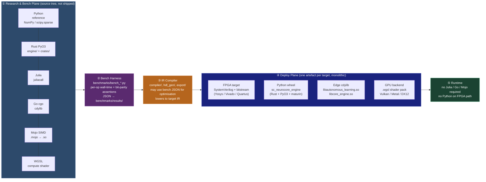
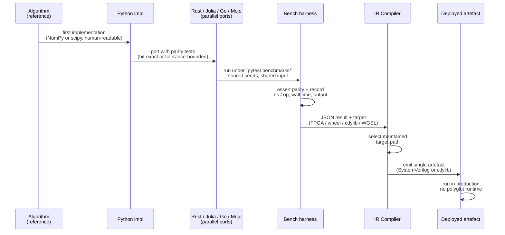
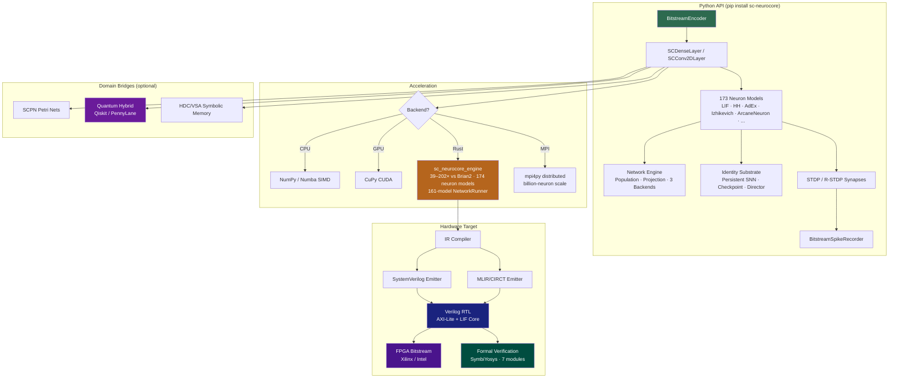

© 1998–2026 Miroslav Šotek. All rights reserved.
Contact: www.anulum.li | protoscience@anulum.li
ORCID: https://orcid.org/0009-0009-3560-0851
License: GNU AFFERO GENERAL PUBLIC LICENSE v3
Commercial Licensing: Available

# SC-NeuroCore

<p align="center">
  
</p>

[](https://github.com/anulum/sc-neurocore/actions/workflows/ci.yml)
[](https://github.com/anulum/sc-neurocore/actions/workflows/codeql.yml)
[](https://pypi.org/project/sc-neurocore/)
[](https://pypi.org/project/sc-neurocore/)
[](https://pepy.tech/project/sc-neurocore)
[](https://mypy-lang.org/)
[](https://github.com/astral-sh/ruff)
[](https://peps.python.org/pep-0561/)
[](https://github.com/pre-commit/pre-commit)
[](https://anulum.github.io/sc-neurocore/)
[](https://www.gnu.org/licenses/agpl-3.0)
[](https://www.python.org/downloads/)
[](https://www.rust-lang.org/)
[](https://www.bestpractices.dev/projects/12175)
[](https://scorecard.dev/viewer/?uri=github.com/anulum/sc-neurocore)
[](https://reuse.software/)
[](https://colab.research.google.com/github/anulum/sc-neurocore/blob/main/notebooks/quickstart_colab.ipynb)

> **Active Development and v4.0 Transition** — SC-NeuroCore is under active
> development. Until v4.0 this checkout intentionally contains a broad,
> kitchen-sink research surface: Python and Rust runtime code, hardware-oriented
> compilers and emitters, experimental bridge modules, and verification
> artefacts live together while the current experimental campaigns establish
> which paths are promoted, split, or retired. The planned v4.0 transition will
> split this source tree into several focused repositories and freeze the stable
> public API. Until then, public APIs, benchmark coverage, and deployment
> workflows are still being consolidated; use the committed tests and benchmark
> artefacts in `benchmarks/results/` as the evidence boundary for specific
> claims.

**Version:** 3.15.0
**Status:** 174 Python-facing neuron models (165 biological + 9 AI-oriented) | 174 Rust engine models | HDL generation + hardware guides | multi-backend training and benchmarking | research modules included in source checkout. Model-fidelity, physical-hardware, and coverage claims remain bounded by the current audit and CI evidence.

## Capability Manifest

Public capability counts are generated from repository sources by
`tools/capability_manifest.py`. The tracked JSON source of truth is
`docs/_generated/capability_manifest.json`; the Markdown snapshot below is
generated from the same manifest and reused by the PyPI long description through
this README.

<!-- capability-snapshot:start -->
<!-- SPDX-License-Identifier: AGPL-3.0-or-later -->
<!-- Generated by tools/capability_manifest.py; do not edit counts by hand. -->

### SC-NeuroCore Capability Inventory

| Surface | Current inventory |
|---|---:|
| Package version | 3.15.0 |
| Public API exports | 44 |
| Python model source modules | 151 |
| Python model classes | 157 |
| Model documentation pages | 174 |
| Rust PyO3 model wrappers | 175 |
| Optional extras | 24 |
| Python test files | 730 |
| Public documentation pages | 536 |
| GitHub Actions workflows | 14 |

Evidence boundary: this snapshot is a static inventory. Performance, coverage, hardware, and scientific-fidelity claims require their own committed evidence artefacts.
<!-- capability-snapshot:end -->

<p align="center">
  
</p>

SC-NeuroCore is an open-source stochastic computing SNN framework
with FPGA-oriented synthesis paths. 174 Python-facing neuron models (165 biophysical + 9 AI-optimised) spanning
82 years of computational neuroscience (McCulloch-Pitts 1943 through
ArcaneNeuron 2026) run inside a deterministic stochastic computing engine
with FPGA-oriented RTL generation, an equation-to-Verilog compiler
for Q-format fixed-point hardware experiments, formal-verification collateral,
a Rust-backed execution engine with benchmark scripts in `benchmarks/`,
GPU-facing backends including wgpu, CuPy, and JAX training surfaces,
MPI distributed simulation (billion-neuron scale via mpi4py),
an identity continuity substrate (persistent spiking networks with
checkpointing and L16 Director control), a 132-function spike train
analysis toolkit (24 modules, including POYO+/POSSM/NDT3/CEBRA foundation-model
decoders), 14 visualisation plots, 13 advanced
plasticity rules (pair/triplet/voltage STDP, BCM, BPTT, TBPTT, EWC,
e-prop, R-STDP, MAML, STP, structural plasticity), 7 biological circuit
primitives (gap junctions, tripartite synapse, Rall dendrite, cortical
column, lateral inhibition, WTA, gamma oscillation), 10 model zoo
configurations with 3 pre-trained weight sets, 9 hardware chip emulators,
quantum hybrid computing (Qiskit + PennyLane + SC-to-quantum compiler), a
[NIR](https://neuroir.org/) bridge — FPGA backend for the
neuromorphic intermediate representation standard (18/18 primitives,
recurrent edges, multi-port subgraphs; verified interop with SpikingJelly,
snnTorch, and Norse), a SpikeInterface adapter for experimental data import,
ANN-to-SNN conversion (trained PyTorch models to rate-coded SNNs in one call),
trainable per-synapse delays (DelayLinear with differentiable interpolation),
a deploy helper (`sc-neurocore deploy model.nir --target ice40`) that scaffolds
or invokes FPGA flow steps when the required external toolchain is installed,
per-layer adaptive bitstream length for mixed-precision SC networks,
event-driven FPGA RTL (AER encoder, event neuron, spike router),
and a 6-codec neural data compression library (ISI, predictive, delta, streaming,
AER) with a unified API and documented benchmark artefacts — targeting BCI
implants (Neuralink-scale 1024+ channels), neural probes (Neuropixels),
neuromorphic inter-chip routing, and real-time closed-loop telemetry.
CI workflows guard changes across the core package and optional backends.
conda-forge recipe ready.
19 research and hardware-facing modules: IEC 61508 safety certification, multi-PDK ASIC flow,
fault injection, UVM testbench generation, multi-tenant hypervisor, digital twin sync,
spintronic/memristor/chiplet mapping, evolutionary substrate with FPGA deployment,
meta-plasticity, bioware interface, federated learning, BCI studio,
explainability, neuro-symbolic predictive coding, stochastic doctor, and model zoo.

## Engineering Philosophy: Research Polyglot, Shipped Core

SC-NeuroCore carries parallel implementations of several compute kernels across
**Python, Rust, Julia, Go, Mojo,** and **WGSL** (GPU shader). This polyglot
surface is deliberate and **scoped to research and benchmarking**. It is not the
shape of the production runtime.

**Why a polyglot research layer.** Each hot kernel (PING gamma-oscillation step,
cortical-column CSR mat-vec, evolutionary-substrate genome operators,
Wilson-Cowan / Wong-Wang batch simulators, STDP plasticity step, SC bitstream
arithmetic, …) is implemented in multiple languages. The test suite then asserts
(a) **cross-language parity** — bit-exact where the algorithm permits (shared
XorShift64 PRNG across the four evolve-runner backends, bit-exact Python ↔ Rust
spike outputs in gamma_oscillation), and (b) **honest wall-clock cost** under a
common harness. The goal is to measure, not to guess, which implementation
should win a given operation on real hardware. Without this layer, any claim
like "Rust is faster than Julia here" is folklore.

**Repository split path.** The present repository is deliberately wider than the
long-term distribution layout. It keeps the runtime, hardware, SCPN bridge,
benchmarking, Studio, and research backends in one checkout while larger
experimental verifications are still in progress. v4.0 is the boundary where
the stable API is frozen and the source tree is split into focused repositories
with clearer ownership surfaces.

**Production path.** The shipping product is the Python package, optional Rust
engine hot paths, and generated hardware artefacts. The research-only polyglot
matrix is not installed by default, is not required by `pip install
sc-neurocore`, and is not part of FPGA deployment. The IR compiler
(`sc-neurocore deploy` + `compiler/`, `hdl_gen/`, `export/`) consumes a
topology and emits one artefact per target:

| Target | Artefact | Source of truth for each kernel |
|---|---|---|
| **FPGA** (Xilinx, Intel, Lattice) | SystemVerilog RTL + bitstream | Rust IR → Verilog emitter (bit-true to NumPy reference) |
| **Edge / embedded** | Rust `cdylib` (`libautonomous_learning.so` + `core_engine.so`) | Rust crate, PyO3-wrapped |
| **Python wheel** | `sc_neurocore_engine` (maturin) | Rust engine + thin Python API |
| **GPU** | WGSL compute shaders (Vulkan / Metal / DX12 / WebGPU) | Shared Rust kernels compiled to WGSL |

At deploy time the compiler resolves operators to the maintained target path
for that artefact. Benchmark results can inform optimisation decisions, but
Julia, Go, and Mojo sources remain source-checkout research material unless a
maintained loader and tests make a specific path authoritative. FPGA artefacts
do not depend on Python or the polyglot toolchain at runtime.

### Default pipeline — stage by stage



### Measured per-operation winners (benchmarks/results/)

Hot-path picks used by the compiler, from the committed benchmark JSON
(Intel i5-11600K @ 3.9 GHz, Linux 6.17, Python 3.12.3):

| Operation | Python baseline | Rust | Julia | Go | Mojo | Compiler picks | Speedup vs Python |
|---|---:|---:|---:|---:|---:|:---|---:|
| `evo_substrate.genomic_distance` | 5992 ns | 258 ns | 23 ns | 23 ns | **19 ns** | **Mojo** | **319×** |
| `evo_substrate.crossover_uniform` | 1094 ns | 481 ns | 46 ns | **42 ns** | 151 ns | **Go** | **26×** |
| `evo_substrate.point_mutation` | 3984 ns | 432 ns | 295 ns | **47 ns** | 151 ns | **Go** | **85×** |
| `gamma_oscillation.step` (100 cells, PING) | 34.7 µs | **6.4 µs** | n/a | — | — | **Rust** | **5.4×** |
| `cortical_column.step` (1544 cells, Potjans) | 0.53 ms | 0.53 ms | 0.54 ms | 0.57 ms | — | Python (tie) | 1.0× |
| SC popcount (packed u64) | — | native | n/a | n/a | — | **Rust SIMD** | — |
| FPGA inference (SC dense, 1024-bit) | — | Verilog RTL | — | — | — | **RTL** | event-driven |

Three observations the benchmark table makes explicit:

1. **No single language wins everything.** Mojo dominates tight SIMD math
  (`genomic_distance`), Go's goroutines + escape-analysis win short-lived
  allocator-heavy ops (`point_mutation`), Rust dominates kernels that reward
  borrow-checker-verified no-copy iteration (`gamma_oscillation`). Python is
  competitive when the inner loop is already in scipy / NumPy C code
  (`cortical_column` — scipy.sparse CSR is hand-tuned C).

2. **The compiler's job is target selection.** Maintained compiler paths emit
  one target artefact and do not ship the research matrix. A polyglot
  implementation becomes authoritative only when a maintained Python entrypoint
  loads it and tests cover that path.

3. **Numbers are verifiable.** Every row traces to a committed, runnable
  script in `benchmarks/` and a JSON in `benchmarks/results/`. Nothing in the
  table is an estimate or folklore.

### Lifecycle of one kernel



Short version: the polyglot matrix lives in the source tree for **honesty**
(measurements not guesses) and **correctness** (cross-language parity catches
algorithm bugs that a single implementation would hide). Treat it as
research-only unless a maintained loader, tests, and install profile say
otherwise.

## Feature Comparison

| Feature | SC-NeuroCore | snnTorch | Norse | Lava | Brian2 |
|---------|:---:|:---:|:---:|:---:|:---:|
| Stochastic computing (bitstream) | **Yes** | — | — | — | — |
| Bit-true RTL co-simulation | **Yes** | — | — | — | — |
| Verilog / FPGA synthesis | **Yes** | — | — | Loihi only | — |
| IR compiler → SystemVerilog | **Yes** | — | — | — | — |
| Rust engine (39–202× vs Brian2) | **Yes** | — | — | — | — |
| Surrogate gradient training | **6 surrogates, 12 cells** | Yes | Yes | Yes | — |
| PyTorch `nn.Module` SNN | **Yes** (+ SC weight export) | Yes | Yes | — | — |
| GPU acceleration | **wgpu + PyTorch + CuPy** | PyTorch | PyTorch | — | — |
| Neuron model library | **174 Python-facing / 173 Rust** | 11 | 6 | 3 | ~5 builtin |
| Rust neuron models (PyO3) | **174** | — | — | — | — |
| NetworkRunner (fused loop) | **161 models** | — | — | — | — |
| Network simulation engine | **3 backends** | PyTorch | PyTorch | Lava | C++ codegen |
| MPI distributed simulation | **Yes** | — | — | — | — |
| Pre-trained model zoo | **10 configs, 3 weights** | — | — | — | — |
| Spike train analysis | **132 functions** | — | — | — | — |
| Visualization plots | **14** | — | — | — | — |
| Advanced plasticity rules | **13** | — | — | — | — |
| Biological circuits | **7** | — | — | — | — |
| SC→quantum compiler | **Yes** | — | — | — | — |
| Predictive coding (SC) | **Yes** | — | — | — | — |
| Fault tolerance benchmark | **Yes** | — | — | — | — |
| Phi* (IIT) estimation | **Yes** | — | — | — | — |
| SpikeInterface adapter | **Yes** | — | — | — | — |
| NIR primitives | **18/18** | — | 12 | 5 | — |
| MNIST accuracy (SNN) | **99.49%** (`benchmarks/results/mnist_conv_accuracy_reproducibility.json`) | ~95% | ~93% | — | — |
| Plasticity (STDP, R-STDP) | Yes | — | Yes | Yes | Yes |
| Quantum hybrid (Qiskit/PennyLane) | **Yes** | — | — | — | — |
| MLIR emitter (CIRCT) | **Yes** | — | — | — | — |
| Hyperdimensional computing | Yes | — | — | — | — |
| Formal verification (SymbiYosys) | **7 modules, 72 props** | — | — | — | — |
| JAX JIT training | **Yes** | — | — | — | — |
| CuPy sparse GPU | **Yes** | — | — | — | — |
| AI-optimised neurons | **9 (ArcaneNeuron + 8)** | — | — | — | — |
| ArcaneZenith Cognitive Core | **Yes** | — | — | — | — |
| Identity substrate | **Yes** | — | — | — | — |
| ANN-to-SNN conversion | **Yes** | — | — | — | — |
| Trainable per-synapse delays | **Yes** | — | — | — | — |
| One-command FPGA deploy CLI | **Yes** | — | — | — | — |
| Per-layer adaptive bitstream | **Yes** | — | — | — | — |
| Event-driven FPGA RTL (AER) | **Yes** | — | — | — | — |
| Raw waveform compression (24x) | **Yes** | — | — | — | — |
| Spike codec library (6 codecs) | **Yes** | — | — | — | — |
| Visual SNN Design Studio | **Yes (web IDE)** | Basic GUI | Jupyter | — | — |
| IEC 61508 safety certification | **Yes** | — | — | — | — |
| Multi-PDK ASIC flow | **Yes** | — | — | — | — |
| Evolutionary substrate (FPGA) | **Yes** | — | — | — | — |
| Multi-tenant hypervisor | **Yes** | — | — | — | — |
| Chiplet/memristor/spintronic | **Yes** | — | — | — | — |
| BCI closed-loop control | **Yes** | — | — | — | — |
| Federated SC learning | **Yes** | — | — | — | — |
| Evolutionary Substrate (FPGA) | **Yes** | — | — | — | — |
| Photonic SC Bridge (FDTD, GDSII) | **Yes** | — | — | — | — |
| HIL Debugger Telemetry Server | **Yes** | — | — | — | — |
| conda-forge recipe | **Ready** | Yes | — | — | Yes |
| PyPI package | Yes | Yes | Yes | Yes | Yes |
| License | AGPL-3.0 | MIT | LGPL-3.0 | BSD-3 | CeCILL-2.1 |

- **132-function spike train analysis toolkit** — CV, Fano factor, cross-correlation, Victor-Purpura distance, SPIKE-sync, Granger causality, GPFA, SPADE pattern detection, plus 4 foundation-model decoders (POYO+, POSSM, NDT3, CEBRA). Matches Elephant + PySpike combined. Pure NumPy + Rust acceleration.

- **Neural data compression library** — Two layers: **WaveformCodec** compresses raw 10-bit electrode waveforms end-to-end (spike detection + template matching + LFP compression, 24x on 1024-channel Neuralink-scale data, fits Bluetooth uplink). **Spike raster codecs** (ISI+Huffman, Predictive with 4 learnable predictors, Delta, Streaming, AER) compress binary spike trains 50-750x. Unified API: `get_codec(name)`, `recommend_codec()`. Learnable world-model predictor (99.6% accuracy). Rust backend (780x speedup). Bit-true LFSR matches Verilog RTL.

- **Project Zenith Autonomous Learning** — Seamless bridge unifying PyTorch surrogate gradients with stochastic biological plasticity parameters (BCM, ELIGENT, R-STDP). Allows developers to train mathematically exact `nn.Module` plasticity rules purely on GPU networks, then seamlessly deploy identical bounded bits (`.scal` Exascale binary drops) targeting verifiable SymbiYosys architectures and Spintronic Rust emulation with 0 execution parity decay. **Project Zenith (including the pure-Rust WGPU backend) is now complete and available.**

- **Photonic SC Bridge (experimental)** — SC bitstream → optical pulse mapping → FDTD co-simulation → crosstalk analysis → GDSII export with Rust acceleration. Full pipeline from ArcaneNeuron to silicon photonics.

- **Self-Replicating Evolutionary SC Substrate (experimental)** — Open-ended evolution of SC networks with genomes, CPPN developmental encoding, island model, Pareto front, formal safety guard, HW-in-the-loop FPGA feedback, and direct NIR/Verilog emission. Evolves ArcaneZenith organisms.

- **HIL Debugger (experimental)** — Real-time FPGA telemetry server with lock-free RingBuffer, WebSocket broadcast, per-layer stats, triggers, rate limiting, and Python orchestration daemon. Full HW-in-the-loop support for SC networks.

- **Mojo SIMD Kernel Acceleration (experimental)** — High-performance Mojo kernels for bitstream ops, popcount, SCC, LFSR. Automatic Pixi orchestration with Python fallback.

- **ArcaneZenith Cognitive Core** (New in v3.14) — The headline cognitive primitive of the framework. It wires `ArcaneNeuron` (a deeply self-referential multi-timescale novelty-gating architecture) directly with Project Zenith's autonomous structural plasticity. Instead of static hyperparameters, internal phenomenology metrics (like novelty detection, confidence thresholds, and meta-learning accumulation) dynamically continuous their own deterministic bounds natively mapped by physical synaptic structures scaling dynamically and reacting across lifelong continuous streams.

SC-NeuroCore's niche: **deterministic stochastic computing with FPGA co-design** — Python simulation matches synthesisable RTL bit-for-bit (deterministic LFSR seeds, Q8.8 fixed-point, cycle-exact co-simulation).

### Performance: Rust Engine vs Brian2 (Brunel AI network)

Measured on i5-11600K @ 3.90 GHz, 300 ms simulation, 10% connection probability.
Stored artifact: [`benchmarks/results/rust_scaling_benchmark.json`](benchmarks/results/rust_scaling_benchmark.json)

| Scale | SC Rust | Brian2 | Speedup | SC synaptic events/s |
|------:|--------:|-------:|--------:|---------------------:|
| 1K neurons | 0.029 s | 2.689 s | **93×** | 110 M/s |
| 5K neurons | 0.285 s | 4.681 s | **16×** | 288 M/s |
| 10K neurons | 0.172 s | 6.754 s | **39×** | 1.86 B/s |
| 50K neurons | 0.582 s | 31.03 s | **53×** | 13.9 B/s |
| 100K neurons | 1.153 s | 232.3 s | **202×** | 27.7 B/s |

SIMD primitives: 190 Gbit/s popcount (AVX-512 dispatch, Criterion benchmark:
[`benchmarks/results/criterion_bitstream_2026-03-26.json`](benchmarks/results/criterion_bitstream_2026-03-26.json))

### Network Simulation Engine

Population-Projection-Network architecture with 3 backends:

| Backend | Scope | Performance |
|---------|-------|-------------|
| **Python** | Any of 174 Python-facing neuron models | NumPy vectorized |
| **Rust NetworkRunner** | 161 models in fused Rayon-parallel loop | 100K+ neurons, near-linear scaling |
| **MPI** | Billion-neuron distributed simulation via mpi4py | Multi-node HPC clusters |

6 topology generators (random, small-world, scale-free, ring, grid, all-to-all),
14 visualization plots (raster, voltage, ISI, cross-correlogram, PSD, firing rate,
phase portrait, population activity, instantaneous rate, spike train comparison,
network graph, weight matrix, connectivity, spatial), and 13 advanced plasticity rules (pair/triplet/voltage
STDP, BCM, BPTT, TBPTT, EWC, e-prop, R-STDP, MAML, homeostatic, STP, structural).

### Model Zoo

10 pre-built network configurations (Brunel balanced, cortical column, CPG,
decision-making, working memory, visual cortex V1, auditory processing, MNIST
classifier, SHD speech classifier, DVS gesture classifier) with 3 pre-trained
weight sets (MNIST 784-128-10, SHD 700-256-20, DVS 256-256-11).

### 174 Neuron Models (1943--2026)

Every model has a uniform `step(current) -> spike` API, a `reset()`, and a
cited reference. One file per model in `src/sc_neurocore/neurons/models/`.

| Category | Count | Examples |
|----------|------:|---------|
| Integrate-and-fire variants | 18 | AdEx, GLIF5, ExpIF, QIF, SFA, MAT, COBA-LIF, Parametric LIF, Fractional LIF |
| Simple spiking (2D+) | 21 | FitzHugh-Nagumo, Morris-Lecar, Hindmarsh-Rose, Resonate-and-Fire, Balanced Resonate-and-Fire, Chay |
| Biophysical (conductance-based) | 20 | Hodgkin-Huxley, Connor-Stevens, Traub-Miles, Mainen-Sejnowski, Pospischil |
| Stochastic / population / neural mass | 13 | Poisson, GLM, Jansen-Rit, Wong-Wang, Wilson-Cowan, Ermentrout-Kopell |
| Rate / plasticity / other | 12 | McCulloch-Pitts (1943), Sigmoid Rate, Astrocyte, Amari, GatedLIF (2022) |
| Hardware chip emulators | 9 | Loihi CUBA, Loihi 2, TrueNorth, BrainScaleS AdEx, SpiNNaker, Akida, DPI |
| Multi-compartment | 7 | Pinsky-Rinzel, Hay L5 Pyramidal, Rall Cable, Booth-Rinzel, Dendrify |
| Map-based (discrete-time) | 6 | Chialvo, Rulkov, Ibarz-Tanaka, Cazelles, Courbage-Nekorkin, Medvedev |
| Core (stochastic computing) | 5 | StochasticLIF, FixedPointLIF, HomeostaticLIF, Dendritic, SC-Izhikevich |
| Training cells (PyTorch) | 4 | LIF, ALIF, RecurrentLIF, EProp-ALIF |
| **AI-optimized (novel)** | **9** | **ArcaneNeuron, MultiTimescale, AttentionGated, PredictiveCoding, SelfReferential, CompositionalBinding, DifferentiableSurrogate, ContinuousAttractor, MetaPlastic** |

### ArcaneNeuron — Self-Referential Cognition

The primary AI-optimised model. Five coupled subsystems in a single ODE:
fast compartment (tau=5ms), working memory (tau=200ms), deep context
(tau=10s), learned attention gate, and a forward self-model (predictor).
The deep compartment accumulates identity: it changes only on genuine
novelty (prediction errors), not routine input. Confidence modulates
threshold and meta-learning rate. No direct equivalent is documented in the
mainstream SNN toolkits compared here for this combined multi-timescale
identity, confidence, and self-model loop.

### Identity Substrate

Persistent spiking network for identity continuity (`sc_neurocore.identity`).

| Module | Class | Purpose |
|--------|-------|---------|
| `substrate.py` | `IdentitySubstrate` | 3-population network (HH cortical + WB inhibitory + HR memory) with STDP and small-world connectivity |
| `encoder.py` | `TraceEncoder` | LSH-based text-to-spike-pattern encoding |
| `decoder.py` | `StateDecoder` | PCA + attractor extraction + priming context generation |
| `checkpoint.py` | `Checkpoint` | Lazarus protocol: save/restore/merge complete network state (.npz) |
| `director.py` | `DirectorController` | L16 cybernetic closure: monitor, diagnose, correct network dynamics |

## Quick Start

```bash
pip install sc-neurocore
```

For biological closed-loop BCI implementations (experimental), install the bioware optional dependencies:
```bash
pip install "sc-neurocore[bioware]"
```

```python
from sc_neurocore import StochasticLIFNeuron

neuron = StochasticLIFNeuron(v_threshold=1.0, tau_mem=20.0, noise_std=0.0)
spikes = sum(neuron.step(0.8) for _ in range(500))
print(f"{spikes} spikes in 500 steps")
```

### Zenith Quickstart

Train biologically plausible rules using PyTorch surrogate autograd, then export the exact layer to hardware:

### Bio-hybrid Closed-Loop with ArcaneZenith (Experimental)

The `bioware` module securely bridges biological real-world MEA setups into Stochastic Computing and Optogenetic laser outputs natively. It supports PCA/K-Means spike sorting, runtime health tracking, pharmacological wash simulations, and `ArcaneZenithCognitiveCore` bridged bindings.

```python
import torch
from sc_neurocore.plasticity import create_plasticity_layer
from sc_neurocore._native.learning_bridge import RULE_STDP

# 1. Train entirely in standard DL execution architectures
bcm_layer = create_plasticity_layer(count=128, rule_type=RULE_STDP, backend="torch", autograd=True)
# ... standard cross-entropy loss.backward() loop

# 2. Deploy natively to SC-NeuroCore hardware limits
exascale_layer = create_plasticity_layer(count=128, rule_type=RULE_STDP, backend="rust", weight=bcm_layer.weights.detach().numpy())
exascale_layer.save("hw_layer.scal")
```
See the full end-to-end integration demo in [`examples/zenith_hybrid_resnet.py`](examples/zenith_hybrid_resnet.py).

```bash
# Add only the extras needed for the current workflow.
pip install "sc-neurocore[core]"      # explicit base profile
pip install "sc-neurocore[nir]"       # NIR interop
pip install "sc-neurocore[training]"  # PyTorch-backed training
pip install "sc-neurocore[studio]"    # local web studio
pip install "sc-neurocore[full]"      # local research environment only
```

See [Install Profiles](docs/guides/install_profiles.md) for the full optional
dependency matrix and research-only boundaries.

### Rust Engine (39–202× faster)

The optional Rust engine provides SIMD-accelerated simulation, 174 neuron
models via PyO3, and fused E-I network simulation. Pre-built wheels are
available through repository release assets or source builds when present in
the local environment.

When installed, SC-NeuroCore automatically uses the Rust engine for:

- **NetworkRunner:** 161-model fused Rayon-parallel simulation loop
- **E-I network:** single Rust call for connectivity + Poisson + Euler + spike detection
- **Batch simulate:** model dispatch loop in compiled Rust
- **SIMD bitstream ops:** 190 Gbit/s popcount (AVX-512)

The pure Python package works without the engine — NumPy fallbacks are
used for all operations. Install or build the engine only when you need the
performance advantage. See [Install Profiles](docs/guides/install_profiles.md)
for the base install, optional extras, and source-build path.

`pip install sc-neurocore` publishes the Python suite under the public
`sc-neurocore` package name. The optional Rust engine remains part of the
repository / release-asset / source-build flow rather than a separate PyPI
runtime dependency. Source-only extended modules such as `analysis`, `viz`,
`audio`, `dashboard`, and `swarm` still require a source checkout.

### Development Setup

```bash
git clone https://github.com/anulum/sc-neurocore.git
cd sc-neurocore
pip install -e ".[dev]"    # editable install with all dev tools
make preflight             # verify setup (lint + tests)
```

If you are changing the Rust bridge locally, install `bridge/` in the same
environment or run source-tree commands with `PYTHONPATH=src:bridge`.

### Visual SNN Design Studio (Experimental)

> **Status:** Development preview. The Studio is functional but under active
> development. API and UI may change between releases until the v4.0 stable API
> freeze.

A web-based IDE for designing, training, compiling, and deploying spiking
neural networks — from ODE equations to FPGA bitstream in a single browser tab.

```bash
pip install sc-neurocore[studio]
sc-neurocore studio              # opens browser at http://127.0.0.1:8001
```

| Feature | What it does |
|---------|-------------|
| **118 Model Browser** | Browse all neuron models by category, simulate with parameter sliders |
| **18+ Analysis Views** | Trace, phase portrait, ISI, f-I curve, bifurcation, heatmap, STA, frequency response, characterisation dashboard |
| **Compiler Inspector** | Build SC IR from equations, verify, emit SystemVerilog |
| **Synthesis Dashboard** | One-click Yosys synthesis to ice40/ECP5/Gowin/Xilinx, multi-target comparison, resource bars |
| **Training Monitor** | Live loss/accuracy curves via SSE, 6 surrogate gradients, per-layer spike rates |
| **Network Canvas** | Drag-and-drop populations and projections (React Flow), NIR export/import |
| **Full Pipeline** | Network → simulate → compile → synthesise in one click |
| **Project Save/Load** | Persistent workspaces as JSON, server-side storage |

No other SNN framework provides a visual design-to-hardware pipeline.
snnTorch has Jupyter notebooks. Brian2 has a basic GUI. Neither goes from
visual network design to FPGA resource estimation.

| Feature | SC-NeuroCore Studio | Brian2 GUI | snnTorch | Nengo GUI |
|---------|:---:|:---:|:---:|:---:|
| Visual network design | **Yes** | Basic | No | Yes |
| ODE equation editor | **Yes** | No | No | No |
| Live training curves | **Yes** | No | TensorBoard | No |
| Verilog output viewer | **Yes** | No | No | No |
| FPGA synthesis | **Yes** | No | No | No |
| Co-simulation view | **Yes** | No | No | No |

Full documentation: [Studio Guide](https://anulum.github.io/sc-neurocore/studio/)

## Docker

The Docker image ships with the full Rust engine (39–202× faster than Brian2):

```bash
# Build
make docker-build
# or: docker build -f deploy/Dockerfile -t sc-neurocore:latest .

# Build the offline HDL shipping profile with packaged baseline RTL primitives
# and the hash-locked HDL dependency set. Vivado is not required for this image.
docker build -f deploy/Dockerfile --build-arg INSTALL_EXTRAS=hdl -t sc-neurocore:hdl .

# Run interactive Python shell
make docker-run
# or: docker run --rm -it sc-neurocore:latest

# Smoke test via docker compose
docker compose -f deploy/docker-compose.yml up
```

Pre-built images are published to GHCR on every release:

```bash
docker pull ghcr.io/anulum/sc-neurocore:latest
docker run --rm -it ghcr.io/anulum/sc-neurocore:latest
```

## Architecture

### Module Tiers

`pip install sc-neurocore` ships **Core + Simulation + Domain bridges** only.
Research and extended modules are available from source (`pip install -e ".[dev]"`).

| Tier | Modules | Ships in wheel | Status |
|------|---------|:--------------:|--------|
| **Core** | neurons, synapses, layers, sources, utils, recorders, accel, compiler, hdl_gen, hardware, cli, exceptions | Yes | Production path; current CI coverage gate is 96%, with 100% retained as the target. |
| **Simulation** | hdc, solvers, transformers, learning, graphs, ensembles, export, pipeline, profiling, models, math, spatial, verification, security | Yes | Stable. Import explicitly. |
| **Industrial** | safety_cert, asic_flow, fault_injection, uvm_gen, hypervisor, digital_twin, chiplet, spintronic, memristor, analog_bridge | No | 1,173 tests. Available from source. |
| **Extended research** | evo_substrate, meta_plasticity, bioware, federated, bci_studio, explainability, neuro_symbolic, stochastic_doctor, model_zoo | No | 1,173 tests. Available from source. |
| **Domain bridges** | quantum (Qiskit/PennyLane), adapters/holonomic (JAX), scpn (Petri nets) | Yes | Requires `pip install sc-neurocore[quantum]` or `[jax]` |
| **Research** | robotics, physics, bio, optics, chaos, sleep, interfaces | No | Tested. Available from source. |
| **Speculative** | `research/` (eschaton, exotic, meta, post_silicon, transcendent) | No | Theoretical. See `research/README.md`. |

### Architecture Diagram



### Core API (28 symbols)

```python
from sc_neurocore import (
    # Neurons
    StochasticLIFNeuron, FixedPointLIFNeuron, FixedPointLFSR,
    FixedPointBitstreamEncoder, HomeostaticLIFNeuron,
    StochasticDendriticNeuron, SCIzhikevichNeuron,
    # Synapses
    BitstreamSynapse, BitstreamDotProduct,
    StochasticSTDPSynapse, RewardModulatedSTDPSynapse,
    # Layers
    SCDenseLayer, SCConv2DLayer, SCLearningLayer,
    VectorizedSCLayer, SCRecurrentLayer, MemristiveDenseLayer,
    SCFusionLayer, StochasticAttention,
    # Utilities
    BitstreamEncoder, BitstreamAverager, RNG,
    generate_bernoulli_bitstream, generate_sobol_bitstream,
    bitstream_to_probability,
    # Sources & Recorders
    BitstreamCurrentSource, BitstreamSpikeRecorder,
)
```

### Hardware (Verilog RTL)

```
hdl/
  sc_bitstream_encoder.v      -- LFSR-based stochastic encoder (SEED_INIT param)
  sc_bitstream_synapse.v      -- AND-gate SC multiplier
  sc_mux_add.v                -- 2-input MUX (scaled addition)
  sc_cordiv.v                 -- CORDIV stochastic divider (Li et al. 2014)
  sc_dotproduct_to_current.v  -- Popcount -> fixed-point current
  sc_lif_neuron.v             -- Q8.8 leaky integrate-and-fire
  sc_firing_rate_bank.v       -- Spike rate estimator
  sc_dense_layer_core.v       -- Full dense layer pipeline (decorrelated seeds)
  sc_dense_matrix_layer.v     -- N×M weight matrix layer
  sc_axil_cfg.v               -- AXI-Lite register file
  sc_axil_cfg_param.v         -- Parameterized AXI-Lite register file
  sc_axis_interface.v         -- AXI-Stream bulk bitstream I/O
  sc_dma_controller.v         -- DMA for weight upload and output readback
  sc_cdc_primitives.v         -- Clock domain crossing (2-FF sync, Gray, async FIFO)
  sc_dense_layer_top.v        -- Dense layer top wrapper
  sc_neurocore_top.v          -- System top (DMA + AXI + layers)
  sc_aer_encoder.v            -- AER spike encoder (event-driven output)
  sc_event_neuron.v           -- Event-triggered LIF (power ∝ spike rate)
  sc_aer_router.v             -- AER event distribution to target neurons
  tb_sc_*.v (7 testbenches)   -- Self-checking simulation testbenches
  formal/ (7 modules)         -- SymbiYosys formal verification properties
```

### GPU Acceleration

```python
from sc_neurocore.accel import xp, HAS_CUPY, to_device, to_host
from sc_neurocore.accel.gpu_backend import gpu_vec_mac

# VectorizedSCLayer auto-detects GPU
layer = VectorizedSCLayer(n_inputs=32, n_neurons=64, length=1024)
output = layer.forward(input_values)  # GPU if CuPy available, else CPU
```

## Hardware-Software Co-Simulation

The co-sim flow verifies bit-exact equivalence between the Python model and
Verilog RTL:

```bash
# 1. Generate stimuli + expected results (Python golden model)
python scripts/cosim_gen_and_check.py --generate

# 2. Run Verilog simulation (requires Icarus Verilog)
iverilog -o tb_lif hdl/sc_lif_neuron.v hdl/tb_sc_lif_neuron.v
vvp tb_lif

# 3. Compare results
python scripts/cosim_gen_and_check.py --check
```

### Reproducibility

Every GitHub Release includes:

- **wheel + sdist** — Python distribution artifacts (`dist/sc_neurocore-*`)
- **SBOM** — CycloneDX software bill of materials (`sbom.json`)
- **Changelog extract** — release notes from `CHANGELOG.md`

Co-simulation traces are generated deterministically from fixed LFSR seeds.
To reproduce a published benchmark:

```bash
git checkout v3.13.3
pip install -e ".[dev]"
python benchmarks/benchmark_suite.py --markdown > BENCHMARKS.md
```

For Verilog co-sim trace reproduction, see `scripts/cosim_gen_and_check.py`
and the seed constants in `hdl/sc_bitstream_encoder.v`.

### Key Technical Details

- **LFSR**: 16-bit maximal-length, polynomial x^16+x^14+x^13+x^11+1, period 65535
- **Seed strategy**: Input encoders `0xACE1 + i*7`, weight encoders `0xBEEF + i*13`
- **Fixed-point**: Q8.8 (DATA_WIDTH=16, FRACTION=8), signed two's complement
- **Overflow**: Explicit bit-width masking via `_mask()` function

## Examples

Runnable scripts in `examples/`:

| Script | Description |
|--------|-------------|
| `01_basic_sc_encoding.py` | Bernoulli & Sobol bitstream encoding/decoding |
| `02_sc_neuron_layer.py` | SCDenseLayer construction, spike trains, and firing-rate summary |
| `03_ir_compile_demo.py` | IR graph building, verification, SystemVerilog emission (v3 Rust engine) |
| `04_vectorized_layer.py` | VectorizedSCLayer throughput benchmarking |
| `05_scpn_stack.py` | Full 7-layer SCPN consciousness stack with inter-layer coupling |
| `06_hdl_generation.py` | Verilog top-level generation from a network description |
| `07_ensemble_consensus.py` | Multi-agent ensemble orchestration and voting |
| `08_hdc_symbolic_query.py` | Hyper-Dimensional Computing symbolic memory (v3 Rust engine) |
| `09_safety_critical_logic.py` | Fault-tolerant Boolean logic with stochastic redundancy (v3 Rust engine) |
| `10_benchmark_report.py` | Head-to-head v2/v3 benchmark suite (v3 Rust engine) |
| `11_sc_training_demo.py` | Surrogate-gradient training of an SC dense layer (v3 Rust engine) |
| `12_load_pretrained_model.py` | Load pretrained ConvSpikingNet and classify MNIST digits |
| `zenith_hybrid_resnet.py` | Train hybrid network with PyTorch autograd → save via Zenith exascale persistence |
| `jax_training_demo.py` | JAX JIT surrogate-gradient SNN training on synthetic data |
| `mnist_fpga/demo.py` | MNIST classifier: train → quantise Q8.8 → SC simulate → Verilog export |
| `mnist_conv_train.py` | **ConvSpikingNet: 99.49% MNIST** (learnable beta/threshold, cosine LR; evidence in `benchmarks/results/mnist_conv_accuracy_reproducibility.json`) |
| `mnist_surrogate/train.py` | Surrogate gradient SNN training (FastSigmoid/SuperSpike/ATan, ~95% MNIST) |
| `nir_roundtrip_demo.py` | NIR roundtrip: CubaLIF + recurrent connections, build → import → run → export |
| `norse_nir_roundtrip.py` | Norse → NIR → SC-NeuroCore roundtrip with real Norse weights |
| `snntorch_nir_roundtrip.py` | snnTorch RSynaptic → NIR → SC-NeuroCore roundtrip (CubaLIF + recurrent) |
| `spikingjelly_nir_roundtrip.py` | SpikingJelly → NIR → SC-NeuroCore roundtrip |
| `ann_to_snn_demo.py` | Convert trained PyTorch ANN to rate-coded SNN |
| `delay_training_demo.py` | Train spiking network with learnable per-synapse delays |

```bash
PYTHONPATH=src:bridge python examples/01_basic_sc_encoding.py
```

Examples marked **(v3 Rust engine)** require an available `sc_neurocore_engine`
bridge install. For source-tree runs against local bridge code, use
`PYTHONPATH=src:bridge` or install `bridge/` in the same environment.

## CI/CD

14 GitHub Actions workflows (`.github/workflows/`), all SHA-pinned:

| Workflow | Purpose |
|----------|---------|
| **ci.yml** | Lint (ruff format + ruff check + bandit) + Test (Python 3.10-3.14, coverage gate enforced in CI) + Build |
| **v3-engine.yml** | Rust engine `cargo test` + `cargo clippy` |
| **v3-wheels.yml** | Cross-platform wheels (Linux, macOS, Windows × Python 3.10–3.14) |
| **docker.yml** | Build & push Docker image to GHCR on release tags |
| **docs.yml** | MkDocs → GitHub Pages |
| **publish.yml** | Publish `sc-neurocore` to PyPI and `engine/` to crates.io on release tags |
| **release.yml** | Python wheel + sdist + changelog extraction → GitHub Release |
| **benchmark.yml** | Performance regression tracking |
| **codeql.yml** | CodeQL security analysis (weekly + on push) |
| **scorecard.yml** | OpenSSF Scorecard |
| **pre-commit.yml** | Pre-commit hook validation |
| **yosys-synth.yml** | Yosys HDL synthesis verification |
| **stale.yml** | Auto-label and close stale issues |

## Benchmarks

Run the benchmark suite:

```bash
python benchmarks/benchmark_suite.py           # quick mode
python benchmarks/benchmark_suite.py --full    # thorough (10x)
python benchmarks/benchmark_suite.py --markdown # output BENCHMARKS.md
```

Sample results (CPU, quick mode):

| Operation | Throughput |
|-----------|-----------|
| LFSR step | 2.25 Mstep/s |
| Bitstream encoder | 1.88 Mstep/s |
| LIF neuron step | 1.15 Mstep/s |
| vec_and (1024 words) | 45.67 Gbit/s |
| gpu_vec_mac (64x32x16w) | 6.15 GOP/s |

## Documentation

**Live site**: [anulum.github.io/sc-neurocore](https://anulum.github.io/sc-neurocore/)

- [Getting Started](docs/guides/getting-started.md) — Installation & quickstart
- [Install Profiles](docs/guides/install_profiles.md) — Base install, optional extras, and research-only polyglot boundary
- [FPGA Deploy Cookbook](docs/tutorials/fpga_deploy_cookbook.md) — Five-minute scaffold, optional synthesis, report-to-optimiser handoff
- [**Tutorials**](https://anulum.github.io/sc-neurocore/tutorials/01_stochastic_computing_fundamentals/) — 88 tracked guides and tutorials (SC fundamentals → MNIST → FPGA → quantum → formal verification)
- [API Reference](docs/api/API_REFERENCE.md) — Python package API
- [Rust Engine API](https://anulum.github.io/sc-neurocore/rust-api/sc_neurocore_engine/) — Rust engine docs
- [Hardware Guide](docs/hardware/HARDWARE_GUIDE.md) — FPGA deployment workflow
- [Architecture](docs/architecture/architecture.md) — Package architecture
- [Benchmarks](docs/benchmarks/BENCHMARKS.md) — Performance measurements
- [CHANGELOG.md](CHANGELOG.md) — Version history

Build docs locally:
```bash
pip install mkdocs mkdocs-material mkdocstrings[python]
mkdocs serve
```

## Install Extras

Start with the base package. It installs the Python package plus `numpy` and
`scipy`; it does not install PyTorch, JAX, Qiskit, PennyLane, Lava, FastAPI, or
hardware toolchains.

```bash
pip install sc-neurocore              # base package: core simulation, compiler, HDL scaffold
pip install sc-neurocore[core]        # explicit base profile
pip install sc-neurocore[training]    # PyTorch-backed training
pip install sc-neurocore[nir]         # NIR import/export
pip install sc-neurocore[studio]      # local web studio
pip install sc-neurocore[bioware]     # biological closed-loop prototypes
```

Acceleration and research extras are intentionally opt-in:

```bash
pip install sc-neurocore[accel]       # Numba JIT experiments
pip install sc-neurocore[gpu]         # CuPy CUDA experiments
pip install sc-neurocore[jax]         # JAX-backed experiments
pip install sc-neurocore[quantum]     # research-grade Qiskit/PennyLane bridges
pip install sc-neurocore[lava]        # Lava interop experiments
pip install sc-neurocore[research]    # plotting, graph, ONNX, and torch research stack
pip install sc-neurocore[full]        # local research environment only; pulls heavy extras
```

See [Install Profiles](docs/guides/install_profiles.md) before using `full`.
The default package and FPGA scaffold flow do not require those heavy extras.

For development (includes all modules and source-only research code):

```bash
pip install -e ".[dev]"               # editable install with pytest, mypy, ruff, hypothesis
```

Pinned dependency files for reproducible environments:

```bash
pip install -r requirements.txt       # runtime only
pip install -r requirements-dev.txt   # runtime + dev tools
```

## Rust Engine (174 Neuron Models, 1 720 Tests across 6 Crates)

The `sc_neurocore_engine` crate provides 174 Rust neuron models callable
from Python via PyO3 bindings (including ArcaneNeuron), a 161-model
NetworkRunner with Rayon-parallel population simulation (100K+ neurons),
and SIMD-accelerated primitives with dispatch across five ISAs (AVX-512,
AVX2, NEON, SVE, RISC-V V).

1 720 Rust tests across 6 workspace crates:

| Crate | Tests | Purpose |
|-------|------:|---------|
| `sc_neurocore_engine` | 1,552 | PyO3 SIMD engine, 174 neuron models, NetworkRunner |
| `tinysc_riscv` | 83 | RISC-V SC instruction set simulator |
| `core_engine` | 22 | SC arithmetic core (standalone) |
| `autonomous_learning` | 12 | Self-modifying plasticity rules |
| `neuro_symbolic` | 28 | Hyperdimensional computing + predictive coding |
| `stochastic_doctor_core` | 23 | Bitstream diagnostics engine |

| Category | Scope |
|----------|-------|
| Primitives | Bernoulli + Sobol bitstream, pack/unpack, popcount, SIMD (5 ISAs) |
| Neurons | 174 models: LIF variants, HH-type, maps, hardware emulators, population, ArcaneNeuron |
| NetworkRunner | 161-model fused simulation loop with CSR projections and Rayon parallelism |
| Synapses | Static, STDP, Reward-STDP |
| Layers | Dense, Conv2D, Recurrent, Learning, Fusion, Memristive, Attention |
| Networks | Brunel, GNN, Spike recorder, Connectome, Fault injection |
| Compiler | IR builder/parser/verifier, SystemVerilog + MLIR emitters, IR bridge |
| Domain | HDC, Kuramoto, SSGF geometry |
| Training | 6 surrogate gradient functions + property tests |

## Community

- [GitHub Discussions](https://github.com/anulum/sc-neurocore/discussions) — questions, ideas, show & tell
- [Issue Tracker](https://github.com/anulum/sc-neurocore/issues) — bug reports and feature requests
- [Contributing Guide](CONTRIBUTING.md) — how to set up, test, and submit PRs

## Citation

If you use SC-NeuroCore in your research, please cite:

```bibtex
@software{sotek2026scneurocore,
  author    = {Šotek, Miroslav},
  title     = {SC-NeuroCore: A Deterministic Stochastic Computing Framework for Neuromorphic Hardware Design},
  version   = {3.15.0},
  year      = {2026},
  doi       = {10.5281/zenodo.18906614},
  url       = {https://github.com/anulum/sc-neurocore},
  license   = {AGPL-3.0-or-later}
}
```

See also [`CITATION.cff`](CITATION.cff) for the machine-readable citation metadata.

## AI Disclosure

This project uses LLMs for advanced control mechanisms and GitHub
handling. All output is reviewed, tested, and verified by the project
author.

## License

SC-NeuroCore is dual-licensed:

- **Open Source**: [GNU Affero General Public License v3.0](LICENSE) (AGPLv3)
- **Commercial**: Proprietary license available for integration into closed-source products

For commercial licensing enquiries, contact [protoscience@anulum.li](mailto:protoscience@anulum.li).

---

<p align="center">
  <a href="https://www.anulum.li">
    
  </a>
  &nbsp;&nbsp;&nbsp;&nbsp;
  <a href="https://www.anulum.li">
    
  </a>
  <br>
  <em>Developed by <a href="https://www.anulum.li">ANULUM</a> / Fortis Studio</em>
</p>
