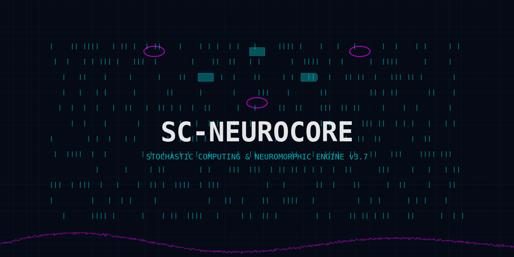
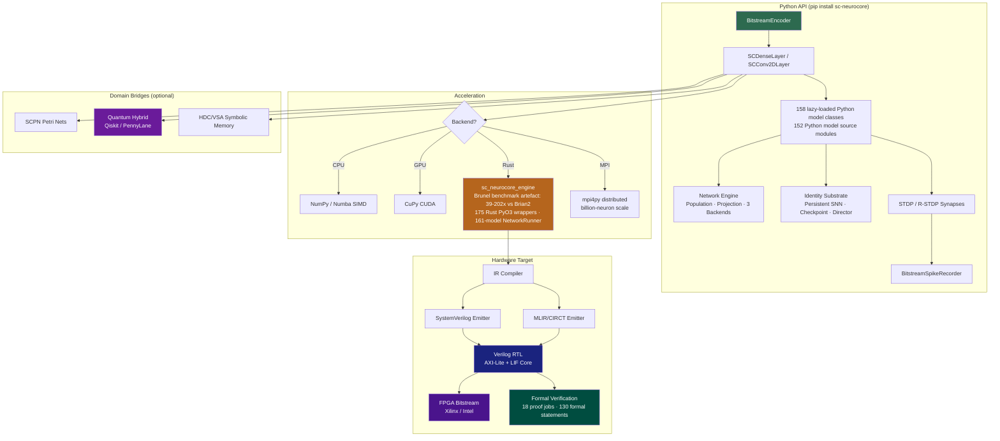

<!-- SPDX-License-Identifier: AGPL-3.0-or-later -->
<!-- © 1998–2026 Miroslav Šotek. All rights reserved. -->
<!-- Contact: www.anulum.li | protoscience@anulum.li -->
<!-- ORCID: https://orcid.org/0009-0009-3560-0851 -->
<!-- License: GNU AFFERO GENERAL PUBLIC LICENSE v3 -->
<!-- Commercial Licensing: Available -->

# SC-NeuroCore

<p align="center">
  
</p>

[](https://github.com/anulum/sc-neurocore/actions/workflows/ci.yml)
[](https://github.com/anulum/sc-neurocore/actions/workflows/codeql.yml)
[](https://pypi.org/project/sc-neurocore/)
[](https://pypi.org/project/sc-neurocore/)
[](https://pepy.tech/project/sc-neurocore)
[](https://mypy-lang.org/)
[](https://github.com/astral-sh/ruff)
[](https://peps.python.org/pep-0561/)
[](https://github.com/pre-commit/pre-commit)
[](https://anulum.github.io/sc-neurocore/)
[](https://www.gnu.org/licenses/agpl-3.0)
[](https://www.python.org/downloads/)
[](https://www.rust-lang.org/)
[](https://www.bestpractices.dev/projects/12175)
[](https://scorecard.dev/viewer/?uri=github.com/anulum/sc-neurocore)
[](https://reuse.software/)
[](https://colab.research.google.com/github/anulum/sc-neurocore/blob/main/notebooks/quickstart_colab.ipynb)

**Stochastic computing and neuromorphic hardware co-design toolkit**

**Version:** 3.16.0

SC-NeuroCore is a research-to-hardware software stack for designing spiking and stochastic neural systems, validating their numerical behaviour, and moving selected models toward FPGA, ASIC, and embedded neuromorphic deployment. It combines a Python public API, an optional Rust acceleration engine, SystemVerilog generation paths, benchmark evidence, and polyglot research mirrors for selected kernels.

It is useful when a team needs to answer practical questions such as:

- Can a stochastic bitstream representation approximate this neural computation within a bounded error budget?
- Which neuron, synapse, encoder, or network path is numerically appropriate for a target workload?
- Can a model be converted into auditable hardware artefacts rather than remaining only a Python simulation?
- Which evidence is available for speed, parity, synthesis, safety-case readiness, or cross-framework comparison?
- Which capabilities are stable package surfaces and which remain source-checkout research surfaces?

<p align="center">
  
</p>

## Who It Is For

| Audience | Primary value |
| --- | --- |
| Neuroscience and SNN researchers | Reproducible neuron and network experiments with explicit numerical guardrails. |
| Hardware and FPGA engineers | Bitstream arithmetic, fixed-point export, RTL generation, and synthesis evidence workflows. |
| ML and edge-computing teams | SNN training, ANN-to-SNN conversion, acceleration options, and deployment trade-off studies. |
| Safety, verification, and industrial teams | Evidence bags, fail-closed readiness checks, formal-verification collateral, and documentation boundaries. |
| Commercial evaluators | A mapped path from modelling to hardware-oriented evidence, with clear gaps before field deployment. |

## What Makes It Distinct

- **Stochastic computing first:** bitstream encoders, probabilistic arithmetic, Sobol/LFSR sources, and bounded error reasoning are first-class components.
- **Neuromorphic breadth with guardrails:** the repository contains a wide neuron/model catalogue, but public docs separate stable package surfaces from opt-in research paths.
- **Hardware-oriented output:** selected workflows generate Verilog/SystemVerilog artefacts, synthesis reports, and hardware-readiness evidence instead of stopping at simulation.
- **Evidence-indexed benchmarking:** public benchmark claims are tied to committed artefacts under `benchmarks/results/` or hardware reports under `hdl/reports/`.
- **Polyglot parity research:** Julia, Go, Mojo, Rust, and Python counterparts exist for selected kernels to test implementation fidelity and performance trade-offs, while the default install remains Python-first.

## Application Areas

SC-NeuroCore is positioned for neuromorphic R&D, stochastic accelerator design, edge inference studies, BCI and spike-codec prototyping, safety-case tooling, and hardware/software co-design. It is not a certified medical, automotive, aerospace, or rail product by itself. Domain profiles in the documentation state required evidence and missing evidence explicitly so commercial or regulated deployment work can start from an auditable gap list.

## Current Evidence Boundary

| Surface | Current status |
| --- | --- |
| Public Python package | Version 3.16.0 package surface with base NumPy/SciPy dependency boundary. |
| Optional acceleration | Rust engine and optional heavy backends are opt-in; Python fallbacks remain available. |
| Hardware evidence | Committed synthesis and report artefacts exist for selected flows; power/energy claims require matching committed reports. |
| Benchmarks | Only committed JSON/CSV/report artefacts are public evidence. Local exploratory runs must not be promoted without raw artefacts. |
| Polyglot surfaces | Source-checkout research and parity surfaces, not default user install requirements. |
| Regulated deployment | Readiness tooling and evidence categories only; no certification or field approval claim. |

## Version and Capability Snapshot

<!-- capability-snapshot:start -->
<!-- SPDX-License-Identifier: AGPL-3.0-or-later -->
<!-- Generated by tools/capability_manifest.py; do not edit counts by hand. -->

### SC-NeuroCore Capability Inventory

| Surface | Current inventory |
|---|---:|
| Package version | 3.16.0 |
| Public API exports | 45 |
| Python model source modules | 152 |
| Python model classes | 158 |
| Model documentation pages | 175 |
| Rust PyO3 model wrappers | 175 |
| Optional extras | 27 |
| Python test files | 999 |
| Public documentation pages | 565 |
| GitHub Actions workflows | 17 |

Evidence boundary: this snapshot is a static inventory. Performance, coverage, hardware, and scientific-fidelity claims require their own committed evidence artefacts.
<!-- capability-snapshot:end -->

Snapshot definitions: **Python test files** counts every `.py` support or test
module under `tests/`; **Python model classes** counts non-private top-level
classes in `src/sc_neurocore/neurons/models/*.py`; **Public documentation
pages** counts Markdown under `docs/` after excluding `docs/internal/` and
`docs/_generated/`.

## Quick Start

```bash
pip install sc-neurocore
```

For biological closed-loop BCI implementations (experimental), install the bioware optional dependencies:
```bash
pip install "sc-neurocore[bioware]"
```

```python
from sc_neurocore import StochasticLIFNeuron

neuron = StochasticLIFNeuron(v_threshold=1.0, tau_mem=20.0, noise_std=0.0)
spikes = sum(neuron.step(0.8) for _ in range(500))
print(f"{spikes} spikes in 500 steps")
```

### Zenith Quickstart

Train biologically plausible rules using PyTorch surrogate autograd, then export the exact layer to hardware:

### Bio-hybrid Closed-Loop with ArcaneZenith (Experimental)

The `bioware` module securely bridges biological real-world MEA setups into Stochastic Computing and Optogenetic laser outputs natively. It supports PCA/K-Means spike sorting, runtime health tracking, pharmacological wash simulations, and `ArcaneZenithCognitiveCore` bridged bindings.

```python
import torch
from sc_neurocore.plasticity import create_plasticity_layer
from sc_neurocore._native.learning_bridge import RULE_STDP

# 1. Train entirely in standard DL execution architectures
bcm_layer = create_plasticity_layer(count=128, rule_type=RULE_STDP, backend="torch", autograd=True)
# ... standard cross-entropy loss.backward() loop

# 2. Deploy natively to SC-NeuroCore hardware limits
exascale_layer = create_plasticity_layer(count=128, rule_type=RULE_STDP, backend="rust", weight=bcm_layer.weights.detach().numpy())
exascale_layer.save("hw_layer.scal")
```
See the full end-to-end integration demo in [`examples/zenith_hybrid_resnet.py`](examples/zenith_hybrid_resnet.py).

```bash
# Add only the extras needed for the current workflow.
pip install "sc-neurocore[minimal]"   # explicit v4 minimal profile
pip install "sc-neurocore[core]"      # explicit base profile
pip install "sc-neurocore[nir]"       # NIR interop
pip install "sc-neurocore[training]"  # PyTorch-backed training
pip install "sc-neurocore[studio]"    # local web studio
pip install "sc-neurocore[full]"      # local research environment only
```

See [Install Profiles](docs/guides/install_profiles.md) for the full optional
dependency matrix and research-only boundaries.

### Rust Engine and Benchmark Evidence

The optional Rust engine provides SIMD-accelerated simulation, 175 Rust PyO3
model wrappers, a 161-model NetworkRunner dispatch list, and fused E-I network
simulation. Release automation builds pre-built `sc_neurocore_engine` wheels
with `maturin` for Python 3.10-3.14 on Linux x86_64/aarch64, macOS, and Windows.
Use a matching release wheel first:

```bash
python -m pip install sc_neurocore_engine
```

If no matching wheel exists for your platform or Python version, build the local
bridge from a source checkout with a local Rust toolchain:

```bash
python -m pip install --require-hashes -r requirements/maturin.txt
cd bridge
python -m maturin develop --release
```

The committed Brunel balanced-network scaling artefact
`benchmarks/results/rust_scaling_benchmark.json` records 39-202x speedups
against Brian2 for its 10K-100K rows. Treat that as workload-specific evidence,
not as a blanket claim for every engine path.

When installed, SC-NeuroCore automatically uses the Rust engine for:

- **NetworkRunner:** 161-model fused Rayon-parallel simulation loop
- **E-I network:** single Rust call for connectivity + Poisson + Euler + spike detection
- **Batch simulate:** model dispatch loop in compiled Rust
- **SIMD bitstream ops:** 190 Gbit/s popcount (AVX-512)

The pure Python package works without the engine — NumPy fallbacks are
used for all operations. Install or build the engine only when you need the
performance advantage. See [Install Profiles](docs/guides/install_profiles.md)
for the base install, optional extras, and source-build path.

`pip install sc-neurocore` publishes the Python suite under the public
`sc-neurocore` package name. The optional Rust engine remains part of the
repository / release-asset / source-build flow rather than a separate PyPI
runtime dependency. Source-only extended modules such as `analysis`, `viz`,
`audio`, `dashboard`, and `swarm` still require a source checkout.

### Development Setup

```bash
git clone https://github.com/anulum/sc-neurocore.git
cd sc-neurocore
pip install -e ".[dev]"    # editable install with all dev tools
make preflight             # verify setup (lint + tests)
```

If you are changing the Rust bridge locally, install `bridge/` in the same
environment or run source-tree commands with `PYTHONPATH=src:bridge`.

### Visual SNN Design Studio (Experimental)

> **Status:** Development preview. The Studio is functional but under active
> development. API and UI may change between releases until the v4.0 stable API
> freeze.

A web-based IDE for designing, training, compiling, and deploying spiking
neural networks — from ODE equations to FPGA bitstream in a single browser tab.

```bash
pip install sc-neurocore[studio]
sc-neurocore studio              # opens browser at http://127.0.0.1:8001
```

| Feature | What it does |
|---------|-------------|
| **118 Model Browser** | Browse all neuron models by category, simulate with parameter sliders |
| **18+ Analysis Views** | Trace, phase portrait, ISI, f-I curve, bifurcation, heatmap, STA, frequency response, characterisation dashboard |
| **Compiler Inspector** | Build SC IR from equations, verify, emit SystemVerilog |
| **Synthesis Dashboard** | One-click Yosys synthesis to ice40/ECP5/Gowin/Xilinx, multi-target comparison, resource bars |
| **Training Monitor** | Live loss/accuracy curves via SSE, 6 surrogate gradients, per-layer spike rates |
| **Network Canvas** | Drag-and-drop populations and projections (React Flow), NIR export/import |
| **Full Pipeline** | Network → simulate → compile → synthesise in one click |
| **Project Save/Load** | Persistent workspaces as JSON, server-side storage |

No other SNN framework provides a visual design-to-hardware pipeline.
snnTorch has Jupyter notebooks. Brian2 has a basic GUI. Neither goes from
visual network design to FPGA resource estimation.

| Feature | SC-NeuroCore Studio | Brian2 GUI | snnTorch | Nengo GUI |
|---------|:---:|:---:|:---:|:---:|
| Visual network design | **Yes** | Basic | No | Yes |
| ODE equation editor | **Yes** | No | No | No |
| Live training curves | **Yes** | No | TensorBoard | No |
| Verilog output viewer | **Yes** | No | No | No |
| FPGA synthesis | **Yes** | No | No | No |
| Co-simulation view | **Yes** | No | No | No |

Full documentation: [Studio Guide](https://anulum.github.io/sc-neurocore/studio/)

## Docker

Docker builds can include the optional Rust acceleration engine when the build
profile installs it. Published speed evidence is scoped to committed benchmark
artefacts such as `benchmarks/results/rust_scaling_benchmark.json`:

```bash
# Build
make docker-build
# or: docker build -f deploy/Dockerfile -t sc-neurocore:latest .

# Build the offline HDL shipping profile with packaged baseline RTL primitives
# and the hash-locked HDL dependency set. Vivado is not required for this image.
docker build -f deploy/Dockerfile --build-arg INSTALL_EXTRAS=hdl -t sc-neurocore:hdl .

# Run interactive Python shell
make docker-run
# or: docker run --rm -it sc-neurocore:latest

# Smoke test via docker compose
docker compose -f deploy/docker-compose.yml up
```

Pre-built images are published to GHCR on every release:

```bash
docker pull ghcr.io/anulum/sc-neurocore:latest
docker run --rm -it ghcr.io/anulum/sc-neurocore:latest
```

## Architecture

### Module Tiers

`pip install sc-neurocore` ships **Core + Simulation + Domain bridges** only.
Research and extended modules are available from source (`pip install -e ".[dev]"`).

| Tier | Modules | Ships in wheel | Status |
|------|---------|:--------------:|--------|
| **Core** | neurons, synapses, layers, sources, utils, recorders, accel, compiler, hdl_gen, hardware, cli, exceptions | Yes | Production path; current CI coverage gate is 98%, with 100% retained as the target. |
| **Simulation** | hdc, solvers, transformers, learning, graphs, ensembles, export, pipeline, profiling, models, math, spatial, verification, security | Yes | Stable. Import explicitly. |
| **Industrial** | safety_cert, asic_flow, fault_injection, uvm_gen, hypervisor, digital_twin, chiplet, spintronic, memristor, analog_bridge | No | Source-only; see `docs/MODULE_INTEGRATION.md` for the historical 19-module integration slice. |
| **Extended research** | evo_substrate, meta_plasticity, bioware, federated, bci_studio, explainability, neuro_symbolic, stochastic_doctor, model_zoo | No | Source-only; see `docs/MODULE_INTEGRATION.md` for the historical 19-module integration slice. |
| **Domain bridges** | quantum (Qiskit/PennyLane), adapters/holonomic (JAX), scpn (Petri nets) | Yes | Requires `pip install sc-neurocore[quantum]` or `[jax]` |
| **Research** | robotics, physics, bio, optics, chaos, sleep, interfaces | No | Tested. Available from source. |
| **Speculative** | `research/` (eschaton, exotic, meta, post_silicon, transcendent) | No | Theoretical. See `research/README.md`. |

### Architecture Diagram



### Core API subset (28 of 44 public exports)

```python
from sc_neurocore import (
    # Neurons
    StochasticLIFNeuron, FixedPointLIFNeuron, FixedPointLFSR,
    FixedPointBitstreamEncoder, HomeostaticLIFNeuron,
    StochasticDendriticNeuron, SCIzhikevichNeuron,
    # Synapses
    BitstreamSynapse, BitstreamDotProduct,
    StochasticSTDPSynapse, RewardModulatedSTDPSynapse,
    # Layers
    SCDenseLayer, SCConv2DLayer, SCLearningLayer,
    VectorizedSCLayer, SCRecurrentLayer, MemristiveDenseLayer,
    SCFusionLayer, StochasticAttention,
    # Utilities
    BitstreamEncoder, BitstreamAverager, RNG,
    generate_bernoulli_bitstream, generate_sobol_bitstream,
    bitstream_to_probability,
    # Sources & Recorders
    BitstreamCurrentSource, BitstreamSpikeRecorder,
)
```

### Hardware (Verilog RTL)

```
hdl/
  sc_bitstream_encoder.v      -- LFSR-based stochastic encoder (SEED_INIT param)
  sc_bitstream_synapse.v      -- AND-gate SC multiplier
  sc_mux_add.v                -- 2-input MUX (scaled addition)
  sc_cordiv.v                 -- CORDIV stochastic divider (Li et al. 2014)
  sc_dotproduct_to_current.v  -- Popcount -> fixed-point current
  sc_lif_neuron.v             -- Q8.8 leaky integrate-and-fire
  sc_firing_rate_bank.v       -- Spike rate estimator
  sc_dense_layer_core.v       -- Full dense layer pipeline (decorrelated seeds)
  sc_dense_matrix_layer.v     -- N×M weight matrix layer
  sc_axil_cfg.v               -- AXI-Lite register file
  sc_axil_cfg_param.v         -- Parameterized AXI-Lite register file
  sc_axis_interface.v         -- AXI-Stream bulk bitstream I/O
  sc_dma_controller.v         -- DMA for weight upload and output readback
  sc_cdc_primitives.v         -- Clock domain crossing (2-FF sync, Gray, async FIFO)
  sc_dense_layer_top.v        -- Dense layer top wrapper
  sc_neurocore_top.v          -- System top (DMA + AXI + layers)
  sc_aer_encoder.v            -- AER spike encoder (event-driven output)
  sc_event_neuron.v           -- Event-triggered LIF (power ∝ spike rate)
  sc_aer_router.v             -- AER event distribution to target neurons
  tb_sc_*.v (16 testbenches)  -- Self-checking simulation testbenches
  formal/ (18 proof jobs)     -- 130 formal statements (100 assert, 7 assume, 23 cover)
```

Formal verification inventory: 18 SymbiYosys proof jobs and 130 formal
statements (100 assert, 7 assume, 23 cover) under `hdl/formal/`.

### GPU Acceleration

```python
from sc_neurocore.accel import xp, HAS_CUPY, to_device, to_host
from sc_neurocore.accel.gpu_backend import gpu_vec_mac

# VectorizedSCLayer auto-detects GPU
layer = VectorizedSCLayer(n_inputs=32, n_neurons=64, length=1024)
output = layer.forward(input_values)  # GPU if CuPy available, else CPU
```

## Hardware-Software Co-Simulation

The co-sim flow verifies bit-exact equivalence between the Python model and
Verilog RTL:

```bash
# 1. Generate stimuli + expected results (Python golden model)
python scripts/cosim_gen_and_check.py --generate

# 2. Run Verilog simulation (requires Icarus Verilog)
iverilog -o tb_lif hdl/sc_lif_neuron.v hdl/tb_sc_lif_neuron.v
vvp tb_lif

# 3. Compare results
python scripts/cosim_gen_and_check.py --check
```

### Reproducibility

Every GitHub Release includes:

- **wheel + sdist** — Python distribution artifacts (`dist/sc_neurocore-*`)
- **SBOM** — CycloneDX software bill of materials (`sbom.json`)
- **Changelog extract** — release notes from `CHANGELOG.md`

Co-simulation traces are generated deterministically from fixed LFSR seeds.
To reproduce a published benchmark:

```bash
git checkout v3.16.0
pip install -e ".[dev]"
python benchmarks/benchmark_suite.py --markdown > BENCHMARKS.md
```

For Verilog co-sim trace reproduction, see `scripts/cosim_gen_and_check.py`
and the seed constants in `hdl/sc_bitstream_encoder.v`.

### Key Technical Details

- **LFSR**: 16-bit maximal-length, polynomial x^16+x^14+x^13+x^11+1, period 65535
- **Seed strategy**: Input encoders `0xACE1 + i*7`, weight encoders `0xBEEF + i*13`
- **Fixed-point**: Q8.8 (DATA_WIDTH=16, FRACTION=8), signed two's complement
- **Overflow**: Explicit bit-width masking via `_mask()` function

## Examples

Runnable scripts in `examples/`:

| Script | Description |
|--------|-------------|
| `01_basic_sc_encoding.py` | Bernoulli & Sobol bitstream encoding/decoding |
| `02_sc_neuron_layer.py` | SCDenseLayer construction, spike trains, and firing-rate summary |
| `03_ir_compile_demo.py` | IR graph building, verification, SystemVerilog emission (v3 Rust engine) |
| `04_vectorized_layer.py` | VectorizedSCLayer throughput benchmarking |
| `05_scpn_stack.py` | Full 7-layer SCPN consciousness stack with inter-layer coupling |
| `06_hdl_generation.py` | Verilog top-level generation from a network description |
| `07_ensemble_consensus.py` | Multi-agent ensemble orchestration and voting |
| `08_hdc_symbolic_query.py` | Hyper-Dimensional Computing symbolic memory (v3 Rust engine) |
| `09_safety_critical_logic.py` | Fault-tolerant Boolean logic with stochastic redundancy (v3 Rust engine) |
| `10_benchmark_report.py` | Head-to-head v2/v3 benchmark suite (v3 Rust engine) |
| `11_sc_training_demo.py` | Surrogate-gradient training of an SC dense layer (v3 Rust engine) |
| `12_load_pretrained_model.py` | Load pretrained ConvSpikingNet and classify MNIST digits |
| `zenith_hybrid_resnet.py` | Train hybrid network with PyTorch autograd → save via Zenith exascale persistence |
| `jax_training_demo.py` | JAX JIT surrogate-gradient SNN training on synthetic data |
| `mnist_fpga/demo.py` | MNIST classifier: train → quantise Q8.8 → SC simulate → Verilog export |
| `mnist_conv_train.py` | **ConvSpikingNet: 99.49% MNIST** (learnable beta/threshold, cosine LR; evidence in `benchmarks/results/mnist_conv_accuracy_reproducibility.json`) |
| `mnist_surrogate/train.py` | Surrogate gradient SNN training (FastSigmoid/SuperSpike/ATan, ~95% MNIST) |
| `nir_roundtrip_demo.py` | NIR roundtrip: CubaLIF + recurrent connections, build → import → run → export |
| `norse_nir_roundtrip.py` | Norse → NIR → SC-NeuroCore roundtrip with real Norse weights |
| `snntorch_nir_roundtrip.py` | snnTorch RSynaptic → NIR → SC-NeuroCore roundtrip (CubaLIF + recurrent) |
| `spikingjelly_nir_roundtrip.py` | SpikingJelly → NIR → SC-NeuroCore roundtrip |
| `ann_to_snn_demo.py` | Convert trained PyTorch ANN to rate-coded SNN |
| `delay_training_demo.py` | Train spiking network with learnable per-synapse delays |

```bash
PYTHONPATH=src:bridge python examples/01_basic_sc_encoding.py
```

Examples marked **(v3 Rust engine)** require an available `sc_neurocore_engine`
bridge install. For source-tree runs against local bridge code, use
`PYTHONPATH=src:bridge` or install `bridge/` in the same environment.

## CI/CD

17 GitHub Actions workflows (`.github/workflows/`), all SHA-pinned:

| Workflow | Purpose |
|----------|---------|
| **ci.yml** | Lint (ruff format + ruff check + bandit) + Test (Python 3.10-3.14, coverage gate enforced in CI) + Build |
| **v3-engine.yml** | Rust engine `cargo test` + `cargo clippy` |
| **v3-wheels.yml** | Cross-platform wheels (Linux, macOS, Windows × Python 3.10–3.14) |
| **docker.yml** | Build & push Docker image to GHCR on release tags |
| **docs.yml** | MkDocs → GitHub Pages |
| **publish.yml** | Publish `sc-neurocore`, engine wheels, and `engine/` crate releases; retries skip already-published PyPI/crates.io versions |
| **release.yml** | Build sdist/SBOM/security packet, support tagged-release backfills, and attach release assets to GitHub Release |
| **benchmark.yml** | Performance regression tracking |
| **codeql.yml** | CodeQL security analysis (weekly + on push) |
| **fuzz.yml** | Rust engine fuzzing with nightly cargo-fuzz targets |
| **mlir-circt.yml** | MLIR/CIRCT canary for compiler lowering paths |
| **nir-canary.yml** | Latest NIR compatibility canary |
| **scorecard.yml** | OpenSSF Scorecard |
| **security-scanners.yml** | pip-audit, cargo-audit, Semgrep, and release security scans |
| **pre-commit.yml** | Pre-commit hook validation |
| **yosys-synth.yml** | Yosys HDL synthesis verification |
| **stale.yml** | Auto-label and close stale issues |

## Benchmarks

Run the benchmark suite:

```bash
python benchmarks/benchmark_suite.py           # quick mode
python benchmarks/benchmark_suite.py --full    # thorough (10x)
python benchmarks/benchmark_suite.py --markdown # output BENCHMARKS.md
```

Sample results (CPU, quick mode):

| Operation | Throughput |
|-----------|-----------|
| LFSR step | 2.25 Mstep/s |
| Bitstream encoder | 1.88 Mstep/s |
| LIF neuron step | 1.15 Mstep/s |
| vec_and (1024 words) | 45.67 Gbit/s |
| gpu_vec_mac (64x32x16w) | 6.15 GOP/s |

## Documentation

**Live site**: [anulum.github.io/sc-neurocore](https://anulum.github.io/sc-neurocore/)

- [Getting Started](docs/guides/getting-started.md) — Installation & quickstart
- [Install Profiles](docs/guides/install_profiles.md) — Base install, optional extras, and research-only polyglot boundary
- [FPGA Deploy Cookbook](docs/tutorials/fpga_deploy_cookbook.md) — Five-minute scaffold, optional synthesis, report-to-optimiser handoff
- [**Tutorials**](https://anulum.github.io/sc-neurocore/tutorials/01_stochastic_computing_fundamentals/) — 88 tracked guides and tutorials (SC fundamentals → MNIST → FPGA → quantum → formal verification)
- [Studio Federation API](docs/api/federation.md) — Optional Hub-facing federation manifest, verbs, and evidence envelopes
- [API Reference](docs/api/API_REFERENCE.md) — Python package API
- [Rust Engine API](https://anulum.github.io/sc-neurocore/rust-api/sc_neurocore_engine/) — Rust engine docs
- [Hardware Guide](docs/hardware/HARDWARE_GUIDE.md) — FPGA deployment workflow
- [Architecture](docs/architecture/architecture.md) — Package architecture
- [Benchmarks](docs/benchmarks/BENCHMARKS.md) — Performance measurements
- [CHANGELOG.md](CHANGELOG.md) — Version history

Build docs locally:
```bash
pip install mkdocs mkdocs-material mkdocstrings[python]
mkdocs serve
```

## Install Extras

Start with the base package. It installs the Python package plus `numpy` and
`scipy`; it does not install PyTorch, JAX, Qiskit, PennyLane, Lava, FastAPI, or
hardware toolchains.

```bash
pip install sc-neurocore              # base package: core simulation, compiler, HDL scaffold
pip install sc-neurocore[minimal]     # explicit v4 minimal profile
pip install sc-neurocore[core]        # explicit base profile
pip install sc-neurocore[training]    # PyTorch-backed training
pip install sc-neurocore[nir]         # NIR import/export
pip install sc-neurocore[studio]      # local web studio
pip install sc-neurocore[bioware]     # biological closed-loop prototypes
```

Run the dependency-light smoke path with `python examples/minimal_smoke_demo.py`.
It exercises root public imports, stochastic bitstreams, one LIF bitstream pass,
and packaged Verilog primitive discovery without quantum, Lava, gdsfactory,
PyTorch, JAX, or hardware-only dependencies.

Acceleration and research extras are intentionally opt-in:

```bash
pip install sc-neurocore[accel]       # Numba JIT experiments
pip install sc-neurocore[gpu]         # CuPy CUDA experiments
pip install sc-neurocore[jax]         # JAX-backed experiments
pip install sc-neurocore[quantum]     # research-grade Qiskit/PennyLane bridges
pip install sc-neurocore[lava]        # Lava interop experiments
pip install sc-neurocore[research]    # plotting, graph, ONNX, and torch research stack
pip install sc-neurocore[full]        # local research environment only; pulls heavy extras
```

See [Install Profiles](docs/guides/install_profiles.md) before using `full`.
The default package and FPGA scaffold flow do not require those heavy extras.

For development (includes all modules and source-only research code):

```bash
pip install -e ".[dev]"               # editable install with pytest, mypy, ruff, hypothesis
```

Pinned dependency files for reproducible environments:

```bash
pip install -r requirements.txt       # runtime only
pip install -r requirements-dev.txt   # runtime + dev tools
```

## Rust Engine (175 PyO3 Wrappers, 161-Model NetworkRunner)

The `sc_neurocore_engine` crate provides 175 Rust PyO3 model wrappers callable
from Python (including ArcaneNeuron), a 161-model NetworkRunner with
Rayon-parallel population simulation (100K+ neurons), and SIMD-accelerated
primitives with dispatch across five ISAs (AVX-512, AVX2, NEON, SVE,
RISC-V V). Rust test totals are maintained by the Rust workspace; public
release claims should cite the current `cargo test -- --list` output or CI
evidence before publication.

| Crate | Tests | Purpose |
|-------|------:|---------|
| `sc_neurocore_engine` | CI-listed | PyO3 SIMD engine, Rust model wrappers, NetworkRunner |
| `tinysc_riscv` | 83 | RISC-V SC instruction set simulator |
| `core_engine` | 22 | SC arithmetic core (standalone) |
| `autonomous_learning` | 12 | Self-modifying plasticity rules |
| `neuro_symbolic` | 28 | Hyperdimensional computing + predictive coding |
| `stochastic_doctor_core` | 23 | Bitstream diagnostics engine |

| Category | Scope |
|----------|-------|
| Primitives | Bernoulli + Sobol bitstream, pack/unpack, popcount, SIMD (5 ISAs) |
| Neurons | 175 PyO3 model wrappers; 161 names wired into NetworkRunner |
| NetworkRunner | 161-model fused simulation loop with CSR projections and Rayon parallelism |
| Synapses | Static, STDP, Reward-STDP |
| Layers | Dense, Conv2D, Recurrent, Learning, Fusion, Memristive, Attention |
| Networks | Brunel, GNN, Spike recorder, Connectome, Fault injection |
| Compiler | IR builder/parser/verifier, SystemVerilog + MLIR emitters, IR bridge |
| Domain | HDC, Kuramoto, SSGF geometry |
| Training | 6 surrogate gradient functions + property tests |

## Community

- [GitHub Discussions](https://github.com/anulum/sc-neurocore/discussions) — questions, ideas, show & tell
- [Issue Tracker](https://github.com/anulum/sc-neurocore/issues) — bug reports and feature requests
- [Contributing Guide](CONTRIBUTING.md) — how to set up, test, and submit PRs

## Citation

If you use SC-NeuroCore in your research, please cite:

```bibtex
@software{sotek2026scneurocore,
  author    = {Šotek, Miroslav},
  title     = {SC-NeuroCore: A Deterministic Stochastic Computing Framework for Neuromorphic Hardware Design},
  version   = {3.16.0},
  year      = {2026},
  doi       = {10.5281/zenodo.18906614},
  url       = {https://github.com/anulum/sc-neurocore},
  license   = {AGPL-3.0-or-later}
}
```

See also [`CITATION.cff`](CITATION.cff) for the machine-readable citation metadata.

## AI Disclosure

This project uses LLMs for advanced control mechanisms and GitHub
handling. All output is reviewed, tested, and verified by the project
author.

## License

SC-NeuroCore is dual-licensed:

- **Open Source**: [GNU Affero General Public License v3.0](LICENSE) (AGPLv3)
- **Commercial**: Proprietary license available for integration into closed-source products

For commercial licensing enquiries, contact [protoscience@anulum.li](mailto:protoscience@anulum.li).

---

<p align="center">
  <a href="https://www.anulum.li">
    
  </a>
  &nbsp;&nbsp;&nbsp;&nbsp;
  <a href="https://www.anulum.li">
    
  </a>
  <br>
  <em>Developed by <a href="https://www.anulum.li">ANULUM</a> / Fortis Studio</em>
</p>
