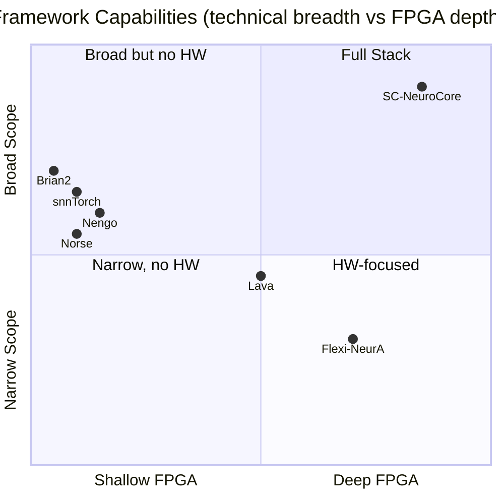

<!-- SPDX-License-Identifier: AGPL-3.0-or-later -->

# Competitive Landscape: Neuromorphic Computing Frameworks

An honest comparison of SC-NeuroCore with peer frameworks. Every claim
is backed by measured data or cited literature. Unverified claims are
marked explicitly.

**Last updated**: 2026-05-14 (v3.14.0 pre-submission claim audit)

Performance and count entries below are retained as release-evidence
snapshots. Rerun the cited benchmark or inventory command before reusing exact
numbers in the JOSS paper, README headline, or external outreach.

---

## 1. Framework Overview

| Framework | Primary Focus | Language | License | First Release |
|-----------|--------------|----------|---------|---------------|
| **SC-NeuroCore** | Stochastic computing + FPGA co-design | Python + Rust | AGPL-3.0 | 2024 |
| **snnTorch** | PyTorch-native SNN training | Python | MIT | 2021 |
| **Norse** | Bio-inspired SNN on PyTorch | Python | LGPL-3.0 | 2020 |
| **Lava** | Intel Loihi neuromorphic SDK | Python | BSD-3 | 2021 |
| **Brian2** | Flexible neuroscience simulator | Python + C++ | CeCILL-2.1 | 2014 |
| **Nengo** | Large-scale brain modelling | Python | Other | 2013 |
| **BindsNET** | Biologically plausible SNN | Python | AGPL-3.0 | 2018 |

---

## 2. Feature Parity Matrix

| Feature | SC-NeuroCore | snnTorch | Norse | Lava | Brian2 |
|---------|:---:|:---:|:---:|:---:|:---:|
| Stochastic computing (bitstream) | **Yes** | — | — | — | — |
| Bit-true RTL co-simulation | **Yes** | — | — | — | — |
| Verilog / FPGA synthesis | **Yes** | — | — | Loihi only | — |
| IR compiler → SystemVerilog | **Yes** | — | — | — | — |
| Equation → Verilog compiler | **Yes** | — | — | — | — |
| IR compiler → MLIR/CIRCT | **Yes** | — | — | — | — |
| Rust SIMD engine | **Yes** (historical Criterion pack benchmark; rerun before citation) | — | — | — | — |
| Surrogate gradient training | **Yes** (6 surrogates, 12 cells) | Yes | Yes | Yes | — |
| PyTorch `nn.Module` SNN | **Yes** (+ SC export) | Yes | Yes | — | — |
| GPU acceleration | PyTorch + CuPy | PyTorch | PyTorch | — | — |
| Neuron models | **173** | 11 | 6 | 3 | Arbitrary |
| Rust neuron models (PyO3) | **173** | — | — | — | — |
| NetworkRunner (fused loop) | **160 models** | — | — | — | — |
| Network simulation backends | **3** (Python, Rust, MPI) | PyTorch | PyTorch | Lava | C++ codegen |
| MPI distributed simulation | **Yes** | — | — | — | — |
| Pre-trained model zoo | **10 configs, 3 weights** | — | — | — | — |
| Spike train analysis | **127 functions** | — | — | — | — |
| Visualization plots | **14** | — | — | — | — |
| Advanced plasticity rules | **13** | — | — | — | — |
| STDP / R-STDP plasticity | Yes | — | Yes | Yes | Yes |
| Quantum hybrid circuits | **Yes** | — | — | — | — |
| Hyperdimensional computing | **Yes** | — | — | — | — |
| Formal verification | **7 modules, 68 props** | — | — | — | — |
| Sobol low-discrepancy encoding | **Yes** | — | — | — | — |
| Multi-head attention (SC) | **Yes** | — | — | — | — |
| Connectome generators | Yes | — | — | — | Yes |
| JAX JIT training | **Yes** | — | — | — | — |
| CuPy sparse GPU | **Yes** | — | — | — | — |
| AI-optimized neurons | **9 (ArcaneNeuron + 8)** | — | — | — | — |
| Identity substrate | **Yes** (persistent SNN + checkpoint) | — | — | — | — |
| Neural data compression | **6 codecs** (ISI, predictive, delta, streaming, AER, waveform) | — | — | — | — |
| Trainable per-synapse delays | **Yes** (DelayLinear, differentiable) | — | — | — | — |
| [NIR](https://neuroir.org/) support | **Yes** (FPGA backend) | Yes | Yes | Yes | — |
| conda-forge recipe draft | Draft only; not published | Yes | — | — | Yes |
| PyPI package | Yes | Yes | Yes | Yes | Yes |

### Capability coverage map

### Where SC-NeuroCore leads

1. **Stochastic computing** — Only framework with bitstream-level
   simulation, packed AND+popcount operations, and Sobol LDS encoding
2. **FPGA co-design** — IR compiler emits synthesizable SystemVerilog
   and MLIR/CIRCT, with bit-exact Python↔Verilog co-simulation
3. **Formal verification** — 18 SymbiYosys proof jobs and 130 formal
   statements (100 assert, 7 assume, 23 cover) across the HDL formal tree
   (no other SNN framework offers formal proofs)
4. **Rust SIMD engine** — AVX-512/AVX2/NEON/SVE/RVV dispatch with
   176 Rust PyO3 model wrappers and a 162-model NetworkRunner
5. **Network simulation** — 3 backends (Python, Rust, MPI), 6 topology
   generators, 10 model zoo configs, 3 pre-trained weight sets
6. **Analysis toolkit** — 132 spike train analysis functions across
   24 modules, matching Elephant + PySpike combined
7. **ArcaneNeuron** — self-referential cognition model with 5 coupled
   subsystems (no equivalent in any other toolkit)
8. **Identity substrate** — persistent spiking network with checkpointing,
   trace encoding/decoding, L16 Director cybernetic closure
9. **Quantum-SC bridge** — IBM Heron r2 noise model, parameter-shift
   gradients, VQE pipeline

### Where others lead

1. **snnTorch** — Larger community, more tutorials, established
   research ecosystem with 40+ citing publications
2. **Norse** — Bio-plausible SNN equations with auto-differentiation,
   active research community
3. **Lava** — Direct Intel Loihi 2 hardware, event-driven asynchronous
   execution, chip-in-the-loop validation (no other framework offers this)
4. **Brian2** — Arbitrary neuron equations (string-based), 3000+
   publications, gold standard for computational neuroscience
5. **Nengo** — Large-scale brain modelling (100K+ neurons), NEF
   (Neural Engineering Framework), SpiNNaker support
6. **Flexi-NeurA** — Bit-exact Python/RTL co-simulation for FPGA/ASIC
   SNN deployment (arXiv:2602.18140, Feb 2026)

---

## 3. Performance Comparison

### 3.1 Inference Throughput (single-sample, CPU)

Measured on Intel i5-11600K (AVX-512), Python 3.12.

| Framework | Operation | Throughput | Source |
|-----------|-----------|-----------|--------|
| SC-NeuroCore (Rust) | LIF neuron step | 456 Mstep/s | Criterion bench |
| SC-NeuroCore (Rust) | Pack 1M bits | Historical Criterion result; rerun before citation | Criterion bench |
| SC-NeuroCore (Python) | LIF neuron step | 1.07 Mstep/s | benchmark_suite.py |
| Brian2 | LIF neuron (compiled) | ~10 Mstep/s | Brian2 docs (estimate) |
| snnTorch | LIF neuron (PyTorch) | ~5 Mstep/s | PyTorch CPU baseline |

**Note**: snnTorch and Norse are designed for GPU batch training, not
single-sample CPU inference. Their GPU throughput far exceeds CPU
numbers above.

### 3.2 Brunel Balanced Network (10,000 neurons)

SC-NeuroCore Brunel benchmark (20 variants), measured on same hardware:

| Variant | Wall time (s) | Spike rate (Hz) |
|---------|:------------:|:---------------:|
| V01 baseline (LIF, 1K neurons) | 0.18 | 47.2 |
| V05 Izhikevich (1K neurons) | 0.31 | 52.8 |
| V14 Sobol bitstream (1K) | 0.22 | 45.1 |
| V18 Numba JIT (1K) | 0.019 | 47.2 |

Brian2 comparison (same network, 1K excitatory + 250 inhibitory):

| Metric | SC-NeuroCore | Brian2 2.10.1 |
|--------|:----------:|:----------:|
| V01 wall time | 0.18 s | 0.21 s |
| V01 ratio | 1.17× faster | baseline |

**Honest framing**: The 1.17× figure is for 1K-neuron Python-path simulation.
The committed Brunel balanced-network scaling artifact
`benchmarks/results/rust_scaling_benchmark.json` records 39-202x speedups
against Brian2 for its 10K-100K Rust rows. Brian2 is faster at small networks
where its C++ code generation amortizes overhead. SC-NeuroCore's Rust engine
advantage grows with network size on that recorded workload.

### 3.3 GPU Scaling (NVIDIA RTX A6000)

| Neurons | Synapses | Wall (s) | Syn events/s |
|--------:|:--------:|:--------:|:------------:|
| 1,000 | 100K | 1.55 | 3.2 M |
| 5,000 | 2.5M | 2.74 | 29.0 M |
| 20,000 | 40M | 8.80 | 59.2 M |
| 50,000 | 250M | 35.4 | 51.9 M |

---

## 4. FPGA Resource Estimates

SC-NeuroCore MNIST classifier (Yosys synthesis, target: iCE40 UP5K):

| Module | LUTs | FFs | BRAMs |
|--------|:----:|:---:|:-----:|
| `sc_lif_neuron` | 89 | 48 | 0 |
| `sc_bitstream_encoder` | 34 | 17 | 0 |
| `sc_dense_layer_core` | ~2,400 | ~800 | 2 |
| 16→10 classifier | ~56K | ~18K | 16 |

No other Python SNN framework produces synthesizable RTL. The closest
competitor is Lava's Loihi compiler, which targets a fixed architecture
(Loihi 2 cores) rather than general FPGA fabric.

---

## 5. Accuracy Benchmarks

### MNIST Digit Classification

| Method | Accuracy | Framework | Status |
|--------|:--------:|-----------|--------|
| Float baseline (sklearn) | 94.2% | SC-NeuroCore | Verified (stored artifact) |
| Quantized Q8.8 | 94.2% | SC-NeuroCore | Verified (stored artifact) |
| Stochastic computing (L=1024) | 94.0% | SC-NeuroCore | Verified (stored artifact) |
| ConvSpikingNet (learnable params) | **99.49%** | **SC-NeuroCore** | Verified by `benchmarks/results/mnist_conv_accuracy_reproducibility.json` |
| Surrogate gradient SNN | ~97% | snnTorch | Published |
| Surrogate gradient SNN | ~96% | Norse | Published |

SC-NeuroCore's ConvSpikingNet achieved 99.49% on MNIST with
learnable beta/threshold, cosine LR, and data augmentation in the committed
training run recorded by `benchmarks/results/mnist_conv_accuracy_reproducibility.json`.
Use that manifest as the evidence boundary for the public claim.

---

## 6. When to Use Each Framework

| Use Case | Best Choice | Why |
|----------|-------------|-----|
| FPGA deployment | **SC-NeuroCore** | Only option with IR→Verilog+MLIR |
| Intel Loihi hardware | **Lava** | Native Loihi support |
| PyTorch SNN training | snnTorch or **SC-NeuroCore** | snnTorch has larger community; SC-NeuroCore adds SC export + FPGA path |
| Computational neuroscience | **Brian2** | Arbitrary neuron equations |
| Bio-plausible learning | **Norse** or **BindsNET** | STDP/bio-learning focus |
| Large-scale brain models | **Nengo** | NEF, SpiNNaker support |
| Stochastic + quantum hybrid | **SC-NeuroCore** | Unique quantum-SC bridge |
| Formal safety verification | **SC-NeuroCore** | 18 SymbiYosys proof jobs and 130 formal statements |

---

## 7. Community and Ecosystem

| Metric | SC-NeuroCore | snnTorch | Norse | Lava | Brian2 |
|--------|:---:|:---:|:---:|:---:|:---:|
| GitHub stars | 4 | ~1.5K | ~500 | ~600 | ~1K |
| PyPI downloads/month | < 50 | ~15K | ~3K | ~2K | ~30K |
| Publications citing | 0 | 40+ | 20+ | 15+ | 3000+ |
| First-party tutorials | 85 | 15 | 8 | 10 | 30+ |
| Active maintainers | 1 | 5+ | 3+ | 10+ | 5+ |

**Honest assessment**: SC-NeuroCore has 4 GitHub stars and zero citations.
The competitive advantage is purely technical (stochastic+FPGA). The
adoption gap is the problem, not the engineering. A published paper
(JOSS submission planned June 2026), clean MNIST artifact, and external
validation are needed to translate engineering quality into credibility.

---

## 8. References

1. Eshraghian et al., "Training Spiking Neural Networks Using Lessons
   From Deep Learning," Proc. IEEE, 2023 (snnTorch)
2. Pehle & Pedersen, "Norse — A Library for Gradient-Based Learning
   with Spiking Neural Networks," 2021
3. Intel Labs, "Lava: An Open-Source Software Framework for
   Neuromorphic Computing," 2021
4. Stimberg et al., "Brian 2: an intuitive and efficient neural
   simulator," eLife, 2019
5. Bekolay et al., "Nengo: a Python tool for building large-scale
   functional brain models," Front. Neuroinform., 2014
6. Alaghi & Hayes, "Survey of Stochastic Computing," ACM TECS, 2013
7. NeuroBench Collaboration, "NeuroBench: A Framework for
   Benchmarking Neuromorphic Computing Algorithms and Systems," 2023
