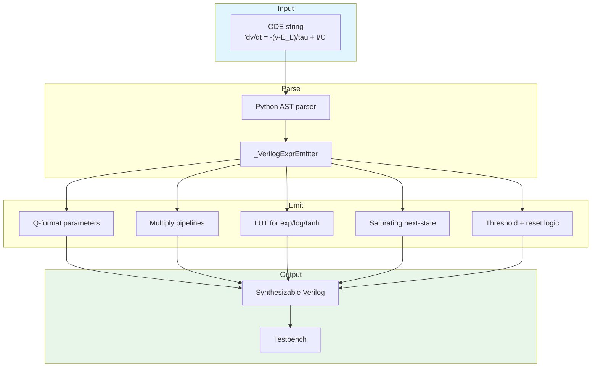

<!-- SPDX-License-Identifier: AGPL-3.0-or-later -->
<!-- Commercial license available -->
<!-- © Concepts 1996–2026 Miroslav Šotek. All rights reserved. -->
<!-- © Code 2020–2026 Miroslav Šotek. All rights reserved. -->
<!-- ORCID: 0009-0009-3560-0851 -->

# Compiler API Reference

Complete API reference for the SC-NeuroCore compilation pipeline.
Covers the ODE-to-Verilog equation compiler, MLIR/CIRCT emitter,
weight quantiser, adaptive precision, IR type checker, static analysis,
and deployment orchestrator.  This is the authoritative reference for
all compiler-facing Python functions.

---

## 1. Mathematical Formalism

### 1.1 ODE Discretisation

The compiler transforms continuous ODEs to discrete fixed-point
computations using the forward Euler method:

$$
x[n+1] = x[n] + \Delta t \cdot f(x[n], I[n])
$$

In Q$m$.$f$ format with shift-based division by $\tau$:

$$
x_{\text{next}} = x + \frac{I - (x - x_{\text{rest}})}{2^{\lceil\log_2 \tau\rceil}}
$$

### 1.2 Fixed-Point Encoding

Parameters and states are encoded in Q$m$.$f$ signed format:

$$
Q(v) = \text{round}(v \cdot 2^f)
$$

The range is $[-2^{m-1}, 2^{m-1} - 2^{-f}]$ with precision $2^{-f}$.

| Format | Total Bits | Integer | Fraction | Range | Precision |
|--------|:----------:|:-------:|:--------:|:-----:|:---------:|
| Q8.8 | 16 | 8 | 8 | ±127 | 0.0039 |
| Q16.16 | 32 | 16 | 16 | ±32767 | 0.000015 |
| Q12.20 | 32 | 12 | 20 | ±2047 | 0.00000095 |

### 1.3 Guard Bit Computation

Guard bits prevent intermediate overflow during multiply-accumulate:

$$
G = \lceil \log_2(N_{\text{terms}}) \rceil
$$

where $N_{\text{terms}}$ is the maximum number of additions in the
datapath.  The data width is extended to $W + G$ bits for
intermediates, then saturated back to $W$ bits for the final result.

### 1.4 Piecewise LUT Approximation

Transcendental functions ($\exp$, $\log$, $\tanh$, etc.) use 16-entry
piecewise-constant lookup tables covering $[-8, +8)$:

$$
f_{\text{LUT}}(x) = \text{table}\left[\left\lfloor \frac{x + 8}{1} \right\rfloor\right]
$$

Accuracy: ~1–2% over the useful range for neuron dynamics.

---

## 2. Architecture

### 2.1 Compilation Pipeline



### 2.2 Module Dependency Graph

```
sc_neurocore.compiler
├── equation_compiler   # ODE → Verilog
├── pipeline            # Yosys → nextpnr → bitstream
├── mlir_emitter        # MLIR/CIRCT backend
├── quantizer           # Float → Q-format
├── adaptive_precision  # Dynamic width switching
├── ir_type_checker     # Stochastic IR validation
├── static_analysis     # Guard bits, SVA, power
└── deployment          # Constraints, drivers, multi-target
```

---

## 3. CLI Interface

### 3.1 Main Compilation Command

```bash
sc-neurocore compile "dv/dt = -(v-E_L)/tau_m + I/C" \
    --threshold "v > -50" --reset "v = -65" \
    --params "E_L=-65,tau_m=10,C=1" --init "v=-65" \
    --target ice40 --testbench --synthesize -o build/
```

### 3.2 CLI Flags

| Flag | Default | Description |
|------|---------|-------------|
| `--threshold` | None | Spike condition (e.g. `"v > -50"`) |
| `--reset` | None | Reset expression (e.g. `"v = -65; w = 0"`) |
| `--params` | None | Comma-separated `key=val` pairs |
| `--init` | None | Initial state `key=val` pairs |
| `--target` | `ice40` | FPGA target (`ice40`, `ecp5`, `artix7`, `zynq`) |
| `--module-name` | `sc_equation_neuron` | Generated Verilog module name |
| `--testbench` | off | Generate simulation testbench |
| `--synthesize` | off | Run Yosys synthesis (requires Yosys in PATH) |
| `-o` / `--output` | `build` | Output directory |

### 3.3 NIR Network Compilation

```bash
sc-neurocore compile-nir model.nir --target artix7 -o build/
```

### 3.4 Multi-Target Compilation

```bash
sc-neurocore compile "dv/dt = -(v)/tau + I" \
    --target artix7,ecp5,ice40 --compare -o build/
```

---

## 4. Python API

### 4.1 Equation Compiler

```python
from sc_neurocore.neurons.equation_builder import from_equations
from sc_neurocore.compiler.equation_compiler import compile_to_verilog

neuron = from_equations(
    "dv/dt = -(v - E_L)/tau_m + I/C",
    threshold="v > -50",
    reset="v = -65",
    params=dict(E_L=-65, tau_m=10, C=1),
    init=dict(v=-65),
)

verilog = compile_to_verilog(
    neuron,
    module_name="sc_lif",
    data_width=16,
    fraction=8,
)
```

#### Supported Functions

| Category | Functions |
|----------|-----------|
| Transcendental | `exp`, `log`, `sqrt`, `tanh`, `sigmoid`, `sin`, `cos` |
| Arithmetic | `abs`, `clip(x, lo, hi)`, `max(a, b)`, `min(a, b)` |
| Polynomial | `x**2` through `x**8` |
| Operators | `+`, `-`, `*`, `/` (by constant), unary `-` |
| Comparison | `>`, `>=`, `<`, `<=` |

### 4.2 MLIR Emitter

```python
from sc_neurocore.compiler import MLIREmitter, generate_mlir_bundle

emitter = MLIREmitter("sc_native_top")
lhs = emitter.emit_lfsr(8, 0x5A)
rhs = emitter.emit_lfsr(8, 0xC3)
emitter.emit_and(lhs, rhs)

bundle = generate_mlir_bundle(emitter, "build/mlir/sc_native_top")
print(bundle.mlir_path)
print(bundle.manifest_path)
```

The manifest records operation counts and whether `firtool` is available.

### 4.3 Weight Quantizer

```python
import numpy as np

from sc_neurocore.compiler.quantizer import (
    PrecisionEnvelopeReport,
    PrecisionTrapReport,
    QFormatMixed,
    compile_dense_block_floating,
    compile_dense_mixed_precision,
    dequantize_weights,
    quantize_weights,
)

weights = np.array([0.5, -0.3, 1.2, 0.0], dtype=np.float64)

# Canonical fixed-point Q8.8 path: returns the integer tensor only.
q_weights = quantize_weights(weights, fmt="Q8.8", rounding="nearest")
restored = dequantize_weights(q_weights, fmt="Q8.8")

# Mixed hardware path: Q8.8 stored weights with Q16.16 accumulation metadata.
mixed = QFormatMixed()
q_mixed, tensor_scale = quantize_weights(weights, fmt=mixed)
restored_mixed = dequantize_weights(q_mixed, fmt=mixed, scale=tensor_scale)
```

`QFormatMixed` defaults to Q8.8 weights, a Q16.16 accumulator, nearest rounding,
and per-tensor scale maximisation.  Its accumulator format must be at least as
wide as the weight format, preserve the weight fractional precision, and cover
the full weight dynamic range.  The returned `tensor_scale` is deterministic
metadata for reconstructing values and for hardware emitters that need the
scale alongside compact stored weights.

Dense deployment can compile a two-dimensional weight matrix into the same
bit-true Q8.8-weight/Q16.16-accumulator contract used by the Rust and HDL
reference paths:

```python
compiled = compile_dense_mixed_precision(weights, fmt=QFormatMixed())
outputs_q1616, overflow = compiled.forward_with_overflow(inputs)
outputs = compiled.forward_float(inputs)
trap_report: PrecisionTrapReport = compiled.precision_trap_report(inputs)
envelope_report: PrecisionEnvelopeReport = compiled.precision_envelope_report(inputs)
manifest = compiled.manifest()
```

The mixed-dense HDL reference exposes the same lane-level overflow contract as
the Python `overflow` mask and Rust `overflow_count`: `overflow_vector[i]`
identifies output channel `i`, while the aggregate `overflow` line is asserted
when any lane saturates.

`forward_with_overflow` returns saturated accumulator-format integer codes and
per-output overflow flags.  In canonical `scale_per_tensor=False` mode the
division from Q8.8×Q16.16 products to Q16.16 outputs uses the same signed
arithmetic shift as the hardware reference.  With per-tensor scaling enabled,
the host path carries `tensor_scale` in the manifest so deployment code can
reconstruct compact stored weights without silently changing the physical
output scale.

`precision_trap_report` packages the same saturated output codes and overflow
mask into deterministic telemetry for host validation and HDL trap registers.
The report manifest includes `output_format`, `output_count`,
`overflow_count`, `saturated_min_count`, `saturated_max_count`, and
`has_overflow`.

`precision_envelope_report` adds conservative predeployment range evidence.  It
returns realised output codes, realised overflow flags, per-output absolute
bound codes, and a manifest containing `observed_overflow_free`,
`conservative_overflow_free`, `max_abs_output_code`, `max_abs_bound_code`, and
`min_headroom_code`.

Block-floating dense deployment uses shared-exponent weight blocks with
Q16.16 inputs and outputs:

```python
compiled_bfp = compile_dense_block_floating(weights, fmt="BFP16E3X32")
outputs_q1616, overflow = compiled_bfp.forward_with_overflow(inputs)
outputs = compiled_bfp.forward_float(inputs)
trap_report = compiled_bfp.precision_trap_report(inputs)
envelope_report = compiled_bfp.precision_envelope_report(inputs)
```

`BFP16E3X32` stores 16-bit signed mantissas and one 3-bit biased exponent per
32-weight block.  The exponent range is the full encoded biased range: for
three exponent bits, the unbiased range is `[-3, +4]`.  The Python deployment
path preserves the shared exponent metadata, saturates final Q16.16 output
codes, and exposes overflow flags for hardware telemetry parity.

#### Rounding Modes

| Mode | Description | Use Case |
|------|-------------|----------|
| `nearest` | Round to nearest representable value | Default |
| `stochastic` | Probabilistic rounding | Training |
| `floor` | Round toward zero | Conservative |

### 4.4 Adaptive Precision

```python
from sc_neurocore.compiler.adaptive_precision import AdaptivePrecisionConfig

config = AdaptivePrecisionConfig(
    low_precision=8,        # LP mode (Q4.4)
    high_precision=16,      # HP mode (Q8.8)
    switch_threshold=0.1,   # Switch to HP when gradient > 0.1
    hysteresis=0.05,        # Stay in HP until gradient < 0.05
)
```

### 4.5 IR Type Checker

```python
from sc_neurocore.compiler.ir_type_checker import check_ir_types

errors = check_ir_types(graph)
if errors:
    for e in errors:
        print(f"Type error: {e}")
```

Signal types: `BITSTREAM`, `RATE`, `SPIKE`, `FIXED`, `ANY`.

### 4.6 Static Analysis

```python
from sc_neurocore.compiler.static_analysis import (
    prove_overflow_free,
    generate_sva,
    estimate_power,
)

# Guard bit computation
proof = prove_overflow_free(
    equations={"v": "-(v - E_L)/tau_m + I/C"},
    params=dict(E_L=-65, tau_m=10, C=1),
    data_width=16,
    fraction=8,
)
print(f"Safe: {proof.safe}, guard bits: {proof.guard_bits}")

# SVA assertion generation
sva = generate_sva(
    state_vars=["v"],
    module_name="sc_lif",
    data_width=16,
    fraction=8,
)

# Power estimation
pe = estimate_power(
    verilog,
    data_width=16,
    freq_mhz=200.0,
    process_nm=28,
)

# Use measured VCD switching activity when available
pe_vcd = estimate_power(
    verilog,
    activity_vcd="build/sc_lif.vcd",
    vcd_time_units_per_cycle=5,
    freq_mhz=200.0,
)
```

### 4.7 Deployment

```python
from sc_neurocore.compiler.deployment import (
    generate_constraints,
    generate_cocotb_testbench,
    generate_riscv_driver,
    generate_sby_script,
    compile_multi_target,
    format_comparison_table,
    estimate_resources,
)

# Timing constraints
xdc = generate_constraints("sc_lif", freq_mhz=200)

# Cocotb testbench
tb = generate_cocotb_testbench("sc_lif", data_width=16, fraction=8)

# RISC-V driver
driver = generate_riscv_driver(
    "sc_lif",
    params={"E_L": 16, "tau_m": 16},
    rtos="freertos",
)

# SymbiYosys formal
sby = generate_sby_script("sc_lif", mode="bmc", depth=20)

# Resource estimation
res = estimate_resources("sc_lif", verilog)
print(f"LUTs: {res.estimated_luts}, DSPs: {res.estimated_dsps}")
```

---

## 5. Pipeline Orchestration

### 5.1 Full Synthesis Flow

```python
from sc_neurocore.compiler.pipeline import run_synthesis_pipeline

result = run_synthesis_pipeline(
    verilog_path="build/sc_lif.v",
    target="ice40",
    freq_mhz=100,
    output_dir="build/",
)
print(f"LUTs: {result.lut_count}")
print(f"FFs: {result.ff_count}")
print(f"Fmax: {result.fmax_mhz:.1f} MHz")
```

### 5.2 Pipeline Stages

| Stage | Tool | Input | Output |
|-------|------|-------|--------|
| Parse | Python AST | ODE string | IR graph |
| Emit | `_VerilogExprEmitter` | IR graph | Verilog RTL |
| Synthesis | Yosys | Verilog | BLIF/JSON |
| P&R | nextpnr | BLIF | Bitstream |

### 5.3 MLIR/CIRCT Path

```python
from sc_neurocore.compiler import MLIREmitter, generate_mlir_bundle

emitter = MLIREmitter("sc_native_top")
# ... emit operations ...
bundle = generate_mlir_bundle(emitter, "build/mlir/sc_native_top")
```

The MLIR backend generates `.mlir` files and `mlir_bundle_manifest.json`.
The manifest records operation counts and does not claim CIRCT lowering
unless a downstream tool execution record is attached.

---

## 6. Data Types and Structures

### 6.1 CompilationResult

```python
@dataclass
class CompilationResult:
    target: str
    verilog: str
    verilog_lines: int
    data_width: int
    fraction: int
    overflow: str           # "saturate" or "wrap"
    rounding: str           # "nearest", "stochastic", "floor"
    estimated_luts: int
    estimated_dsps: int
    estimated_ffs: int
    guard_bits: int
    max_freq_mhz: float
```

### 6.2 OverflowProofResult

```python
@dataclass
class OverflowProofResult:
    safe: bool
    guard_bits: int
    max_intermediate_bits: int
    overflow_possible_vars: list[str]
```

### 6.3 PowerEstimate

```python
@dataclass
class PowerEstimate:
    dynamic_mw: float
    static_mw: float
    total_mw: float
    energy_per_spike_nj: float
    toggle_rate: float
```

### 6.4 ResourceEstimate

```python
@dataclass
class ResourceEstimate:
    estimated_luts: int
    estimated_dsps: int
    estimated_ffs: int
    estimated_bram_18k: int
    mul_count: int
    add_count: int
    register_bits: int
```

---

## 7. Performance Characteristics

### 7.1 Compilation Speed

| Neuron Type | State Vars | Compile Time | Lines |
|------------|:----------:|:------------:|:-----:|
| LIF | 1 | ~5 ms | ~80 |
| Izhikevich | 2 | ~8 ms | ~120 |
| AdEx | 2 | ~10 ms | ~140 |
| HH | 4 | ~20 ms | ~250 |
| Custom (10 vars) | 10 | ~50 ms | ~600 |

### 7.2 Generated Verilog Quality

| Metric | LIF Q8.8 | Izh Q16.16 | HH Q16.16 |
|--------|:--------:|:----------:|:---------:|
| Lines | 80 | 120 | 250 |
| LUTs (Artix-7) | ~80 | ~200 | ~500 |
| DSPs | 1 | 3 | 8 |
| Fmax | 450 MHz | 400 MHz | 350 MHz |
| Power (28nm) | 0.003 mW | 0.008 mW | 0.06 mW |

### 7.3 LUT Accuracy

| Function | LUT Entries | Range | Max Error |
|----------|:----------:|:-----:|:---------:|
| `exp` | 16 | [-8, 8) | 1.5% |
| `log` | 16 | (0, 8) | 2.0% |
| `tanh` | 16 | [-8, 8) | 1.0% |
| `sigmoid` | 16 | [-8, 8) | 1.2% |
| `sqrt` | 16 | [0, 8) | 1.8% |

---

## 8. Test Suite and Verification

### 8.1 Equation Compiler Test

```bash
python -c "
from sc_neurocore.neurons.equation_builder import from_equations
from sc_neurocore.compiler.equation_compiler import compile_to_verilog

n = from_equations('dv/dt = -(v-E_L)/tau_m + I/C',
    threshold='v > -50', reset='v = -65',
    params=dict(E_L=-65, tau_m=10, C=1), init=dict(v=-65))
v = compile_to_verilog(n, module_name='sc_lif')
assert 'module sc_lif' in v
assert 'spike' in v
assert len(v.splitlines()) > 50
print(f'Equation compiler: PASS ({len(v.splitlines())} lines)')
"
```

### 8.2 Multi-Target Compilation Test

```bash
python -c "
from sc_neurocore.neurons.equation_builder import from_equations
from sc_neurocore.compiler.deployment import compile_multi_target

n = from_equations('dv/dt = -(v)/tau + I',
    threshold='v > 0', reset='v = 0',
    params=dict(tau=10), init=dict(v=0))
results = compile_multi_target(n, ['artix7', 'ice40'], 'test')
assert len(results) == 2
print('Multi-target: PASS')
"
```

### 8.3 Quantizer Test

```bash
python -c "
from sc_neurocore.compiler.quantizer import quantize_weights
q = quantize_weights([1.0, -0.5, 0.25], data_width=16, fraction=8)
assert q[0] == 256   # 1.0 * 256
assert q[1] == -128   # -0.5 * 256
assert q[2] == 64     # 0.25 * 256
print('Quantizer: PASS')
"
```

### 8.4 Static Analysis Test

```bash
python -c "
from sc_neurocore.compiler.static_analysis import prove_overflow_free
r = prove_overflow_free(
    {'v': '-(v - E_L)/tau_m + I/C'},
    dict(E_L=-65, tau_m=10, C=1),
    data_width=16, fraction=8,
)
assert r.safe
print(f'Overflow proof: PASS (guard_bits={r.guard_bits})')
"
```

### 8.5 SVA Generation Test

```bash
python -c "
from sc_neurocore.compiler.static_analysis import generate_sva
sva = generate_sva(['v'], module_name='sc_lif')
assert 'a_no_overflow_v' in sva
assert 'c_spike_reachable' in sva
print('SVA generation: PASS')
"
```

### 8.6 Power Estimation Test

```bash
python -c "
from sc_neurocore.compiler.static_analysis import estimate_power
v = 'wire signed [15:0] _mul0 = a * b; reg signed [15:0] v_reg;'
pe = estimate_power(v, data_width=16, freq_mhz=200, process_nm=28)
assert pe.total_mw > 0
print(f'Power: {pe.total_mw:.6f} mW — PASS')
"
```

### 8.7 Deployment Functions Test

```bash
python -c "
from sc_neurocore.compiler.deployment import (
    generate_constraints,
    generate_cocotb_testbench,
    generate_riscv_driver,
    generate_sby_script,
)

xdc = generate_constraints('test', freq_mhz=200)
assert 'create_clock' in xdc

tb = generate_cocotb_testbench('test', data_width=16, fraction=8)
assert 'cocotb' in tb

d = generate_riscv_driver('test', {'v': 16}, rtos='freertos')
assert 'xTaskCreate' in d

sby = generate_sby_script('test', mode='bmc', depth=10)
assert 'mode bmc' in sby

print('All deployment: PASS')
"
```

### 8.8 E2E Pipeline Test

```bash
python -m pytest tests/e2e/test_e2e_pipeline.py -v
```

### 8.9 Troubleshooting

| Symptom | Cause | Fix |
|---------|-------|-----|
| `compile_to_verilog` fails | Invalid ODE syntax | Check equation string format |
| Overflow in simulation | Guard bits insufficient | Increase data width |
| Yosys synthesis fails | Unsupported Verilog construct | Check target compatibility |
| Power estimate zero | Empty Verilog source | Verify compilation output |
| MLIR bundle missing firtool | firtool not installed | Install CIRCT toolchain |

---

## References

1. **Fixed-point arithmetic:**
   Yates, R.B. "Fixed-Point Arithmetic: An Introduction."
   Digital Signal Labs, Technical Report, 2013.

2. **Yosys synthesis framework:**
   Wolf, C. "Yosys Open SYnthesis Suite."
   https://yosyshq.net/yosys/, 2024.

3. **CIRCT project:**
   LLVM Foundation. "Circuit IR Compilers and Tools."
   https://circt.llvm.org/, 2024.

---

## Further Reading

- [Equation to Verilog Tutorial](../tutorials/33_equation_to_verilog.md) — ODE syntax guide
- [Static Analysis Guide](../guides/static_analysis_guide.md) — Guard bits, SVA
- [Formal Verification Guide](../guides/formal_verification.md) — SymbiYosys
- [Deployment Guide](../guides/deployment_guide.md) — Constraints, drivers
- [Multi-Target Deployment](../guides/multi_target_deployment.md) — 194 profiles
