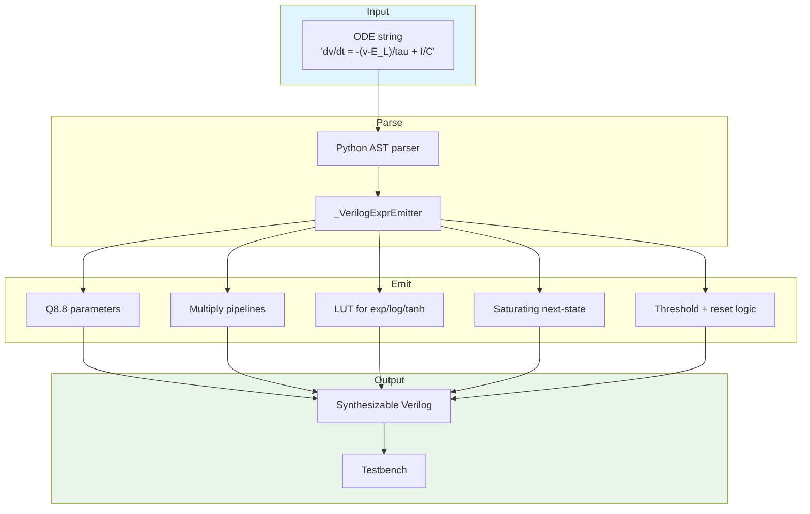

<!-- SPDX-License-Identifier: AGPL-3.0-or-later -->

# Compiler API Reference

Network-to-hardware compilation pipeline. Arbitrary ODE strings to
synthesizable Verilog RTL in one function call.

## CLI

```bash
sc-neurocore compile "dv/dt = -(v-E_L)/tau_m + I/C" \
    --threshold "v > -50" --reset "v = -65" \
    --params "E_L=-65,tau_m=10,C=1" --init "v=-65" \
    --target ice40 --testbench --synthesize -o build/
```

| Flag | Default | Description |
|------|---------|-------------|
| `--threshold` | None | Spike condition (e.g. `"v > -50"`) |
| `--reset` | None | Reset expression (e.g. `"v = -65; w = 0"`) |
| `--params` | None | Comma-separated `key=val` pairs |
| `--init` | None | Initial state `key=val` pairs |
| `--target` | `ice40` | FPGA target (`ice40`, `ecp5`, `artix7`, `zynq`) |
| `--module-name` | `sc_equation_neuron` | Generated Verilog module name |
| `--testbench` | off | Generate simulation testbench |
| `--synthesize` | off | Run Yosys synthesis (requires Yosys in PATH) |
| `-o` / `--output` | `build` | Output directory |

## Equation → Verilog Compiler

Compile arbitrary ODE neuron equations to synthesizable Verilog RTL.

### Supported functions

| Category | Functions |
|----------|-----------|
| Transcendental | `exp`, `log`, `sqrt`, `tanh`, `sigmoid`, `sin`, `cos` |
| Arithmetic | `abs`, `clip(x, lo, hi)`, `max(a, b)`, `min(a, b)` |
| Polynomial | `x**2` through `x**8` |
| Operators | `+`, `-`, `*`, `/` (by constant), unary `-` |
| Comparison | `>`, `>=`, `<`, `<=` |

Transcendental functions use 16-entry piecewise Q8.8 lookup tables
covering [-8, +8). Accuracy: ~1-2% over the useful range for neuron
dynamics. All arithmetic includes saturating overflow protection.



::: sc_neurocore.compiler.equation_compiler

## Pipeline

Orchestration pipeline: MLIR → firtool → Verilog → Yosys → nextpnr → bitstream.

::: sc_neurocore.compiler.pipeline

## MLIR Emitter

::: sc_neurocore.compiler.mlir_emitter

## Weight Quantizer

Float → Q-format fixed-point with nearest/stochastic/floor rounding,
plus SC probability mapping.

::: sc_neurocore.compiler.quantizer

## Adaptive Precision

::: sc_neurocore.compiler.adaptive_precision

## IR Type Checker

Validates Stochastic IR graphs before emission. Catches Bitstream/Rate/Spike
type mismatches that would otherwise silently produce wrong results.

Signal types: `BITSTREAM`, `RATE`, `SPIKE`, `FIXED`, `ANY`.

::: sc_neurocore.compiler.ir_type_checker
