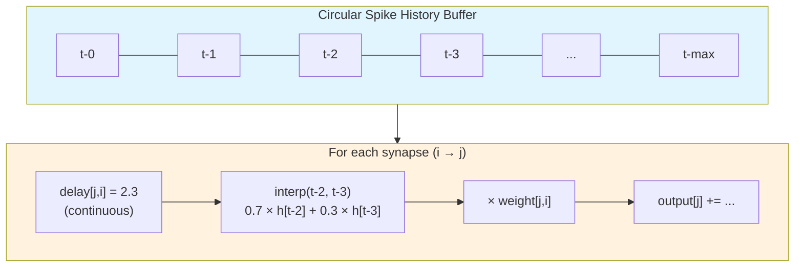

<!-- SPDX-License-Identifier: AGPL-3.0-or-later -->

# DelayLinear API

Trainable per-synapse delays for temporal coding in SNNs.

`DelayLinear` is a dense layer where each synapse has a trainable weight AND
a trainable delay. During forward pass, the input spike history is queried
at fractional delay positions via linear interpolation, making delays
differentiable. This implements the DCLS principle (Hammouamri et al. 2023)
applied to fully-connected SNN layers.

## Why trainable delays?

Rate coding discards temporal structure. Temporal coding (spike timing)
carries more information per spike — a single precisely-timed spike encodes
as much as hundreds of rate-coded spikes. Trainable delays let the network
learn optimal spike timing relationships: which input spikes should arrive
simultaneously (coincidence detection) and which should be staggered
(sequence recognition).

Research shows delays can replace entire layers — same accuracy with fewer
parameters (Hammouamri et al. 2023). SC-NeuroCore's `DelayLinear` makes
this practical: train in PyTorch, export integer delays to FPGA via
`to_nir_delay_array()`.

## Architecture



```
Interpolation detail — differentiable delay readout:

    spike history:  ──┬──○──●──○──●──○──○──●──○──
                      t  t-1 t-2 t-3 t-4 ...

    delay d = 2.3:        │←─ 2.3 ─→│
                          ▼
    interp(t-2.3) = 0.7 × history[t-2] + 0.3 × history[t-3]
                    └── floor fraction ──┘   └── ceil fraction ──┘
```

Gradient flows through the interpolation weights (0.7 and 0.3), telling
the optimizer whether to increase or decrease each delay.

## Parameters

| Parameter | Type | Default | Description |
|---|---|---|---|
| `in_features` | int | — | Number of input neurons |
| `out_features` | int | — | Number of output neurons |
| `max_delay` | int | 16 | Maximum delay in timesteps |
| `bias` | bool | False | Include bias term |
| `learn_delay` | bool | True | Make delays trainable |
| `init_delay` | float | 1.0 | Initial delay for all synapses |

## Methods

| Method | Returns | Description |
|---|---|---|
| `step(x)` | Tensor | Process one timestep. x: (batch, in) or (in,) |
| `reset()` | None | Clear spike history. Call between sequences |
| `delays_int` | LongTensor | Quantized integer delays for hardware |
| `to_nir_delay_array()` | ndarray | Flat float64 array for Projection |

## Example: sequence classifier with delays

```python
import torch
import torch.nn as nn
from sc_neurocore.training import LIFCell, DelayLinear, atan_surrogate

class DelayedSNN(nn.Module):
    def __init__(self, n_in, n_hidden, n_out, max_delay=8):
        super().__init__()
        self.delay1 = DelayLinear(n_in, n_hidden, max_delay=max_delay)
        self.lif1 = LIFCell(beta=0.9)
        self.fc2 = nn.Linear(n_hidden, n_out)
        self.lif2 = LIFCell(beta=0.9)

    def forward(self, x):
        """x: (T, batch, n_in)"""
        T, batch, _ = x.shape
        v1 = torch.zeros(batch, self.delay1.out_features, device=x.device)
        v2 = torch.zeros(batch, self.fc2.out_features, device=x.device)
        spike_sum = torch.zeros(batch, self.fc2.out_features, device=x.device)

        self.delay1.reset()
        for t in range(T):
            h = self.delay1.step(x[t])
            spike, v1 = self.lif1(h, v1)
            h = self.fc2(spike)
            spike, v2 = self.lif2(h, v2)
            spike_sum += spike

        return spike_sum

model = DelayedSNN(n_in=16, n_hidden=64, n_out=5, max_delay=8)
x = torch.randn(30, 4, 16)  # T=30, batch=4
out = model(x)  # (4, 5)
```

## Hardware export

```python
# After training
int_delays = model.delay1.delays_int  # (n_hidden, n_in) integer tensor
nir_delays = model.delay1.to_nir_delay_array()  # flat float64

# Use with network engine
from sc_neurocore.network.projection import Projection
proj = Projection(src_pop, tgt_pop, weight=0.1, delay=nir_delays)
```

## Deployable checkpoint selection

For FPGA or ASIC deployment, the checkpoint-selection metric must match the
hardware constraint. A delay model trained with fractional positions and a
wide interpolation kernel can score well in native PyTorch validation while
still being a poor hardware candidate after delays are rounded to integer
timesteps. The deployable validation path therefore uses the same conditions
as exported RTL:

1. save the current training delay and kernel state;
2. round trainable delay positions to integer timesteps;
3. set the DCLS `max` kernel bandwidth to `SIG=0`;
4. run validation and record the score as `fpga_val_acc`;
5. restore the training state before continuing optimisation.

`data/masquelier_shd/train_dcls_max.py` follows this protocol for the SHD
`dcls_max` experiments. The script writes both native validation accuracy and
`fpga_val_acc` to `training_log.csv`; `best.pth` is selected by
`fpga_val_acc`, while native validation remains a diagnostic ceiling.

The upstream SHD evaluator rounds model positions in place during evaluation,
so the script saves and restores the full model state around native validation
and test scoring unless persistent rounding is explicitly enabled. This keeps
deployable scoring separate from the optimiser trajectory.

Relevant environment variables:

| Variable | Default | Purpose |
|---|---:|---|
| `SHD_SIGMA_INIT` | `15.0` | Start of the DCLS `max` bandwidth schedule. |
| `SHD_SIGMA_FINAL` | `0.0` | End of the bandwidth schedule. |
| `SHD_ROUND_EACH_EPOCH` | `0` | Set to `1` to persistently round delays after every epoch. |
| `SHD_SEED` | config seed | Override deterministic training seed for sweeps. |
| `SHD_OUTPUT_SUBDIR` | `dcls_max` | Output directory below `exp/SHD/SNN_axonal_feedforward_delays/`. |

## References

- Hammouamri, Xiloyannis, Bhatt, Bhattacharyya & Bhatt,
  "Learning Delays in Spiking Neural Networks using Dilated Convolutions
  with Learnable Spacings", ICLR 2023
- Göltz, Kriener, Baumbach, Billaudelle, Breitwieser, Cramer, Dold,
  Kungl, Senn, Schemmel, Meier & Petrovici, "DelGrad: Exact Gradients
  in Spiking Networks for Learning Transmission Delays and Weights",
  arXiv 2024
- Sun, Zeng, Fang & Li, "Learnable Axonal Delay in Spiking Neural
  Networks for Adaptive Temporal Representation", AAAI 2025

See [Tutorial 39: Learnable Delays](../tutorials/39_learnable_delays.md)
and [Training API Reference](training.md).

::: sc_neurocore.training.delay_linear
    options:
      show_root_heading: true
