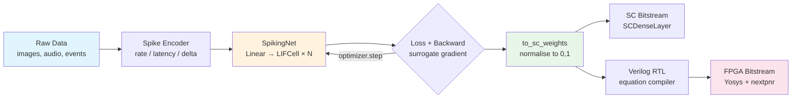
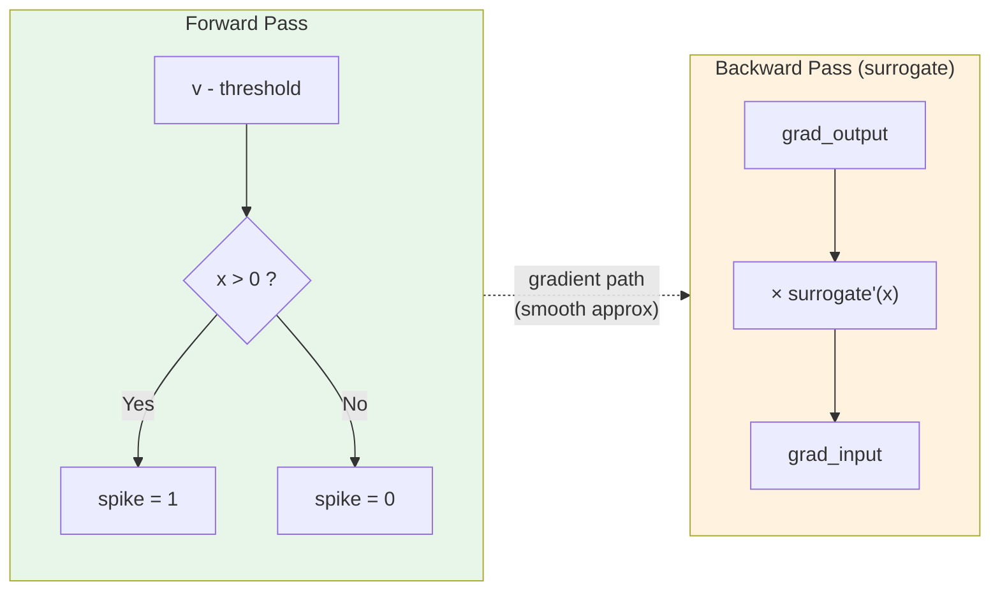
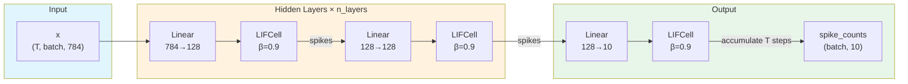

<!-- SPDX-License-Identifier: AGPL-3.0-or-later -->

# Training API Reference

GPU-accelerated SNN training with surrogate gradients and SC bitstream export.

**Install**: `pip install sc-neurocore[training]` (adds PyTorch ≥ 2.0)

```python
from sc_neurocore.training import LIFCell, SpikingNet, train_epoch, evaluate
```

All modules are `torch.nn.Module` subclasses. Train with standard PyTorch
optimizers and loss functions, then export weights to stochastic computing
bitstreams via `to_sc_weights()`.

## Equilibrium Propagation

`EPNetwork` is the NumPy research surface for the two-phase
settle-and-nudge equilibrium-propagation protocol. It is exported from
`sc_neurocore.training` for direct selection:

```python
from sc_neurocore.training import EPNetwork

net = EPNetwork(layer_sizes=[4, 3, 2], rng_seed=42)
prediction = net.predict(x, n_settle=20)
```

The implementation remains a research training path and does not change the
Torch surrogate-gradient pipeline, compiler integration, polyglot kernels, or
benchmark-dispatched training benchmarks.

### End-to-end pipeline



### Module hierarchy

```mermaid
classDiagram
    class nn_Module["torch.nn.Module"]

    class LIFCell {
        beta: float
        threshold: float
        surrogate_fn: Callable
        forward(current, v) → spike, v
    }
    class IFCell {
        forward(current, v) → spike, v
    }
    class SynapticCell {
        alpha: float
        forward(current, i_syn, v) → spike, i_syn, v
    }
    class ALIFCell {
        rho: float
        beta_adapt: float
        forward(current, v, a) → spike, v, a
    }
    class ExpIFCell {
        delta_t: float
        v_rh: float
        forward(current, v) → spike, v
    }
    class AdExCell {
        a: float
        b: float
        forward(current, v, w) → spike, v, w
    }
    class SpikingNet {
        linears: ModuleList
        lifs: ModuleList
        forward(x) → spike_counts, mem_acc
        to_sc_weights() → List
    }
    class ConvSpikingNet {
        conv1, conv2: Conv2d
        fc1, fc2: Linear
        forward(x) → spike_counts, mem_acc
    }
    class DelayLinear {
        delay: Parameter
        step(x) → current
        delays_int → LongTensor
    }

    nn_Module <|-- LIFCell
    nn_Module <|-- IFCell
    nn_Module <|-- SynapticCell
    nn_Module <|-- ALIFCell
    nn_Module <|-- ExpIFCell
    nn_Module <|-- AdExCell
    nn_Module <|-- SpikingNet
    nn_Module <|-- ConvSpikingNet
    nn_Module <|-- DelayLinear
```



---

## Surrogate Gradient Functions

Surrogate gradients solve the non-differentiability of spike generation.
Forward pass: Heaviside step `(x > 0) → {0, 1}`. Backward pass: smooth
approximation of the Dirac delta. All functions expect pre-shifted input
`x = v - threshold`.



**Surrogate gradient shapes** (backward pass — gradient magnitude vs distance from threshold):

```
    gradient
    ▲
1.0 │  ╱╲   atan (wide, stable)
    │ ╱  ╲
0.5 │╱    ╲╱╲  fast_sigmoid (sharp, fast)
    │       ╲
0.0 │────────╲─────────────► x = v - threshold
   -3  -2  -1   0   1   2   3

    Wider gradient window = more neurons receive learning signal
    Narrower = sharper threshold, faster convergence but less stable
```

| Function | Backward formula | Default param | Citation |
|---|---|---|---|
| `atan_surrogate(x, alpha=2.0)` | α / (2(1 + (παx/2)²)) | α=2.0 | Fang et al. 2021 |
| `fast_sigmoid(x, slope=25.0)` | slope / (1 + slope·\|x\|)² | slope=25.0 | Zenke & Vogels 2021 |
| `superspike(x, beta=10.0)` | 1 / (1 + β·\|x\|)² | β=10.0 | Zenke & Ganguli 2018 |
| `sigmoid_surrogate(x, slope=5.0)` | slope · σ(sx)(1 - σ(sx)) | slope=5.0 | Standard |
| `straight_through(x)` | 1 (identity) | — | Bengio et al. 2013 |
| `triangular(x, width=1.0)` | max(0, 1 - \|x\|/w) / w | width=1.0 | Esser et al. 2016 |

**Choosing a surrogate**: `atan_surrogate` is the safest default — wide
gradient window, stable convergence on most tasks. `fast_sigmoid` trains
faster on deep networks (>3 spiking layers). `superspike` gives the
sharpest gradients near threshold — useful for temporal coding but requires
lower learning rates. `straight_through` passes gradients unchanged — works
for simple architectures but is theoretically unprincipled.

```python
from sc_neurocore.training import atan_surrogate, fast_sigmoid, superspike
from sc_neurocore.training import sigmoid_surrogate, straight_through, triangular

# All share the same signature
x = torch.tensor([-0.5, 0.0, 0.5], requires_grad=True)
spike = atan_surrogate(x)  # tensor([0., 0., 1.])
spike.sum().backward()      # x.grad is smooth, nonzero everywhere
```

---

## Neuron Cells

All cells are `torch.nn.Module` instances. Forward pass takes input current
and hidden state(s), returns `(spike, *new_states)`. Spikes are {0, 1}
tensors.

### LIFCell

Leaky Integrate-and-Fire. The workhorse spiking neuron.

```
v[t] = beta * v[t-1] + I[t]
spike[t] = H(v[t] - threshold)
v[t] -= spike[t] * threshold
```

```python
from sc_neurocore.training import LIFCell

cell = LIFCell(
    beta=0.9,              # membrane leak (higher = longer memory)
    threshold=1.0,         # spike threshold
    surrogate_fn=atan_surrogate,
    learn_beta=False,      # True → beta becomes a trainable parameter
    learn_threshold=False, # True → threshold becomes trainable
)

# Single-step forward
current = torch.randn(batch, n_neurons)
v = torch.zeros(batch, n_neurons)
spike, v_next = cell(current, v)
```

When `learn_beta=True`, beta is stored as `log(p/(1-p))` (logit) and
projected through sigmoid to stay in (0, 1). When `learn_threshold=True`,
threshold is stored as `log(threshold)` and projected through exp to stay
positive.

### IFCell

Integrate-and-Fire without leak (beta = 1). Accumulates input until
threshold. Simplest spiking model — useful for energy estimation and
spike counting tasks.

```python
from sc_neurocore.training import IFCell
cell = IFCell(threshold=1.0)
spike, v_next = cell(current, v)  # v_next = v + current (no decay)
```

### SynapticCell

Dual-exponential synaptic current + membrane. Two state variables provide
more realistic temporal filtering of synaptic input.

```
i_syn[t] = alpha * i_syn[t-1] + I[t]
v[t] = beta * v[t-1] + i_syn[t]
```

```python
from sc_neurocore.training import SynapticCell
cell = SynapticCell(alpha=0.9, beta=0.8, threshold=1.0)
spike, i_syn_next, v_next = cell(current, i_syn, v)
```

### ALIFCell

Adaptive LIF (Bellec et al., 2020). Threshold increases after each spike,
implementing spike-frequency adaptation — the network learns when to
suppress firing.

```
v[t] = beta * v[t-1] + I[t]
theta[t] = theta_0 + beta_adapt * a[t]
a[t] = rho * a[t-1] + spike[t-1]
```

```python
from sc_neurocore.training import ALIFCell
cell = ALIFCell(beta=0.9, threshold=1.0, rho=0.99, beta_adapt=1.8)
spike, v_next, a_next = cell(current, v, a)
```

The adaptation variable `a` tracks recent spiking history. `rho` controls
how quickly adaptation decays (0.99 = slow adaptation, 0.9 = fast).
`beta_adapt` scales the threshold shift.

### ExpIFCell

Exponential IF (Fourcaud-Trocmé et al., 2003). An exponential term creates
a sharp voltage upstroke near threshold, modelling the sodium channel
activation in cortical neurons.

```
v[t] = beta * v[t-1] + delta_T * exp((v[t-1] - v_rh) / delta_T) + I[t]
```

```python
from sc_neurocore.training import ExpIFCell
cell = ExpIFCell(beta=0.9, threshold=1.0, delta_t=0.5, v_rh=0.8)
spike, v_next = cell(current, v)
```

`delta_t` controls the sharpness of the upstroke. `v_rh` is the rheobase
(voltage where exponential term activates). The exp term is clamped at 5.0
to prevent numerical overflow.

### AdExCell

Adaptive Exponential IF (Brette & Gerstner, 2005). Combines the
exponential upstroke with an adaptation current `w` that modulates firing
patterns. Can reproduce tonic, adapting, bursting, and irregular spiking.

```
v[t] = beta * v[t-1] + delta_T * exp((v - v_rh) / delta_T) - w[t-1] + I[t]
w[t] = rho * w[t-1] + a * (v[t-1] - v_rest) + b * spike[t]
```

```python
from sc_neurocore.training import AdExCell
cell = AdExCell(beta=0.9, threshold=1.0, delta_t=0.5, v_rh=0.8,
                a=0.01, b=0.1, rho=0.99, v_rest=0.0)
spike, v_next, w_next = cell(current, v, w)
```

`a` couples membrane voltage to adaptation. `b` controls the spike-triggered
adaptation increment. Together they determine the neuron's firing pattern
class.

### LapicqueCell

Lapicque IF with membrane resistance (Lapicque, 1907). The original
integrate-and-fire model with explicit RC circuit parameters.

```
v[t] = (1 - dt/tau) * (v[t-1] - v_rest) + v_rest + (R * dt / tau) * I[t]
```

```python
from sc_neurocore.training import LapicqueCell
cell = LapicqueCell(tau=20.0, r=1.0, dt=1.0, threshold=1.0, v_rest=0.0)
spike, v_next = cell(current, v)
```

`tau` is the membrane time constant (ms). `r` is the membrane resistance
(MΩ). `dt` is the simulation timestep.

### AlphaCell

Alpha synapse neuron (Rall, 1967). Separate excitatory and inhibitory
synaptic currents with independent time constants. Models the biological
separation of glutamatergic and GABAergic synapses.

```
i_exc[t] = alpha_exc * i_exc[t-1] + I_exc[t]
i_inh[t] = alpha_inh * i_inh[t-1] + I_inh[t]
v[t] = beta * v[t-1] + i_exc[t] - i_inh[t]
```

```python
from sc_neurocore.training import AlphaCell
cell = AlphaCell(alpha_exc=0.9, alpha_inh=0.85, beta=0.9)
spike, i_exc_next, i_inh_next, v_next = cell(exc_current, inh_current, i_exc, i_inh, v)
```

### SecondOrderLIFCell

Second-order LIF with inertial acceleration term (Dayan & Abbott, 2001).
The acceleration `a` acts as a low-pass filter that smooths input current
before reaching the membrane, producing smoother voltage trajectories.

```
a[t] = alpha * a[t-1] + I[t]
v[t] = beta * v[t-1] + a[t]
```

```python
from sc_neurocore.training import SecondOrderLIFCell
cell = SecondOrderLIFCell(alpha=0.95, beta=0.9)
spike, a_next, v_next = cell(current, a, v)
```

### RecurrentLIFCell

LIF with trainable recurrent weights. An orthogonal-initialized
`nn.Linear` feeds previous spikes back as additional input.

```python
from sc_neurocore.training import RecurrentLIFCell
cell = RecurrentLIFCell(n_neurons=128, beta=0.9)
spike, v_next = cell(current, v, spike_prev)
```

Recurrence adds temporal context without increasing timesteps. Useful for
sequence classification (speech, gestures).

---

## Network Architectures

### SpikingNet

Multi-layer feedforward SNN: `[Linear → LIFCell] × (n_layers + 1)`.
Readout accumulates output spike counts and membrane potential over T
timesteps.



```python
from sc_neurocore.training import SpikingNet

net = SpikingNet(
    n_input=784,     # flattened 28×28 MNIST
    n_hidden=128,    # hidden layer width
    n_output=10,     # classes
    n_layers=2,      # number of hidden layers
    beta=0.9,
    surrogate_fn=atan_surrogate,
    learn_beta=False,
    learn_threshold=False,
)

# Forward: x is (T, batch, n_input) → (spike_counts, membrane_acc)
x = torch.randn(25, 64, 784)  # T=25, batch=64
spike_counts, mem_acc = net(x)
predicted = spike_counts.argmax(dim=1)  # (64,)
```

#### `to_sc_weights(include_bias=True, noise_model=None)`

Export trained weights to [0, 1] range for stochastic computing bitstream
deployment. Each layer's weight matrix is min-max normalised independently.
Optional deterministic export-time noise models can realise finite bitstream
probabilities before FPGA/ASIC hand-off.

```python
sc_layers = net.to_sc_weights()
for i, layer in enumerate(sc_layers):
    w = layer["weight"]  # Tensor, values in [0, 1]
    print(f"Layer {i}: {tuple(w.shape)}, range [{w.min():.3f}, {w.max():.3f}]")
    if "bias" in layer:
        print(f"  bias: {tuple(layer['bias'].shape)}")
```

```python
from sc_neurocore.training import SCWeightNoiseModel

noise = SCWeightNoiseModel(mode="binomial", bitstream_length=256, seed=17)
sc_layers = net.to_sc_weights(noise_model=noise)
print(sc_layers[0]["noise_model"])
```

These weights map directly to bitstream probabilities in `SCDenseLayer` and
the equation compiler's Verilog RTL.

## Stochastic Backpropagation

The stochastic-backpropagation reference path trains stochastic-computing
design variables together with model parameters. Use it when the training
objective must expose gradients through bitstream length, encoding choice, and
correlation metadata before export, instead of training a floating-point model
and converting the weights afterwards.

Primary public API:

- `SCBackpropDesignSpace` defines the allowed bitstream lengths, encodings,
  and correlation interval for differentiable design selection.
- `SCBackpropJointReport` records the relaxed prediction, objective breakdown,
  selected design, length probabilities, encoding probabilities, expected
  bitstream length, selected encoding, selected length, and selected
  correlation.
- `SCTrainingObjectiveConfig` controls task loss, length cost, correlation
  cost, and encoding cost.
- `stochastic_backprop_joint_objective` evaluates the differentiable joint
  objective and returns the report used for training, export, and audit
  evidence.

The reproducible evidence command is:

```bash
PYTHONPATH=src python tools/stochastic_backprop_benchmark.py \
  --output benchmarks/results/stochastic_backprop_benchmark.json \
  --export-manifest benchmarks/results/stochastic_backprop_export_manifest.json \
  --estimator-regression-manifest benchmarks/results/stochastic_backprop_estimator_regression_manifest.json \
  --handoff-dir benchmarks/results/stochastic_backprop_handoff \
  --bitstream-length 256 \
  --steps 32 \
  --learning-rate 0.4
```

The current public evidence boundary is
`local_simulation_and_executable_hdl_parity`: the generated artefacts prove the
local benchmark, SC-NIR export metadata, estimator-regression manifest, and
executable HDL parity path. They do not claim physical hardware measurement,
Vivado timing closure, PYNQ deployment, or board-level power evidence.

::: sc_neurocore.training.stochastic_backprop
    options:
      show_root_heading: true

### ConvSpikingNet

Convolutional SNN for image classification:

```mermaid
flowchart LR
    I["Input<br/>28×28×1"] --> C1["Conv2d<br/>1→32, 5×5"]
    C1 --> S1["LIF<br/>24×24×32"]
    S1 --> P1["AvgPool<br/>12×12×32"]
    P1 --> C2["Conv2d<br/>32→64, 5×5"]
    C2 --> S2["LIF<br/>8×8×64"]
    S2 --> P2["AvgPool<br/>4×4×64"]
    P2 --> FL["Flatten<br/>1024"]
    FL --> F1["Linear<br/>1024→128"]
    F1 --> S3["LIF"]
    S3 --> F2["Linear<br/>128→10"]
    F2 --> S4["LIF"]
    S4 --> O["spike_counts<br/>(batch, 10)"]

    style I fill:#e1f5fe
    style O fill:#e8f5e9
```



```python
from sc_neurocore.training import ConvSpikingNet

net = ConvSpikingNet(
    n_output=10,
    beta=0.9,
    learn_beta=True,
    learn_threshold=True,
)

# Forward: x is (T, batch, 1, 28, 28)
x = torch.randn(25, 32, 1, 28, 28)
spike_counts, mem_acc = net(x)
```

Designed for 28×28 grayscale images (MNIST, Fashion-MNIST). For other
input sizes, modify `self.fc1` input dimension.

---

## Spike Encoding

Convert continuous values to binary spike trains for SNN input.

### rate_encode

Poisson rate coding. Each timestep, spike with probability proportional
to input value. Works for any static data.

```python
from sc_neurocore.training import rate_encode

x = torch.rand(64, 784)         # batch of images in [0, 1]
spikes = rate_encode(x, n_timesteps=25)  # (25, 64, 784)
```

### latency_encode

Time-to-first-spike. Stronger inputs spike earlier. Each neuron fires
exactly once. Information is in spike timing, not rate.

```python
from sc_neurocore.training import latency_encode

spikes = latency_encode(x, n_timesteps=25, tau=5.0)
# Strong input (0.9) → spike at t≈0
# Weak input (0.1)  → spike at t≈4
```

### delta_encode

Spike on temporal change. For event-based or streaming data where
change matters more than absolute value.

```python
from sc_neurocore.training import delta_encode

# x: (T, *batch) — temporal sequence
spikes = delta_encode(x, threshold=0.1)  # spike where |dx| > 0.1
```

---

## Loss Functions

### Classification losses

```python
from sc_neurocore.training import spike_count_loss, membrane_loss, spike_rate_loss

# Cross-entropy on spike counts (default, recommended)
loss = spike_count_loss(spike_counts, targets)

# Cross-entropy on accumulated membrane potential
loss = membrane_loss(mem_acc, targets)

# MSE on spike rates vs target pattern
loss = spike_rate_loss(spike_counts, targets, n_timesteps=25, target_rate=0.8)
```

`spike_count_loss` is recommended for most tasks. `membrane_loss` can work
better when spike counts are very sparse (few spikes per class).
`spike_rate_loss` explicitly shapes firing rates — useful when you need
precise rate control for SC bitstream deployment.

### Regularizers

```python
from sc_neurocore.training import spike_l1_loss, spike_l2_loss

# L1 on mean firing rate — encourages sparse firing
reg = spike_l1_loss(spike_counts, n_timesteps=25)

# L2 on mean firing rate — penalizes high-firing outliers
reg = spike_l2_loss(spike_counts, n_timesteps=25)

# Combined
total_loss = spike_count_loss(spike_counts, targets) + 0.01 * spike_l1_loss(spike_counts, 25)
```

---

## Training and Evaluation

### auto_device

Select a usable supported device in priority order: CUDA, MPS, CPU. CUDA is
used when the installed PyTorch build advertises support for the device compute
capability through `torch.cuda.get_arch_list()`. Unsupported local GPUs fall
back to CPU without emitting PyTorch compute-capability warnings.

```python
from sc_neurocore.training import auto_device
device = auto_device()  # torch.device('cuda:N'), ('mps'), or ('cpu')
```

Passing `device="cuda"` directly to `train_epoch` or `evaluate` bypasses that
selector; use it when the PyTorch wheel supports the target GPU.

### train_epoch

One full pass through the training set. Handles timestep expansion,
loss computation, gradient clipping.

```python
from sc_neurocore.training import train_epoch

avg_loss, accuracy = train_epoch(
    model,
    train_loader,
    optimizer,
    n_timesteps=25,
    loss_fn=spike_count_loss,  # any (spike_counts, targets) → scalar
    device="cuda",
    max_grad_norm=1.0,         # None to disable clipping
    flatten_input=True,        # False for ConvSpikingNet
)
```

`flatten_input=True` reshapes `(batch, C, H, W)` to `(batch, C*H*W)` for
feedforward SNNs. Set to `False` for convolutional models.

### evaluate

Same as `train_epoch` but with `torch.no_grad()` and `model.eval()`.

```python
from sc_neurocore.training import evaluate

val_loss, val_acc = evaluate(model, test_loader, n_timesteps=25, device="cuda")
```

---

## Utilities

### SpikeMonitor

Record spike activity per layer during forward pass. Attach to any
`SpikingNet` or `ConvSpikingNet`.

```python
from sc_neurocore.training import SpikeMonitor

monitor = SpikeMonitor(model)
spike_counts, mem = model(x)

# Retrieve spikes for a specific layer
for name in monitor.layer_names:
    spikes = monitor.get(name)  # (T, batch, n_neurons) or None
    print(f"{name}: {spikes.shape if spikes is not None else 'no spikes'}")

monitor.reset()   # clear recorded data (keep hooks)
monitor.remove()  # remove hooks entirely
```

### model_info

Architecture summary for SNN models.

```python
from sc_neurocore.training import model_info

info = model_info(model)
# {
#   "total_params": 134922,
#   "trainable_params": 134922,
#   "spiking_cells": 3,
#   "cell_types": ["LIFCell"],
#   "learnable_dynamics": ["lifs.0._beta_logit", ...]
# }
```

### population_decode

Weighted average readout instead of argmax. Computes the centroid of
spike-count distribution over preferred values.

```python
from sc_neurocore.training import population_decode

# Decode angle from population of 36 neurons (10° spacing)
preferred = torch.arange(0, 360, 10, dtype=torch.float32)
angle = population_decode(spike_counts, preferred)  # (batch,)
```

### reset_states

Clear all `SpikeMonitor` instances in a list.

```python
from sc_neurocore.training import reset_states
reset_states([monitor1, monitor2])
```

### Utility verification

`sc_neurocore.training.utils` is part of the scoped public docstring policy.
The focused utility tests exercise hook collection/removal, monitor reset,
population-vector decoding with default, custom, batched, and vector preferred
values, and the `reset_states(None)` no-op. On 2026-06-27 the focused checks
passed for Ruff, NumPy docstrings, strict mypy, and
`tests/test_training/test_utils.py` (`10 passed`). Local coverage
instrumentation for this Torch utility currently fails during Torch import with
`RuntimeError: function '_has_torch_function' already has a docstring`; the same
production-path tests pass without coverage instrumentation.

---

## DelayLinear

Trainable per-synapse delays for temporal coding. Each synapse has a weight
AND a continuous-valued delay, both optimized by backpropagation.

```python
from sc_neurocore.training import DelayLinear

layer = DelayLinear(
    in_features=64,
    out_features=32,
    max_delay=16,      # delays in [0, 16) timesteps
    learn_delay=True,  # make delays trainable
    init_delay=1.0,    # initial delay for all synapses
    bias=False,
)
```

**Usage**: call `step(x)` at each timestep. The module maintains an
internal spike history buffer.

```python
layer.reset()  # clear history between sequences
for t in range(T):
    x = input_spikes[t]          # (batch, in_features)
    current = layer.step(x)      # (batch, out_features)
```

**Hardware export**:

```python
int_delays = layer.delays_int          # quantized (out, in) integers
nir_array = layer.to_nir_delay_array() # flat float64 for Projection(delay=...)
```

See [Tutorial 39: Learnable Delays](../tutorials/39_learnable_delays.md).

::: sc_neurocore.training.delay_linear
    options:
      show_root_heading: true
