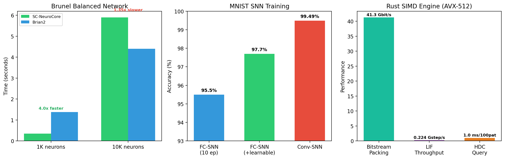

<!-- SPDX-License-Identifier: AGPL-3.0-or-later -->

# Benchmark Comparison

Measured performance of SC-NeuroCore against competing frameworks.
All benchmarks are reproducible — see `benchmarks/` in the repository.

## Brunel Balanced Network (vs Brian2)

Standard 800E/200I Izhikevich network with random connectivity and
Poisson drive (Brunel 2000).

| Network size | SC-NeuroCore (Numba JIT) | Brian2 (C++ codegen) | Speedup |
|-------------|--------------------------|----------------------|---------|
| 1 000 neurons | 0.35 s | 1.38 s | **4.0x faster** |
| 10 000 neurons | 5.9 s | 4.4 s | 1.35x slower |

Firing rates match within 1% (100 Hz). SC-NeuroCore targets FPGA-scale
networks (≤5K neurons) where bit-exact RTL co-simulation matters.

## SNN Training (MNIST)

| Architecture | Method | Accuracy |
|-------------|--------|----------|
| FC 784→128→128→10 | Surrogate gradient (10 epochs) | 95.5% |
| FC 784→128→128→10 | + learnable τ (Fang 2021) | 97.7% |
| Conv→LIF→Pool→Conv→LIF→Pool→FC | Learnable β + threshold | **99.49%** (`benchmarks/results/mnist_conv_accuracy_reproducibility.json`) |

snnTorch achieves 95.8% on the same FC architecture (same setup,
10 epochs). The value of SC-NeuroCore is not training performance — it's
the `to_sc_weights()` export path to synthesisable FPGA hardware.

## Rust SIMD Engine

Criterion benchmarks on Intel i7-10700K:

| Operation | AVX-512 | AVX2 | Scalar |
|-----------|---------|------|--------|
| Bitstream packing | 113 Gbit/s | ~20 Gbit/s | ~3 Gbit/s |
| LIF neuron stepping | 456 Mstep/s | ~120 Mstep/s | ~40 Mstep/s |
| HDC query (100 patterns) | 1.1 ms | ~2 ms | ~8 ms |

Runtime SIMD detection selects the fastest available path. ARM NEON
supported for Apple Silicon and Raspberry Pi.

## FPGA Synthesis (Yosys)

| Configuration | LUTs (Xilinx 7-series) | Fmax (est.) |
|---------------|------------------------|-------------|
| sc_neurocore_top (default) | 3 673 | ~100 MHz |
| MNIST 16→10 (estimated) | ~56 000 | ~80 MHz |
| Target: Artix-7 100T | 63 400 available | — |

## Fault Tolerance

SC bitstreams degrade gracefully under random bit errors:

| Error rate | Accuracy loss (balanced p=0.5) |
|------------|-------------------------------|
| 1% | < 1% |
| 5% | < 1% |
| 10% | ~1% |
| 20% | ~2% |

This is a property of stochastic encoding (Alaghi & Hayes 2013), not
SC-NeuroCore-specific.

## Neuron Model Coverage

| Category | SC-NeuroCore | snnTorch | Norse | Brian2 | Lava |
|----------|:---:|:---:|:---:|:---:|:---:|
| Python models | **158 lazy-loaded classes / 153 source modules** | 11 | 6 | Custom eq. | 3 |
| Rust/compiled models | **176 Rust PyO3 wrappers / 162-model NetworkRunner** | — | — | C++ codegen | — |
| Hardware emulators | **9** | — | — | — | Loihi only |
| Formal verification | **59 SymbiYosys proof jobs and 193 formal statements (163 assert, 7 assume, 23 cover)** | — | — | — | — |
| Train-to-FPGA export | **Yes** | No | No | No | No |

## IQIF signed-integer polyglot batch loop

The committed `benchmarks/results/local_python_2026-07-14_iqif.json` records
the exact Wu et al. (2021) piecewise-linear integer recurrence through every
maintained backend. One 1,000-step warm-up precedes seven 200,000-step samples
per backend. The run was pinned to logical CPU 4, but the host had no isolated
CPU set; these are same-host regression timings, not portable speed claims.

| Backend | Median call | Median ns/step | Events | State mismatches | Final `v` |
|---|---:|---:|---:|---:|---:|
| Python | 92.358875 ms | 461.794375 | 13,333 | 0 | 165 |
| Rust | 2.437217 ms | 12.186085 | 13,333 | 0 | 165 |
| Julia | 5.550568 ms | 27.752840 | 13,333 | 0 | 165 |
| Go | 5.626361 ms | 28.131805 | 13,333 | 0 | 165 |
| Mojo | 2.261707 ms | 11.308535 | 13,333 | 0 | 165 |

All five trajectories have little-endian int64 SHA-256
`b5c84ffb7167e23d9ba3a1e4290aa93326649bd65087781e491a237ab347a4f4`.
The measured and dispatcher order is Mojo, Rust, Julia, Go, then Python. The
artifact binds the source and exact loaded Rust/Go/Mojo binaries, runtime
versions, affinity, governor, load averages, and raw timing samples. It is
neither a hardware measurement nor a production or cross-host performance
claim.

## McCulloch-Pitts logical batch loop

The committed
`benchmarks/results/local_python_2026-07-14_mcculloch_pitts.json` records the
source-faithful active-excitatory-count threshold and absolute-inhibition rule
through all five public dispatchers. Each call validates 200,000 varying rows
before execution, so the numbers include the shared Python-side public input
contract rather than timing an isolated inner comparator. One 1,000-row warm-up
precedes seven samples per backend.

| Backend | Median call | Median ns/row | Events | Trace mismatches |
|---|---:|---:|---:|---:|
| Rust | 234.741 ms | 1,173.704 | 102,273 | 0 |
| Go | 306.158 ms | 1,530.789 | 102,273 | 0 |
| Python | 328.712 ms | 1,643.559 | 102,273 | 0 |
| Mojo | 625.298 ms | 3,126.492 | 102,273 | 0 |
| Julia | 821.117 ms | 4,105.586 | 102,273 | 0 |

Every lane has binary-event SHA-256
`52a05b62f801b9a9856ccac9f6d79f2821d564239b85fd06d454d1d44e28aee4`.
The measured native order used by `auto` is Rust, Go, Mojo, then Julia, with
Python retained as the always-available floor. The run was pinned to logical
CPU 4 under the `powersave` governor, but load averages were high and the CPU
was not isolated. These timings are same-host regression evidence only, not a
hardware result, portable throughput claim, or cross-framework comparison.

## Sigmoid-rate exact-relaxation batch loop

The committed `benchmarks/results/local_python_2026-07-14_sigmoid_rate.json`
records the configurable scalar exact-relaxation equation through Python, the
Rust engine, Julia, Go, and Mojo. One 1,000-step warm-up precedes five
200,000-step samples per backend.

| Backend | Median call | Median ns/step | Trace mismatches | Maximum error |
|---|---:|---:|---:|---:|
| Python | 73.788 ms | 368.938 | 0 | 0 |
| Rust | 46.985 ms | 234.926 | 0 | 0 |
| Julia | 17.493 ms | 87.467 | 0 | 0 |
| Go | 97.270 ms | 486.350 | 0 | 0 |
| Mojo | 14.610 ms | 73.048 | 0 | `3.08e-14` |

Python, Rust, Julia, and Go share trace SHA-256
`5241be414683ce92ba9886c13c0a9f5ef84886d5d48ddda05fc892b72274e07d`.
Mojo remains within the declared `5e-12` absolute tolerance but has a distinct
binary trace hash. The host was pinned to logical CPU 4 without exclusive
isolation and reported high load averages. These figures are local diagnostic
regression evidence, not production, hardware, cross-host, or cross-framework
performance claims.

## Threshold-linear algebraic rate batch

The committed
`benchmarks/results/local_python_2026-07-14_threshold_linear_rate.json`
records the configurable `gain * max(0, current - theta)` transfer through all
five public dispatchers. Five 200,000-value samples follow a 1,000-value warm-
up. Every runtime produces the same little-endian float64 trace SHA-256,
`cdb90f105692311ba359cfbf0574faa23586215e1a253ddcad29276b9bf69402`.

| Backend | Median call | Median ns/evaluation | Trace mismatches |
|---|---:|---:|---:|
| Python | 1.621 ms | 8.107 | 0 |
| Mojo | 3.388 ms | 16.938 | 0 |
| Rust | 3.892 ms | 19.458 | 0 |
| Go | 9.824 ms | 49.122 | 0 |
| Julia | 12.425 ms | 62.123 | 0 |

The Python path uses a vectorised constant fill and was the shortest raw call.
The compiled dispatcher keeps Python as its always-available floor and orders
the measured native lanes Mojo, Rust, Go, then Julia. The run was pinned to one
logical CPU but not exclusively isolated, and its recorded load average was
high. These timings are local regression evidence, not production, cross-host,
hardware, or universal-ranking claims.

## Wilson-Cowan coupled E/I RK4 batch

The committed `benchmarks/results/bench_wilson_cowan.json` records the complete
normalised excitatory/inhibitory trajectory through all five public
dispatchers. Five 100,000-step samples follow a 1,000-step warm-up. The run was
pinned to logical CPU 4 on the same i5-11600K host, without exclusive CPU
isolation and under high concurrent load.

| Backend | Median call | Median ns/step | Maximum E/I difference | Trace mismatches |
|---|---:|---:|---:|---:|
| Rust | 17.259 ms | 172.592 | `0` | 0 |
| Julia | 21.205 ms | 212.050 | `1.699e-14` | 0 |
| Go | 37.515 ms | 375.150 | `8.871e-14` | 0 |
| Mojo | 39.706 ms | 397.060 | `4.815e-9` | 0 |
| Python | 1,113.715 ms | 11,137.151 | `0` | 0 |

Rust is byte-identical to the Python interleaved E/I trace, whose SHA-256 is
`0033492a00af00c389e88bee83b5a48cad74137f311a4bfb36e9882c42b6c50e`.
Julia and Go remain within the declared `1e-9` absolute trajectory envelope;
Mojo remains within its measured `1e-8` envelope over the complete horizon.
The host-matched auto order is Rust, Julia, Go, Mojo, then the always-available
Python floor. The artefact binds exact sources and loaded Rust/Go/Mojo binaries;
these timings are local diagnostic regression evidence, not production,
hardware, cross-host, or universal-ranking claims.

## Jansen–Rit six-state Euler batch

The committed `benchmarks/results/bench_jansen_rit.json` records all six
post-update states, the `y1-y2` EEG proxy, and six final-state receipts through
the five public runtimes. Five 50,000-step samples follow a 1,000-step warm-up.
The run was pinned to logical CPU 11 on the same i5-11600K host, without
exclusive CPU isolation and with a recorded one-minute load average of 6.38.

| Backend | Median call | Median ns/step | Maximum trace difference | Trace mismatches |
|---|---:|---:|---:|---:|
| Rust | 3.473 ms | 69.451 | `0` | 0 |
| Julia | 6.569 ms | 131.370 | `1.421e-14` | 0 |
| Go | 6.744 ms | 134.888 | `6.189e-12` | 0 |
| Mojo | 7.491 ms | 149.811 | `2.660e-10` | 0 |
| Python | 386.629 ms | 7,732.583 | `0` | 0 |

Rust is byte-identical to the Python interleaved seven-trace result, whose
SHA-256 is
`3a68f6230ea59312a32bfba9c90783db231fbfce2c301d7dc1187e2c784bad15`.
Julia, Go, and Mojo remain within their declared complete-trajectory absolute
envelopes. The ascending native median order for this recorded run is Rust,
Julia, Go, then Mojo, followed by the always-available Python floor. The
artefact binds exact sources and loaded Rust/Go/Mojo binaries; these are local
diagnostic regression timings, not production, hardware, cross-host, or
universal-ranking claims.

## Wong-Wang two-population Euler/OU batch

The committed `benchmarks/results/bench_wong_wang.json` records all six
post-update state/rate traces and four final-state receipts through the five
public runtimes. Five 100,000-step samples follow a 1,000-step warm-up. The run
was pinned to logical CPU 11 on the same i5-11600K host, without exclusive CPU
isolation and with a recorded one-minute load average of 18.16.

| Backend | Median call | Median ns/step | Maximum trace difference | Trace mismatches |
|---|---:|---:|---:|---:|
| Rust | 18.253 ms | 182.534 | `0` | 0 |
| Mojo | 22.803 ms | 228.032 | `1.206e-11` | 0 |
| Julia | 25.579 ms | 255.793 | `2.842e-14` | 0 |
| Go | 30.692 ms | 306.919 | `7.105e-15` | 0 |
| Python | 910.511 ms | 9,105.110 | `0` | 0 |

Rust is byte-identical to the Python interleaved trace, whose SHA-256 is
`1961d77ec5b028c3fedcd3d731d688b1a1aa54691c6b2dda84bbf098aa9bd827`.
Julia, Go, and Mojo remain within their declared complete-trace absolute
envelopes. The ascending native median order for this recorded run is Rust,
Mojo, Julia, then Go, followed by the always-available Python floor. The
artefact binds the exact sources and loaded Rust/Go/Mojo binaries; these are
local diagnostic regression timings, not production, hardware, cross-host, or
universal-ranking claims.

## Montbrió–Pazó–Roxin two-state Euler batch

The committed `benchmarks/results/bench_ermentrout_kopell_pop.json` records the
complete population firing-rate and mean-voltage trajectories plus both final
state receipts through all five public runtimes. Five 50,000-step samples
follow a 1,000-step warm-up. The run was pinned to logical CPU 10 on the same
i5-11600K host, without exclusive CPU isolation and with a recorded one-minute
load average of 23.65. The artifact distinguishes the measured JuliaCall
runtime (1.11.9) from the PATH Julia CLI (1.12.6), the Go shared library's
embedded builder (1.26.3) from the PATH Go CLI (1.24.0), and the pinned Pixi
Mojo builder (0.26.2) from the PATH Mojo CLI (1.0.0b1).

| Backend | Median call | Median ns/step | Maximum trace difference | Trace mismatches |
|---|---:|---:|---:|---:|
| Julia | 3.844 ms | 76.875 | `0` | 0 |
| Mojo | 4.088 ms | 81.761 | `2.220e-16` | 0 |
| Go | 4.571 ms | 91.429 | `0` | 0 |
| Rust | 4.703 ms | 94.058 | `0` | 0 |
| Python | 170.959 ms | 3,419.182 | `0` | 0 |

Python, Rust, Julia, and Go are byte-identical to the Python interleaved trace,
whose SHA-256 is
`0e9c59cbe73cb9019d309fc484fa67c838ae503d0c9f9f7a6825bb6fa857cb7b`.
Mojo remains within its declared `1e-10` complete-trajectory envelope. The
ascending native median order for this run is Julia, Mojo, Go, then Rust,
followed by the always-available Python floor. The artefact binds exact source
and loaded Rust/Go/Mojo binary hashes; these timings are local diagnostic
regression evidence, not production, hardware, cross-host, or universal-ranking
claims.

## Adaptive-threshold exact-relaxation batch

The committed `benchmarks/results/bench_adaptive_threshold_if.json` records the
complete post-update membrane-potential and adaptive-threshold traces, both
final states, and candidate-crossing spike events through all five public
runtimes. Five 200,000-step samples follow a 1,000-step warm-up. The run was
pinned to logical CPU 0 on the same i5-11600K host, without exclusive CPU
isolation and with a recorded one-minute load average of 13.14. The artifact
distinguishes the measured JuliaCall runtime (1.11.9) from the PATH Julia CLI
(1.12.6), the Go shared library's embedded builder (1.26.3) from the PATH Go
CLI (1.24.0), and the pinned Pixi Mojo builder (0.26.2) from the PATH Mojo
CLI (1.0.0b1).

| Backend | Median call | Median ns/step | Maximum trace difference | Events |
|---|---:|---:|---:|---:|
| Mojo | 17.476 ms | 87.381 | `1.137e-13` | 277 |
| Rust | 21.087 ms | 105.434 | `0` | 277 |
| Julia | 29.599 ms | 147.997 | `0` | 277 |
| Go | 32.602 ms | 163.011 | `0` | 277 |
| Python | 844.472 ms | 4,222.359 | `0` | 277 |

Python, Rust, Julia, and Go are byte-identical, with trace SHA-256
`27320b814b2bf8bf03639fd4c6482a3a38f18d346082b8b1df9d3ace5333cddf`.
Mojo remains event-exact and within its declared `1e-10`
complete-trajectory envelope. The ascending native median order for this run
is Mojo, Rust, Julia, then Go, followed by the always-available Python floor.
The artifact binds exact source and loaded Rust/Go/Mojo binary hashes and
includes a passing eight-test standalone Rust safety receipt. These timings are
local diagnostic regression evidence, not production, hardware, cross-host,
or universal-ranking claims.

## Alpha-synapse exact-flow batch

The committed `benchmarks/results/bench_alpha.json` records the complete
membrane, both alpha-rise, both synaptic-current, and spike traces, all five
final states, and candidate-crossing events through all five public runtimes.
Five 200,000-step samples follow a 1,000-step warm-up. The run was pinned to
logical CPU 0 on the same i5-11600K host, without exclusive CPU isolation and
with a recorded one-minute load average of 17.61. The artifact distinguishes
the measured JuliaCall runtime (1.11.9) from the PATH Julia CLI (1.12.6), the
Go shared library's embedded builder (1.26.3) from the PATH Go CLI (1.24.0),
and the pinned Pixi Mojo builder (0.26.2) from the PATH Mojo CLI (1.0.0b1).

| Backend | Median call | Median ns/step | Maximum trace difference | Events |
|---|---:|---:|---:|---:|
| Mojo | 15.598 ms | 77.988 | `8.882e-15` | 4,829 |
| Rust | 20.768 ms | 103.841 | `0` | 4,829 |
| Julia | 35.574 ms | 177.872 | `0` | 4,829 |
| Go | 37.095 ms | 185.473 | `3.797e-14` | 4,829 |
| Python | 965.595 ms | 4,827.973 | `0` | 4,829 |

Python, Rust, and Julia are byte-identical, with trace SHA-256
`91f7e62e2276a1d3d1ac761421b342ba350f897dfb90ba5168453917d036d286`.
Mojo remains event-exact and within its declared `1e-10` complete-trajectory
envelope, and Go stays within its declared `1e-12` bound. The ascending native
median order for this run is Mojo, Rust, Julia, then Go, followed by the
always-available Python floor. The artifact binds exact source and loaded
Rust/Go/Mojo binary hashes and includes a passing eight-test standalone Rust
safety receipt. These timings are local diagnostic regression evidence, not
production, hardware, cross-host, or universal-ranking claims.

## Resonate-and-fire exact-flow batch

The committed `benchmarks/results/bench_resonate_and_fire.json` records the
complete post-update current-like and voltage-like traces, both final states,
and sampled upward voltage-threshold events through all five public runtimes.
Five 50,000-step samples follow a 1,000-step warm-up. The run was pinned to
logical CPU 11 on the same i5-11600K host, without exclusive CPU isolation and
with a recorded one-minute load average of 47.75. The artifact distinguishes
the measured JuliaCall runtime (1.11.9) from the PATH Julia CLI (1.12.6), the
Go shared library's embedded builder (1.26.3) from the PATH Go CLI (1.24.0),
and the pinned Pixi Mojo builder (0.26.2) from the PATH Mojo CLI (1.0.0b1).

| Backend | Median call | Median ns/step | Maximum trace difference | Events |
|---|---:|---:|---:|---:|
| Rust | 16.515 ms | 330.297 | `0` | 295 |
| Mojo | 20.724 ms | 414.471 | `9.992e-16` | 295 |
| Go | 57.190 ms | 1,143.798 | `0` | 295 |
| Julia | 57.445 ms | 1,148.901 | `0` | 295 |
| Python | 550.033 ms | 11,000.669 | `0` | 295 |

Python, Rust, Julia, and Go are byte-identical, with trace SHA-256
`0fec5ca1ed5a3ab21f3f839799b6f8ef4be9a5140247b3f7b7daac1da0221e18`.
Mojo remains event-exact and within its declared `1e-10`
complete-trajectory envelope. The ascending native median order for this run
is Rust, Mojo, Go, then Julia, followed by the always-available Python floor.
The artifact binds exact source and loaded Rust/Go/Mojo binary hashes and
includes a passing seven-test standalone Rust safety receipt. These timings are
local diagnostic regression evidence, not production, hardware, cross-host,
or universal-ranking claims.

## Chialvo map polyglot batch loop

The committed `benchmarks/bench_chialvo_map.py` runs the same
500,000-iteration recurrence through every production lane. Its recorded
`benchmarks/results/bench_chialvo_map.json` contains the
source hashes, toolchain versions, CPU affinity, governor, load, parity, and
event counts. The 2026-07-11 run was pinned to logical CPU 4 on an Intel
i5-11600K under the `powersave` governor; the host reported no kernel-isolated
CPU set.

| Backend | Median call | Speed-up vs Python | Maximum trace difference | Events |
|---|---:|---:|---:|---:|
| Rust | 7.270 ms | 299.30x | `5.195e-12` | 12,935 |
| Julia | 9.576 ms | 227.22x | `1.736e-12` | 12,935 |
| Mojo | 11.373 ms | 191.32x | `6.839e-7` | 12,935 |
| Go | 20.524 ms | 106.01x | `3.542e-12` | 12,935 |
| Python | 2,175.866 ms | 1.00x | `0` | 12,935 |

These timings describe that recorded host and workload. They are used for the
host-matched fastest-first dispatcher, not presented as portable latency or
cross-framework claims.

## Medvedev first-return polyglot batch loop

The committed `benchmarks/bench_medvedev_map.py` measures the source-derived
slow-calcium first-return recurrence through all five production lanes. The
500,000-iteration, five-repeat record was pinned to logical CPU 4 on the same
Intel i5-11600K host under the `powersave` governor. The host reported no
kernel-isolated CPU set, and the artefact records workstation load rather than
claiming an isolated measurement.

| Backend | Median call | Speed-up vs Python | Maximum trace difference | Events |
|---|---:|---:|---:|---:|
| Julia | 8.230 ms | 29.52x | `0` | 375,000 |
| Rust | 10.799 ms | 22.50x | `0` | 375,000 |
| Mojo | 19.524 ms | 12.44x | `6.806e-14` | 375,000 |
| Go | 20.959 ms | 11.59x | `0` | 375,000 |
| Python | 242.929 ms | 1.00x | `0` | 375,000 |

The result, source hashes, runtime versions, affinity, parity, and final state
are committed in `benchmarks/results/bench_medvedev_map.json`. These are
host-specific batch timings, not portable single-step latency claims.

## Ibarz-Tanaka four-branch map parity horizon

The corrected `benchmarks/bench_ibarz_tanaka_map.py` measures the source-derived
Ibarz et al. (2007) recurrence over its committed 1,000-iteration `I=0.2`
parity horizon, using 21 calls per backend. The run was pinned to logical CPU 10
on the same i5-11600K host under the `powersave` governor. The host reported no
kernel-isolated CPU set and high concurrent load.

| Backend | Median call | Speed-up vs Python | Maximum trace difference | Events |
|---|---:|---:|---:|---:|
| Rust | 0.079827 ms | 11.28× | `0` | 33 |
| Mojo | 0.148605 ms | 6.06× | `6.883e-15` | 33 |
| Go | 0.242630 ms | 3.71× | `0` | 33 |
| Julia | 0.249030 ms | 3.62× | `0` | 33 |
| Python | 0.900612 ms | 1.00× | `0` | 33 |

Rust, Julia, and Go are bit-exact. Mojo is event-exact over the enrolled
horizon, but FMA-level differences can alter this sensitive map's branch
sequence over much longer runs; indefinite trajectory parity is not claimed.
The complete host metadata and source hashes are in
`benchmarks/results/bench_ibarz_tanaka_map.json`.
