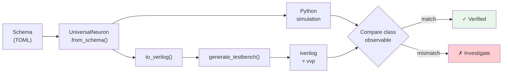

<!-- SPDX-License-Identifier: AGPL-3.0-or-later -->
<!-- Commercial license available -->
<!-- © Concepts 1996–2026 Miroslav Šotek. All rights reserved. -->
<!-- © Code 2020–2026 Miroslav Šotek. All rights reserved. -->
<!-- ORCID: 0009-0009-3560-0851 -->

# Python ↔ Verilog Co-Simulation Guide

This guide documents the SC-NeuroCore co-simulation framework for validating
that Verilog RTL generated by the equation compiler agrees with the Python
reference under the metric appropriate to the model class. Deterministic
non-chaotic models usually compare spike counts; discrete or sensitive maps use
bounded state trajectories and event vectors.

## Overview

The co-simulation framework:

1. Compiles a model schema to Verilog via the equation compiler
2. Generates a testbench that drives constant current for N clock cycles
3. Compiles and runs the simulation via Icarus Verilog (`iverilog` + `vvp`)
4. Captures the declared observable (spikes or a bounded state trace)
5. Compares against the Python `UniversalNeuron.step()` reference



## Prerequisites

- **Python 3.10+** with the `sc_neurocore` package installed
- **Icarus Verilog** (`iverilog`, `vvp`) — install via `apt install iverilog`
- Tests skip gracefully if iverilog is not available

## Running Co-Simulation Tests

```bash
# Run all co-simulation tests
python -m pytest tests/test_cosimulation.py -v -s

# Run just the accuracy tests
python -m pytest tests/test_cosimulation.py -k "accuracy" -v -s

# Run Q4.12 precision tests
python -m pytest tests/test_cosimulation.py -k "Q412" -v -s

# Run Q16.16 precision tests
python -m pytest tests/test_cosimulation.py -k "Q1616" -v -s
```

## Test Structure

The co-simulation suite is organized into four test classes:

### TestCoSimulation — Q8.8 Baseline

| Test | Description | Assertion |
|------|-------------|-----------|
| `test_both_produce_spikes` | Both Python and Verilog spike (6 models) | `spikes > 0` |
| `test_spike_count_accuracy` | Spike counts match within 1% (6 models) | `gap < 1%` |
| `test_no_current_no_spikes` | Zero current → zero spikes (5 models) | `spikes == 0` |
| `test_python_sim_is_deterministic` | Python gives same result twice | `a == b` |
| `test_verilog_sim_is_deterministic` | Verilog gives same result twice | `a == b` |

### TestQ412Precision — Q4.12 (16-bit, 12 fractional)

| Test | Description |
|------|-------------|
| `test_lif_q412_spikes` | Q4.12 LIF produces spikes |
| `test_lif_q412_near_python` | Q4.12 within 5% of Python |
| `test_q412_vs_q88_comparison` | Both Q4.12 and Q8.8 within 5% |
| `test_q412_zero_current_lif_is_range_classified` | LIF zero-current is excluded from Q4.12 parity by range diagnostics |

Q4.12 is a narrow-range, high-resolution mode. It can track driven LIF spike
counts in the existing test window, but it is not an mV-range LIF mode:
`v_rest=-65.0`, initial `v=-65.0`, and `tau_m=10.0` exceed the
[-8, +7.9998] Q4.12 range. Use `python -m sc_neurocore.neurons precision lif`
before treating any Q4.12 LIF run as a parity claim.

### TestQ1616Precision — Q16.16 (32-bit, 16 fractional)

| Test | Description |
|------|-------------|
| `test_lif_q1616_spikes` | Q16.16 LIF produces spikes |
| `test_lif_q1616_near_python` | Q16.16 within 1% of Python |
| `test_q1616_zero_current_silence` | Zero current → silence ✓ |

## Verified Models

Six deterministic Q8.8 baseline models are verified. Five have exact spike-count
parity; Izhikevich has a declared one-spike Q8.8 quantisation boundary and exact
Q16.16 parity at the same operating point:

| Model | State Variables | Complexity | Spikes (I=50, 200 steps) |
|-------|:-:|:-:|:-:|
| **LIF** | v | Linear | 200 |
| **Lapicque** | v | Linear | 200 |
| **Quadratic IF** | v | Quadratic | 50 |
| **Izhikevich** | v, u | Quadratic (2-var) | 25 float64 / 24 Q8.8; 25 Q16.16 |
| **Resonate-and-Fire** | v, w | Linear (2-var) | 200 |
| **Perfect Integrator** | v | Linear ramp | 200 |

### FitzHugh-Rinzel Q16.16 enrolment

The three-state `fitzhugh_rinzel` schema is validated separately from the Q8.8
baseline set because its slow variable and cubic RK4 datapath need Q16.16 range and
resolution. The schema mirrors the hand model's coupled `v`, `w`, and `y` equations,
rising-edge `v >= 1` decision, and no-reset flow. Over 3000 steps, hand model, schema
runner, and emitted RTL agree exactly on spike counts throughout the enrolled current
band: seven crossings at `I=0.4`, eight at `I=0.5`, and eight at `I=0.6`. The marginal
crossing at `I=0.7` is outside the declared parity band because fixed-point rounding
changes its count.

### Pernarowski Q16.16 enrolment

The three-state `pernarowski` schema mirrors the maintained autonomous beta-cell
burster: simultaneous classical RK4 over a cubic fast coordinate and two separated
slow variables, rising-edge `v >= 0.5` detection, and no reset. Its slow-wave rhythm
is intrinsic, so input current shifts the trajectory rather than gating a
silent/single/train response. Over 5000 steps, the hand model, schema runner, and
emitted Q16.16 RTL agree exactly at all four enrolled operating points: 17 crossings
at each of `I=-0.1`, `0.0`, `0.1`, and `0.2`.
The corresponding S5/H1 promotion also emits a Q8.8 formal-catalogue core and
port-only harness. Its depth-4 SymbiYosys/Z3 job proves the bounded reset-spike
safety property; the Q16.16 harness remains the behavioural parity evidence.

### Terman-Wang Q16.16 enrolment

The two-state `terman_wang` schema mirrors the maintained LEGION relaxation
oscillator: simultaneous classical RK4 over the cubic fast nullcline and
`tanh`-gated recovery, rising-edge `v >= 1.5` detection, and no reset. Because
the recovery equation is transcendental, raw state bit identity is not portable
across math libraries or fixed-point look-up tables. The enrolled observable is
therefore the robust crossing count. Over 8,000 steps the hand model, schema
runner, and Q16.16 RTL agree exactly on the full silent/single/train set: zero
crossings at `I=-1.0`, one at `I=0.0`, and three at `I=0.5`.

The S5/H1 promotion also emits a Q8.8 formal-catalogue core and port-only
harness. Its depth-4 SymbiYosys/Z3 job proves bounded reset-spike safety only;
the three Q16.16 operating points remain the behavioural parity evidence.

### Rulkov map Q16.16 trajectory enrolment

The `rulkov_map` schema mirrors the maintained Rulkov 2002 hand model as a
simultaneous discrete recurrence: rational subthreshold branch, spike plateau,
hard reset, slow `y` drift, and rising `x >= 0` crossing detection. It is not an
ODE and receives no timestep scaling or integrator smoothing.

The class-correct evidence is a bounded trajectory rather than a long-window
spike count. At `I=1.5` over 30 iterations, the rational, plateau, and reset
branches execute ten times each. The hand model and paired TOML/JSON schemas
agree exactly on every state and event. The Q16.16 RTL reproduces the complete
ten-event vector, with both committed state coordinates within `0.001` absolute
error of float64. This validates fixed-point lowering without claiming that a
sensitive map must retain float64 trajectory identity indefinitely.

The S5/H2 descriptor additionally points to the raw Yosys 0.33
`synth_xilinx` report for the generated Q16.16 core. Its formal-catalogue entry
uses generated Q8.8 RTL, a port-only harness, and a depth-4 SymbiYosys/Z3
reset-spike safety job; behavioural evidence remains the Q16.16 short-window
trajectory.

### Cazelles map Q16.16 trajectory enrolment

The `cazelles_map` schema mirrors the maintained Cazelles, Courbage, and
Rabinovich (2001) hand model as a simultaneous discrete recurrence. The fast
coordinate commits
`clip(a*x*(1-x) - y + I, -2, 2)`, the slow coordinate commits
`y + epsilon*(x - sigma)` from the old state, and each committed
`x >= x_threshold` value emits a level event. It is not a crossing detector and
receives no ODE timestep scaling.

The enrolled Q16.16 evidence uses three bounded 30-iteration trajectories. At
`I=0.5`, `1.0`, and `2.0`, the hand model and paired TOML/JSON schemas agree
exactly on all states and events. The RTL reproduces the complete event vectors
of two, one, and one events respectively, while both state coordinates remain
within `0.0004` absolute error of float64. Together the points exercise the
interior expression and both fast-state clip bounds.

The sensitive `I=0.05` trajectory is an explicit exclusion: over 30 iterations,
the hand/schema path emits seven level events while Q16.16 emits eight, with
seven event-position mismatches. Pinning that observation prevents the bounded
trajectory evidence from being read as long-window chaotic identity.

The S5/H1 promotion adds a Q8.8 formal-catalogue core and port-only harness.
Its depth-4 SymbiYosys/Z3 job proves reset-spike safety only; the three Q16.16
trajectories remain the behavioural evidence.

### Courbage-Nekorkin map fixed-point trajectory enrolment

The `courage_nekorkin_map` schema reproduces Courbage, Nekorkin, and Vdovin
(2007), equations 3–5: both coordinates commit simultaneously, the fast map
uses its three published piecewise-linear branches, and the `x >= d` Heaviside
term applies on the upper side of the discontinuity. `I` is the maintained API
extension; `I=0` is the published autonomous recurrence. The software event is
an upward `x >= x_threshold` crossing and does not reset either coordinate.

At `I=-0.3/0/0.3`, the hand model and paired TOML/JSON schemas agree exactly
on every state and event. Q16.16 RTL is event-exact over bounded
30/20/30-iteration windows. The points exercise all three fast-map branches
and both sides of the Heaviside discontinuity; maximum coordinate errors remain
below `0.014` for `x` and `0.00031` for `y`.

Q32.32 extends each input to 30 iterations and preserves the complete event
vectors of one, four, and one events. Across that set, the maximum errors are
`2.604e-5` for `x` and `8.379e-7` for `y`.

The autonomous 30-iteration Q16.16 trace is an explicit exclusion: float64
emits four events, RTL emits six, and six positions differ. Q32.32 resolves
that same window at four events on both paths. The exclusion prevents bounded
fixed-point evidence from being read as long-window identity for a sensitive
discontinuous map.

The S5/H1 promotion adds a Q8.8 formal-catalogue core and port-only harness.
Its depth-4 SymbiYosys/Z3 job proves reset-spike safety only; Q16.16/Q32.32
trajectories remain the behavioural evidence.

### Ermentrout-Kopell theta-Euler Q16.16 enrolment

The `ermentrout_kopell_map_neuron` schema mirrors the maintained hand class,
not the older catalogue `theta` schema. The sourced object is the continuous
Ermentrout-Kopell (1986) theta equation. The hand implementation adds
`dt=0.1`, input gain, forward Euler, an upward `theta=pi` event, and modulo
`2*pi`; the schema states those as maintained choices and commits the complete
recurrence with `method="map"`.

The event predicate uses `theta_prev` and the unwrapped candidate. This matters
at negative current: the first candidate can fall below zero and commit near
`2*pi`, but that backward wrap is not an upward event. Positive-literal modulo
is lowered with the same floored-remainder correction in Verilog and the
generated integer C/Rust kernels.

The hand model and paired TOML/JSON schemas agree exactly on every float64 state
and event under the varied-drive test. Over 2,000 steps, Q16.16 RTL preserves
the class-correct spike counts at all enrolled points: zero at `I=-0.5`, 45 at
`I=0.5`, and 64 at `I=1.0`. Maximum circular phase errors are respectively
below `0.081`, `0.089`, and `0.025` rad. The cosine LUT shifts some event
positions, so full fixed-point event vectors and trajectories are not claimed
exact.

The integer C and Rust generators match Verilog state and event words
cycle-for-cycle over 240 steps at both current signs. The S5/H1 promotion also emits a Q8.8
catalogue core and port-only harness; its depth-4 SymbiYosys/Z3 job proves the
bounded reset/spike safety property only.

### GLIF Q16.16 enrolment

The `glif` schema mirrors the maintained Allen Institute GLIF5 model:
simultaneous classical RK4 over membrane voltage, adaptive threshold, and two
after-spike currents, followed by candidate-level `v >= theta` detection and a
candidate-first adaptive reset. A varied 4,000-step drive produces 181 resets;
the hand model and both schema formats agree exactly on every event and all four
post-step states.

Over 1,000 constant-current steps, hand model and schema runner report
0/0/23/54/86/95 spikes at `I=0/15/22/30/45/50`; emitted Q16.16 RTL reports the
same six counts exactly. The compiler evaluates state-dependent resets from the
integrated candidate and exposes post-reset output state, matching the schema
runner's integrate-detect-reset order. This removes the former one-spike drift
that had masked a pre-step-reset semantic mismatch. The enrolled hardware
contract spans the whole operating set rather than one selected exact current.

The S5/H1 promotion retains the existing formal-catalogue enrolment with
regenerated Q8.8 RTL, a port-only harness, and a depth-6 SymbiYosys/Z3 safety
job. The Q16.16 six-point set remains the behavioural parity evidence.

### Mihalas-Niebur Q16.16 enrolment

The `mihalas_niebur` schema mirrors the maintained four-state generalised
integrate-and-fire model: simultaneous classical RK4 over membrane voltage,
adaptive threshold, and two spike-triggered currents; candidate-level
`v >= theta` detection; and a candidate-first reset that scales the membrane
excursion, floors the threshold, and increments both currents. Over a varied
1,600-step sequence with 168 resets, the hand model and paired TOML/JSON schemas
agree exactly on every event and all four post-step states.

Over 1,000 constant-current steps, hand model, schema runner, and emitted Q16.16
RTL agree exactly on 0/0/0/31/60/87/131/157/207/256 spikes at
`I=0/0.5/1/1.5/2/2.5/3.5/4/5/6`. The former 300-step `I=3` evidence is now exact
at 36/36/36 after the shared candidate-reset/output correction. A longer
1,000-step run at the same current exposes one marginal fixed-point crossing:
hand/schema/RTL report 111/111/112. The suite asserts that triplet separately,
so the boundary cannot be hidden by a loose global tolerance or promoted as an
exact operating point.

The S5/H1 descriptor retains the generated Q8.8 formal-catalogue core, port-only
harness, and depth-3 SymbiYosys/Z3 safety job. The ten exact Q16.16 points plus
the declared boundary remain the behavioural parity evidence.

### Wilson-HR Q16.16 enrolment

The two-state `wilson_hr` schema mirrors the maintained polynomial cortical
model: simultaneous classical RK4 over membrane `v` and recovery `r`, level
`v >= 0.4` detection, and a hard `v = -0.7` reset that preserves the candidate
recovery state. Five passes through eight 100-step current blocks produce 35
spikes and resets while both schema formats reproduce every post-step hand-model
state exactly. Over 5,000 constant-current steps the hand model, schema runner,
and Q16.16 RTL agree exactly on the enrolled silent/single/train set: zero spikes
at `I=0.0`, one at `I=2.0`, and four at `I=10.0`.

The S5/H1 promotion also emits a Q8.8 formal-catalogue core and port-only
harness. Its depth-4 SymbiYosys/Z3 job proves bounded reset-spike safety only;
the three Q16.16 operating points remain the behavioural parity evidence.

## Adding a New Model to Co-Simulation

1. **Ensure paired TOML/JSON schemas exist** in
   `src/sc_neurocore/neurons/model_schemas/`.
2. **Create dedicated files** named `tests/test_cosim_<model>.py` and
   `tests/test_reference_<model>.py`; do not add new enrolments to the legacy
   aggregate buckets.
3. **Run those model-specific tests** — if they fail:
   - Check whether a transcendental LUT changes the class-correct observable
   - Check if parameters overflow the chosen precision mode
   - Use `python -m sc_neurocore.neurons precision <model>` for diagnostics

```bash
python -m pytest -q \
    tests/test_cosim_your_new_model.py \
    tests/test_reference_your_new_model.py
```

## Schema-Gap Reporting

Use the schema-gap report before selecting the next WC-A5 enrolment target:

```bash
python tools/schema_gap_report.py --format markdown --output docs/internal/schema_gap_report_latest.md
```

The tool scans live source modules and schema files without importing optional
backends. It reports the net schema gap, source modules still lacking a
same-name or alias schema, schema-only names, source-evidence classifications,
and a ranked enrolment table. The current checkout has 153 model source modules,
30 unique schema models, a net schema gap of 123, and 125 source-module rows
still needing same-name or alias schema coverage because `izhikevich` and `lif`
are schema-only names.

## Testbench Architecture

The generated testbench follows this structure:

```verilog
module tb_sc_lif;
    reg clk;
    reg rst_n;
    wire spike_out;
    wire signed [15:0] v_out;

    sc_lif uut (
        .clk(clk), .rst_n(rst_n),
        .I_t(16'sd12800),    // Q8.8 encoded input current
        .spike_out(spike_out),
        .v_out(v_out)
    );

    // 100 MHz clock
    initial clk = 0;
    always #5 clk = ~clk;

    integer spike_count;

    initial begin
        $dumpfile("tb_sc_lif.vcd");
        $dumpvars(0, tb_sc_lif);
        spike_count = 0;

        // Reset phase
        rst_n = 0;
        #20;
        rst_n = 1;
        @(posedge clk);        // 1 settling cycle

        // Measurement phase
        repeat (200) begin
            @(posedge clk);
            #1;                 // combinational settling
            if (spike_out)
                spike_count = spike_count + 1;
        end

        $display("Simulation complete: %0d spikes in 200 cycles",
                 spike_count);
        $finish;
    end
endmodule
```

Key timing details:

| Phase | Purpose | Duration |
|-------|---------|----------|
| Reset (`rst_n = 0`) | Initialise all registers | 20ns (2 clock periods) |
| Settling (`@(posedge clk)`) | Allow reset to propagate | 1 clock cycle |
| `#1` after posedge | Let combinational outputs settle | 1ps (minimal) |

> **Historical note:** The settling cycle and `#1` delay were added in
> 2026-05-01 to eliminate a 0.5% residual gap caused by sampling `spike_out`
> before combinational logic had propagated after reset de-assertion.

## Compiler Correctness: Six Critical Fixes

The following fixes were applied to achieve 0.0% co-simulation accuracy:

| # | Fix | Impact |
|---|-----|--------|
| 1 | Intermediate wire for bit-select | iverilog compilation |
| 2 | Persistent wire counters | Multi-variable models |
| 3 | Portable negative literals | Cross-tool compatibility |
| 4 | **Q-format division** | 99% → 50% gap |
| 5 | **Look-ahead threshold** | 50% → 0.5% gap |
| 6 | **Testbench timing** | 0.5% → 0.0% gap |

### Fix #4: Q-Format Division

**Bug:** Division by parameters used bare Verilog integer division `(a / b)`,
which divides by the Q-encoded raw value (e.g., 2560 for tau_m=10 in Q8.8).

**Fix:** Proper Q-format: `(a << fraction) / b`, with explicit sign extension:

```verilog
wire signed [15:0] _dop0 = numerator;                       // named operand
wire signed [31:0] _dnum0 = $signed({...}) <<< 8;           // shift up
wire signed [31:0] _div0 = _dnum0 / $signed({...});         // divide
wire signed [15:0] _dres0 = _div0[15:0];                    // extract Q result
```

### Fix #5: Look-Ahead Threshold

**Bug:** Threshold compared `v_reg` (current cycle) instead of `v_next`
(computed new voltage), creating a 1-cycle detection delay.

**Fix:** Threshold expression uses `v_next` wires:

```verilog
// Before: if ((v_reg > threshold))     ← 1 cycle late
// After:  if ((v_next > threshold))    ← matches Python semantics
```

## Troubleshooting

### Model produces spikes in Python but not in Verilog

1. **Check dt encoding:** `python -m sc_neurocore.neurons precision <model>`
   - If dt underflows (Q-value = 0), the Euler update is zero
   - Solution: increase dt or use wider precision mode

2. **Check parameter range:** Look for `⚠ Overflow` or `⚠ Underflow` warnings
   - Solution: use Q16.16 for wide-range parameters

3. **Check division:** Parameters used as divisors should be > 0.004 (Q8.8
   minimum representable value)

### Verilog produces more spikes than Python

1. **Check for Q-format overflow:** Large v² products may wrap in 16-bit
   - Solution: use Q16.16 for nonlinear models
   - Example: Izhikevich at zero current — 0.04*v² overflows Q8.8

### Compilation fails with iverilog

- Ensure `-g2012` flag is passed (SystemVerilog 2012 features required)
- Check for bit-select on complex expressions (should be caught by the compiler)

## Further Reading

- [Precision Modes Guide](precision_modes.md) — Q8.8, Q4.12, Q16.16 details
- [Tutorial 33: Equation-to-Verilog](../tutorials/33_equation_to_verilog.md)
- [Tutorial 09: Hardware Co-simulation](../tutorials/09_hardware_cosimulation.md)
- Strategic assessment evidence is maintained internally; public co-simulation
  claims in this guide are bounded by the tests and compiler fixes documented
  above.
