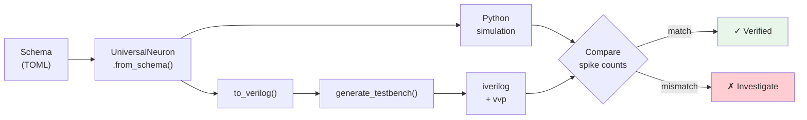

<!-- SPDX-License-Identifier: AGPL-3.0-or-later -->
<!-- Commercial license available -->
<!-- © Concepts 1996–2026 Miroslav Šotek. All rights reserved. -->
<!-- © Code 2020–2026 Miroslav Šotek. All rights reserved. -->
<!-- ORCID: 0009-0009-3560-0851 -->

# Python ↔ Verilog Co-Simulation Guide

This guide documents the SC-NeuroCore co-simulation framework for validating
that the Verilog RTL generated by the equation compiler produces **bit-true
equivalent** spike behaviour to the Python reference implementation.

## Overview

The co-simulation framework:

1. Compiles a model schema to Verilog via the equation compiler
2. Generates a testbench that drives constant current for N clock cycles
3. Compiles and runs the simulation via Icarus Verilog (`iverilog` + `vvp`)
4. Parses the spike count from simulation output
5. Compares against the Python `UniversalNeuron.step()` reference



## Prerequisites

- **Python 3.10+** with the `sc_neurocore` package installed
- **Icarus Verilog** (`iverilog`, `vvp`) — install via `apt install iverilog`
- Tests skip gracefully if iverilog is not available

## Running Co-Simulation Tests

```bash
# Run all co-simulation tests
python -m pytest tests/test_cosimulation.py -v -s

# Run just the accuracy tests
python -m pytest tests/test_cosimulation.py -k "accuracy" -v -s

# Run Q4.12 precision tests
python -m pytest tests/test_cosimulation.py -k "Q412" -v -s

# Run Q16.16 precision tests
python -m pytest tests/test_cosimulation.py -k "Q1616" -v -s
```

## Test Structure

The co-simulation suite is organized into four test classes:

### TestCoSimulation — Q8.8 Baseline

| Test | Description | Assertion |
|------|-------------|-----------|
| `test_both_produce_spikes` | Both Python and Verilog spike (6 models) | `spikes > 0` |
| `test_spike_count_accuracy` | Spike counts match within 1% (6 models) | `gap < 1%` |
| `test_no_current_no_spikes` | Zero current → zero spikes (5 models) | `spikes == 0` |
| `test_python_sim_is_deterministic` | Python gives same result twice | `a == b` |
| `test_verilog_sim_is_deterministic` | Verilog gives same result twice | `a == b` |

### TestQ412Precision — Q4.12 (16-bit, 12 fractional)

| Test | Description |
|------|-------------|
| `test_lif_q412_spikes` | Q4.12 LIF produces spikes |
| `test_lif_q412_near_python` | Q4.12 within 5% of Python |
| `test_q412_vs_q88_comparison` | Both Q4.12 and Q8.8 within 5% |
| `test_q412_zero_current_lif_is_range_classified` | LIF zero-current is excluded from Q4.12 parity by range diagnostics |

Q4.12 is a narrow-range, high-resolution mode. It can track driven LIF spike
counts in the existing test window, but it is not an mV-range LIF mode:
`v_rest=-65.0`, initial `v=-65.0`, and `tau_m=10.0` exceed the
[-8, +7.9998] Q4.12 range. Use `python -m sc_neurocore.neurons precision lif`
before treating any Q4.12 LIF run as a parity claim.

### TestQ1616Precision — Q16.16 (32-bit, 16 fractional)

| Test | Description |
|------|-------------|
| `test_lif_q1616_spikes` | Q16.16 LIF produces spikes |
| `test_lif_q1616_near_python` | Q16.16 within 1% of Python |
| `test_q1616_zero_current_silence` | Zero current → silence ✓ |

## Verified Models

Six deterministic Q8.8 baseline models are verified in the spike-parity set:

| Model | State Variables | Complexity | Spikes (I=50, 200 steps) |
|-------|:-:|:-:|:-:|
| **LIF** | v | Linear | 200 |
| **Lapicque** | v | Linear | 200 |
| **Quadratic IF** | v | Quadratic | 50 |
| **Izhikevich** | v, u | Quadratic (2-var) | 25 |
| **Resonate-and-Fire** | v, w | Linear (2-var) | 200 |
| **Perfect Integrator** | v | Linear ramp | 200 |

## Adding a New Model to Co-Simulation

1. **Ensure the model schema exists** in `src/sc_neurocore/neurons/model_schemas/`
2. **Add the model name** to `_COSIM_MODELS` in `tests/test_cosimulation.py`
3. **Run the test** — if it fails:
   - Check if the model uses transcendental functions (not yet supported in co-sim)
   - Check if parameters overflow the chosen precision mode
   - Use `python -m sc_neurocore.neurons precision <model>` for diagnostics

```python
# Example: adding a new model to co-sim
_COSIM_MODELS = ["lif", "lapicque", "quadratic_if", "izhikevich",
                 "resonate_fire", "perfect_integrator", "your_new_model"]
```

## Schema-Gap Reporting

Use the schema-gap report before selecting the next WC-A5 enrolment target:

```bash
python tools/schema_gap_report.py --format markdown --output docs/internal/schema_gap_report_latest.md
```

The tool scans live source modules and schema files without importing optional
backends. It reports the net schema gap, source modules still lacking a
same-name or alias schema, schema-only names, source-evidence classifications,
and a ranked enrolment table. The current checkout has 152 model source modules,
22 unique schema models, a net schema gap of 130, and 132 source-module rows
still needing same-name or alias schema coverage because `izhikevich` and `lif`
are schema-only names.

## Testbench Architecture

The generated testbench follows this structure:

```verilog
module tb_sc_lif;
    reg clk;
    reg rst_n;
    wire spike_out;
    wire signed [15:0] v_out;

    sc_lif uut (
        .clk(clk), .rst_n(rst_n),
        .I_t(16'sd12800),    // Q8.8 encoded input current
        .spike_out(spike_out),
        .v_out(v_out)
    );

    // 100 MHz clock
    initial clk = 0;
    always #5 clk = ~clk;

    integer spike_count;

    initial begin
        $dumpfile("tb_sc_lif.vcd");
        $dumpvars(0, tb_sc_lif);
        spike_count = 0;

        // Reset phase
        rst_n = 0;
        #20;
        rst_n = 1;
        @(posedge clk);        // 1 settling cycle

        // Measurement phase
        repeat (200) begin
            @(posedge clk);
            #1;                 // combinational settling
            if (spike_out)
                spike_count = spike_count + 1;
        end

        $display("Simulation complete: %0d spikes in 200 cycles",
                 spike_count);
        $finish;
    end
endmodule
```

Key timing details:

| Phase | Purpose | Duration |
|-------|---------|----------|
| Reset (`rst_n = 0`) | Initialise all registers | 20ns (2 clock periods) |
| Settling (`@(posedge clk)`) | Allow reset to propagate | 1 clock cycle |
| `#1` after posedge | Let combinational outputs settle | 1ps (minimal) |

> **Historical note:** The settling cycle and `#1` delay were added in
> 2026-05-01 to eliminate a 0.5% residual gap caused by sampling `spike_out`
> before combinational logic had propagated after reset de-assertion.

## Compiler Correctness: Six Critical Fixes

The following fixes were applied to achieve 0.0% co-simulation accuracy:

| # | Fix | Impact |
|---|-----|--------|
| 1 | Intermediate wire for bit-select | iverilog compilation |
| 2 | Persistent wire counters | Multi-variable models |
| 3 | Portable negative literals | Cross-tool compatibility |
| 4 | **Q-format division** | 99% → 50% gap |
| 5 | **Look-ahead threshold** | 50% → 0.5% gap |
| 6 | **Testbench timing** | 0.5% → 0.0% gap |

### Fix #4: Q-Format Division

**Bug:** Division by parameters used bare Verilog integer division `(a / b)`,
which divides by the Q-encoded raw value (e.g., 2560 for tau_m=10 in Q8.8).

**Fix:** Proper Q-format: `(a << fraction) / b`, with explicit sign extension:

```verilog
wire signed [15:0] _dop0 = numerator;                       // named operand
wire signed [31:0] _dnum0 = $signed({...}) <<< 8;           // shift up
wire signed [31:0] _div0 = _dnum0 / $signed({...});         // divide
wire signed [15:0] _dres0 = _div0[15:0];                    // extract Q result
```

### Fix #5: Look-Ahead Threshold

**Bug:** Threshold compared `v_reg` (current cycle) instead of `v_next`
(computed new voltage), creating a 1-cycle detection delay.

**Fix:** Threshold expression uses `v_next` wires:

```verilog
// Before: if ((v_reg > threshold))     ← 1 cycle late
// After:  if ((v_next > threshold))    ← matches Python semantics
```

## Troubleshooting

### Model produces spikes in Python but not in Verilog

1. **Check dt encoding:** `python -m sc_neurocore.neurons precision <model>`
   - If dt underflows (Q-value = 0), the Euler update is zero
   - Solution: increase dt or use wider precision mode

2. **Check parameter range:** Look for `⚠ Overflow` or `⚠ Underflow` warnings
   - Solution: use Q16.16 for wide-range parameters

3. **Check division:** Parameters used as divisors should be > 0.004 (Q8.8
   minimum representable value)

### Verilog produces more spikes than Python

1. **Check for Q-format overflow:** Large v² products may wrap in 16-bit
   - Solution: use Q16.16 for nonlinear models
   - Example: Izhikevich at zero current — 0.04*v² overflows Q8.8

### Compilation fails with iverilog

- Ensure `-g2012` flag is passed (SystemVerilog 2012 features required)
- Check for bit-select on complex expressions (should be caught by the compiler)

## Further Reading

- [Precision Modes Guide](precision_modes.md) — Q8.8, Q4.12, Q16.16 details
- [Tutorial 33: Equation-to-Verilog](../tutorials/33_equation_to_verilog.md)
- [Tutorial 09: Hardware Co-simulation](../tutorials/09_hardware_cosimulation.md)
- Strategic assessment evidence is maintained internally; public co-simulation
  claims in this guide are bounded by the tests and compiler fixes documented
  above.
