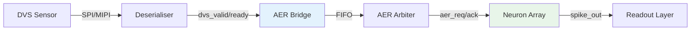

<!-- SPDX-License-Identifier: AGPL-3.0-or-later -->
<!-- Commercial license available -->
<!-- © Concepts 1996–2026 Miroslav Šotek. All rights reserved. -->
<!-- © Code 2020–2026 Miroslav Šotek. All rights reserved. -->
<!-- ORCID: 0009-0009-3560-0851 -->

# DVS Event-Camera Pipeline

Integrate Dynamic Vision Sensors (DVS) with SC-NeuroCore compiled
spike networks using the auto-generated AER (Address-Event Representation)
bridge.  This guide covers the DVS→AER→Neuron pipeline architecture,
FIFO sizing, overflow handling, and integration with Prophesee and
Sony IMX636 event cameras.

---

## 1. Mathematical Formalism

### 1.1 DVS Event Model

A DVS pixel $(x, y)$ generates an event when the log-intensity change
exceeds a contrast threshold $C$:

$$
e_i = (x_i, y_i, t_i, p_i) \quad \text{where} \quad
\left|\log I(x, y, t) - \log I(x, y, t_{\text{prev}})\right| \geq C
$$

- $p_i \in \{0, 1\}$: polarity (OFF/ON)
- $t_i$: microsecond-resolution timestamp

### 1.2 Event Rate Estimation

The average event rate depends on scene dynamics:

$$
R_{\text{events}} = N_{\text{pixels}} \cdot f_{\text{contrast}} \cdot \bar{v}_{\text{motion}}
$$

Typical ranges:

| Scene | Events/s | Bandwidth |
|-------|:--------:|:---------:|
| Static | < 1K | < 100 Kb/s |
| Slow motion | 10K–100K | 1–10 Mb/s |
| Fast motion | 1M–10M | 100 Mb/s–1 Gb/s |

### 1.3 FIFO Sizing

To prevent event loss during burst activity, the FIFO depth must
satisfy:

$$
D_{\text{FIFO}} \geq R_{\text{burst}} \cdot T_{\text{process}}
$$

where $R_{\text{burst}}$ is the peak event rate and $T_{\text{process}}$
is the neuron processing time per event.

For a neuron at 200 MHz processing one event per cycle:

$$
T_{\text{process}} = 5\text{ ns}, \quad
D_{\text{FIFO}} \geq R_{\text{burst}} \cdot 5 \times 10^{-9}
$$

At 10M events/s peak: $D_{\text{FIFO}} \geq 50$ entries.

### 1.4 AER Protocol Timing

The 4-phase handshake protocol:

$$
T_{\text{AER}} = T_{\text{req}} + T_{\text{setup}} + T_{\text{ack}} + T_{\text{release}}
$$

At 200 MHz: $T_{\text{AER}} \approx 4 \times 5\text{ ns} = 20\text{ ns}$,
giving a maximum throughput of 50M events/s.

---

## 2. Architecture

### 2.1 Pipeline Overview



### 2.2 AER Bridge Module

```
┌───────────────────────────────────────────────────┐
│  sc_dvs_aer_bridge                                │
│                                                    │
│  DVS Input (streaming)          AER Output         │
│  ┌──────────┐    ┌──────┐    ┌──────────┐         │
│  │dvs_valid │───►│ FIFO │───►│ aer_req  │───►     │
│  │dvs_ready │◄───│      │◄───│ aer_ack  │◄───     │
│  │dvs_addr  │───►│      │───►│ aer_addr │───►     │
│  │dvs_pol   │───►│      │───►│ aer_pol  │───►     │
│  │dvs_ts    │───►│      │───►│ aer_ts   │───►     │
│  └──────────┘    └──────┘    └──────────┘         │
│                  │Status │                         │
│                  │count  │                         │
│                  │overflow│                        │
│                  └───────┘                         │
└───────────────────────────────────────────────────┘
```

### 2.3 Event Word Format

The bridge packs DVS events into a single wide word for FIFO storage:

| Field | Bits | Position |
|-------|:----:|:--------:|
| Address (X×Y) | 16 | `[48:33]` |
| Polarity | 1 | `[32]` |
| Timestamp | 32 | `[31:0]` |
| **Total** | **49** | — |

---

## 3. Supported Sensors

| Sensor | Resolution | Max Events/s | Interface | Polarity |
|--------|:----------:|:------------:|-----------|:--------:|
| Prophesee EVK4 | 1280×720 | 1.2G | MIPI CSI-2 | ON/OFF |
| Sony IMX636 | 1280×720 | 100M | SPI / MIPI | ON/OFF |
| Samsung DVS-Gen4 | 640×480 | 300M | MIPI | ON/OFF |
| iniVation DAVIS 346 | 346×260 | 12M | USB3 / SPI | ON/OFF |
| CelePixel CeleX-V | 1280×800 | 500M | MIPI | ON only |

### 3.1 Address Width Selection

| Resolution | Pixels | Address Width | Notes |
|:----------:|:------:|:-------------:|-------|
| 346×260 | 89,960 | 17 bits | DAVIS 346 |
| 640×480 | 307,200 | 19 bits | Standard VGA |
| 1280×720 | 921,600 | 20 bits | HD (Prophesee/Sony) |
| 1920×1080 | 2,073,600 | 21 bits | Full HD |

---

## 4. Python API

### 4.1 Generate DVS→AER Bridge

```python
from sc_neurocore.compiler.intelligence.core import generate_dvs_aer_bridge

bridge = generate_dvs_aer_bridge(
    "sc_dvs_bridge",
    addr_width=20,          # 1280×720 pixel space
    polarity_bit=True,      # ON/OFF events
    timestamp_width=32,     # µs resolution
    fifo_depth=128,         # 128-entry FIFO
)

with open("sc_dvs_bridge.v", "w") as f:
    f.write(bridge)
```

### 4.2 Prophesee EVK4 Configuration

```python
bridge = generate_dvs_aer_bridge(
    "sc_prophesee_bridge",
    addr_width=20,          # 1280×720
    polarity_bit=True,
    timestamp_width=32,
    fifo_depth=256,         # Large FIFO for 1.2G peak rate
)
```

### 4.3 Sony IMX636 Configuration

```python
bridge = generate_dvs_aer_bridge(
    "sc_imx636_bridge",
    addr_width=20,          # 1280×720
    polarity_bit=True,
    timestamp_width=32,
    fifo_depth=64,          # Moderate FIFO for 100M peak
)
```

### 4.4 DAVIS 346 Configuration (Low-Resolution)

```python
bridge = generate_dvs_aer_bridge(
    "sc_davis346_bridge",
    addr_width=17,          # 346×260
    polarity_bit=True,
    timestamp_width=16,     # Shorter timestamp for small sensor
    fifo_depth=32,          # Small FIFO for 12M peak
)
```

### 4.5 Full DVS→Neuron Pipeline

```python
from sc_neurocore.compiler.intelligence.core import generate_dvs_aer_bridge
from sc_neurocore.neurons.equation_builder import from_equations
from sc_neurocore.compiler.equation_compiler import compile_to_verilog
from sc_neurocore.compiler.deployment import generate_riscv_driver

# 1. DVS bridge
bridge = generate_dvs_aer_bridge("sc_dvs", addr_width=20, fifo_depth=128)

# 2. LIF neuron for spike processing
neuron = from_equations(
    "dv/dt = -(v - E_L)/tau_m + I/C",
    threshold="v > -50", reset="v = -65",
    params=dict(E_L=-65, tau_m=10, C=1),
    init=dict(v=-65),
)
verilog = compile_to_verilog(neuron, module_name="sc_lif")

# 3. RISC-V driver for readout
driver = generate_riscv_driver("sc_lif", {"E_L": 16}, rtos="freertos")

# 4. Write artefacts
for name, content in [
    ("sc_dvs.v", bridge),
    ("sc_lif.v", verilog),
    ("sc_lif_riscv.h", driver),
]:
    with open(name, "w") as f:
        f.write(content)
```

---

## 5. CLI Usage

### 5.1 Generate Bridge Module

```bash
python -c "
from sc_neurocore.compiler.intelligence.core import generate_dvs_aer_bridge
b = generate_dvs_aer_bridge(
    'sc_dvs_bridge',
    addr_width=20,
    fifo_depth=128,
)
open('sc_dvs_bridge.v', 'w').write(b)
print(f'Generated: sc_dvs_bridge.v ({len(b)} bytes)')
"
```

### 5.2 Synthesise with Yosys

```bash
yosys -p "
    read_verilog sc_dvs_bridge.v
    synth_xilinx -top sc_dvs_bridge
    stat
"
```

### 5.3 Verify with iverilog

```bash
iverilog -o dvs_tb sc_dvs_bridge.v dvs_testbench.v
vvp dvs_tb
```

---

## 6. Generated Verilog Structure

### 6.1 Module Ports

```verilog
module sc_dvs_aer_bridge (
    input  wire        clk,
    input  wire        rst,

    // DVS event input (streaming)
    input  wire        dvs_valid,
    output wire        dvs_ready,
    input  wire [19:0] dvs_addr,
    input  wire        dvs_polarity,
    input  wire [31:0] dvs_timestamp,

    // AER output (to spike network)
    output wire        aer_req,
    input  wire        aer_ack,
    output wire [19:0] aer_addr,
    output wire        aer_polarity,
    output wire [31:0] aer_timestamp,

    // Status
    output wire [7:0]  fifo_count,
    output wire        fifo_overflow
);
```

### 6.2 FIFO Implementation

The FIFO uses synchronous BRAM inference for efficient resource usage:

```verilog
    // FIFO storage
    reg [52:0] fifo_mem [0:127];    // 53-bit event words
    reg [6:0] wr_ptr, rd_ptr;
    reg [7:0] count;

    // Back-pressure: stop accepting when full
    assign dvs_ready = (count < 128);
    assign fifo_overflow = overflow_r;
```

### 6.3 AER Handshake FSM

```verilog
    // 4-phase handshake state machine
    localparam IDLE = 2'b00;
    localparam REQ  = 2'b01;
    localparam WAIT = 2'b10;

    reg [1:0] aer_state;

    always @(posedge clk or posedge rst) begin
        if (rst) begin
            aer_state <= IDLE;
        end else case (aer_state)
            IDLE: if (count > 0) aer_state <= REQ;
            REQ:  if (aer_ack)   aer_state <= WAIT;
            WAIT: if (!aer_ack)  aer_state <= IDLE;
        endcase
    end
```

---

## 7. Performance Characteristics

### 7.1 Resource Usage

| Configuration | LUTs | FFs | BRAM 18K | Max Freq |
|---------------|:----:|:---:|:--------:|:--------:|
| FIFO=32, addr=17 | ~120 | ~80 | 1 | 450 MHz |
| FIFO=64, addr=20 | ~150 | ~100 | 1 | 400 MHz |
| FIFO=128, addr=20 | ~180 | ~120 | 1 | 380 MHz |
| FIFO=256, addr=20 | ~220 | ~150 | 2 | 350 MHz |

### 7.2 Throughput

| Clock | Handshake Latency | Max Throughput | Suitable For |
|:-----:|:-----------------:|:--------------:|--------------|
| 100 MHz | 40 ns | 25M events/s | DAVIS 346 |
| 200 MHz | 20 ns | 50M events/s | Sony IMX636 |
| 400 MHz | 10 ns | 100M events/s | Prophesee EVK4 |

### 7.3 Latency Budget

| Stage | Latency (cycles) | At 200 MHz |
|-------|:-----------------:|:----------:|
| DVS→FIFO write | 1 | 5 ns |
| FIFO read | 1 | 5 ns |
| AER handshake | 2–4 | 10–20 ns |
| Neuron compute | 1–8 | 5–40 ns |
| **Total** | **5–14** | **25–70 ns** |

### 7.4 FIFO Overflow Analysis

For a Prophesee EVK4 with 1.2G peak events/s at 200 MHz processing:

$$
\text{Overflow probability} \approx P\left(\text{burst} > D_{\text{FIFO}} \cdot \frac{f_{\text{clk}}}{R_{\text{peak}}}\right)
$$

| FIFO Depth | Max Burst Duration | Overflow Risk |
|:----------:|:------------------:|:-------------:|
| 32 | 5.3 µs | High |
| 64 | 10.7 µs | Medium |
| 128 | 21.3 µs | Low |
| 256 | 42.7 µs | Very low |

---

## 8. Test Suite and Verification

### 8.1 Bridge Generation Test

```bash
python -c "
from sc_neurocore.compiler.intelligence.core import generate_dvs_aer_bridge
b = generate_dvs_aer_bridge('test_dvs', addr_width=16, fifo_depth=32)
assert 'dvs_valid' in b
assert 'aer_req' in b
assert 'fifo_mem' in b
assert 'fifo_overflow' in b
print(f'DVS bridge: PASS ({len(b)} bytes)')
"
```

### 8.2 Address Width Parameterisation

```bash
python -c "
from sc_neurocore.compiler.intelligence.core import generate_dvs_aer_bridge
for aw in [12, 16, 20, 24]:
    b = generate_dvs_aer_bridge('dvs', addr_width=aw)
    assert f'[{aw-1}:0]' in b
    print(f'addr_width={aw}: PASS')
"
```

### 8.3 FIFO Depth Parameterisation

```bash
python -c "
from sc_neurocore.compiler.intelligence.core import generate_dvs_aer_bridge
for depth in [16, 32, 64, 128, 256]:
    b = generate_dvs_aer_bridge('dvs', fifo_depth=depth)
    assert f'[0:{depth-1}]' in b
    print(f'fifo_depth={depth}: PASS')
"
```

### 8.4 Polarity Bit Toggle

```bash
python -c "
from sc_neurocore.compiler.intelligence.core import generate_dvs_aer_bridge
b1 = generate_dvs_aer_bridge('dvs', polarity_bit=True)
b2 = generate_dvs_aer_bridge('dvs', polarity_bit=False)
assert 'dvs_polarity' in b1
assert 'Polarity: True' in b1
assert 'Polarity: False' in b2
print('Polarity toggle: PASS')
"
```

### 8.5 Timestamp Width Test

```bash
python -c "
from sc_neurocore.compiler.intelligence.core import generate_dvs_aer_bridge
for tw in [16, 24, 32, 48]:
    b = generate_dvs_aer_bridge('dvs', timestamp_width=tw)
    assert f'[{tw-1}:0]' in b
    print(f'timestamp_width={tw}: PASS')
"
```

### 8.6 E2E Pipeline Test

```bash
python -m pytest tests/e2e/test_e2e_pipeline.py -v -k "dvs"
```

### 8.7 Troubleshooting

| Symptom | Cause | Fix |
|---------|-------|-----|
| `fifo_overflow` asserted | FIFO too small | Increase `fifo_depth` |
| No `aer_req` events | FIFO empty / no DVS input | Check `dvs_valid` signal |
| Address truncation | `addr_width` too small | Match sensor resolution |
| Timestamp rollover | 16-bit timestamp | Use 32-bit `timestamp_width` |
| Events dropped | Clock too slow | Increase FPGA clock or FIFO depth |
| AER deadlock | `aer_ack` never asserted | Check downstream neuron busy logic |

### 8.8 Application Examples

#### Gesture Recognition

DVS event streams from hand gestures are converted to AER events
and processed by a spiking convolutional network on FPGA:

```python
# Gesture recognition: 128×128 ROI from DVS
bridge = generate_dvs_aer_bridge(
    "sc_gesture",
    addr_width=14,          # 128×128 = 16384 pixels
    timestamp_width=32,
    fifo_depth=128,
)
```

#### Optical Flow Estimation

Sparse event-based optical flow using local event correlation:

```python
# High-res optical flow: full 1280×720
bridge = generate_dvs_aer_bridge(
    "sc_optflow",
    addr_width=20,
    timestamp_width=48,     # Extended timestamp for velocity
    fifo_depth=256,
)
```

#### Multi-Sensor Fusion

Multiple DVS bridges feeding into a single neuron array:

```python
bridges = []
for i in range(4):
    b = generate_dvs_aer_bridge(
        f"sc_dvs_{i}",
        addr_width=17,      # DAVIS 346
        fifo_depth=64,
    )
    bridges.append(b)
    with open(f"sc_dvs_{i}.v", "w") as f:
        f.write(b)
```

### 8.9 SPI Interface Integration

For sensors with SPI interfaces (DAVIS 346, IMX636 SPI mode),
the event deserialiser precedes the AER bridge:

```
SPI MISO → Shift Register → Event Parser → dvs_valid/addr/pol/ts → AER Bridge
```

The SPI clock rate determines the maximum event throughput:

| SPI Clock | Max Events/s | Suitable Sensor |
|:---------:|:------------:|:----------------|
| 10 MHz | 250K | Low-res, low speed |
| 50 MHz | 1.25M | DAVIS 346 |
| 100 MHz | 2.5M | IMX636 SPI mode |

---

## References

1. **DVS event-camera principles:**
   Gallego, G. *et al.* "Event-Based Vision: A Survey."
   *IEEE TPAMI*, 44(1):154–180, 2022.

2. **AER protocol:**
   Boahen, K. "Point-to-Point Connectivity Between Neuromorphic Chips
   Using Address Events." *IEEE TCS-II*, 47(5):416–434, 2000.

3. **Prophesee Metavision SDK:**
   Prophesee S.A. "Metavision SDK Documentation." 2024.

4. **Sony IMX636 event sensor:**
   Sony Semiconductor Solutions. "IMX636 Event-Based Vision Sensor
   Datasheet." 2023.

5. **FPGA-based event processing:**
   Aung, M.T. *et al.* "Event-Driven Visual-Inertial Odometry
   on FPGA." *IEEE TCAS-I*, 2023.

---

## Further Reading

- [RISC-V Integration Guide](riscv_integration.md) — MMIO drivers, SoC integration
- [Network Compilation Guide](network_compilation.md) — BRAM arrays, weight ROM
- [Hardware Profiles Guide](hardware_profiles.md) — 175 platform profiles
- [Deployment Guide](deployment_guide.md) — Constraints, bitstream automation
- [Thermal Deployment Guide](thermal_deployment.md) — Power-aware deployment
