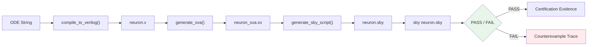

<!-- SPDX-License-Identifier: AGPL-3.0-or-later -->
<!-- Commercial license available -->
<!-- © Concepts 1996–2026 Miroslav Šotek. All rights reserved. -->
<!-- © Code 2020–2026 Miroslav Šotek. All rights reserved. -->
<!-- ORCID: 0009-0009-3560-0851 -->

# Formal Verification Flow

Formally verify compiled neuron modules using SystemVerilog Assertions (SVA)
and SymbiYosys bounded model checking.  This guide covers the complete
verification pipeline from assertion generation through proof execution
and DO-254 / IEC 61508 certification evidence extraction.

---

## 1. Mathematical Formalism

### 1.1 Bounded Model Checking (BMC)

BMC unrolls the neuron's state-transition relation up to a depth $k$ and
checks whether any property violation is reachable:

$$
\phi_{\text{BMC}}(k) = I(s_0) \wedge \bigwedge_{i=0}^{k-1} T(s_i, s_{i+1})
\wedge \bigvee_{i=0}^{k} \neg P(s_i)
$$

where $I(s_0)$ is the initial state predicate (reset), $T(s_i, s_{i+1})$
is the transition relation (one clock cycle), and $P(s_i)$ is the safety
property (e.g. no overflow).

If $\phi_{\text{BMC}}(k)$ is **UNSAT**, no property violation exists
within $k$ cycles.

### 1.2 K-Induction

For unbounded proofs, SymbiYosys uses k-induction:

1. **Base case:** BMC for $k$ cycles (no violation reachable from reset).
2. **Induction step:** Assume $P$ holds for $k$ consecutive arbitrary
   states; prove $P$ holds for state $k+1$.

$$
\text{Induction}(k) = \left(\bigwedge_{i=0}^{k-1} P(s_i) \wedge T(s_i, s_{i+1})\right)
\implies P(s_k)
$$

If both base and step pass, the property holds for **all reachable states**.

### 1.3 Overflow Safety Property

For a signed Q$m$.$f$ fixed-point state variable $v$ with $W = m + f + 1$
bits, the overflow safety assertion is:

$$
\forall n \geq 0: -2^{W-1} \leq v[n] \leq 2^{W-1} - 1
$$

In SVA syntax:

```systemverilog
a_no_overflow_v: assert property (
    disable iff (!rst_n)
    $signed(v_reg) >= -32768 && $signed(v_reg) <= 32767
);
```

### 1.4 Reachability Cover Property

To prove that the neuron can actually spike (liveness):

$$
\exists n \geq 0: \text{spike\_out}[n] = 1
$$

In SVA:

```systemverilog
c_spike_reachable: cover property (
    disable iff (!rst_n)
    spike_out == 1'b1
);
```

### 1.5 Input Assumption Bounding

External inputs must be constrained to physically valid ranges to
prevent false counterexamples.  For a current input $I_t$ in Q8.8:

$$
I_{\min}^Q \leq I_t \leq I_{\max}^Q
$$

In SVA:

```systemverilog
a_I_t_bounded: assume property (
    disable iff (!rst_n)
    $signed(I_t) >= -16'd8192 && $signed(I_t) <= 16'd8192
);
```

---

## 2. Architecture

### 2.1 Verification Pipeline



### 2.2 SVA Bind Architecture

The generated SVA module uses SystemVerilog `bind` to attach assertions
to the compiled neuron without modifying its source code:

```
┌──────────────────────────────────┐
│  sc_equation_neuron.v            │
│  (compiled neuron — unmodified)  │
│                                  │
│  ┌────────────────────────────┐  │
│  │  sc_equation_neuron_sva.sv │  │  ← bind overlay
│  │  • overflow assertions     │  │
│  │  • reachability covers     │  │
│  │  • input assumptions       │  │
│  └────────────────────────────┘  │
└──────────────────────────────────┘
```

### 2.3 SymbiYosys Configuration

The `.sby` file coordinates the formal verification run:

```
[options]        → mode (bmc/prove/cover), depth
[engines]        → solver backend (smtbmc/aiger + boolector/z3/yices)
[script]         → Yosys commands (read_verilog, prep)
[files]          → source file list
```

---

## 3. Supported Verification Modes

| Mode | CLI / API | What It Proves | Completeness |
|------|-----------|---------------|:------------:|
| BMC | `mode="bmc"` | No violation in $k$ cycles | Bounded |
| Prove | `mode="prove"` | No violation ever (k-induction) | Unbounded |
| Cover | `mode="cover"` | Target states are reachable | Existential |

### 3.1 Solver Backends

| Solver | Engine | Speed | Strength |
|--------|--------|:-----:|----------|
| `smtbmc` | `boolector` | ★★★★ | Best for bit-vector QF_BV |
| `smtbmc` | `z3` | ★★★ | Broader theory support |
| `smtbmc` | `yices` | ★★★★ | Fast incremental solving |
| `aiger` | `abc` | ★★★★★ | AIG-based, fastest for small designs |

### 3.2 Assertion Categories

| Category | Prefix | Count per Neuron | Purpose |
|----------|--------|:----------------:|---------|
| Overflow | `a_no_overflow_*` | 1 per state var | Safety |
| Reachability | `c_spike_reachable` | 1 | Liveness |
| No-spike | `c_no_spike` | 1 | Quiescent reachability |
| Positive range | `c_*_positive` | 1 per state var | Range coverage |
| Negative range | `c_*_negative` | 1 per state var | Range coverage |
| Input bounds | `a_*_bounded` | 1 per input | Assumption |

---

## 4. Python API

### 4.1 Generate SVA Assertions

```python
from sc_neurocore.compiler.static_analysis import generate_sva

sva = generate_sva(
    state_vars=["v"],
    data_width=16,
    fraction=8,
    signed=True,
    input_bounds={"I_t": (-8192, 8192)},
    module_name="sc_lif_neuron",
)

with open("sc_lif_neuron_sva.sv", "w") as f:
    f.write(sva)
```

### 4.2 Generate SymbiYosys Script

```python
from sc_neurocore.compiler.deployment import generate_sby_script

sby = generate_sby_script(
    "sc_lif_neuron",
    depth=20,
    mode="bmc",
    solver="smtbmc",
    engine="boolector",
)

with open("sc_lif_neuron.sby", "w") as f:
    f.write(sby)
```

### 4.3 Full Pipeline Example

```python
from sc_neurocore.neurons.equation_builder import from_equations
from sc_neurocore.compiler.equation_compiler import compile_to_verilog
from sc_neurocore.compiler.static_analysis import generate_sva
from sc_neurocore.compiler.deployment import generate_sby_script

# 1. Define neuron
neuron = from_equations(
    "dv/dt = -(v - E_L)/tau_m + I/C",
    threshold="v > -50", reset="v = -65",
    params=dict(E_L=-65, tau_m=10, C=1),
    init=dict(v=-65),
)

# 2. Compile to Verilog
verilog = compile_to_verilog(neuron, module_name="sc_lif")
with open("sc_lif.v", "w") as f:
    f.write(verilog)

# 3. Generate SVA
sva = generate_sva(
    state_vars=["v"],
    data_width=16, fraction=8,
    module_name="sc_lif",
)
with open("sc_lif_sva.sv", "w") as f:
    f.write(sva)

# 4. Generate sby
sby = generate_sby_script("sc_lif", depth=30, mode="prove")
with open("sc_lif.sby", "w") as f:
    f.write(sby)

# 5. Run: sby sc_lif.sby
```

### 4.4 Izhikevich Multi-Variable Example

```python
sva = generate_sva(
    state_vars=["v", "u"],
    data_width=32, fraction=16,
    signed=True,
    input_bounds={"I_t": (-2**24, 2**24)},
    module_name="sc_izh",
)
```

This generates overflow assertions for **both** `v_reg` and `u_reg`,
plus reachability covers for spike output and both variable ranges.

---

## 5. CLI Usage

### 5.1 Generate Verification Artefacts

```bash
# Compile neuron + generate SVA + sby in one pass
sc-neurocore compile "dv/dt = -(v-E_L)/tau_m + I/C" \
    --threshold "v > -50" --reset "v = -65" \
    --params "E_L=-65,tau_m=10,C=1" --init "v=-65" \
    --name sc_lif --format verilog -o build/

# Then manually generate SVA:
python -c "
from sc_neurocore.compiler.static_analysis import generate_sva
from sc_neurocore.compiler.deployment import generate_sby_script

sva = generate_sva(['v'], module_name='sc_lif')
open('build/sc_lif_sva.sv', 'w').write(sva)

sby = generate_sby_script('sc_lif', mode='prove', depth=30)
open('build/sc_lif.sby', 'w').write(sby)
"
```

### 5.2 Run SymbiYosys

```bash
# Install SymbiYosys (if not present)
# See: https://symbiyosys.readthedocs.io/en/latest/install.html

# Run BMC (bounded, fast)
cd build/ && sby sc_lif.sby

# Run k-induction (unbounded proof)
# Edit .sby: mode prove
sby sc_lif.sby

# Run cover (check reachability)
# Edit .sby: mode cover
sby sc_lif.sby
```

### 5.3 Interpret Results

```
SBY  0:00:05  sc_lif  engine_0: ##   0:00:01  Checking assertions in step 0..
SBY  0:00:05  sc_lif  engine_0: ##   0:00:01  Checking assertions in step 1..
...
SBY  0:00:08  sc_lif  engine_0: ##   0:00:04  Status: passed
SBY  0:00:08  sc_lif  summary: Elapsed clock time [H:MM:SS (secs)]: 0:00:08 (8)
SBY  0:00:08  sc_lif  summary: engine_0 (smtbmc boolector) returned pass
SBY  0:00:08  sc_lif  DONE (PASS, rc=0)
```

- **PASS**: All assertions hold for the given depth / inductively.
- **FAIL**: Counterexample trace written to `sc_lif/engine_0/trace.vcd`.
  View with GTKWave: `gtkwave sc_lif/engine_0/trace.vcd`.

---

## 6. Generated SVA Structure

### 6.1 Complete SVA Module Example (LIF, Q8.8)

```systemverilog
// Auto-generated SystemVerilog Assertions for sc_lif
// SC-NeuroCore static analysis — DO-254 / IEC 61508 compliance
// Fixed-point: Q7.8 (16-bit signed)

module sc_lif_sva (
    input wire clk,
    input wire rst_n,
    input wire signed [15:0] I_t,
    input wire spike_out,
    input wire signed [15:0] v_reg
);

    default clocking cb @(posedge clk);
    endclocking

    // ── Overflow Assertions ──────────────────────────────────
    a_no_overflow_v: assert property (
        disable iff (!rst_n)
        $signed(v_reg) >= 16'sd-32768 && $signed(v_reg) <= 16'sd32767
    ) else $error("OVERFLOW: v_reg = %0d", v_reg);

    // ── Reachability Covers ─────────────────────────────────
    c_spike_reachable: cover property (
        disable iff (!rst_n) spike_out == 1'b1
    );
    c_no_spike: cover property (
        disable iff (!rst_n) spike_out == 1'b0
    );
    c_v_positive: cover property (
        disable iff (!rst_n) $signed(v_reg) > 0
    );
    c_v_negative: cover property (
        disable iff (!rst_n) $signed(v_reg) < 0
    );

    // ── Input Assumptions ───────────────────────────────────
    a_I_t_bounded: assume property (
        disable iff (!rst_n)
        $signed(I_t) >= -16'sd8192 && $signed(I_t) <= 16'sd8192
    );

endmodule

// Bind to DUT
bind sc_lif sc_lif_sva sva_inst (.*);
```

### 6.2 SymbiYosys Script Example

```
# Auto-generated SymbiYosys script for sc_lif
# SC-NeuroCore formal verification flow
# Run: sby sc_lif.sby

[options]
mode prove
depth 30

[engines]
smtbmc boolector

[script]
read_verilog -formal sc_lif.v
read_verilog -sv -formal sc_lif_sva.sv
prep -top sc_lif

[files]
sc_lif.v
sc_lif_sva.sv
```

---

## 7. Performance Characteristics

### 7.1 Verification Times

| Neuron | State Vars | DW | BMC-20 | BMC-50 | Prove |
|--------|:----------:|:--:|:------:|:------:|:-----:|
| LIF | 1 (v) | 16 | ~2s | ~8s | ~15s |
| Izhikevich | 2 (v, u) | 16 | ~5s | ~20s | ~45s |
| AdEx | 2 (v, w) | 32 | ~15s | ~60s | ~3min |
| Hodgkin-Huxley | 4 (v, m, h, n) | 32 | ~60s | ~5min | ~20min |

Times measured with Boolector on AMD Ryzen 9 5950X.

### 7.2 Depth Selection Guide

| Scenario | Recommended Depth | Rationale |
|----------|:-----------------:|-----------|
| Quick smoke test | 10 | Fast, catches reset bugs |
| Standard BMC | 20 | Covers initial transient |
| Deep BMC | 50 | Covers full spike cycle |
| K-induction | 30 | Sufficient for most neurons |
| Complex dynamics | 100+ | HH, multi-compartment |

### 7.3 Trade-offs: BMC vs K-Induction

| Aspect | BMC | K-Induction |
|--------|-----|-------------|
| Completeness | Bounded | Unbounded |
| Speed | Fast | Slower |
| False negatives | Possible (deeper bugs) | None |
| False positives | None | Possible (induction failure) |
| Recommended for | CI quick checks | Release certification |

### 7.4 State Space Complexity

The formal verification complexity scales with the number of state
variables and bit widths:

| Neuron Type | State Bits | SAT Variables (approx.) | Memory |
|-------------|:----------:|:-----------------------:|:------:|
| LIF (Q8.8) | 16 | ~500 | < 10 MB |
| LIF (Q16.16) | 32 | ~2,000 | ~50 MB |
| Izhikevich (Q8.8) | 32 | ~1,500 | ~30 MB |
| Izhikevich (Q16.16) | 64 | ~8,000 | ~200 MB |
| HH (Q8.8) | 64 | ~6,000 | ~150 MB |
| HH (Q16.16) | 128 | ~30,000 | ~1 GB |

### 7.5 Recommended Solver Selection by Design Size

| Design Size | State Bits | Best Solver | Mode |
|-------------|:----------:|-------------|------|
| Small (< 32) | < 32 | `aiger abc` | BMC |
| Medium (32–128) | 32–128 | `smtbmc boolector` | BMC or Prove |
| Large (> 128) | > 128 | `smtbmc z3` | BMC |
| Multi-clock | Any | `smtbmc yices` | Prove |

### 7.6 Scaling with Pipeline Stages

Pipelined neurons add latency registers but do not increase the proof
difficulty significantly — pipeline registers are linear state elements:

| Pipeline Stages | Additional State Bits | BMC Slowdown |
|:--------------:|:---------------------:|:------------:|
| 0 | 0 | 1× (baseline) |
| 1 | W | ~1.1× |
| 2 | 2W | ~1.2× |
| 4 | 4W | ~1.5× |

Where $W$ is the data width.  The latency output port is a compile-time
constant and adds zero formal verification overhead.

---

## 8. Test Suite and Verification

### 8.1 Testing the SVA Generator

```bash
# Verify SVA generates correct SystemVerilog syntax
python -c "
from sc_neurocore.compiler.static_analysis import generate_sva
sva = generate_sva(['v'], module_name='test_neuron')
assert 'a_no_overflow_v' in sva
assert 'c_spike_reachable' in sva
assert 'endmodule' in sva
print('SVA generation: PASS')
"
```

### 8.2 Testing the SBY Generator

```bash
python -c "
from sc_neurocore.compiler.deployment import generate_sby_script
sby = generate_sby_script('test_neuron', mode='bmc', depth=10)
assert '[options]' in sby
assert 'mode bmc' in sby
assert 'depth 10' in sby
print('SBY generation: PASS')
"
```

### 8.3 Multi-Variable SVA Test

```bash
# Verify multi-variable neurons get per-variable assertions
python -c "
from sc_neurocore.compiler.static_analysis import generate_sva
sva = generate_sva(['v', 'u'], data_width=32, fraction=16, module_name='sc_izh')
assert 'a_no_overflow_v' in sva
assert 'a_no_overflow_u' in sva
assert 'c_v_positive' in sva
assert 'c_u_positive' in sva
print('Multi-variable SVA: PASS')
"
```

### 8.4 Unsigned Format SVA Test

```bash
python -c "
from sc_neurocore.compiler.static_analysis import generate_sva
sva = generate_sva(['v'], signed=False, module_name='sc_unsigned')
assert 'signed' not in sva.split('module')[1].split('endmodule')[0].lower() or \
       '\$signed' not in sva
print('Unsigned SVA: PASS')
"
```

### 8.5 All Verification Modes Test

```bash
python -c "
from sc_neurocore.compiler.deployment import generate_sby_script
for mode in ['bmc', 'prove', 'cover']:
    sby = generate_sby_script('test', mode=mode, depth=15)
    assert f'mode {mode}' in sby
    assert 'depth 15' in sby
print('All modes: PASS')
"
```

### 8.6 Full E2E Formal Verification Test

```bash
# Run the e2e test that covers the full formal pipeline
python -m pytest tests/e2e/test_e2e_pipeline.py -v -k "formal"
```

### 8.7 Certification Evidence Extraction

The formal verification results can feed into the certification
evidence generation pipeline:

```python
from sc_neurocore.compiler.deployment import generate_certification_evidence

evidence = generate_certification_evidence(
    module_name="sc_lif",
    dal_level="A",  # DO-254 Design Assurance Level
    formal_results={"bmc_depth": 30, "result": "PASS"},
)
```

### 8.8 Troubleshooting

| Symptom | Cause | Fix |
|---------|-------|-----|
| BMC fails at step 0 | Reset logic bug | Check `rst_n` polarity |
| Induction fails | Insufficient depth | Increase depth or add auxiliary invariants |
| Cover unreachable | Input bounds too tight | Widen `input_bounds` |
| Out of memory | Large state space | Use `aiger abc`, reduce data width |
| Timeout | Complex multiplications | Reduce BMC depth, use BMC instead of prove |

---

## References

1. **SymbiYosys documentation:**
   https://symbiyosys.readthedocs.io/en/latest/

2. **Boolector SMT solver:**
   Brummayer, R. & Biere, A. "Boolector: An Efficient SMT Solver for
   Bit-Vectors and Arrays." *TACAS 2009.*

3. **Formal verification of digital circuits:**
   Biere, A. *et al.* "Bounded Model Checking." *Handbook of
   Satisfiability*, ch. 14, 2009.

4. **SystemVerilog Assertions (IEEE 1800-2017):**
   IEEE Standard for SystemVerilog, §16 Assertions.

---

## Further Reading

- [Static Analysis Guide](static_analysis_guide.md) — Guard bits, overflow proof
- [Safety Certification Guide](safety_certification.md) — DO-254, IEC 61508
- [Verification & Debug Guide](verification_debug.md) — Co-simulation, iverilog
- [Pipeline & Adaptive Precision Guide](pipeline_adaptive_precision.md) — Pipeline stages
- [Deployment Guide](deployment_guide.md) — Constraints, drivers, Cocotb
