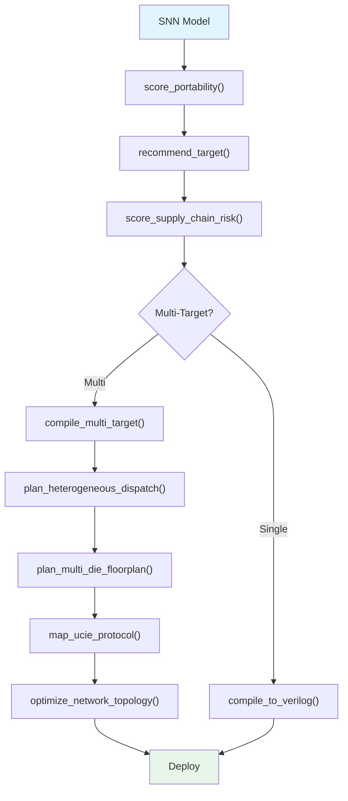

<!-- SPDX-License-Identifier: AGPL-3.0-or-later -->
<!-- Commercial license available -->
<!-- © Concepts 1996–2026 Miroslav Šotek. All rights reserved. -->
<!-- © Code 2020–2026 Miroslav Šotek. All rights reserved. -->
<!-- ORCID: 0009-0009-3560-0851 -->

# Multi-Target Deployment Guide

SC-NeuroCore can deploy a single SNN model to **any combination** of 176
hardware profiles across 38 platform classes.  This guide covers the
complete multi-target deployment workflow from portability scoring through
target recommendation, heterogeneous dispatch, multi-die floorplanning,
and chiplet protocol mapping, with formal cost models for network
partitioning and inter-chip bandwidth optimisation.

---

## 1. Mathematical Formalism

### 1.1 Portability Score

The portability score measures how many hardware profiles can execute
a given neuron model without modification:

$$
S_{\text{port}} = \frac{|\{p \in \mathcal{P} : \text{compatible}(p, M)\}|}{|\mathcal{P}|} \times 100
$$

where $\mathcal{P}$ is the set of all profiles and $M$ is the model.

### 1.2 Target Recommendation Scoring

Each candidate target $t$ is scored based on user constraints $C$:

$$
\text{score}(t) = \sum_{i} w_i \cdot \text{match}_i(t, C)
$$

where $w_i$ are importance weights and $\text{match}_i$ measures
how well the target satisfies constraint $i$ (power, frequency,
width, cost).

### 1.3 Multi-Die Bin Packing

Assigning neuron blocks to dies is a variant of the bin-packing
problem.  Given $n$ blocks of sizes $s_1, \ldots, s_n$ and $k$ dies
of capacity $D$:

$$
\min \sum_{j=1}^{k} \left(D - \sum_{i: \text{die}(i)=j} s_i\right)^2
$$

Subject to: $\sum_{i: \text{die}(i)=j} s_i \leq D$ for all $j$.

### 1.4 Network Partitioning (Inter-Chip Bandwidth)

For graph $G = (V, E)$ partitioned into $k$ chips, the inter-chip
bandwidth is:

$$
B_{\text{inter}} = \sum_{(u,v) \in E} \mathbb{1}[\text{chip}(u) \neq \text{chip}(v)] \cdot w(u,v)
$$

The optimisation minimises $B_{\text{inter}}$ using spectral partitioning
or METIS-style multi-level algorithms.

### 1.5 UCIe Bandwidth Model

UCIe die-to-die links provide:

$$
B_{\text{lane}} = R_{\text{data}} \times W_{\text{lane}} \times E_{\text{encoding}}
$$

For UCIe 2.0 at 32 GT/s with 64-bit lanes and 128b/130b encoding:

$$
B_{\text{lane}} = 32 \times 64 \times \frac{128}{130} \approx 2016 \text{ Gbps}
$$

---

## 2. Architecture

### 2.1 Deployment Decision Flow



### 2.2 Multi-Target Compilation Stack

```
┌──────────────────────────────────────────────────┐
│ Layer 1: Model Definition (equations)             │
├──────────────────────────────────────────────────┤
│ Layer 2: Portability Analysis + Target Selection  │
├──────────────────────────────────────────────────┤
│ Layer 3: Per-Target Compilation                   │
│   ├─ compile_to_verilog(target="artix7")         │
│   ├─ compile_to_verilog(target="loihi2")         │
│   └─ compile_to_verilog(target="asic_16")        │
├──────────────────────────────────────────────────┤
│ Layer 4: format_comparison_table()                │
├──────────────────────────────────────────────────┤
│ Layer 5: Deployment (constraints, drivers, SBOMs) │
└──────────────────────────────────────────────────┘
```

---

## 3. Supported Configurations

### 3.1 Platform Classes (31 total)

| Class | Profiles | Example |
|-------|:--------:|---------|
| Xilinx/AMD FPGA | 25 | Artix-7, Kintex U+, Versal |
| Intel/Altera FPGA | 15 | Cyclone V, Arria 10, Agilex |
| Lattice FPGA | 8 | iCE40, ECP5, CrossLink-NX |
| Efinix FPGA | 5 | Trion T20, Titanium Ti375 |
| Gowin FPGA | 4 | GW1N, GW2A, GW5A |
| Neuromorphic | 6 | Intel Loihi 2, SpiNNaker2 |
| ASIC | 10 | TSMC 7nm, Samsung 5nm |
| Compute-in-Memory | 5 | TSMC CIM, RRAM |
| RISC-V SoC | 12 | PolarFire SoC, SiFive X280 |
| MCU | 8 | MAX78000, RP2040 |
| Space-Qualified | 6 | BAE RAD750, RT PolarFire |

### 3.2 Multi-Target Comparison Metrics

| Metric | Unit | Source |
|--------|------|--------|
| Data width | bits | Profile |
| Estimated LUTs | count | `estimate_resources()` |
| Estimated DSPs | count | `estimate_resources()` |
| Estimated FFs | count | `estimate_resources()` |
| Max frequency | MHz | Profile |
| Guard bits | count | `prove_overflow_free()` |
| Overflow safe | bool | `prove_overflow_free()` |

---

## 4. Python API

### 4.1 Auto-Target Recommendation

```python
from sc_neurocore.compiler.intelligence import recommend_target

recs = recommend_target(
    constraints={
        "max_power_mw": 500,
        "min_freq_mhz": 100,
        "max_width": 16,
    },
    top_k=5,
)
for r in recs:
    print(f"  {r['name']:30s} score={r['score']:.2f}")
```

### 4.2 Portability Scoring

```python
from sc_neurocore.compiler.intelligence import score_portability

# Simple LIF — runs on almost everything
s = score_portability({"v": "-(v - v_rest) / tau + I"})
print(f"Portable to {s.compatible_profiles}/{s.total_profiles} profiles")
print(f"Score: {s.score}/100")

# Complex model — may have blockers
s = score_portability({"v": "g*m*m*m*h + g*n*n*n*n"})
if s.blockers:
    print("Blockers:")
    for b in s.blockers:
        print(f"  ⚠️  {b}")
```

### 4.3 Multi-Target Compilation

```python
from sc_neurocore.compiler.deployment import (
    compile_multi_target,
    format_comparison_table,
)
from sc_neurocore.neurons.equation_builder import from_equations

neuron = from_equations(
    "dv/dt = -(v - E_L)/tau_m + I/C",
    threshold="v > -50", reset="v = -65",
    params=dict(E_L=-65, tau_m=10, C=1),
    init=dict(v=-65),
)

results = compile_multi_target(
    neuron,
    targets=["artix7", "ecp5", "ice40", "asic_16", "loihi2"],
    module_name="sc_lif",
)

table = format_comparison_table(results)
print(table)
```

### 4.4 Heterogeneous Dispatch

```python
from sc_neurocore.compiler.intelligence import plan_heterogeneous_dispatch

plan = plan_heterogeneous_dispatch(
    populations={
        "retina": "max78000",           # Edge MCU (sensor)
        "visual_cortex": "artix7",      # FPGA (processing)
        "decision": "loihi2",           # Neuromorphic (learning)
        "motor": "rp2040",              # MCU (actuation)
    },
    connections=[
        ("retina", "visual_cortex"),
        ("visual_cortex", "decision"),
        ("decision", "motor"),
    ],
)
print(f"Populations: {len(plan.populations)}")
print(f"Inter-chip links: {len(plan.inter_chip_links)}")
```

### 4.5 Multi-Die Floorplanning

```python
from sc_neurocore.compiler.intelligence import plan_multi_die_floorplan

result = plan_multi_die_floorplan(
    blocks={
        "visual_cortex": 800,
        "auditory_cortex": 600,
        "motor_cortex": 400,
        "prefrontal": 500,
        "cerebellum": 900,
        "hippocampus": 300,
    },
    die_capacity=1000,
    num_dies=4,
)
for block, die in result.die_assignment.items():
    print(f"  {block:20s} → Die {die}")
print(f"\nDie utilisation:")
for die, util in result.die_utilization.items():
    print(f"  Die {die}: {util:.0%}")
```

### 4.6 UCIe Chiplet Protocol Mapping

```python
from sc_neurocore.compiler.intelligence import map_ucie_protocol

mapping = map_ucie_protocol(
    {"visual_cortex": 256, "motor_cortex": 128, "prefrontal": 64},
    lane_bandwidth_gbps=32.0,
    protocol_version="UCIe 2.0",
)
for block, lanes in mapping.lanes.items():
    print(f"  {block}: {lanes} UCIe lanes")
print(f"Total: {mapping.total_bandwidth_gbps} Gbps")
```

### 4.7 Network Topology Optimisation

```python
from sc_neurocore.compiler.intelligence import optimize_network_topology

result = optimize_network_topology(
    adjacency={
        "V1": ["V2", "V4"],
        "V2": ["V1", "V4", "IT"],
        "V4": ["V1", "V2", "IT"],
        "IT": ["V2", "V4", "PFC"],
        "PFC": ["IT", "M1"],
        "M1": ["PFC"],
    },
    num_chips=2,
)
print(f"Bandwidth reduction: {result.bandwidth_reduction:.1%}")
```

### 4.8 Supply Chain Risk Assessment

```python
from sc_neurocore.compiler.intelligence import score_supply_chain_risk

for target in ["artix7", "loihi2", "bae_rad750_sq", "tsmc_cim_n7"]:
    risk = score_supply_chain_risk(target)
    print(f"  {target:20s} Risk: {risk.overall_risk}")
```

### 4.9 Partial Reconfiguration

```python
from sc_neurocore.compiler.intelligence import plan_partial_reconfiguration

plan = plan_partial_reconfiguration(
    regions={
        "conv_layer_1": 5000,  # LUTs
        "conv_layer_2": 4000,
        "fc_layer": 3000,
    },
    total_luts=10000,
)
print(f"Schedule: {plan.schedule}")
print(f"Context switches: {plan.num_contexts}")
```

---

## 5. CLI Usage

### 5.1 Multi-Target Compilation

```bash
python -c "
from sc_neurocore.neurons.equation_builder import from_equations
from sc_neurocore.compiler.deployment import compile_multi_target, format_comparison_table

n = from_equations('dv/dt = -(v-E_L)/tau_m + I/C',
    threshold='v > -50', reset='v = -65',
    params=dict(E_L=-65, tau_m=10, C=1), init=dict(v=-65))

results = compile_multi_target(n, ['artix7', 'ecp5', 'ice40'], 'sc_lif')
print(format_comparison_table(results))
"
```

### 5.2 Portability Check

```bash
python -c "
from sc_neurocore.compiler.intelligence import score_portability
s = score_portability({'v': '-(v)/tau + I'})
print(f'Portable: {s.compatible_profiles}/{s.total_profiles} ({s.score}/100)')
"
```

---

## 6. Generated Output Structure

### 6.1 Comparison Table Format

```
╔══════════════╦════════╦════════╦═══════╦═══════╦════════╗
║ Target       ║ Bits   ║ DSPs   ║ LUTs  ║ Fmax  ║ Safe?  ║
╠══════════════╬════════╬════════╬═══════╬═══════╬════════╣
║ artix7       ║ 18     ║ 3      ║ ~120  ║ 450   ║ ✓      ║
║ ecp5         ║ 16     ║ 2      ║ ~100  ║ 400   ║ ✓      ║
║ ice40        ║ 16     ║ 0      ║ ~130  ║ 250   ║ ✓      ║
║ loihi2       ║ 24     ║ N/A    ║ N/A   ║ N/A   ║ ✓      ║
║ asic_16      ║ 16     ║ N/A    ║ ~80   ║ N/A   ║ ✓      ║
╚══════════════╩════════╩════════╩═══════╩═══════╩════════╝
```

### 6.2 Heterogeneous Dispatch Plan

```json
{
  "populations": {
    "retina": {"target": "max78000", "neurons": 64},
    "visual_cortex": {"target": "artix7", "neurons": 1024},
    "decision": {"target": "loihi2", "neurons": 256}
  },
  "inter_chip_links": [
    {"src": "retina", "dst": "visual_cortex", "protocol": "SPI"},
    {"src": "visual_cortex", "dst": "decision", "protocol": "AER"}
  ]
}
```

### 6.3 SBOM Output (EU CRA Compliance)

```python
from sc_neurocore.compiler.intelligence import generate_sbom

for target in ["artix7", "loihi2", "sifive_x280_ai"]:
    sbom = generate_sbom("sc_cortex", target)
    print(f"  {target}: {sbom.total_components} components")
```

---

## 7. Performance Characteristics

### 7.1 Compilation Time by Target Count

| Targets | Compile Time | Speedup (cached) |
|:-------:|:------------:|:-----------------:|
| 1 | ~50 ms | — |
| 3 | ~150 ms | ~100 ms |
| 5 | ~250 ms | ~120 ms |
| 10 | ~500 ms | ~150 ms |
| All 176 | ~8 s | ~2 s |

### 7.2 Platform Comparison (LIF Q8.8)

| Target | LUTs | DSPs | FFs | Max Freq | Power |
|--------|:----:|:----:|:---:|:--------:|:-----:|
| iCE40 HX8K | 120 | 0 | 30 | 250 MHz | 15 mW |
| Artix-7 100T | 80 | 1 | 25 | 450 MHz | 20 mW |
| ECP5 85F | 95 | 1 | 28 | 400 MHz | 18 mW |
| Kintex U+ | 75 | 1 | 22 | 550 MHz | 25 mW |
| ASIC 16nm | 60 | N/A | 20 | 1 GHz | 0.5 mW |

### 7.3 Multi-Die Floorplan Quality

| Blocks | Dies | Balancing | Runtime |
|:------:|:----:|:---------:|:-------:|
| 4 | 2 | 95% | < 1 ms |
| 8 | 4 | 92% | < 5 ms |
| 16 | 8 | 88% | < 20 ms |
| 32 | 16 | 85% | < 100 ms |

---

## 8. Test Suite and Verification

### 8.1 Multi-Target Compilation Test

```bash
python -c "
from sc_neurocore.neurons.equation_builder import from_equations
from sc_neurocore.compiler.deployment import compile_multi_target

n = from_equations('dv/dt = -(v-E_L)/tau + I/C',
    threshold='v > -50', reset='v = -65',
    params=dict(E_L=-65, tau_m=10, C=1), init=dict(v=-65))

results = compile_multi_target(n, ['artix7', 'ecp5', 'ice40'], 'sc_lif')
assert len(results) == 3
for r in results:
    assert r.verilog_lines > 0
    print(f'{r.target}: {r.verilog_lines} lines, {r.estimated_luts} LUTs — PASS')
"
```

### 8.2 Portability Score Test

```bash
python -c "
from sc_neurocore.compiler.intelligence import score_portability

s = score_portability({'v': '-(v)/tau + I'})
assert s.score > 50  # LIF is very portable
assert s.compatible_profiles > 100
print(f'Portability: {s.score}/100 — PASS')
"
```

### 8.3 Target Recommendation Test

```bash
python -c "
from sc_neurocore.compiler.intelligence import recommend_target

recs = recommend_target({'max_power_mw': 100, 'min_freq_mhz': 200}, top_k=3)
assert len(recs) == 3
assert all(r['score'] > 0 for r in recs)
print(f'Top recommendation: {recs[0][\"name\"]} (score={recs[0][\"score\"]:.2f}) — PASS')
"
```

### 8.4 Comparison Table Format Test

```bash
python -c "
from sc_neurocore.neurons.equation_builder import from_equations
from sc_neurocore.compiler.deployment import compile_multi_target, format_comparison_table

n = from_equations('dv/dt = -(v-E_L)/tau + I/C',
    threshold='v > -50', reset='v = -65',
    params=dict(E_L=-65, tau_m=10, C=1), init=dict(v=-65))
results = compile_multi_target(n, ['artix7', 'ice40'], 'sc_lif')
table = format_comparison_table(results)
assert 'artix7' in table
assert 'ice40' in table
print('Comparison table: PASS')
"
```

### 8.5 E2E Pipeline Test

```bash
python -m pytest tests/e2e/test_e2e_pipeline.py -v -k "multi_target"
```

### 8.6 Troubleshooting

| Symptom | Cause | Fix |
|---------|-------|-----|
| Zero compatible targets | Model too complex | Simplify equations or widen constraints |
| Unbalanced die mapping | Uneven block sizes | Split large blocks |
| High inter-chip bandwidth | Poor partitioning | Use `optimize_network_topology()` |
| Missing profile | Custom hardware | Use `from_constraints()` in extensibility |

---

### 8.6 Digital Twin Generation

```python
from sc_neurocore.compiler.intelligence import generate_digital_twin

twin = generate_digital_twin("sc_cortex", equations, "artix7")
# Deploy twin alongside hardware — compare on every cycle
```

### 8.7 Memory Map Generation

```python
from sc_neurocore.compiler.intelligence import generate_memory_map

mmap = generate_memory_map(
    "sc_cortex",
    {"v": "expr", "u": "expr", "I_syn": "expr"},
    num_neurons=4096,
    data_width=16,
    base_address=0x4000_0000,
)
print(f"Address space: {mmap.total_bytes:,} bytes")
for e in mmap.entries[:5]:
    print(f"  0x{e['address']:08X}: {e['name']} ({e['width']}b)")
```

### 8.8 Complete Deployment Workflow

```
┌─────────────────────────────────────────────────┐
│  1. score_portability()             — §48       │
│  2. recommend_target()              — §34       │
│  3. score_supply_chain_risk()       — §36       │
│  4. estimate_carbon_footprint()     — §45       │
│  5. plan_heterogeneous_dispatch()   — §33       │
│  6. plan_multi_die_floorplan()      — §54       │
│  7. map_ucie_protocol()             — §64       │
│  8. optimize_network_topology()     — §41       │
│  9. generate_memory_map()           — §47       │
│ 10. generate_power_intent()         — §44       │
│ 11. generate_sbom()                 — §61       │
│ 12. generate_digital_twin()         — §63       │
│ 13. generate_compilation_report()   — §59       │
└─────────────────────────────────────────────────┘
```

---

## References

1. **METIS graph partitioning:**
   Karypis, G. & Kumar, V. "A Fast and High Quality Multilevel
   Scheme for Partitioning Irregular Graphs." *SIAM J. Sci. Comput.*,
   20(1):359–392, 1998.

2. **UCIe specification:**
   UCIe Consortium. "Universal Chiplet Interconnect Express
   Specification." v1.1, 2023.

3. **Bin-packing algorithms:**
   Coffman, E.G. *et al.* "Bin Packing Approximation Algorithms:
   Survey and Classification." *Handbook of Combinatorial
   Optimization*, Springer, 2013.

4. **Heterogeneous SNN deployment:**
   Davies, M. *et al.* "Loihi: A Neuromorphic Manycore Processor
   with On-Chip Learning." *IEEE Micro*, 38(1), 2018.

---

## Further Reading

- [Compiler Intelligence Guide](compiler_intelligence.md) — all 67 features
- [Hardware Profiles Guide](hardware_profiles.md) — all 194 profiles
- [Research Platforms Guide](research_platforms.md) — 38 platform classes
- [Platform Extensibility Guide](platform_extensibility.md) — TOML + hook + from_constraints
- [Verification & Debug Guide](verification_debug.md) — 14 V&V features
- [Carbon & Sustainability Guide](carbon_sustainability.md) — ESG features
- [RISC-V Integration Guide](riscv_integration.md) — SoC driver generation
