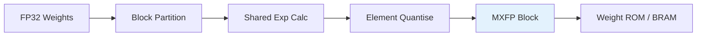

<!-- SPDX-License-Identifier: AGPL-3.0-or-later -->
<!-- Commercial license available -->
<!-- © Concepts 1996–2026 Miroslav Šotek. All rights reserved. -->
<!-- © Code 2020–2026 Miroslav Šotek. All rights reserved. -->
<!-- ORCID: 0009-0009-3560-0851 -->

# Block-FP / MXFP Encoding

Encode and decode neural network weights using OCP Microscaling (MX)
floating-point formats.  This guide covers the MXFP4, MXFP6, MXFP8
(E4M3/E5M2), and standalone FP8 formats as specified in the OCP
Microscaling Formats Specification v1.0, with integration guidance for
NVIDIA H100/B100 and AMD MI300 workflows.

---

## 1. Mathematical Formalism

### 1.1 Microscaling Format Structure

Each MXFP block consists of a shared exponent and $B$ element mantissas:

$$
\text{Block} = \underbrace{E_{\text{shared}}}_{\text{8 bits}} \;|\;
\underbrace{m_0 \;|\; m_1 \;|\; \cdots \;|\; m_{B-1}}_{\text{B elements × k bits}}
$$

The total bits per block:

$$
W_{\text{block}} = E_{\text{shared}} + B \times k
$$

where $k \in \{4, 6, 8\}$ is the element width and $B = 32$ (default block size).

### 1.2 Shared Exponent Computation

The shared exponent is derived from the maximum absolute value in the block:

$$
E_{\text{shared}} = \left\lfloor \log_2 \max_i |v_i| \right\rfloor + E_{\text{bias}}
$$

where $E_{\text{bias}} = 2^{w-1} - 1$ for $w$-bit shared exponent (typically 127 for 8 bits).

### 1.3 Element Encoding

Each element $v_i$ is encoded as:

$$
m_i = \text{sign}(v_i) \;|\; \text{round}\left(\frac{|v_i|}{2^{E_{\text{shared}} - E_{\text{bias}}}} \cdot M_{\max}\right)
$$

where $M_{\max} = 2^{k_m} - 1$ is the maximum mantissa value and
$k_m$ is the mantissa bit width.

### 1.4 Decoding

$$
v_i = (-1)^{s_i} \cdot \frac{m_i}{M_{\max}} \cdot 2^{E_{\text{shared}} - E_{\text{bias}}}
$$

### 1.5 Compression Ratio

Compared to FP32 (32 bits per element):

$$
\text{CR} = \frac{32 \cdot B}{E_{\text{shared}} + B \cdot k}
$$

| Format | $k$ | $E_{\text{shared}}$ | $B$ | Block Bits | CR |
|--------|:---:|:-------------------:|:---:|:----------:|:--:|
| MXFP4 | 4 | 8 | 32 | 136 | 7.5× |
| MXFP6 | 6 | 8 | 32 | 200 | 5.1× |
| MXFP8 | 8 | 8 | 32 | 264 | 3.9× |
| FP8 | 8 | 0 | 1 | 8 | 4.0× |

---

## 2. Architecture

### 2.1 MXFP Processing Pipeline



### 2.2 Block Memory Layout

```
┌─────────────────────────────────────────────────┐
│  MXFP Block (136 bits for MXFP4)                │
│                                                   │
│  ┌──────────┬───┬───┬───┬─────┬───┐              │
│  │ SharedExp│ e0│ e1│ e2│ ... │e31│              │
│  │  8 bits  │4b │4b │4b │     │4b │              │
│  └──────────┴───┴───┴───┴─────┴───┘              │
│  [135:128]  [127:124] [123:120] ... [3:0]        │
└─────────────────────────────────────────────────┘
```

### 2.3 Integration with Hardware Accelerators

```
┌─────────────────────────────────────────────┐
│  Training (FP32/FP16/BF16)                  │
│  PyTorch / JAX / TensorFlow                 │
└────────┬────────────────────────────────────┘
         │ Export weights
         ▼
┌─────────────────────────────────────────────┐
│  SC-NeuroCore MXFP Encoder                  │
│  mxfp_encode_block() → compact blocks       │
└────────┬────────────────────────────────────┘
         │ Quantised weights
         ▼
┌─────────────────────────────────────────────┐
│  FPGA Weight ROM / NVIDIA TensorCore        │
│  Inference at reduced precision             │
└─────────────────────────────────────────────┘
```

---

## 3. Supported Formats

### 3.1 MXFP Format Catalogue

| Format | Element Bits | Exp Bits | Mantissa Bits | Block Size | Shared Exp |
|--------|:----------:|:--------:|:-------------:|:----------:|:----------:|
| MXFP4 | 4 | 2 | 1 | 32 | 8 |
| MXFP6 | 6 | 3 | 2 | 32 | 8 |
| MXFP8 E4M3 | 8 | 4 | 3 | 32 | 8 |
| MXFP8 E5M2 | 8 | 5 | 2 | 32 | 8 |
| FP8 E4M3 | 8 | 4 | 3 | 1 | 0 |
| FP8 E5M2 | 8 | 5 | 2 | 1 | 0 |

### 3.2 Accuracy vs Density Trade-Offs

| Format | Max Error (%) | Dynamic Range | Density (elem/byte) |
|--------|:------------:|:-------------:|:-------------------:|
| MXFP4 | ~25% | Low | 2.0 |
| MXFP6 | ~12% | Medium | 1.33 |
| MXFP8 E4M3 | ~3% | High | 1.0 |
| MXFP8 E5M2 | ~6% | Very high | 1.0 |
| FP8 E4M3 | ~3% | High | 1.0 |
| FP8 E5M2 | ~6% | Very high | 1.0 |

### 3.3 Hardware Accelerator Compatibility

| Accelerator | MXFP4 | MXFP6 | MXFP8 E4M3 | MXFP8 E5M2 | FP8 |
|-------------|:-----:|:-----:|:----------:|:----------:|:---:|
| NVIDIA H100 | ✓ | — | ✓ | ✓ | ✓ |
| NVIDIA B100 | ✓ | ✓ | ✓ | ✓ | ✓ |
| AMD MI300X | ✓ | — | ✓ | ✓ | ✓ |
| Intel Gaudi 3 | — | — | ✓ | ✓ | ✓ |
| FPGA (SC-NeuroCore) | ✓ | ✓ | ✓ | ✓ | ✓ |

---

## 4. Python API

### 4.1 Encode a Block

```python
from sc_neurocore.compiler.intelligence.core import (
    mxfp_encode_block,
    MXFP4, MXFP6, MXFP8_E4M3, MXFP8_E5M2,
)

# 32 float values (one block)
values = [0.5, -0.3, 1.2, 0.0, -0.8, 0.1] + [0.0] * 26

shared_exp, elements = mxfp_encode_block(values, MXFP4)
print(f"Shared exponent: {shared_exp}")
print(f"Elements: {elements[:6]}...")  # First 6
```

### 4.2 Decode a Block

```python
from sc_neurocore.compiler.intelligence.core import mxfp_decode_block

decoded = mxfp_decode_block(shared_exp, elements, MXFP4)
print(f"Original:  {values[:6]}")
print(f"Decoded:   {decoded[:6]}")
```

### 4.3 Round-Trip Accuracy Test

```python
import random
from sc_neurocore.compiler.intelligence.core import (
    mxfp_encode_block, mxfp_decode_block,
    MXFP4, MXFP6, MXFP8_E4M3,
)

random.seed(42)
values = [random.gauss(0, 1) for _ in range(32)]

for config in [MXFP4, MXFP6, MXFP8_E4M3]:
    exp, elems = mxfp_encode_block(values, config)
    decoded = mxfp_decode_block(exp, elems, config)
    max_err = max(abs(a - b) for a, b in zip(values, decoded))
    print(f"{config.label}: max error = {max_err:.4f}")
```

### 4.4 Encode Weight Matrix

```python
from sc_neurocore.compiler.intelligence.core import (
    mxfp_encode_block, MXFP8_E4M3,
)

# Flatten and partition into blocks of 32
weights = [[random.gauss(0, 0.5) for _ in range(64)] for _ in range(64)]
flat = [w for row in weights for w in row]

blocks = []
for i in range(0, len(flat), 32):
    block = flat[i:i+32]
    if len(block) < 32:
        block += [0.0] * (32 - len(block))
    exp, elems = mxfp_encode_block(block, MXFP8_E4M3)
    blocks.append((exp, elems))

total_bits = len(blocks) * MXFP8_E4M3.bits_per_block
fp32_bits = len(flat) * 32
print(f"FP32: {fp32_bits} bits, MXFP8: {total_bits} bits")
print(f"Compression: {fp32_bits / total_bits:.1f}×")
```

### 4.5 FP8 Standalone Encoding

```python
from sc_neurocore.compiler.intelligence.core import (
    mxfp_encode_block, mxfp_decode_block,
    FP8_E4M3, FP8_E5M2,
)

# FP8 uses block_size=1, no shared exponent
value = [0.75]
exp, elems = mxfp_encode_block(value, FP8_E4M3)
decoded = mxfp_decode_block(exp, elems, FP8_E4M3)
print(f"FP8 E4M3: {value[0]} → {decoded[0]}")

exp, elems = mxfp_encode_block(value, FP8_E5M2)
decoded = mxfp_decode_block(exp, elems, FP8_E5M2)
print(f"FP8 E5M2: {value[0]} → {decoded[0]}")
```

---

## 5. CLI Usage

### 5.1 Encode Weight File

```bash
python -c "
import numpy as np
from sc_neurocore.compiler.intelligence.core import (
    mxfp_encode_block, MXFP8_E4M3,
)

# Load weights from numpy file
# w = np.load('weights.npy').flatten()
w = np.random.randn(1024).tolist()

blocks = []
for i in range(0, len(w), 32):
    block = w[i:i+32]
    if len(block) < 32:
        block += [0.0] * (32 - len(block))
    blocks.append(mxfp_encode_block(block, MXFP8_E4M3))

print(f'Encoded {len(w)} weights into {len(blocks)} MXFP8 blocks')
print(f'Compression: {len(w)*32 / (len(blocks)*MXFP8_E4M3.bits_per_block):.1f}×')
"
```

### 5.2 Compare Formats

```bash
python -c "
import random
from sc_neurocore.compiler.intelligence.core import (
    mxfp_encode_block, mxfp_decode_block,
    MXFP4, MXFP6, MXFP8_E4M3, MXFP8_E5M2,
)

random.seed(42)
values = [random.gauss(0, 1) for _ in range(32)]

print(f'{'Format':>12} | {'Max Error':>10} | {'Bits/Block':>10} | {'Compression':>11}')
print('-' * 52)
for cfg in [MXFP4, MXFP6, MXFP8_E4M3, MXFP8_E5M2]:
    exp, elems = mxfp_encode_block(values, cfg)
    decoded = mxfp_decode_block(exp, elems, cfg)
    err = max(abs(a-b) for a, b in zip(values, decoded))
    cr = 32 * 32 / cfg.bits_per_block
    print(f'{cfg.label:>12} | {err:10.4f} | {cfg.bits_per_block:10d} | {cr:10.1f}×')
"
```

---

## 6. Format Internals

### 6.1 MXFP4 Bit Layout (per element)

```
┌───┬───┬───┬───┐
│ S │ E1│ E0│ M │
│ 1b│ 1b│ 1b│1b │
└───┴───┴───┴───┘
```

- S: sign bit
- E[1:0]: 2-bit element exponent
- M: 1-bit mantissa

### 6.2 MXFP6 Bit Layout (per element)

```
┌───┬───┬───┬───┬───┬───┐
│ S │ E2│ E1│ E0│ M1│ M0│
│ 1b│ 1b│ 1b│ 1b│ 1b│ 1b│
└───┴───┴───┴───┴───┴───┘
```

### 6.3 MXFP8 E4M3 Bit Layout (per element)

```
┌───┬───┬───┬───┬───┬───┬───┬───┐
│ S │ E3│ E2│ E1│ E0│ M2│ M1│ M0│
│ 1b│ 1b│ 1b│ 1b│ 1b│ 1b│ 1b│ 1b│
└───┴───┴───┴───┴───┴───┴───┴───┘
```

### 6.4 MXFP8 E5M2 Bit Layout (per element)

```
┌───┬───┬───┬───┬───┬───┬───┬───┐
│ S │ E4│ E3│ E2│ E1│ E0│ M1│ M0│
│ 1b│ 1b│ 1b│ 1b│ 1b│ 1b│ 1b│ 1b│
└───┴───┴───┴───┴───┴───┴───┴───┘
```

### 6.5 Shared Exponent Block Header

```
┌───┬───┬───┬───┬───┬───┬───┬───┐
│ E7│ E6│ E5│ E4│ E3│ E2│ E1│ E0│   8-bit biased exponent
└───┴───┴───┴───┴───┴───┴───┴───┘
```

Bias = 127 (IEEE 754 style).

---

## 7. Performance Characteristics

### 7.1 Encoding Speed

| Format | Block Size | Elements/call | Throughput (Python) |
|--------|:----------:|:-------------:|:-------------------:|
| MXFP4 | 32 | 32 | ~50K blocks/s |
| MXFP6 | 32 | 32 | ~50K blocks/s |
| MXFP8 | 32 | 32 | ~50K blocks/s |
| FP8 | 1 | 1 | ~500K elements/s |

### 7.2 Weight ROM Size Comparison

| Network | Weights | FP32 | MXFP8 | MXFP4 | Savings |
|---------|:-------:|:----:|:-----:|:-----:|:-------:|
| 100×100 | 10K | 40 KB | 10.3 KB | 5.3 KB | 74–87% |
| 1K×1K | 1M | 4 MB | 1.03 MB | 0.53 MB | 74–87% |
| 10K×10K | 100M | 400 MB | 103 MB | 53 MB | 74–87% |

### 7.3 Accuracy by Domain

| Domain | Best Format | Typical Error | Notes |
|--------|:-----------:|:------------:|-------|
| Spiking weights | MXFP8 E4M3 | < 3% | Best precision/density |
| Rate-coded weights | MXFP6 | < 12% | Acceptable for rate coding |
| Binary weights | MXFP4 | < 25% | Near-binary sparsity |
| Gradients | MXFP8 E5M2 | < 6% | Wider dynamic range |

---

## 8. Test Suite and Verification

### 8.1 Round-Trip Accuracy Test

```bash
python -c "
from sc_neurocore.compiler.intelligence.core import (
    mxfp_encode_block, mxfp_decode_block,
    MXFP4, MXFP6, MXFP8_E4M3, MXFP8_E5M2,
)

values = [0.5, -0.3, 1.2, 0.0] + [0.0] * 28

for cfg in [MXFP4, MXFP6, MXFP8_E4M3, MXFP8_E5M2]:
    exp, elems = mxfp_encode_block(values, cfg)
    decoded = mxfp_decode_block(exp, elems, cfg)
    # Sign preservation
    for i, (orig, dec) in enumerate(zip(values, decoded)):
        if orig != 0:
            assert (orig > 0) == (dec > 0), f'Sign flip at {i}'
    print(f'{cfg.label}: PASS')
"
```

### 8.2 Zero Stability Test

```bash
python -c "
from sc_neurocore.compiler.intelligence.core import (
    mxfp_encode_block, mxfp_decode_block,
    MXFP4, MXFP8_E4M3,
)

zeros = [0.0] * 32
for cfg in [MXFP4, MXFP8_E4M3]:
    exp, elems = mxfp_encode_block(zeros, cfg)
    decoded = mxfp_decode_block(exp, elems, cfg)
    assert all(d == 0.0 for d in decoded)
    print(f'{cfg.label} zero stability: PASS')
"
```

### 8.3 Block Size Validation Test

```bash
python -c "
from sc_neurocore.compiler.intelligence.core import mxfp_encode_block, MXFP4
try:
    mxfp_encode_block([1.0] * 16, MXFP4)  # Wrong size
    assert False, 'Should have raised ValueError'
except ValueError:
    print('Block size validation: PASS')
"
```

### 8.4 Monotonicity Test

```bash
python -c "
from sc_neurocore.compiler.intelligence.core import (
    mxfp_encode_block, mxfp_decode_block, MXFP8_E4M3,
)

# Monotonically increasing values
values = [i * 0.1 for i in range(32)]
exp, elems = mxfp_encode_block(values, MXFP8_E4M3)
decoded = mxfp_decode_block(exp, elems, MXFP8_E4M3)

# Check decoded is approximately monotonic (allowing quantisation)
violations = sum(1 for i in range(1, 32)
                 if decoded[i] < decoded[i-1] - 0.1)
assert violations == 0, f'{violations} monotonicity violations'
print('Monotonicity: PASS')
"
```

### 8.5 Negative Value Encoding Test

```bash
python -c "
from sc_neurocore.compiler.intelligence.core import (
    mxfp_encode_block, mxfp_decode_block, MXFP8_E4M3,
)

# All negative values
values = [-0.5, -1.0, -2.0, -0.1] + [-0.3] * 28
exp, elems = mxfp_encode_block(values, MXFP8_E4M3)
decoded = mxfp_decode_block(exp, elems, MXFP8_E4M3)

for orig, dec in zip(values, decoded):
    assert dec <= 0, f'Positive decode for negative input: {orig} → {dec}'
print('Negative encoding: PASS')
"
```

### 8.6 Large Value Saturation Test

```bash
python -c "
from sc_neurocore.compiler.intelligence.core import (
    mxfp_encode_block, mxfp_decode_block, MXFP4,
)

# Very large values — should saturate gracefully
values = [1000.0, -500.0, 0.001] + [0.0] * 29
exp, elems = mxfp_encode_block(values, MXFP4)
decoded = mxfp_decode_block(exp, elems, MXFP4)
# Should not produce NaN or inf
import math
assert all(not math.isnan(d) and not math.isinf(d) for d in decoded)
print('Saturation: PASS')
"
```

### 8.7 Weight ROM Integration Test

```bash
python -c "
from sc_neurocore.compiler.intelligence.core import (
    mxfp_encode_block, mxfp_decode_block,
    generate_weight_rom, MXFP8_E4M3,
)

# Encode weights, decode, then store in weight ROM
import random
random.seed(42)
original = [random.gauss(0, 0.5) for _ in range(32)]
exp, elems = mxfp_encode_block(original, MXFP8_E4M3)
decoded = mxfp_decode_block(exp, elems, MXFP8_E4M3)

# Convert decoded to Q8.8 integers for ROM
q_weights = [[int(d * 256) for d in decoded[:16]],
             [int(d * 256) for d in decoded[16:]]]
rom = generate_weight_rom(q_weights, 'mxfp_rom', data_width=16)
assert 'mxfp_rom' in rom
print(f'MXFP→ROM integration: PASS ({len(rom)} bytes)')
"
```

### 8.8 Statistical Error Analysis

```bash
python -c "
import random, math
from sc_neurocore.compiler.intelligence.core import (
    mxfp_encode_block, mxfp_decode_block,
    MXFP4, MXFP6, MXFP8_E4M3,
)

random.seed(42)
N = 100  # blocks
print(f'Statistical analysis over {N} blocks (3200 values):')
print(f'{'Format':>12} | {'Mean Err':>10} | {'Max Err':>10} | {'RMSE':>10}')
print('-' * 52)

for cfg in [MXFP4, MXFP6, MXFP8_E4M3]:
    errors = []
    for _ in range(N):
        values = [random.gauss(0, 1) for _ in range(32)]
        exp, elems = mxfp_encode_block(values, cfg)
        decoded = mxfp_decode_block(exp, elems, cfg)
        errors.extend(abs(a-b) for a, b in zip(values, decoded))
    mean_err = sum(errors) / len(errors)
    max_err = max(errors)
    rmse = math.sqrt(sum(e**2 for e in errors) / len(errors))
    print(f'{cfg.label:>12} | {mean_err:10.4f} | {max_err:10.4f} | {rmse:10.4f}')
"
```

### 8.9 E2E Pipeline Test

```bash
python -m pytest tests/e2e/test_e2e_pipeline.py -v -k "mxfp"
```

### 8.10 Troubleshooting

| Symptom | Cause | Fix |
|---------|-------|-----|
| ValueError: block size mismatch | Input not 32 elements | Pad with zeros |
| All decoded values zero | Shared exponent overflow | Check input range |
| Large quantisation error | MXFP4 too coarse | Use MXFP6 or MXFP8 |
| Sign flip | Encoding bug | Verify `element_bits` config |

### 8.11 Quantisation-Aware Training Note

When training networks for MXFP deployment, apply quantisation-aware
training (QAT) to minimise accuracy loss:

```python
# PyTorch QAT example (pseudo-code)
# After training in FP32:
for layer in model.layers:
    weights_fp32 = layer.weight.data.flatten().tolist()
    blocks = []
    for i in range(0, len(weights_fp32), 32):
        block = weights_fp32[i:i+32]
        if len(block) < 32:
            block += [0.0] * (32 - len(block))
        exp, elems = mxfp_encode_block(block, MXFP8_E4M3)
        decoded = mxfp_decode_block(exp, elems, MXFP8_E4M3)
        blocks.extend(decoded)
    # Use decoded weights as STE (Straight-Through Estimator)
    # for the next training iteration
```

---

## References

1. **OCP Microscaling Formats Specification v1.0:**
   Open Compute Project. "OCP Microscaling Formats (MX) Specification."
   Version 1.0, 2023.

2. **FP8 training:**
   Micikevicius, P. *et al.* "FP8 Formats for Deep Learning."
   arXiv:2209.05433, 2022.

3. **NVIDIA H100 Tensor Core:**
   NVIDIA Corporation. "NVIDIA H100 Tensor Core GPU Architecture."
   Whitepaper, 2022.

4. **AMD MI300X specifications:**
   Advanced Micro Devices. "AMD Instinct MI300X Accelerator."
   Datasheet, 2023.

5. **Quantisation-aware training:**
   Jacob, B. *et al.* "Quantization and Training of Neural Networks
   for Efficient Integer-Arithmetic-Only Inference." *CVPR 2018.*

---

## Further Reading

- [Precision Modes Guide](precision_modes.md) — Q-format fixed-point modes
- [Network Compilation Guide](network_compilation.md) — Weight ROM generation
- [Pipeline & Adaptive Precision Guide](pipeline_adaptive_precision.md) — LP/HP switching
- [Hardware Profiles Guide](hardware_profiles.md) — Target capabilities
- [Thermal Deployment Guide](thermal_deployment.md) — Power implications of precision
