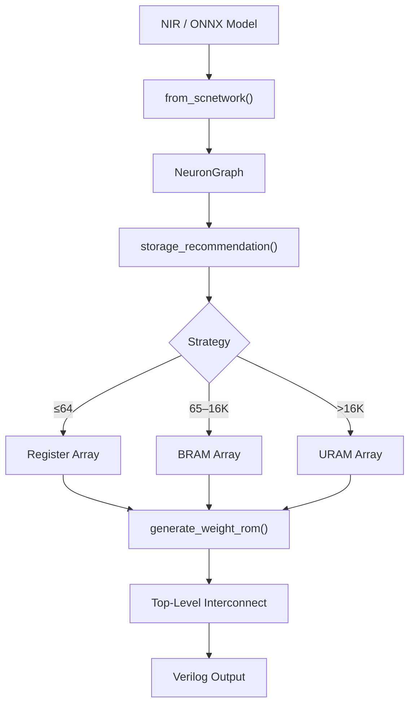

<!-- SPDX-License-Identifier: AGPL-3.0-or-later -->
<!-- Commercial license available -->
<!-- © Concepts 1996–2026 Miroslav Šotek. All rights reserved. -->
<!-- © Code 2020–2026 Miroslav Šotek. All rights reserved. -->
<!-- ORCID: 0009-0009-3560-0851 -->

# Network-Level Compilation

Compile multi-neuron spike networks to FPGA using BRAM auto-selection,
time-multiplexed neuron arrays, and weight ROM generation.  This guide
covers scaling from registers (≤64 neurons) through BRAM (65–16K) to
URAM (>16K on UltraScale+), with complete weight matrix encoding in
Verilog, Xilinx `.coe`, and Intel `.mif` formats.

---

## 1. Mathematical Formalism

### 1.1 Storage Strategy Decision

The optimal storage strategy minimises resource cost $C(N, W)$ for $N$
neurons with $W$ state bits each:

$$
\text{strategy}(N, W) = \begin{cases}
\text{registers} & \text{if } N \leq 64 \\
\text{BRAM} & \text{if } 64 < N \leq 16{,}384 \\
\text{URAM} & \text{if } N > 16{,}384 \text{ and URAM available}
\end{cases}
$$

### 1.2 BRAM Tile Estimation

For BRAM-based storage, the number of 18Kb or 36Kb tiles required:

$$
T_{18\text{K}} = \begin{cases}
1 & \text{if } N \cdot W \leq 18{,}432 \\
0 & \text{otherwise}
\end{cases}
\qquad
T_{36\text{K}} = \left\lceil \frac{N \cdot W}{36{,}864} \right\rceil
$$

### 1.3 URAM Tile Estimation

UltraRAM tiles are 288Kb (72 bits × 4096 depth):

$$
T_{\text{URAM}} = \left\lceil \frac{N \cdot W}{294{,}912} \right\rceil
$$

### 1.4 Time-Multiplexed Processing

A single compute pipeline processes $N$ neurons sequentially, completing
one network tick in $N$ clock cycles:

$$
T_{\text{tick}} = N \cdot T_{\text{clk}} = \frac{N}{f_{\text{clk}}}
$$

At 200 MHz with 1024 neurons: $T_{\text{tick}} = 5.12\ \mu\text{s}$.

Maximum simulation speed:

$$
f_{\text{sim}} = \frac{f_{\text{clk}}}{N} = \frac{200 \times 10^6}{1024} = 195{,}312\ \text{ticks/s}
$$

### 1.5 Weight ROM Addressing

For a fully connected layer with $N_{\text{src}}$ source and
$N_{\text{dst}}$ destination neurons:

$$
\text{addr} = i_{\text{src}} \cdot N_{\text{dst}} + i_{\text{dst}}
$$

Total ROM size: $N_{\text{src}} \times N_{\text{dst}} \times W_{\text{weight}}$ bits.

---

## 2. Architecture

### 2.1 Network Compilation Pipeline



### 2.2 Time-Multiplexed Neuron Array

```
┌────────────────────────────────────────────────────┐
│  sc_neuron_array                                    │
│                                                     │
│  ┌──────────┐    ┌────────────┐    ┌───────────┐  │
│  │ BRAM     │───►│ Compute    │───►│ Write-Back│  │
│  │ State    │    │ Pipeline   │    │ + Spike   │  │
│  │ [0:N-1]  │◄───│ (1 neuron/ │◄───│ Detection │  │
│  └──────────┘    │  cycle)    │    └───────────┘  │
│                  └─────┬──────┘                    │
│                        │                            │
│  ┌──────────┐         │          ┌───────────┐    │
│  │ Weight   │─────────┘          │ Spike Out │    │
│  │ ROM      │                    │ + Neuron ID│    │
│  └──────────┘                    └───────────┘    │
└────────────────────────────────────────────────────┘
```

---

## 3. Supported Configurations

### 3.1 Storage Strategy Comparison

| Strategy | Neurons | LUTs | BRAM | URAM | Latency |
|----------|:-------:|:----:|:----:|:----:|:-------:|
| Registers | 1–64 | N×W | 0 | 0 | 1 cycle |
| BRAM | 65–16K | ~200 | 1–18 | 0 | N cycles |
| URAM | 16K+ | ~200 | 0 | 1–8 | N cycles |

### 3.2 Weight ROM Format Support

| Format | Extension | Vendor | Use Case |
|--------|-----------|--------|----------|
| Verilog `$readmemh` | `.v` | Generic | Simulation + synthesis |
| Xilinx COE | `.coe` | Xilinx/AMD | Vivado Block Memory Gen |
| Intel MIF | `.mif` | Intel/Altera | Quartus IP Catalog |

### 3.3 Interconnect Selection

By default the interconnect is auto-selected by neuron count:

| Neuron Count | Interconnect | Topology |
|:------------:|:------------:|----------|
| ≤64 | Direct wiring | Point-to-point |
| >64 | AER bus | Address-event arbitrated |

A third, opt-in **folded** (time-multiplexed) interconnect is available for multi-layer
networks. It shares one combinational processing element per neuron type (a per-type PE
pool) across every neuron of that type, holds per-neuron state in a per-population BRAM,
and a single sequencer walks each population in turn — advancing the whole network in
`neurons + 1` cycles per timestep and collapsing the direct path's one module instance
per neuron to a handful of shared datapaths. A single global `spike_bus` is committed at
the end of each tick, so recurrent and inter-population spiking fan-in read it as a
stable prior-tick double-buffer. It is bit-exact with the direct path (the same
fixed-point arithmetic, time-multiplexed) and is never auto-selected; request it
explicitly:

```bash
sc-neurocore compile-nir model.nir --interconnect folded -o build/
```

```python
result = compile_network_to_fpga(graph, interconnect="folded")
result.folded_metrics  # FoldedResourceMetrics: populations, pe_instances, shared_multipliers,
                       # state_ram_bits, cycles_per_tick, direct_neuron_instances
```

The folded subset covers any number of populations of supported neuron types whose
connections are connection-less, external-weighted, recurrent spiking, or inter-population
spiking, including per-source **synaptic delays** (a delay of `d` ticks reads a depth-`d`
`spike_bus` history shift-register). Connections carrying a non-zero bias, source/destination
thresholds, or an analogue source population (whose fan-in is the membrane voltage rather than
spikes) are not folded yet; such graphs raise and should use `direct`/auto.
`compile_network_to_fpga` attaches a [`FoldedResourceMetrics`](../API_REFERENCE.md) summary
on the result only for the folded path; the CLI prints it and writes a machine-readable
`folded_metrics.json` artefact (the versioned `scnir_source_manifest.json` is left to its
SC-NIR source-handoff role).

---

## 4. Python API

### 4.1 Storage Recommendation

```python
from sc_neurocore.compiler.intelligence import storage_recommendation

rec = storage_recommendation(
    neuron_count=1024,
    state_bits_per_neuron=16,
    has_uram=False,
)
print(rec)
# StorageRecommendation(
#     strategy='bram',
#     neuron_count=1024,
#     total_bits=16384,
#     bram_18k_used=1,
#     bram_36k_used=0,
#     reason='1024 neurons × 16b = 16Kb — using BRAM.'
# )
```

### 4.2 Generate BRAM Neuron Array

```python
from sc_neurocore.compiler.intelligence import generate_bram_array

verilog = generate_bram_array(
    module_name="sc_neuron_array",
    neuron_count=1024,
    data_width=16,
    state_vars=1,      # 1 for LIF, 2 for Izhikevich
)

with open("sc_neuron_array.v", "w") as f:
    f.write(verilog)
```

The generated array implements a concrete current-based LIF update in the
time-multiplexed datapath:

```verilog
assign v_next = v_curr + (I_global >>> 4) - (v_curr >>> 3);
```

It is therefore suitable as a compact BRAM-backed LIF array. More detailed
biophysical equations should use the equation compiler path, which emits the
requested equation-specific datapath instead of this fixed LIF recurrence.

### 4.3 Generate Weight ROM

```python
from sc_neurocore.compiler.intelligence.core import generate_weight_rom

# Random 10×10 weight matrix in Q8.8
import random
weights = [[random.randint(-128, 127) for _ in range(10)] for _ in range(10)]

# Verilog ROM
verilog_rom = generate_weight_rom(weights, "sc_weight_rom", data_width=16)

# Xilinx COE file
coe_rom = generate_weight_rom(
    weights, "sc_weight_rom",
    data_width=16, output_format="coe",
)

# Intel MIF file
mif_rom = generate_weight_rom(
    weights, "sc_weight_rom",
    data_width=16, output_format="mif",
)

with open("sc_weight_rom.v", "w") as f:
    f.write(verilog_rom)
with open("sc_weight_rom.coe", "w") as f:
    f.write(coe_rom)
with open("sc_weight_rom.mif", "w") as f:
    f.write(mif_rom)
```

### 4.4 Full Network Compilation

```python
from sc_neurocore.compiler.intelligence import (
    storage_recommendation,
    generate_bram_array,
)
from sc_neurocore.compiler.intelligence.core import generate_weight_rom
from sc_neurocore.neurons.equation_builder import from_equations
from sc_neurocore.compiler.equation_compiler import compile_to_verilog

# 1. Compile neuron type
neuron = from_equations(
    "dv/dt = -(v - E_L)/tau_m + I/C",
    threshold="v > -50", reset="v = -65",
    params=dict(E_L=-65, tau_m=10, C=1),
    init=dict(v=-65),
)
neuron_v = compile_to_verilog(neuron, module_name="sc_lif")

# 2. Determine storage
rec = storage_recommendation(512, 16, has_uram=False)
print(f"Strategy: {rec.strategy} ({rec.reason})")

# 3. Generate array
array_v = generate_bram_array(
    neuron_count=512,
    data_width=16,
    state_vars=1,
)

# 4. Generate weight ROM
import random
W = [[random.randint(-50, 50) for _ in range(512)] for _ in range(512)]
rom_v = generate_weight_rom(W, "sc_weights", data_width=16)

# Write all
for name, content in [
    ("sc_lif.v", neuron_v),
    ("sc_neuron_array.v", array_v),
    ("sc_weights.v", rom_v),
]:
    with open(name, "w") as f:
        f.write(content)
```

---

## 5. CLI Usage

### 5.1 Network Compilation via NIR

```bash
sc-neurocore compile-nir model.nir --target artix7 -o build/
```

This auto-detects neuron count and selects the appropriate storage
strategy, generating the neuron array, weight ROM, and top-level
interconnect.

### 5.2 Generate Weight ROM Standalone

```bash
python -c "
from sc_neurocore.compiler.intelligence.core import generate_weight_rom
import random
W = [[random.randint(-100, 100) for _ in range(64)] for _ in range(64)]

for fmt in ['verilog', 'coe', 'mif']:
    rom = generate_weight_rom(W, 'sc_rom', data_width=16, output_format=fmt)
    ext = {'verilog': 'v', 'coe': 'coe', 'mif': 'mif'}[fmt]
    open(f'sc_rom.{ext}', 'w').write(rom)
    print(f'{fmt}: {len(rom)} bytes')
"
```

---

## 6. Generated Verilog Structure

### 6.1 BRAM Array Module

```verilog
// Auto-generated time-multiplexed neuron array: sc_neuron_array
// SC-NeuroCore network-level compilation
// Neurons: 1024, State width: 16b, Pipeline: 1 neuron/cycle

module sc_neuron_array (
    input  wire        clk,
    input  wire        rst,
    input  wire        en,
    input  wire signed [15:0] I_global,
    output wire        spike_out,
    output wire [9:0]  spike_neuron_id,
    output wire        tick_done
);

    (* ram_style = "block" *)
    reg [15:0] state_bram [0:1023];

    reg [9:0]  neuron_idx;
    reg        tick_active;
    reg signed [15:0] v_curr;
    wire signed [15:0] v_next;
    wire       spike_w;

    // Compute datapath (plugged from compiled neuron)
    assign v_next = v_curr + (I_global >>> 4) - (v_curr >>> 3);
    assign spike_w = (v_next > 16'sd16383);

    // ...
endmodule
```

### 6.2 Weight ROM (Verilog Format)

```verilog
// Auto-generated weight ROM: sc_weight_rom
// 100 entries × 16-bit

module sc_weight_rom (
    input  wire [6:0] addr,
    output reg signed [15:0] data
);
    always @(*) begin
        case (addr)
            7'd0: data = 16'sh001A;
            7'd1: data = 16'shFFE6;
            // ...
        endcase
    end
endmodule
```

### 6.3 Xilinx COE Format

```
; Auto-generated by SC-NeuroCore
memory_initialization_radix = 16;
memory_initialization_vector =
001A,
FFE6,
0032,
...;
```

### 6.4 Intel MIF Format

```
-- Auto-generated by SC-NeuroCore
DEPTH = 100;
WIDTH = 16;
ADDRESS_RADIX = DEC;
DATA_RADIX = HEX;
CONTENT
BEGIN
0 : 001A;
1 : FFE6;
2 : 0032;
END;
```

---

## 7. Performance Characteristics

### 7.1 Scaling Analysis

| Neurons | State Bits | BRAM 18K | Tick Latency (200 MHz) |
|:-------:|:----------:|:--------:|:----------------------:|
| 64 | 1,024 | 0 (regs) | 0.32 µs |
| 256 | 4,096 | 1 | 1.28 µs |
| 1,024 | 16,384 | 1 | 5.12 µs |
| 4,096 | 65,536 | 2 | 20.5 µs |
| 16,384 | 262,144 | 8 | 81.9 µs |
| 65,536 | 1,048,576 | 4 URAM | 327.7 µs |

### 7.2 Maximum Network Size by Target

| Target | BRAM | URAM | Max Neurons (Q8.8) | Max Neurons (Q16.16) |
|--------|:----:|:----:|:------------------:|:-------------------:|
| Artix-7 100T | 135 × 36Kb | — | ~300K | ~150K |
| Kintex UltraScale+ | 600 × 36Kb | 80 × 288Kb | ~1.3M | ~650K |
| Versal Premium | 967 × 36Kb | 463 × 288Kb | ~8.4M | ~4.2M |

### 7.3 Weight ROM Size Limits

| Network | Weights | ROM Size (Q8.8) | ROM Size (Q16.16) |
|---------|:-------:|:---------------:|:-----------------:|
| 100×100 fully connected | 10K | 20 KB | 40 KB |
| 1K×1K fully connected | 1M | 2 MB | 4 MB |
| 1K×1K sparse (10%) | 100K | 200 KB | 400 KB |

---

## 8. Test Suite and Verification

### 8.1 Storage Recommendation Test

```bash
python -c "
from sc_neurocore.compiler.intelligence import storage_recommendation

assert storage_recommendation(32, 16).strategy == 'registers'
assert storage_recommendation(128, 16).strategy == 'bram'
assert storage_recommendation(32000, 16, has_uram=True).strategy == 'uram'
assert storage_recommendation(32000, 16, has_uram=False).strategy == 'bram'
print('Storage recommendation: PASS')
"
```

### 8.2 BRAM Array Generation Test

```bash
python -c "
from sc_neurocore.compiler.intelligence import generate_bram_array
v = generate_bram_array(neuron_count=256, data_width=16)
assert 'state_bram' in v
assert 'ram_style' in v
assert '[7:0]' in v  # 8-bit neuron index for 256 neurons
print(f'BRAM array: PASS ({len(v)} bytes)')
"
```

### 8.3 Weight ROM Cross-Format Consistency

```bash
python -c "
from sc_neurocore.compiler.intelligence.core import generate_weight_rom
W = [[100, -50], [25, -75]]

v = generate_weight_rom(W, 'test', data_width=16, output_format='verilog')
c = generate_weight_rom(W, 'test', data_width=16, output_format='coe')
m = generate_weight_rom(W, 'test', data_width=16, output_format='mif')

# All formats should contain the same hex values
assert '0064' in v.lower() or '64' in v  # 100 decimal
assert '0064' in c.lower() or '64' in c
assert '0064' in m.lower() or '64' in m
print('Cross-format consistency: PASS')
"
```

### 8.5 Large Network Scaling Test

```bash
python -c "
from sc_neurocore.compiler.intelligence import storage_recommendation

for n in [16, 64, 128, 1024, 8192, 32768]:
    rec = storage_recommendation(n, 16)
    print(f'{n:>6} neurons: {rec.strategy:<10} {rec.reason}')
"
```

### 8.6 Izhikevich Multi-State Array

For neurons with multiple state variables (e.g. Izhikevich with
`v` and `u`), the BRAM width doubles:

```python
from sc_neurocore.compiler.intelligence import generate_bram_array

# 2 state variables × 16 bits = 32 bits per neuron
v = generate_bram_array(
    neuron_count=512,
    data_width=16,
    state_vars=2,  # v and u
)
print(f"Array size: {len(v)} bytes")
```

### 8.7 Sparse Weight Matrix

For networks with sparse connectivity (e.g. cortical microcircuits),
only non-zero weights are stored:

```python
from sc_neurocore.compiler.intelligence.core import generate_weight_rom

# Sparse 100×100 matrix with ~10% connectivity
import random
W = [[0] * 100 for _ in range(100)]
for _ in range(1000):  # 10% fill
    i, j = random.randint(0, 99), random.randint(0, 99)
    W[i][j] = random.randint(-50, 50)

rom = generate_weight_rom(W, "sc_sparse_rom", data_width=16)
print(f"ROM: {len(rom)} bytes (includes zero entries)")
```

### 8.8 Multi-Layer Network Pattern

For feed-forward networks with multiple layers:

```python
from sc_neurocore.compiler.intelligence.core import generate_weight_rom

layers = [
    {"src": 64, "dst": 128, "name": "layer_0"},
    {"src": 128, "dst": 64, "name": "layer_1"},
    {"src": 64, "dst": 10, "name": "layer_2"},
]

for layer in layers:
    import random
    W = [[random.randint(-30, 30)
          for _ in range(layer["dst"])]
         for _ in range(layer["src"])]
    rom = generate_weight_rom(W, f"sc_{layer['name']}_rom", data_width=16)
    with open(f"sc_{layer['name']}_rom.v", "w") as f:
        f.write(rom)
    print(f"{layer['name']}: {layer['src']}×{layer['dst']} = "
          f"{layer['src']*layer['dst']} weights")
```

### 8.9 Troubleshooting

| Symptom | Cause | Fix |
|---------|-------|-----|
| `synthesis ramstyle` ignored | Wrong vendor | Use `(* ram_style *)` for Xilinx |
| State corruption | BRAM read-during-write | Check `NO_CHANGE` attribute |
| Tick never completes | `neuron_idx` overflow | Verify index width matches count |
| Zero spikes | Threshold too high | Check Q-format threshold encoding |
| Weight sign error | Unsigned vs signed ROM | Use `signed` in Verilog port |

### 8.10 E2E Pipeline Test

```bash
python -m pytest tests/e2e/test_e2e_pipeline.py -v -k "network"
```

---

## References

1. **BRAM inference in Xilinx FPGAs:**
   AMD/Xilinx. "Vivado Design Suite User Guide: Synthesis." UG901, 2024.

2. **UltraRAM user guide:**
   AMD/Xilinx. "UltraScale Architecture Memory Resources." UG573, 2024.

3. **Time-multiplexed neural networks on FPGA:**
   Pani, D. *et al.* "An FPGA platform for real-time simulation of
   spiking neuronal networks." *Front. Neurosci.*, 11:90, 2017.

4. **SpiNNaker time-multiplexed neurons:**
   Furber, S.B. *et al.* "The SpiNNaker Project." *Proceedings of
   the IEEE*, 102(5):652–665, 2014.

---

## Further Reading

- [NIR FPGA Compilation Guide](nir_fpga_compilation.md) — Full NIR→FPGA pipeline
- [DVS Pipeline Guide](dvs_pipeline.md) — Event camera integration
- [Hardware Profiles Guide](hardware_profiles.md) — BRAM/URAM per target
- [Deployment Guide](deployment_guide.md) — Constraints, resource estimation
- [MXFP Encoding Guide](mxfp_encoding.md) — Weight compression
