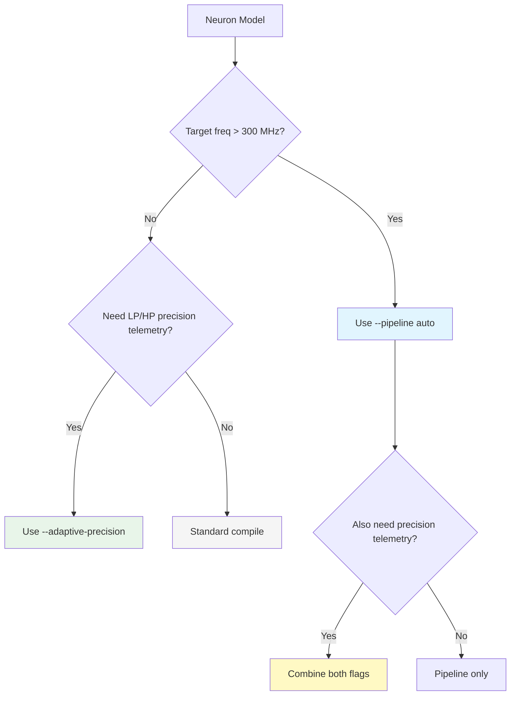

<!-- SPDX-License-Identifier: AGPL-3.0-or-later -->
<!-- Commercial license available -->
<!-- © Concepts 1996–2026 Miroslav Šotek. All rights reserved. -->
<!-- © Code 2020–2026 Miroslav Šotek. All rights reserved. -->
<!-- ORCID: 0009-0009-3560-0851 -->

# Pipeline Stages and Adaptive Runtime Precision

The SC-NeuroCore compiler supports two advanced Verilog generation strategies
for high-frequency neuromorphic deployment and precision-bound analysis:

1. **Pipeline Stage Insertion** — automatically or manually insert register
   stages at multiply outputs to meet timing constraints on high-frequency
   FPGA targets (Versal 900 MHz, Agilex 800 MHz).
2. **Adaptive Precision Telemetry** — generate dual-datapath Verilog that
   runs low-precision (LP) and high-precision (HP) paths in parallel.  HP is
   the authoritative output; LP and hysteresis logic expose `use_hp` telemetry
   for later audited power-control work.

Both features are fully integrated into the `compile` CLI command and the
Python API.

---

## 1. Mathematical Formalism

### 1.1 Pipeline Stage Budget

The number of pipeline stages needed to meet a target clock frequency is
determined by the critical path depth (longest chain of DSP multiplications)
and the propagation delay per DSP block.

**Critical path depth** for an expression tree:

$$
D(e) = \begin{cases}
0 & \text{if } e \text{ is a leaf (constant, variable)} \\
1 + \max(D(e_L), D(e_R)) & \text{if } e = e_L \times e_R \text{ or } e = e_L \div e_R \\
\max(D(e_L), D(e_R)) & \text{otherwise (add, sub)}
\end{cases}
$$

**Pipeline stages needed:**

$$
S = \max\!\left(0,\ \left\lceil D \cdot t_{\text{DSP}} \cdot f_{\text{target}} \right\rceil - 1\right)
$$

where $t_{\text{DSP}}$ is the DSP propagation delay (default 2.5 ns for
Xilinx DSP48E2) and $f_{\text{target}}$ is the target clock frequency in GHz.

**Example:** Izhikevich `dv/dt = 0.04*v*v + 5*v + 140 - u + I` has
$D = 3$ (three chained multiplies: `0.04*v`, `result*v`, `5*v`).  At
900 MHz ($f = 0.9$): $S = \lceil 3 \times 2.5 \times 0.9 \rceil - 1 = 6$.

### 1.2 Adaptive Precision Hysteresis Telemetry

The dual-datapath wrapper uses a hysteresis controller to mark where the LP
path is outside its preferred operating range.  The membrane voltage $v$ is
monitored against two thresholds:

$$
\text{THRESH\_UP} = \alpha_{\text{up}} \cdot v_{\max}^{\text{LP}}
\qquad
\text{THRESH\_DOWN} = \alpha_{\text{down}} \cdot v_{\max}^{\text{LP}}
$$

where $v_{\max}^{\text{LP}} = (2^{W_{\text{LP}}-1} - 1) / 2^{F_{\text{LP}}}$
is the maximum representable value in the LP format, and $\alpha_{\text{up}} = 0.8$,
$\alpha_{\text{down}} = 0.5$ by default.

**Telemetry transitions:**

$$
\text{use\_hp}_{n+1} = \begin{cases}
1 & \text{if use\_hp}_n = 0 \wedge |v_n| > \text{THRESH\_UP} \\
0 & \text{if use\_hp}_n = 1 \wedge |v_n| < \text{THRESH\_DOWN} \\
\text{use\_hp}_n & \text{otherwise}
\end{cases}
$$

The current wrapper does not switch output state.  HP remains authoritative in
all cycles.

### 1.3 HP-Authoritative Output

The emitted wrapper registers only HP outputs:

$$
v_{\text{out}} = v_{\text{HP}}, \qquad \text{spike}_{\text{out}} = \text{spike}_{\text{HP}}
$$

This avoids claiming equivalence between unsynchronised LP and HP states.

### 1.4 Power-Control Boundary

The dynamic power of a synchronous CMOS circuit is:

$$
P_{\text{dyn}} = \alpha \cdot C_L \cdot V_{DD}^2 \cdot f
$$

The generated adaptive wrapper does not gate clocks and does not claim a power
reduction.  A power-saving variant must add a target-specific clock-enable or
integrated clock-gate cell plus a verified state-transfer protocol before any
accuracy or power claim is valid.

---

## 2. Architecture

### 2.1 Pipeline Stage Insertion

The pipeline register insertion modifies the Verilog emission at the multiply
node level.  Each multiplication in the ODE expression tree produces a
wide intermediate wire (`2*DW` bits).  When pipelining is enabled, this
wire is registered before truncation:

```
┌─────────┐     ┌──────────┐     ┌──────────┐     ┌──────────┐
│ operand  │────►│ multiply │────►│ register │────►│ truncate │
│ a, b     │     │ a * b    │     │ _mulN_r  │     │ >>> frac │
└─────────┘     └──────────┘     └──────────┘     └──────────┘
                   wire             reg              wire
                 (2*DW bits)      (2*DW bits)       (DW bits)
```

**Without pipeline** (combinational):
```verilog
wire signed [31:0] _mul0 = a * b;
wire signed [15:0] _t0 = (_mul0 >>> 8);
```

**With pipeline** (registered):
```verilog
wire signed [31:0] _mul0 = a * b;
reg  signed [31:0] _mul0_r;
always @(posedge clk) _mul0_r <= _mul0;
wire signed [15:0] _t0 = (_mul0_r >>> 8);
```

The compiler also adds:
- `output wire [N:0] latency` port reporting total pipeline depth
- `assign latency = K;` where K is the number of pipeline registers

### 2.2 Adaptive Precision Telemetry

The adaptive precision compiler generates three Verilog modules in a
single output file:

```
┌──────────────────────────────────────────────────────────────────┐
│ Top-Level Wrapper (sc_adaptive_neuron)                          │
│                                                                  │
│  ┌───────────────┐        ┌───────────────┐                     │
│  │  LP Datapath   │        │  HP Datapath   │                    │
│  │  Q8.8 (16-bit) │        │  Q16.16 (32-b) │                   │
│  │  .clk(clk)     │        │  .clk(clk)     │                   │
│  │  .I_t(lp_I_t)  │        │  .I_t(I_t)     │                   │
│  └──────┬────────┘        └──────┬────────┘                     │
│         │                        │                               │
│         ▼                        ▼                               │
│  ┌─────────────────────────────────────┐                        │
│  │        HP Output Register             │                        │
│  │  spike_out = HP; state_out = HP       │                        │
│  └──────────────┬──────────────────────┘                        │
│                 │                                                 │
│                 ▼                                                 │
│  ┌─────────────────────────────────────┐                        │
│  │  Hysteresis Telemetry                │                        │
│  │  |v| > THRESH_UP  → use_hp=1        │                        │
│  │  |v| < THRESH_DOWN → use_hp=0       │                        │
│  └─────────────────────────────────────┘                        │
└──────────────────────────────────────────────────────────────────┘
```

Key design decisions:
- **Full-module instantiation**: each datapath is a complete, independently
  synthesisable neuron module.  This avoids error-prone partial sharing of
  combinational logic.
- **No fabric clock gating**: both datapaths receive `clk`.
- **HP-authoritative output**: `use_hp` is telemetry only until a state-transfer
  or clock-enable design is audited.

---

## 3. Supported Configurations

### 3.1 Pipeline Modes

| Mode | CLI Flag | API Parameter | Behaviour |
|------|----------|---------------|-----------|
| Off | (default) | `pipeline_stages=0` | Purely combinational |
| Global | `--pipeline N` | `pipeline_stages=N` | Register every multiply |
| Auto | `--pipeline auto` | N/A (CLI only) | Compute from critical path |
| Selective | `--pipeline-points _mul0,_mul2` | `pipeline_points=[...]` | Register named signals only |

### 3.2 Canonical LP/HP Precision Pairs

All 15 canonical LP/HP pairs are verified to compile successfully for any
neuron type:

| # | LP Format | HP Format | LP Bits | HP Bits | Primary Use Case |
|---|-----------|-----------|:-------:|:-------:|-----------------|
| 1 | Q1.7 | Q8.8 | 8 | 16 | Ultra-compact edge |
| 2 | Q4.4 | Q8.8 | 8 | 16 | TrueNorth-class |
| 3 | Q1.7 | Q4.12 | 8 | 16 | Normalised edge |
| 4 | Q4.4 | Q4.12 | 8 | 16 | Normalised edge |
| 5 | Q8.8 | Q16.16 | 16 | 32 | **Default** — mV-scale models |
| 6 | Q8.8 | Q20.12 | 16 | 32 | Network accumulation |
| 7 | Q8.8 | Q8.24 | 16 | 32 | EP training gradients |
| 8 | Q4.12 | Q16.16 | 16 | 32 | Normalised → gold |
| 9 | Q4.12 | Q8.24 | 16 | 32 | Normalised → ultra |
| 10 | Q1.15 | Q16.16 | 16 | 32 | ARM CMSIS → gold |
| 11 | Q9.9 | Q16.16 | 18 | 32 | DSP-native → gold |
| 12 | Q9.9 | Q18.18 | 18 | 36 | DSP-native → UltraScale |
| 13 | Q12.12 | Q16.16 | 24 | 32 | Loihi-2 → gold |
| 14 | Q12.12 | Q18.18 | 24 | 36 | Loihi-2 → UltraScale |
| 15 | Q14.13 | Q18.18 | 27 | 36 | Stratix → UltraScale |

Custom `(data_width, fraction)` pairs are also accepted — the 15 presets
are canonical shortcuts, not limitations.

### 3.3 Precision Strings and Manifest

Adaptive precision also accepts exact precision strings on both datapaths:

```python
verilog = compile_adaptive_precision(
    neuron,
    lp_precision="Q8.8",
    hp_precision="Q16.16",
)

verilog = compile_adaptive_precision(
    neuron,
    lp_precision="BFP16E3X32",
    hp_precision="Q16.16",
)
```

When emitted, the top-level RTL includes a deterministic JSON manifest:

```verilog
// SC-NeuroCore Adaptive Precision Manifest: {"kind":"adaptive_precision_v1",...}
```

The manifest carries:

- LP/HP precision metadata (`kind`, precision label, width/fraction fields),
- explicit block metadata for block-floating modes (`mantissa_bits`, `exponent_bits`,
  `block_size`, exponent bias, exponent code range, unbiased exponent range,
  maximum mantissa magnitude, minimum quantum, maximum absolute value, and the
  flattened contiguous block-alignment rule),
- signed/overflow/rounding contract,
- hysteresis percentages.

This contract is consumed by downstream parity tooling and is expected to be stable
across codegen releases.

For `BFP16E3X32`, the adaptive manifest must record exponent bias `3`,
exponent codes `[0, 7]`, unbiased exponent range `[-3, +4]`, mantissa maximum
`32767`, minimum quantum `0.125`, and maximum absolute value `524272.0`.  The
generated RTL still emits a fixed mantissa datapath; the shared exponent path is
explicit metadata until a target-specific block exponent datapath is emitted and
formally checked.

---

## 4. Python API

### 4.1 Pipeline Stage Insertion

```python
from sc_neurocore.compiler.equation_compiler import compile_to_verilog
from sc_neurocore.neurons.equation_builder import from_equations

neuron = from_equations(
    "dv/dt = -(v - E_L)/tau_m + I/C",
    threshold="v > -50", reset="v = -65",
    params=dict(E_L=-65, tau_m=10, C=1),
    init=dict(v=-65),
)

# Global pipelining: register every multiply
verilog = compile_to_verilog(
    neuron,
    module_name="sc_lif_pipelined",
    pipeline_stages=1,
)

# Selective pipelining: register only the dt multiply
verilog = compile_to_verilog(
    neuron,
    module_name="sc_lif_selective",
    pipeline_points=["_dt_mul_v"],
)
```

### 4.2 Critical Path Analysis

```python
from sc_neurocore.compiler.static_analysis import (
    critical_path_depth,
    pipeline_stages_needed,
    pipeline_analysis,
)

# Single expression
depth = critical_path_depth("0.04 * v * v + 5 * v + 140 - u + I")
# depth = 3

# Compute stages for 900 MHz
stages = pipeline_stages_needed(depth, target_freq_mhz=900)
# stages = 6

# Full per-variable analysis
result = pipeline_analysis(
    {"v": "0.04 * v * v + 5 * v + 140 - u + I",
     "u": "a * (b * v - u)"},
    target_freq_mhz=500,
)
print(result["v"]["depth"])        # 3
print(result["v"]["stages"])       # number of stages needed
print(result["v"]["achievable_mhz"])  # max frequency without pipelining
```

### 4.3 Adaptive Runtime Precision

```python
from sc_neurocore.compiler.adaptive_runtime_precision import (
    compile_adaptive_precision,
    PRECISION_PAIRS,
)

# Default Q8.8 → Q16.16
verilog = compile_adaptive_precision(
    neuron,
    module_name="sc_lif_adaptive",
)

# Custom pair: Q4.12 → Q8.24 with tight hysteresis
verilog = compile_adaptive_precision(
    neuron,
    module_name="sc_lif_ultra",
    lp_width=16, lp_frac=12,
    hp_width=32, hp_frac=24,
    threshold_up_pct=0.9,
    threshold_down_pct=0.3,
)

# Hysteresis band rules:
# threshold_up_pct must satisfy 0 < threshold_down_pct < threshold_up_pct < 1.
# Codes are quantised into LP datapath range, so both thresholds must
# map to at least 1 distinct non-zero code points.

# Iterate over all canonical pairs
for (lp_w, lp_f), (hp_w, hp_f) in PRECISION_PAIRS:
    v = compile_adaptive_precision(
        neuron,
        lp_width=lp_w, lp_frac=lp_f,
        hp_width=hp_w, hp_frac=hp_f,
    )
    print(f"Q{lp_w-lp_f-1}.{lp_f} → Q{hp_w-hp_f-1}.{hp_f}: {len(v)} chars")
```

---

## 5. CLI Usage

### 5.1 Pipeline Stage Insertion

```bash
# Auto-pipeline based on target frequency
sc-neurocore compile "dv/dt = -(v-E_L)/tau_m + I/C" \
    --threshold "v > -50" --reset "v = -65" \
    --params "E_L=-65,tau_m=10,C=1" --init "v=-65" \
    --pipeline auto

# Force 2 pipeline stages
sc-neurocore compile "dv/dt = 0.04*v*v + 5*v + 140 - u + I; \
    du/dt = a*(b*v - u)" \
    --threshold "v > 30" --reset "v = -65; u = u + 8" \
    --params "a=0.02,b=0.2" --init "v=-65,u=-14" \
    --pipeline 2

# Selective pipeline at named signals
sc-neurocore compile "dv/dt = -(v-E_L)/tau_m + I/C" \
    --threshold "v > -50" --reset "v = -65" \
    --params "E_L=-65,tau_m=10,C=1" --init "v=-65" \
    --pipeline-points "_mul0,_dt_mul_v"
```

### 5.2 Adaptive Runtime Precision

```bash
# Default Q8.8 → Q16.16
sc-neurocore compile "dv/dt = -(v-E_L)/tau_m + I/C" \
    --threshold "v > -50" --reset "v = -65" \
    --params "E_L=-65,tau_m=10,C=1" --init "v=-65" \
    --adaptive-precision

# Custom LP/HP widths
sc-neurocore compile "dv/dt = -(v-E_L)/tau_m + I/C" \
    --threshold "v > -50" --reset "v = -65" \
    --params "E_L=-65,tau_m=10,C=1" --init "v=-65" \
    --adaptive-precision \
    --lp-width 8 --lp-frac 7 \
    --hp-width 16 --hp-frac 8
```

---

## 6. Generated Verilog Structure

### 6.1 Pipelined Module (LIF, 1 stage)

```verilog
module sc_lif_pipelined #(
    parameter signed [15:0] P_E_L = 16'sd48896,
    // ...
)(
    input wire clk,
    input wire rst_n,
    input wire signed [15:0] I_t,
    output reg spike_out,
    output reg signed [15:0] v_out,
    output wire [0:0] latency        // ← pipeline latency port
);

// Pipeline latency: 1 cycle(s)
assign latency = 1'd1;

reg signed [15:0] v_reg;

// Pipeline registers for multiply outputs
reg signed [31:0] _dt_mul_v_r;       // ← registered dt multiply

// Combinational: compute derivative
wire signed [31:0] _dt_mul_v = (...) * 16'sd26;

// Pipeline register stage
always @(posedge clk) begin
    _dt_mul_v_r <= _dt_mul_v;        // ← 1 cycle latency
end

// Truncation reads from registered output
wire signed [15:0] _dt_trunc_v = (_dt_mul_v_r >>> 8);

// ... rest of sequential logic unchanged ...
endmodule
```

### 6.2 Adaptive Precision Module (LIF, Q8.8 → Q16.16)

```verilog
// ═══════════════════════════════════════════════════════════════
// Low-Precision Datapath (Q7.8, 16-bit)
// ═══════════════════════════════════════════════════════════════
module sc_lif_adaptive_lp #(...)(
    input wire clk, input wire rst_n,
    input wire signed [15:0] I_t,
    output reg spike_out,
    output reg signed [15:0] v_out
);
    // ... standard LIF at Q8.8 ...
endmodule

// ═══════════════════════════════════════════════════════════════
// High-Precision Datapath (Q15.16, 32-bit)
// ═══════════════════════════════════════════════════════════════
module sc_lif_adaptive_hp #(...)(
    input wire clk, input wire rst_n,
    input wire signed [31:0] I_t,
    output reg spike_out,
    output reg signed [31:0] v_out
);
    // ... standard LIF at Q16.16 ...
endmodule

// ═══════════════════════════════════════════════════════════════
// Adaptive Precision Wrapper — HP-authoritative telemetry
// ═══════════════════════════════════════════════════════════════
module sc_lif_adaptive (
    input wire clk,
    input wire rst_n,
    input wire signed [31:0] I_t,
    output reg spike_out,
    output reg signed [31:0] v_out,
    output wire use_hp                // precision telemetry
);

// Hysteresis precision telemetry
localparam signed [15:0] THRESH_UP = 16'sd26214;
localparam signed [15:0] THRESH_DOWN = 16'sd16383;

reg precision_mode;
assign use_hp = precision_mode;

always @(posedge clk or negedge rst_n) begin
    if (!rst_n) precision_mode <= 1'b0;
    else begin
        if (!precision_mode && (|v| > THRESH_UP))
            precision_mode <= 1'b1;
        else if (precision_mode && (|v| < THRESH_DOWN))
            precision_mode <= 1'b0;
    end
end

// Instantiate both datapaths
sc_lif_adaptive_lp lp_inst (.clk(clk),    ...);
sc_lif_adaptive_hp hp_inst (.clk(clk),    ...);

// HP-authoritative output register
always @(posedge clk or negedge rst_n) begin
    if (!rst_n) begin
        spike_out <= 1'b0;
        v_out <= 32'sd0;
    end else begin
        if (precision_mode) begin
            spike_out <= hp_spike;
            v_out <= hp_v_out;
        end else begin
            spike_out <= lp_spike;
            // Sign-extend + fractional shift
            v_out <= {{16{lp_v_out[15]}}, lp_v_out} << 8;
        end
    end
end

endmodule
```

---

## 7. Performance Characteristics

### 7.1 Pipeline Stage Impact

| Neuron | Multiplies | Depth | Stages @100 MHz | Stages @500 MHz | Stages @900 MHz |
|--------|:----------:|:-----:|:---------------:|:---------------:|:---------------:|
| LIF | 1 (dt) | 1 | 0 | 0 | 1 |
| Izhikevich | 6 | 3 | 0 | 2 | 6 |
| AdEx | 4 | 2 | 0 | 1 | 3 |
| Hodgkin-Huxley | 12+ | 4 | 0 | 3 | 8 |

### 7.2 Adaptive Precision Area Boundary

| Configuration | LP Datapath | HP Datapath | Wrapper | Current Contract |
|---------------|-------------|-------------|---------|------------------|
| Q1.7 → Q8.8 | Present | Authoritative | Telemetry | No power claim |
| Q8.8 → Q16.16 | Present | Authoritative | Telemetry | No power claim |
| Q12.12 → Q18.18 | Present | Authoritative | Telemetry | No power claim |
| BFP16E3X32 → Q16.16 | Fixed mantissa + exponent metadata | Authoritative | Telemetry | No power claim |

The current implementation deliberately pays area for an LP monitor plus an HP
reference datapath.  Power reduction must be measured only after a target
clock-enable or clock-gate implementation is added and verified.

### 7.3 Decision Flowchart



---

## 8. Test Suite

### 8.1 Pipeline Stage Tests (18 tests)

| Class | Tests | Coverage |
|-------|:-----:|----------|
| `TestPipelineRegisters` | 6 | Register declarations, latency port, always block |
| `TestPipelinePoints` | 2 | User-specified selective insertion |
| `TestCriticalPathIntegration` | 6 | Depth analysis, auto-pipeline, frequency sweep |
| `TestOutputConsistency` | 4 | Structural integrity, Q16.16, multi-variable |

### 8.2 Adaptive Precision Tests (37 tests)

| Class | Tests | Coverage |
|-------|:-----:|----------|
| `TestDualDatapath` | 6 | LP/HP sub-modules, wrapper, instantiation |
| `TestHPAuthoritativeClocking` | 4 | no fabric clock gate, use_hp telemetry |
| `TestHysteresis` | 5 | Thresholds, precision_mode, custom percentages |
| `TestHPAuthoritativeOutput` | 2 | HP spike and state drive wrapper outputs |
| `TestAllPrecisionPairs` | 15 | All 15 canonical LP/HP pairs |
| `TestValidation` | 3 | Invalid configurations rejected |
| `TestMultiStateVariable` | 2 | Izhikevich (v + u) dual-variable |

### 8.3 Running Tests

```bash
# Pipeline tests only
python -m pytest tests/test_pipeline_stages.py -v

# Adaptive precision tests only
python -m pytest tests/test_adaptive_runtime_precision.py -v

# Full regression (includes equation compiler + NIR)
python -m pytest tests/test_equation_compiler.py \
    tests/test_nir_fpga_pipeline.py \
    tests/test_pipeline_stages.py \
    tests/test_adaptive_runtime_precision.py -v
```

---

## Further Reading

- [Precision Modes Guide](precision_modes.md) — 11 Q-format modes
- [Hardware Profiles Guide](hardware_profiles.md) — 175 platform profiles
- [Static Analysis Guide](static_analysis_guide.md) — guard bits, overflow proof
- [Co-Simulation Guide](cosimulation_guide.md) — Python↔Verilog verification
- [NIR/ONNX → FPGA Guide](nir_fpga_compilation.md) — network compilation
- [SoC Integration Guide](soc_integration_guide.md) — bus interfaces, drivers
