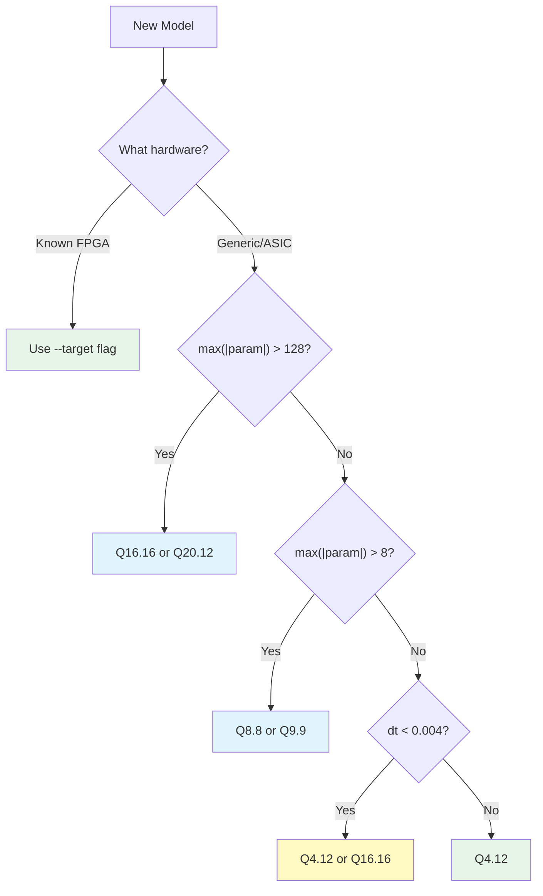

<!-- SPDX-License-Identifier: AGPL-3.0-or-later -->
<!-- Commercial license available -->
<!-- © Concepts 1996–2026 Miroslav Šotek. All rights reserved. -->
<!-- © Code 2020–2026 Miroslav Šotek. All rights reserved. -->
<!-- ORCID: 0009-0009-3560-0851 -->

# Fixed-Point Precision Modes

SC-NeuroCore supports **11 named fixed-point precision modes** for Verilog RTL
code generation, spanning 8-bit through 36-bit, plus arbitrary custom formats via
the API. Each mode trades off between **integer range** (the largest values
representable), **fractional resolution** (the finest distinction between values),
and **hardware resource cost** (DSP/gate utilisation).

## Quick Reference — All 11 Modes

| # | Mode | CLI Key | Bits | Integer Range | Resolution | Best For |
|---|------|---------|:----:|--------------|-----------|----------|
| 1 | **Q1.7** | `q17` | 8 | [-1, +0.99] | 1/128 | Ultra-compact (Loihi/TrueNorth-class) |
| 2 | **Q8.8** | `q88` | 16 | [-128, +127.996] | 1/256 | mV-scale models (default) |
| 3 | **Q4.12** | `q412` | 16 | [-8, +7.9998] | 1/4096 | Normalised dynamics (FHN, Theta) |
| 4 | **Q1.15** | `q115` | 16 | [-1, +1.0] | 1/32768 | ARM CMSIS-DSP standard |
| 5 | **Q9.9** | `q99` | 18 | [-256, +255.998] | 1/512 | DSP48-native (Xilinx/Intel/Lattice) |
| 6 | **Q12.12** | `q1212` | 24 | [-2048, +2047.999] | 1/4096 | Loihi-2 native / audio-grade |
| 7 | **Q14.13** | `q1413` | 27 | [-8192, +8191.999] | 1/8192 | Intel Stratix 27×27 DSP |
| 8 | **Q20.12** | `q2012` | 32 | [-524288, +524287] | 1/4096 | Network-level accumulation |
| 9 | **Q16.16** | `q1616` | 32 | [-32768, +32767] | 1/65536 | Gold standard |
| 10 | **Q8.24** | `q824` | 32 | [-128, +128] | 1/16.7M | Ultra-precision (EP training) |
| 11 | **Q18.18** | `q1818` | 36 | [-131072, +131072] | 1/262144 | UltraScale DSP48E2-native |

## Mathematical Foundation

A Q*m*.*n* fixed-point number uses:
- **1 sign bit** (two's complement)
- ***m* integer bits** (determining range)
- ***n* fractional bits** (determining resolution)

The value of a raw integer `r` in Q*m*.*n* format is:

```
value = r / 2^n
```

**Encoding** a float to Q-format:

```
raw = round(value × 2^n)
```

**Range** of representable values:

```
min = -2^(m+n-1) / 2^n = -2^(m-1)
max = (2^(m+n-1) - 1) / 2^n ≈ 2^(m-1) - 2^(-n)
```

## Tier-by-Tier Guide

### 8-Bit Tier: Q1.7

The most compact format — 4× neuron density compared to Q8.8. Suitable for
models with all parameters normalised to [-1, +1].

```python
verilog = neuron.to_verilog(module_name="sc_lif", data_width=8, fraction=7)
```

**Targets:** IBM TrueNorth, BrainChip Akida, QuickLogic EOS S3.
**Limitation:** mV-scale models (v_rest=-65) will overflow.

### 16-Bit Tier: Q8.8, Q4.12, Q1.15

| Mode | Use Case | Key Feature |
|------|----------|-------------|
| **Q8.8** | mV-scale neuron models (LIF, HH) | Default; ±128 range covers physiological voltages |
| **Q4.12** | Normalised dynamics (FHN, Theta, GLIF) | 16× finer precision than Q8.8 |
| **Q1.15** | ARM CMSIS-DSP interop, SpiNNaker 2 | Industry standard fractional format |

```bash
python -m sc_neurocore.neurons compile lif -p q88 -o lif.v
python -m sc_neurocore.neurons compile lif -p q412 -o lif_hp.v
python -m sc_neurocore.neurons compile lif -p q115 -o lif_arm.v
```

### 18-Bit Tier: Q9.9 — The Universal DSP Format

Q9.9 uses exactly the native width of DSP hard multipliers across **5 FPGA vendors**:

| Vendor | DSP Block | Multiplier | Q9.9 Fits? |
|--------|-----------|:----------:|:----------:|
| Xilinx | DSP48E1/A1 | 18×18 | ✅ 100% |
| Intel | Variable | 18×18 | ✅ 100% |
| Lattice | MULT18X18D | 18×18 | ✅ 100% |
| Gowin | MULT18X18 | 18×18 | ✅ 100% |
| Microchip | MACC | 18×18 | ✅ 100% |

```bash
python -m sc_neurocore.neurons compile lif -p q99 -o lif_dsp.v
```

### 24-Bit Tier: Q12.12

Matches Intel Loihi 2's native 24-bit membrane potential format and Xilinx
Versal's DSP58 B-port width (24 bits). Also matches Achronix Speedster7t's
24×24 MLP blocks.

```bash
python -m sc_neurocore.neurons compile lif -p q1212 -o lif_loihi.v
```

### 27-Bit Tier: Q14.13

Exploits Intel's 27×27 variable-precision DSP blocks found in Arria 10,
Stratix 10, and Agilex FPGAs. Provides ±8192 range with 1/8192 resolution.

```bash
python -m sc_neurocore.neurons compile lif -p q1413 -o lif_stratix.v
```

### 32-Bit Tier: Q20.12, Q16.16, Q8.24

| Mode | Use Case | Key Feature |
|------|----------|-------------|
| **Q20.12** | Network-level accumulation | ±524K range with Q4.12 precision |
| **Q16.16** | Gold standard | Widest range + high precision |
| **Q8.24** | Equilibrium propagation training | Ultra-fine gradients (dt=1µs) |

```bash
python -m sc_neurocore.neurons compile lif -p q2012 -o lif_net.v
python -m sc_neurocore.neurons compile lif -p q1616 -o lif_hd.v
python -m sc_neurocore.neurons compile lif -p q824  -o lif_ep.v
```

### 36-Bit Tier: Q18.18

Uses the full product width of Xilinx UltraScale DSP48E2 blocks (27×18 = 45-bit
product, of which 36 bits are the Q18.18 result). Provides ±131K range with
sub-microsecond resolution.

```bash
python -m sc_neurocore.neurons compile lif -p q1818 -o lif_us.v
```

## Custom Formats via API

The compiler accepts **any** `(data_width, fraction)` pair — the 11 named modes
are CLI shortcuts, not limitations:

```python
# Arbitrary format: Q6.10 (16-bit, 10 fractional)
verilog = neuron.to_verilog(
    module_name="sc_lif_custom",
    data_width=16, fraction=10,
)

# Ultra-wide: Q32.32 (64-bit)
verilog = neuron.to_verilog(
    module_name="sc_lif_64",
    data_width=64, fraction=32,
)
```

## Block-Floating Pilot via quantizer API

Quantizer and adaptive-precision surfaces also parse block-floating formats such as
`BFP16E3X32`:

```python
from sc_neurocore.compiler.quantizer import (
    quantize_block_floating,
    dequantize_block_floating,
)

weights = np.array([[0.1, 0.2], [0.3, 0.4]])
q, exponents = quantize_block_floating(weights, fmt="BFP16E3X32")
restored = dequantize_block_floating(q, exponents, fmt="BFP16E3X32")
```

In this codepath, adaptive precision emits manifest metadata (`mantissa_bits`,
`exponent_bits`, `block_size`) alongside fixed-point datapath emission for now.

## Mixed Q8.8 / Q16.16 Weight-Accumulator Contract

The quantiser also exposes the mixed fixed-point contract used by hardware
compiler paths that keep stored weights compact while widening the accumulation
datapath:

```python
from sc_neurocore.compiler.quantizer import (
    QFormatMixed,
    dequantize_weights,
    quantize_weights,
)

fmt = QFormatMixed()  # Q8.8 weights, Q16.16 accumulator, per-tensor scale
q_weights, tensor_scale = quantize_weights(weights, fmt=fmt)
restored = dequantize_weights(q_weights, fmt=fmt, scale=tensor_scale)
```

For `QFormatMixed`, `quantize_weights` returns both the stored integer tensor and
the scale multiplier required to reconstruct the original values.  The default
path maximises the Q8.8 integer dynamic range per tensor and carries the
deterministic scale metadata needed by the wider Q16.16 accumulator path.  Set
`scale_per_tensor=False` only when the canonical Q8.8 scale must be preserved
exactly for legacy parity.

### Mixed Dense Deployment Path

Dense layers can be compiled into the same mixed contract directly:

```python
from sc_neurocore.compiler.quantizer import QFormatMixed, compile_dense_mixed_precision

compiled = compile_dense_mixed_precision(weights, fmt=QFormatMixed())
outputs_q1616, overflow = compiled.forward_with_overflow(inputs)
```

This path is wired across three implementation surfaces:

- Python: `CompiledMixedDense` stores Q8.8 weights, Q16.16 accumulator metadata,
  exact signed saturation, and deterministic deployment manifests.
- Rust: `sc_neurocore_engine::ir::qformat::mixed_dense_q88_q1616` mirrors the
  canonical integer MAC, arithmetic shift, shape validation, and saturation
  behaviour.
- HDL: `hdl/sc_mixed_precision_dense.v` provides a synchronous RTL reference
  with explicit overflow telemetry and saturated Q16.16 outputs.

Benchmark and synthesis evidence from 2026-06-04 is committed under
`benchmarks/results/local_python_2026-06-04_mixed_dense.json`,
`benchmarks/results/local_rust_2026-06-04_mixed_dense.json`, and
`hdl/reports/yosys_mixed_precision_dense_2026-06-04.json`.

## CLI Usage

### Compiling with Precision Selection

```bash
# Default Q8.8
python -m sc_neurocore.neurons compile lif -o sc_lif.v

# Any of the 11 named modes
python -m sc_neurocore.neurons compile lif -p q1212 -o sc_lif_24.v

# Hardware target (auto-selects optimal precision)
python -m sc_neurocore.neurons compile lif --target artix7 -o sc_lif_fpga.v
```

### Precision Diagnostics

The `precision` subcommand analyses a model across all 11 modes, showing how
each parameter encodes, with overflow/underflow warnings and a recommendation:

```bash
python -m sc_neurocore.neurons precision lif
```

Output (abridged):

```
Precision analysis for: LIF
========================================================================

Q1.7 (8-bit, 7 frac):
  ⚠ Underflow: v_rest=-65.0 below Q1.7 min=-1.0000

Q8.8 (16-bit, 8 frac):
  All parameters fit ✓

Q9.9 (18-bit, 9 frac):
  All parameters fit ✓

Q12.12 (24-bit, 12 frac):
  All parameters fit ✓

========================================================================
Compatible modes: Q8.8, Q9.9, Q12.12, Q14.13, Q20.12, Q16.16, Q8.24, Q18.18
Recommendation: Q8.8 (smallest compatible format)
  For max precision: Q8.24
```

## Overflow and Rounding Modes

Precision modes can be combined with overflow and rounding settings. See the
[Hardware Profiles Guide](hardware_profiles.md) for full details.

```bash
# Q8.8 with banker's rounding (IEEE 754)
python -m sc_neurocore.neurons compile lif -p q88 --rounding bankers -o lif.v

# Q16.16 with overflow trapping (safety-critical)
python -m sc_neurocore.neurons compile lif -p q1616 --overflow trap -o lif.v
```

## Programmatic API

The `Q88` dataclass (supports all precisions despite the name) provides
compile-time diagnostics:

```python
from sc_neurocore.compiler.equation_compiler import Q88

# Create any precision
q = Q88(data_width=18, fraction=9)  # Q9.9

# Properties
print(q.integer_bits)   # 8
print(q.max_value)      # 255.998
print(q.min_value)      # -256.0
print(q.resolution)     # 0.00195

# With overflow and rounding
q = Q88(data_width=24, fraction=12, overflow="wrap", rounding="nearest")
print(q.overflow)    # "wrap"
print(q.rounding)    # "nearest"

# Unsigned Q-format
q = Q88(data_width=16, fraction=8, signed=False)
print(q.min_value)   # 0.0
print(q.max_value)   # 255.996 (double the positive range)

# Range checking
warnings = q.check_range(-65.0, label="v_rest")

# Full precision report
report = q.precision_report(
    dt=0.001,
    params={"v_rest": -65.0, "tau_m": 10.0},
)
print(report)
```

## Arithmetic Operations in Generated Verilog

### Multiplication

All multiplications widen to 2×DW bits, then truncate (with configurable
rounding) back to DW bits:

```verilog
// a * b in Q8.8 → 32-bit product, then truncate back to 16-bit
wire signed [31:0] _mul0 = a * b;
wire signed [15:0] _t0 = (_mul0 >>> 8);  // truncate rounding
```

### Division by Constant

Division by a known constant uses reciprocal multiplication (more precise
and resource-efficient than hardware division):

```verilog
// a / 10.0 → a * (1/10 in Q8.8) = a * 26
wire signed [31:0] _mul0 = a * 16'sd26;
wire signed [15:0] _t0 = (_mul0 >>> 8);
```

### Threshold Detection (Look-Ahead)

The threshold comparison uses `v_next` (the combinational next-state value)
rather than `v_reg` (the 1-cycle-old register value):

```verilog
// Look-ahead: check v_NEXT, not v_reg
if ((v_next > (-16'sd12800))) begin
    spike_out <= 1'b1;
    v_reg <= P_V_REST;
end
```

## Decision Flowchart



## Verified Co-Simulation Results

All mV-range modes achieve **0.0%** Python↔Verilog spike count gap
at I=50.0, 200 steps for linear models:

| Mode | LIF | Lapicque | Resonate-Fire |
|------|:---:|:--------:|:-------------:|
| Q8.8 (16-bit) | 200/200 | 200/200 | 200/200 |
| Q9.9 (18-bit) | 200/200 | 200/200 | 200/200 |
| Q12.12 (24-bit) | 200/200 | 200/200 | 200/200 |
| Q14.13 (27-bit) | 200/200 | 200/200 | 200/200 |
| Q20.12 (32-bit) | 200/200 | 200/200 | 200/200 |
| Q16.16 (32-bit) | 200/200 | 200/200 | 200/200 |
| Q8.24 (32-bit) | 200/200 | 200/200 | 200/200 |
| Q18.18 (36-bit) | 200/200 | 200/200 | 200/200 |

## Further Reading

- [Hardware Profiles Guide](hardware_profiles.md) — 32 platform profiles, overflow, rounding
- [Co-Simulation Guide](cosimulation_guide.md) — Python↔Verilog verification
- [Pipeline & Adaptive Precision Guide](pipeline_adaptive_precision.md) — Dual-datapath LP/HP switching, 15 canonical pairs
- [Tutorial 33: Equation-to-Verilog](../tutorials/33_equation_to_verilog.md)
- [Fixed-Point Design Tutorial](../tutorials/13_fixed_point_design.md)
