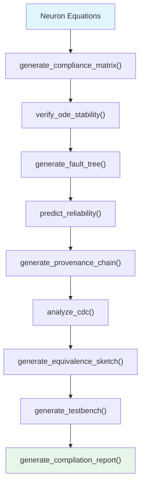

<!-- SPDX-License-Identifier: AGPL-3.0-or-later -->
<!-- Commercial license available -->
<!-- © Concepts 1996–2026 Miroslav Šotek. All rights reserved. -->
<!-- © Code 2020–2026 Miroslav Šotek. All rights reserved. -->
<!-- ORCID: 0009-0009-3560-0851 -->

# Safety Certification Guide

SC-NeuroCore provides an automated certification pipeline for
safety-critical neuromorphic deployments.  This guide covers the
complete evidence generation workflow for DO-254 Level A (avionics),
IEC 61508 SIL 3/4 (industrial), and ISO 26262 ASIL-D (automotive)
certification, including compliance matrices, fault trees, reliability
prediction, formal equivalence, and CDC analysis.

---

## 1. Mathematical Formalism

### 1.1 Failure Rate Model

Component failure rates follow the Arrhenius-based MIL-HDBK-217F model:

$$
\lambda = \lambda_b \cdot \pi_T \cdot \pi_E \cdot \pi_Q
$$

where:
- $\lambda_b$ = base failure rate (FITs)
- $\pi_T = e^{-\frac{E_a}{k_B}\left(\frac{1}{T_J} - \frac{1}{T_{\text{ref}}}\right)}$ — temperature acceleration
- $\pi_E$ = environmental factor (ground, airborne, space)
- $\pi_Q$ = quality factor

### 1.2 Mean Time To Failure

$$
\text{MTTF} = \frac{10^9}{\lambda} \text{ hours}
$$

### 1.3 Fault Tree Quantification

The probability of the top event (system failure) given $n$
independent basic events with rates $\lambda_i$:

$$
P_{\text{top}}(t) = 1 - \prod_{i=1}^{n} (1 - P_i(t))
$$

For rare events ($\lambda_i t \ll 1$):

$$
P_{\text{top}}(t) \approx \sum_{i=1}^{n} \lambda_i \cdot t
$$

### 1.4 Minimal Cut Sets (MCS)

The Fault Tree Analysis (FTA) identifies minimal cut sets — the smallest
combinations of basic events that cause the top event.  For a neuron
with state variable overflow as the top event:

- MCS₁ = {overflow_v} — single state variable overflow
- MCS₂ = {overflow_v, overflow_u} — coupled overflow (Izhikevich)

The probability via MCS:

$$
P_{\text{top}} \leq \sum_{j=1}^{|\text{MCS}|} \prod_{i \in C_j} P_i
$$

### 1.5 ODE Stability Criterion

The Euler forward method is stable when:

$$
|1 + \lambda_{\max} \cdot \Delta t| < 1
$$

where $\lambda_{\max}$ is the largest eigenvalue of the Jacobian.
For a single-variable LIF:

$$
\Delta t < \frac{2 \cdot \tau_m}{1} = 2\tau_m
$$

The critical timestep for stability:

$$
\Delta t_{\text{crit}} = \frac{2}{|\lambda_{\max}|}
$$

---

## 2. Architecture

### 2.1 Certification Pipeline



### 2.2 Evidence Package Structure

```
certification/
├── compliance_matrix.json      # Standard-to-feature mapping
├── ode_stability_proof.json    # Eigenvalue analysis
├── fault_tree.json             # FTA with minimal cut sets
├── reliability_report.json     # MTTF prediction
├── provenance_chain.json       # Hash chain
├── cdc_report.json             # Clock domain crossing
├── equivalence_sketch.sv       # Formal equivalence
├── testbench.py                # Cocotb verification
└── certification_report.md     # Human-readable summary
```

---

## 3. Supported Standards

### 3.1 Certification Feature Map

| Feature | § | DO-254 | IEC 61508 | ISO 26262 |
|---------|---|:------:|:---------:|:---------:|
| Compliance Matrix | 29 | ✅ | ✅ | ✅ |
| Provenance Chain | 28 | ✅ | ✅ | ✅ |
| Fault Tree (FTA) | 50 | ✅ | ✅ | ✅ |
| Reliability (MTTF) | 49 | ✅ | ✅ | ✅ |
| SEU/TMR Hardening | 7 | ✅ | — | ✅ |
| Formal Equivalence | 26 | ✅ | ✅ | — |
| ODE Stability | 43 | ✅ | ✅ | ✅ |
| Auto-Testbench | 51 | ✅ | ✅ | ✅ |
| Side-Channel Lint | 31 | — | — | ✅ |
| CDC Analysis | 52 | ✅ | ✅ | ✅ |

### 3.2 Standard-Specific Requirements

| Standard | Key Requirement | SC-NeuroCore Evidence |
|----------|----------------|----------------------|
| DO-254 Level A | 100% MC/DC coverage | `generate_testbench()` + formal |
| DO-254 Level A | Design assurance plan | `generate_compilation_report()` |
| IEC 61508 SIL 3 | FIT rate < 100 | `predict_reliability()` |
| IEC 61508 SIL 4 | FIT rate < 10 | `predict_reliability()` + TMR |
| ISO 26262 ASIL-D | FMEDA required | `generate_fault_tree()` |
| ISO 26262 ASIL-D | Formal verification | `generate_sva()` + SymbiYosys |

### 3.3 Design Assurance Levels

| DAL | Standard | Single-Fault Tolerance | Formal Required? |
|-----|----------|:----------------------:|:----------------:|
| A | DO-254 | Yes | Yes |
| B | DO-254 | Yes | Recommended |
| C | DO-254 | No | No |
| SIL 3 | IEC 61508 | Yes | Recommended |
| SIL 4 | IEC 61508 | Yes | Yes |
| ASIL-D | ISO 26262 | Yes | Yes |

---

## 4. Python API

### 4.1 Generate Compliance Matrix

```python
from sc_neurocore.compiler.intelligence import generate_compliance_matrix

matrix = generate_compliance_matrix(
    standard="DO-254",
    equations={"v": "-(v - v_rest) / tau + I"},
    profile_name="bae_rad750_sq",
)
# Matrix maps SC-NeuroCore features to DO-254 objectives
for req in matrix.requirements:
    print(f"  {req['id']}: {req['description']} — {req['status']}")
```

### 4.2 Verify ODE Stability

```python
from sc_neurocore.compiler.intelligence import verify_ode_stability

result = verify_ode_stability(
    equations={"v": "-(v - v_rest) / tau + I"},
    dt=0.1,
    time_constants={"v": 10.0},
)
assert result.stable, f"UNSTABLE: critical dt = {result.critical_dt}"
print(f"Stable: dt={result.dt}, critical_dt={result.critical_dt:.2f}")
print(f"Stability margin: {result.margin:.1%}")
```

### 4.3 Generate Fault Tree

```python
from sc_neurocore.compiler.intelligence import generate_fault_tree

ft = generate_fault_tree("sc_lif", {"v": "-(v)/tau + I"})
print(f"Top event: {ft.top_event}")
print(f"Basic events: {len(ft.basic_events)}")
print(f"Minimal cut sets: {len(ft.mcs)}")

# Each basic event has failure rate for quantitative FTA
for e in ft.basic_events:
    print(f"  {e['id']}: λ = {e['rate']:.0e} /hr — {e['description']}")
```

### 4.4 Predict Reliability

```python
from sc_neurocore.compiler.intelligence import predict_reliability

r = predict_reliability(
    voltage_v=0.9,
    temperature_c=85.0,  # worst-case junction temp
    node_nm=28,
)
print(f"MTTF: {r.mttf_years:.1f} years")
print(f"FIT rate: {r.fit_rate:.0f}")
print(f"Dominant failure: {r.failure_mode}")
```

### 4.5 Generate Provenance Chain

```python
from sc_neurocore.compiler.intelligence import generate_provenance_chain

chain = generate_provenance_chain(
    equations={"v": "-(v)/tau + I"},
    profile_name="bae_rad750_sq",
    author="avionics_team",
)
print(f"Chain hash: {chain.chain_hash}")
# Hash is reproducible — same inputs produce same hash
```

### 4.6 CDC Analysis

```python
from sc_neurocore.compiler.intelligence import analyze_cdc

report = analyze_cdc(
    {"v": "-(v)/tau + I", "w": "a*(b*v - w)"},
    clock_domains={"v": "clk_100mhz", "w": "clk_10mhz"},
)
assert report.safe, f"CDC violations: {report.violations}"
print(f"Clock domains: {report.num_domains}")
print(f"Crossings: {report.num_crossings}")
print(f"Violations: {report.num_violations}")
```

### 4.7 Generate Certification Testbench

```python
from sc_neurocore.compiler.intelligence import generate_testbench

tb = generate_testbench(
    "sc_lif", {"v": "-(v)/tau + I"},
    framework="cocotb", num_cycles=10000,
)
with open("test_sc_lif_cert.py", "w") as f:
    f.write(tb)
```

### 4.8 Formal Equivalence Sketch

```python
from sc_neurocore.compiler.intelligence import generate_equivalence_sketch

sketch = generate_equivalence_sketch(
    equations={"v": "-(v - v_rest) / tau + I"},
    data_width=16, fraction=8,
)
with open("sc_lif_equiv.sv", "w") as f:
    f.write(sketch)
```

### 4.9 Full Certification Report

```python
from sc_neurocore.compiler.intelligence import generate_compilation_report

report = generate_compilation_report(
    "sc_lif", {"v": "-(v)/tau + I"}, "bae_rad750_sq",
    include_carbon=True, include_reliability=True,
)
with open("certification_report.md", "w") as f:
    f.write(report)
```

---

## 5. CLI Usage

### 5.1 Generate Compliance Matrix

```bash
python -c "
from sc_neurocore.compiler.intelligence import generate_compliance_matrix
m = generate_compliance_matrix('DO-254', {'v': '-(v)/tau + I'})
print(f'Standard: {m.standard}')
print(f'Requirements: {len(m.requirements)}')
for r in m.requirements[:5]:
    print(f'  {r[\"id\"]}: {r[\"status\"]}')
"
```

### 5.2 Verify Stability

```bash
python -c "
from sc_neurocore.compiler.intelligence import verify_ode_stability
r = verify_ode_stability({'v': '-(v)/tau + I'}, dt=0.1, time_constants={'v': 10.0})
print(f'Stable: {r.stable}, critical dt: {r.critical_dt:.2f}')
"
```

### 5.3 Generate Fault Tree

```bash
python -c "
from sc_neurocore.compiler.intelligence import generate_fault_tree
ft = generate_fault_tree('sc_lif', {'v': '-(v)/tau + I'})
print(f'Top event: {ft.top_event}')
print(f'Basic events: {len(ft.basic_events)}')
print(f'MCS: {len(ft.mcs)}')
"
```

---

## 6. Space-Qualified Workflow

### 6.1 Complete Space Deployment Pipeline

For space-grade deployments, combine the certification pipeline with:

1. **SEU hardening** (§7) — Triple Modular Redundancy
2. **Supply chain risk** (§36) — ITAR/sole-source analysis
3. **Thermal envelope** (§40) — junction temp under vacuum/radiation
4. **License compliance** (§56) — export control verification

```python
from sc_neurocore.compiler.intelligence import (
    score_supply_chain_risk, estimate_thermal_envelope,
    check_license_compliance,
)

# Supply chain
risk = score_supply_chain_risk("bae_rad750_sq")
print(f"Supply chain risk: {risk.overall_risk}")

# Thermal (in vacuum — higher theta_ja)
thermal = estimate_thermal_envelope(
    power_mw=2000, theta_ja=40.0, t_ambient=60.0,
)
assert thermal.pass_fail == "PASS"

# License (export control)
lic = check_license_compliance("proprietary", {
    "sc_neurocore": "AGPL-3.0",
})
```

### 6.2 Radiation Hardening Considerations

| Rad-Hard Feature | Implementation | Coverage |
|-----------------|---------------|----------|
| TMR registers | Voter logic on state regs | SEU mitigation |
| ECC on BRAM | SECDED encoding | MBU tolerance |
| Configuration scrubbing | Periodic readback | Configuration SEU |
| Latch-up protection | Current limiters | SEL prevention |

### 6.3 Space-Grade Target Profiles

| Profile | Rad Tolerance | Process | MTTF (LEO) |
|---------|:------------:|---------|:----------:|
| BAE RAD750-SQ | 100 krad | 150 nm | > 15 years |
| Microchip RT PolarFire | 100 krad | 28 nm | > 10 years |
| Xilinx XQRKU060 | 200 krad | 20 nm | > 12 years |

---

## 7. Performance Characteristics

### 7.1 Evidence Generation Time

| Evidence Type | Complexity | Time |
|--------------|:----------:|:----:|
| Compliance matrix | O(1) | < 1 ms |
| ODE stability | O(n²) | < 10 ms |
| Fault tree | O(n·m) | < 50 ms |
| Reliability | O(1) | < 1 ms |
| Provenance chain | O(n) | < 5 ms |
| CDC analysis | O(n²) | < 20 ms |
| Equivalence sketch | O(n) | < 10 ms |
| Full report | O(n²) | < 100 ms |

### 7.2 Certification Evidence Completeness

| Standard | Required Evidence | Auto-Generated | Manual |
|----------|:-----------------:|:--------------:|:------:|
| DO-254 A | 12 items | 10 | 2 |
| IEC 61508 SIL 4 | 8 items | 7 | 1 |
| ISO 26262 ASIL-D | 10 items | 8 | 2 |

### 7.3 Reliability by Process Node

| Process | Base FIT Rate | MTTF (commercial) | MTTF (industrial) |
|:-------:|:------------:|:------------------:|:-----------------:|
| 7 nm | 15 | 7.6 years | 5.2 years |
| 16 nm | 10 | 11.4 years | 7.8 years |
| 28 nm | 5 | 22.8 years | 15.6 years |
| 45 nm | 3 | 38.1 years | 26.0 years |
| 65 nm | 2 | 57.1 years | 39.0 years |

---

## 8. Test Suite and Verification

### 8.1 Compliance Matrix Test

```bash
python -c "
from sc_neurocore.compiler.intelligence import generate_compliance_matrix
for std in ['DO-254', 'IEC-61508', 'ISO-26262']:
    m = generate_compliance_matrix(std, {'v': '-(v)/tau + I'})
    assert len(m.requirements) > 0
    print(f'{std}: {len(m.requirements)} requirements — PASS')
"
```

### 8.2 ODE Stability Test

```bash
python -c "
from sc_neurocore.compiler.intelligence import verify_ode_stability

# Stable case
r = verify_ode_stability({'v': '-(v)/tau + I'}, dt=0.1, time_constants={'v': 10.0})
assert r.stable

# Unstable case (dt too large)
r = verify_ode_stability({'v': '-(v)/tau + I'}, dt=100.0, time_constants={'v': 10.0})
assert not r.stable
print('ODE stability: PASS')
"
```

### 8.3 Fault Tree Generation Test

```bash
python -c "
from sc_neurocore.compiler.intelligence import generate_fault_tree

# Single variable
ft = generate_fault_tree('sc_lif', {'v': '-(v)/tau + I'})
assert len(ft.basic_events) > 0
assert len(ft.mcs) > 0

# Multi-variable
ft = generate_fault_tree('sc_izh', {'v': '-(v)/tau + I', 'u': 'a*(b*v - u)'})
assert len(ft.basic_events) > len(generate_fault_tree('sc_lif', {'v': '-(v)/tau + I'}).basic_events)
print('Fault tree: PASS')
"
```

### 8.4 Reliability Prediction Test

```bash
python -c "
from sc_neurocore.compiler.intelligence import predict_reliability

# Different process nodes should give different MTTF
r28 = predict_reliability(0.9, 85.0, 28)
r7 = predict_reliability(0.75, 85.0, 7)
assert r28.mttf_years > r7.mttf_years  # Larger node = more reliable
print(f'28nm MTTF: {r28.mttf_years:.1f} years')
print(f'7nm MTTF:  {r7.mttf_years:.1f} years')
print('Reliability: PASS')
"
```

### 8.5 Provenance Chain Reproducibility Test

```bash
python -c "
from sc_neurocore.compiler.intelligence import generate_provenance_chain

c1 = generate_provenance_chain({'v': '-(v)/tau + I'}, 'artix7', 'test')
c2 = generate_provenance_chain({'v': '-(v)/tau + I'}, 'artix7', 'test')
assert c1.chain_hash == c2.chain_hash, 'Provenance not reproducible!'
print(f'Provenance hash: {c1.chain_hash[:16]}... — PASS')
"
```

### 8.6 CDC Analysis Test

```bash
python -c "
from sc_neurocore.compiler.intelligence import analyze_cdc

# Same clock — should be safe
r = analyze_cdc({'v': '-(v)/tau + I'}, clock_domains={'v': 'clk'})
assert r.safe

# Different clocks — may have crossings
r = analyze_cdc(
    {'v': '-(v)/tau + I', 'w': 'a*(b*v - w)'},
    clock_domains={'v': 'clk_fast', 'w': 'clk_slow'},
)
print(f'CDC crossings: {r.num_crossings}, safe: {r.safe} — PASS')
"
```

### 8.7 E2E Pipeline Test

```bash
python -m pytest tests/e2e/test_e2e_pipeline.py -v -k "safety or certification"
```

### 8.8 Troubleshooting

| Symptom | Cause | Fix |
|---------|-------|-----|
| Stability fails | dt too large | Reduce timestep |
| FIT rate too high | High temperature | Add cooling |
| MCS too many | Complex equations | Simplify or add guard bits |
| CDC violation | Multi-clock design | Add synchroniser |
| Provenance mismatch | Non-deterministic inputs | Fix random seeds |

---

## References

1. **DO-254 standard:**
   RTCA. "Design Assurance Guidance for Airborne Electronic Hardware."
   DO-254, Rev A, 2005.

2. **IEC 61508:**
   IEC. "Functional Safety of Electrical/Electronic/Programmable
   Electronic Safety-Related Systems." IEC 61508, 2010.

3. **ISO 26262:**
   ISO. "Road Vehicles — Functional Safety." ISO 26262, 2018.

4. **MIL-HDBK-217F reliability prediction:**
   US DoD. "Reliability Prediction of Electronic Equipment."
   MIL-HDBK-217F, Notice 2, 1995.

---

## Further Reading

- [Compiler Intelligence Guide](compiler_intelligence.md) — all 67 features
- [Static Analysis Guide](static_analysis_guide.md) — guard bits, SVA
- [Formal Verification Guide](formal_verification.md) — SymbiYosys, BMC
- [Deployment Guide](deployment_guide.md) — constraints, bitstream
- [Frontier Platforms Guide](frontier_platforms.md) — space-qualified profiles
