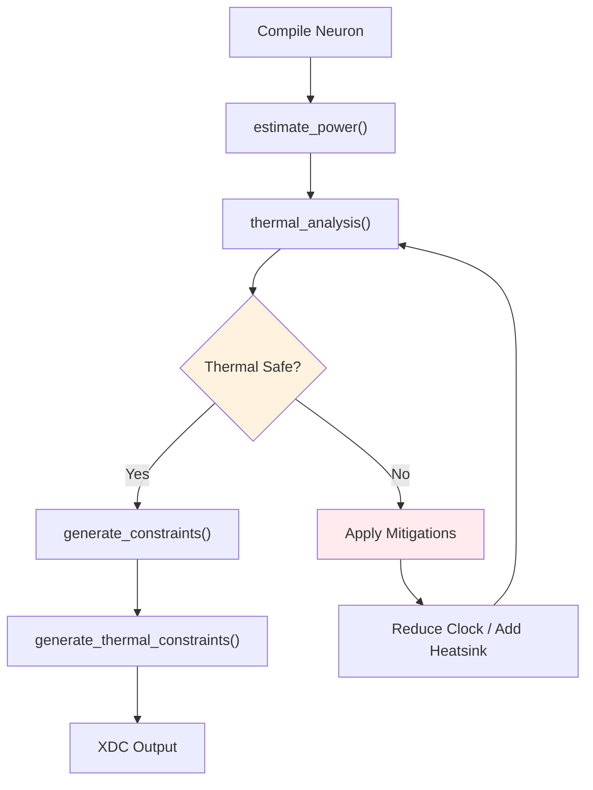

<!-- SPDX-License-Identifier: AGPL-3.0-or-later -->
<!-- Commercial license available -->
<!-- © Concepts 1996–2026 Miroslav Šotek. All rights reserved. -->
<!-- © Code 2020–2026 Miroslav Šotek. All rights reserved. -->
<!-- ORCID: 0009-0009-3560-0851 -->

# Thermal-Aware Deployment

Estimate thermal impact, apply frequency derating, and generate
thermal-aware placement constraints for compiled neuron designs.
This guide covers package-level junction rise, optional local DSP hotspot
spreading resistance, SLR-aware DSP spreading, and XDC constraint generation
for temperature-margined deployment.

---

## 1. Mathematical Formalism

### 1.1 Junction Temperature Model

The steady-state junction temperature uses the package-level junction rise plus
an optional local spreading term for concentrated DSP columns:

$$
T_J = T_A + P_{\text{total}} \cdot \theta_{JA}
      + \frac{P_{\text{DSP}}}{N_{\text{DSP columns}}} \cdot \theta_{\text{spread}}
$$

where:
- $T_A$ = ambient temperature (°C), typically 25–85°C
- $P_{\text{total}}$ = total package power dissipation (W)
- $\theta_{JA}$ = junction-to-ambient thermal resistance (°C/W)
- $P_{\text{DSP}}$ = DSP-attributed dynamic power (W), when available
- $\theta_{\text{spread}}$ = local spreading resistance from a DSP-column
  hotspot to the package junction node (°C/W)

### 1.2 Thermal Resistance by Package

| Package | $\theta_{JA}$ (°C/W) | Example Target |
|---------|:---------------------:|---------------|
| BGA-676 (Artix-7) | 11.5 | XC7A100T |
| BGA-900 (Kintex U+) | 7.2 | XCKU5P |
| BGA-1760 (Versal) | 3.5 | XCVM1802 |
| QFP-144 | 25.0 | Small FPGAs |
| ASIC (flip-chip) | 1.5–3.0 | Custom silicon |

### 1.3 Frequency Derating

Above 85°C, timing degrades due to increased transistor delay.
The derating model:

$$
f_{\text{derated}} = f_{\text{nominal}} \times \delta(T_J)
$$

where:

$$
\delta(T_J) = \begin{cases}
1.0 & \text{if } T_J \leq 85°C \\
1.0 - 0.001 \cdot (T_J - 85) & \text{if } T_J > 85°C
\end{cases}
$$

Capped at 30% maximum derating ($\delta \geq 0.7$).

### 1.4 Process Node Sensitivity

Smaller process nodes are more sensitive to thermal effects:

$$
\delta_{\text{adjusted}} = \delta(T_J) \times \gamma(n)
$$

| Process ($n$) | $\gamma(n)$ | Impact |
|:-------------:|:-----------:|--------|
| 7 nm | 0.98 | −2% additional derating |
| 16 nm | 0.99 | −1% additional derating |
| 28 nm | 1.00 | Baseline |
| 45 nm+ | 1.00 | Negligible sensitivity |

### 1.5 Dynamic Power Equation

From measured VCD switching activity when available, or from the structural
activity-factor fallback when no waveform is provided:

$$
P_{\text{dynamic}} = \alpha \cdot C \cdot V_{DD}^2 \cdot f
$$

where $\alpha$ is the average toggle rate, $C$ is the total switched
capacitance, $V_{DD}$ is the supply voltage, and $f$ is the clock
frequency.

### 1.6 DSP Hotspot Risk Model

DSP blocks concentrate power in narrow columns.  The hotspot risk
depends on the number of multipliers per DSP column:

$$
\text{risk} = \begin{cases}
\text{none} & \text{if } M/K \leq 4 \\
\text{low} & \text{if } 4 < M/K \leq 10 \\
\text{medium} & \text{if } 10 < M/K \leq 20 \\
\text{high} & \text{if } M/K > 20
\end{cases}
$$

where $M$ = total multiplier count, $K$ = available DSP columns.

---

## 2. Architecture

### 2.1 Thermal-Aware Compilation Flow



### 2.2 Thermal Analysis Pipeline

```
┌────────────────────────────────────────────────────┐
│  estimate_power()                                   │
│  └─► PowerEstimate (dynamic_mw, static_mw, ...)   │
│                                                     │
│  thermal_analysis()                                 │
│  └─► ThermalEstimate (T_j, ΔT, derating, risk)    │
│                                                     │
│  generate_thermal_constraints()                     │
│  └─► XDC (derated clock, DSP spreading)            │
└────────────────────────────────────────────────────┘
```

### 2.3 Thermal Envelope Estimator

A separate quick-check estimator for feasibility studies:

```
estimate_thermal_envelope()
  └─► ThermalEnvelopeEstimate (T_j, margin, PASS/FAIL)
```

---

## 3. Supported Configurations

### 3.1 Process Node Library

| Node | Cap/bit (fF) | Leakage (µW/LUT) | $V_{DD}$ (V) |
|:----:|:------------:|:-----------------:|:------------:|
| 7 nm | 0.2 | 0.04 | 0.75 |
| 10 nm | 0.3 | 0.05 | 0.80 |
| 14 nm | 0.5 | 0.07 | 0.85 |
| 16 nm | 0.6 | 0.08 | 0.85 |
| 22 nm | 0.8 | 0.12 | 0.90 |
| 28 nm | 1.0 | 0.10 | 1.00 |
| 40 nm | 1.5 | 0.15 | 1.10 |
| 45 nm | 1.8 | 0.18 | 1.20 |
| 65 nm | 2.5 | 0.25 | 1.20 |

### 3.2 Thermal Safety Limits

| Application | $T_{J,\max}$ (°C) | Standard |
|-------------|:------------------:|----------|
| Commercial | 85–100 | — |
| Industrial | 100 | IEC 61131 |
| Automotive | 125–150 | AEC-Q100 |
| Military | 125 | MIL-STD-883 |
| Space | 125 | MIL-PRF-38535 |

### 3.3 Hotspot Risk Mitigation

| Risk Level | Mitigation | XDC Action |
|:----------:|-----------|------------|
| None | — | Standard constraints |
| Low | Monitor | Add temperature sensor |
| Medium | Spread DSPs | Cross-column placement |
| High | Spread + derate | Placement + derated clock |

---

## 4. Python API

### 4.1 Power Estimation

```python
from sc_neurocore.compiler.static_analysis import estimate_power

pe = estimate_power(
    verilog_source,       # Generated Verilog string
    data_width=16,
    freq_mhz=200.0,
    vdd=1.0,
    process_nm=28,
    spike_rate_hz=10.0,
)

print(f"Dynamic:  {pe.dynamic_mw:.4f} mW")
print(f"Static:   {pe.static_mw:.4f} mW")
print(f"Total:    {pe.total_mw:.4f} mW")
print(f"Energy/spike: {pe.energy_per_spike_nj:.2f} nJ")
print(f"Toggle rate:  {pe.toggle_rate:.3f}")
```

For post-simulation runs, pass a VCD trace so the dynamic term is driven by
observed bit transitions instead of structural defaults:

```python
pe = estimate_power(
    verilog_source,
    activity_vcd="build/sc_lif.vcd",
    vcd_time_units_per_cycle=5,  # e.g. 1 ns VCD units, 200 MHz clock
    freq_mhz=200.0,
)
```

### 4.2 Thermal Analysis

```python
from sc_neurocore.compiler.intelligence.power_and_thermal import (
    thermal_analysis,
)

ta = thermal_analysis(
    estimated_power_mw=pe.total_mw,
    target_freq_mhz=200.0,
    theta_ja=11.5,          # Artix-7 BGA
    t_ambient_c=25.0,
    t_junction_max_c=100.0,
    process_nm=28,
    mul_count=4,            # 4 DSP multipliers
    dsp_columns=2,          # Spread across 2 columns
)

print(f"ΔT:        {ta.delta_t_c:.2f} °C")
print(f"T_junction: {ta.junction_temp_c:.1f} °C")
print(f"Derated freq: {ta.derated_freq_mhz:.1f} MHz")
print(f"Safe: {ta.thermal_safe}")
print(f"Hotspot: {ta.hotspot_risk}")
```

### 4.3 Generate Thermal Constraints

```python
from sc_neurocore.compiler.intelligence.power_and_thermal import (
    generate_thermal_constraints,
)

xdc = generate_thermal_constraints(
    "sc_hh_neuron",
    ta,
    dsp_columns=2,
)

with open("sc_hh_neuron_thermal.xdc", "w") as f:
    f.write(xdc)
```

### 4.4 Quick Thermal Envelope Check

```python
from sc_neurocore.compiler.intelligence.power_and_thermal import (
    estimate_thermal_envelope,
)

env = estimate_thermal_envelope(
    power_mw=100.0,
    theta_ja=11.5,
    t_ambient=25.0,
    t_junction_max=100.0,
)

print(f"T_j: {env.t_junction:.2f} °C")
print(f"Margin: {env.thermal_margin:.2f} °C")
print(f"Result: {env.pass_fail}")
```

### 4.5 Full Thermal-Aware Pipeline

```python
from sc_neurocore.neurons.equation_builder import from_equations
from sc_neurocore.compiler.equation_compiler import compile_to_verilog
from sc_neurocore.compiler.static_analysis import estimate_power
from sc_neurocore.compiler.intelligence.power_and_thermal import (
    thermal_analysis,
    generate_thermal_constraints,
)

# 1. Compile HH neuron
neuron = from_equations(
    "dv/dt = -(v-E_L)/tau_m + I/C",
    threshold="v > -50", reset="v = -65",
    params=dict(E_L=-65, tau_m=10, C=1),
    init=dict(v=-65),
)
verilog = compile_to_verilog(neuron, module_name="sc_hh")

# 2. Estimate power
pe = estimate_power(verilog, freq_mhz=200, process_nm=28)

# 3. Thermal analysis
ta = thermal_analysis(pe.total_mw, 200.0, mul_count=4)

# 4. Generate constraints
xdc = generate_thermal_constraints("sc_hh", ta)

with open("sc_hh.v", "w") as f:
    f.write(verilog)
with open("sc_hh_thermal.xdc", "w") as f:
    f.write(xdc)
print(f"Thermal: {ta.junction_temp_c}°C, derated: {ta.derated_freq_mhz} MHz")
```

---

## 5. CLI Usage

### 5.1 Power + Thermal Analysis

```bash
python -c "
from sc_neurocore.neurons.equation_builder import from_equations
from sc_neurocore.compiler.equation_compiler import compile_to_verilog
from sc_neurocore.compiler.static_analysis import estimate_power
from sc_neurocore.compiler.intelligence.power_and_thermal import thermal_analysis

neuron = from_equations(
    'dv/dt = -(v-E_L)/tau_m + I/C',
    threshold='v > -50', reset='v = -65',
    params=dict(E_L=-65, tau_m=10, C=1),
    init=dict(v=-65),
)
v = compile_to_verilog(neuron, module_name='sc_lif')
pe = estimate_power(v, freq_mhz=200, process_nm=28)
ta = thermal_analysis(pe.total_mw, 200.0, theta_ja=11.5)
print(f'Power: {pe.total_mw:.4f} mW')
print(f'T_j:   {ta.junction_temp_c:.1f} °C')
print(f'Safe:  {ta.thermal_safe}')
"
```

### 5.2 Multi-Process Comparison

```bash
python -c "
from sc_neurocore.compiler.static_analysis import estimate_power
from sc_neurocore.compiler.intelligence.power_and_thermal import thermal_analysis

# Dummy verilog with known structure
v = 'wire signed [15:0] _mul0; reg signed [15:0] v_reg;'

for nm in [7, 16, 28, 45, 65]:
    pe = estimate_power(v, freq_mhz=200, process_nm=nm, vdd=0.85 if nm<20 else 1.0)
    ta = thermal_analysis(pe.total_mw, 200.0, process_nm=nm)
    print(f'{nm}nm: {pe.total_mw:.4f} mW, T_j={ta.junction_temp_c:.1f}°C, safe={ta.thermal_safe}')
"
```

---

## 6. Generated Constraint Structure

### 6.1 Thermal-Aware XDC Example

```tcl
# Thermal-aware constraints for sc_hh_neuron
# SC-NeuroCore thermal compilation
# Junction temp: 26.2°C, Hotspot risk: low
# Derated frequency: 200.0 MHz

# Use derated clock period
create_clock -period 5.000 -name clk [get_ports clk]
```

### 6.2 DSP Spreading Constraints (Medium/High Risk)

```tcl
# DSP spreading across 2 columns to reduce hotspots
set_property LOC DSP48E2_X0Y0 \
    [get_cells -hier -filter {REF_NAME =~ DSP*} -limit 1]

# Soft placement constraint: spread DSPs
set_property C_REG 1 [get_cells -hier -filter {REF_NAME =~ DSP*}]
```

### 6.3 Thermal Warning Constraints

```tcl
# WARNING: Junction temperature 105.3°C exceeds limit!
# Consider: reduce clock, add heatsink, or reduce neuron count.
```

---

## 7. Performance Characteristics

### 7.1 Power by Neuron Type

| Neuron | Data Width | Muls | Add | Power (28nm, 200 MHz) |
|--------|:----------:|:----:|:---:|:---------------------:|
| LIF | 16 | 1 | 3 | ~0.003 mW |
| Izhikevich | 16 | 3 | 5 | ~0.008 mW |
| AdEx | 32 | 4 | 6 | ~0.025 mW |
| HH | 32 | 8 | 12 | ~0.060 mW |

### 7.2 Thermal Impact at Scale

| Network | Neurons | Total Power | ΔT (θ=11.5) | T_j (25°C ambient) |
|---------|:-------:|:-----------:|:------------:|:-------------------:|
| 100 LIF | 100 | 0.3 mW | 0.003°C | 25.003°C |
| 1K LIF | 1000 | 3.0 mW | 0.035°C | 25.035°C |
| 10K Izh | 10000 | 80 mW | 0.92°C | 25.92°C |
| 100K HH | 100000 | 6 W | 69°C | 94°C |

### 7.3 Energy Harvesting Feasibility

| Design | Power | Solar (indoor) | Solar (outdoor) | Piezo |
|--------|:-----:|:--------------:|:---------------:|:-----:|
| 10 LIF | 30 µW | 3 cm² | 0.003 cm² | 0.15 cm² |
| 100 LIF | 300 µW | 30 cm² | 0.03 cm² | 1.5 cm² |
| 1K Izh | 8 mW | Infeasible | 0.8 cm² | 40 cm² |

---

## 8. Test Suite and Verification

### 8.1 Power Estimation Test

```bash
python -c "
from sc_neurocore.compiler.static_analysis import estimate_power

# Generate a known Verilog structure
v = '''
wire signed [15:0] _mul0 = a * b;
wire signed [15:0] _mul1 = c * d;
reg signed [15:0] v_reg;
'''
pe = estimate_power(v, data_width=16, freq_mhz=200, process_nm=28)
assert pe.dynamic_mw > 0
assert pe.static_mw >= 0
assert pe.total_mw == round(pe.dynamic_mw + pe.static_mw, 4)
assert 0 < pe.toggle_rate < 1
print(f'Power estimation: PASS ({pe.total_mw:.6f} mW)')
"
```

### 8.2 Thermal Analysis Test

```bash
python -c "
from sc_neurocore.compiler.intelligence.power_and_thermal import thermal_analysis

# Safe case
ta = thermal_analysis(100.0, 200.0, theta_ja=11.5, t_ambient_c=25.0)
assert ta.thermal_safe
assert ta.junction_temp_c < 100

# Unsafe case
ta2 = thermal_analysis(10000.0, 200.0, theta_ja=11.5, t_ambient_c=85.0)
assert not ta2.thermal_safe
print('Thermal analysis: PASS')
"
```

### 8.3 Derating Test

```bash
python -c "
from sc_neurocore.compiler.intelligence.power_and_thermal import thermal_analysis

# Above 85°C should derate
ta = thermal_analysis(1000.0, 500.0, theta_ja=11.5, t_ambient_c=85.0)
assert ta.derated_freq_mhz < 500.0
print(f'Derating: PASS ({ta.derated_freq_mhz:.1f} MHz from 500.0 MHz)')
"
```

### 8.4 Constraint Generation Test

```bash
python -c "
from sc_neurocore.compiler.intelligence.power_and_thermal import (
    thermal_analysis, generate_thermal_constraints,
)
ta = thermal_analysis(50.0, 200.0, mul_count=15, dsp_columns=1)
xdc = generate_thermal_constraints('test', ta)
assert 'create_clock' in xdc
if ta.hotspot_risk in ('medium', 'high'):
    assert 'DSP spreading' in xdc
print(f'Constraint gen: PASS (hotspot={ta.hotspot_risk})')
"
```

### 8.5 Thermal Envelope Quick Check

```bash
python -c "
from sc_neurocore.compiler.intelligence.power_and_thermal import estimate_thermal_envelope

env = estimate_thermal_envelope(power_mw=100.0, theta_ja=11.5, t_ambient=25.0)
assert env.pass_fail == 'PASS'
assert env.t_junction < 100

env2 = estimate_thermal_envelope(power_mw=10000.0, theta_ja=25.0, t_ambient=85.0)
assert env2.pass_fail == 'FAIL'
print(f'Envelope: PASS (margin={env.thermal_margin:.1f}°C)')
"
```

### 8.6 Hotspot Risk Classification Test

```bash
python -c "
from sc_neurocore.compiler.intelligence.power_and_thermal import thermal_analysis

# No hotspot
ta = thermal_analysis(10.0, 200.0, mul_count=2, dsp_columns=1)
assert ta.hotspot_risk == 'none'

# Medium hotspot
ta = thermal_analysis(10.0, 200.0, mul_count=15, dsp_columns=1)
assert ta.hotspot_risk == 'medium'

# High hotspot
ta = thermal_analysis(10.0, 200.0, mul_count=25, dsp_columns=1)
assert ta.hotspot_risk == 'high'
print('Hotspot classification: PASS')
"
```

### 8.7 Energy Harvesting Integration

For ultra-low-power edge deployments, combine thermal analysis with
energy harvesting feasibility:

```python
from sc_neurocore.compiler.intelligence.power_and_thermal import (
    thermal_analysis,
    model_energy_harvest,
)

# 10 LIF neurons at 200 MHz, 28nm
ta = thermal_analysis(0.03, 200.0, theta_ja=11.5, process_nm=28)

# Check solar harvesting feasibility
harvest = model_energy_harvest(
    design_power_uw=ta.power_mw * 1000,  # mW → µW
    harvester_type="solar",
    harvester_area_cm2=2.0,
    environment="indoor",
)
print(f"Power: {ta.power_mw:.4f} mW")
print(f"Solar harvest: {harvest.harvester_power_uw:.1f} µW")
print(f"Energy positive: {harvest.energy_positive}")
print(f"Duty cycle: {harvest.recommended_duty_cycle:.2%}")
```

### 8.8 DVFS Integration Pattern

Combine thermal analysis with the DVFS controller generator:

```python
from sc_neurocore.compiler.intelligence.power_and_thermal import (
    thermal_analysis,
    generate_dvfs_controller,
)

# Generate DVFS controller based on thermal budget
ta = thermal_analysis(50.0, 500.0, theta_ja=7.2, process_nm=16)

dvfs = generate_dvfs_controller(
    "sc_neuron_array",
    operating_points=[
        {"voltage_mv": 700, "freq_mhz": 100},
        {"voltage_mv": 900, "freq_mhz": int(ta.derated_freq_mhz)},
        {"voltage_mv": 1100, "freq_mhz": 500},
    ],
)
```

### 8.9 E2E Thermal Pipeline Test

```bash
python -m pytest tests/e2e/test_e2e_pipeline.py -v -k "thermal"
```

### 8.10 Troubleshooting

| Symptom | Cause | Fix |
|---------|-------|-----|
| T_j unexpectedly high | Wrong θ_JA | Match package to datasheet |
| Derating too aggressive | High ambient temperature | Add active cooling |
| DSP hotspot warning | Too many muls in 1 column | Increase `dsp_columns` |
| Power estimate too high | Conservative heuristic | Use post-synthesis report |

---

## References

1. **FPGA thermal management:**
   AMD/Xilinx. "Thermal Management for FPGAs." WP517, 2020.

2. **Junction temperature derating:**
   Intel. "Thermal Management for Intel FPGAs." AN358, 2023.

3. **Dynamic power modelling:**
   Poon, K.K.W. *et al.* "A Detailed Power Model for Field-
   Programmable Gate Arrays." *ACM TDAR*, 1(3), 2005.

4. **DVFS for FPGA:**
   Nunez-Yanez, J.L. "Adaptive Voltage Scaling with In-Situ
   Detectors in Commercial FPGAs." *IEEE TVLSI*, 23(8), 2015.

---

## Further Reading

- [Power Estimation API](../api/compiler.md) — `estimate_power()` reference
- [Hardware Profiles Guide](hardware_profiles.md) — θ_JA by target platform
- [Precision Modes Guide](precision_modes.md) — Q-format modes affect power
- [Deployment Guide](deployment_guide.md) — Constraint generation
- [Network Compilation Guide](network_compilation.md) — Scaling to large networks
