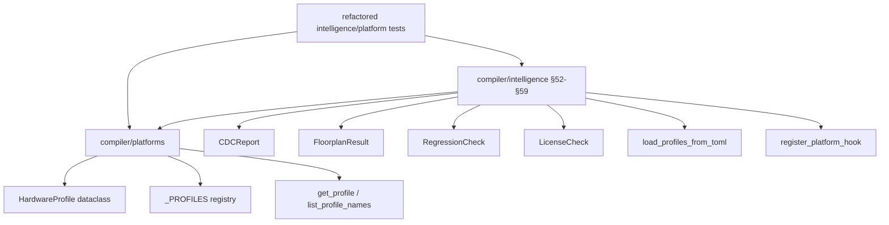

<!-- SPDX-License-Identifier: AGPL-3.0-or-later -->
<!-- Commercial license available -->
<!-- © Concepts 1996–2026 Miroslav Šotek. All rights reserved. -->
<!-- © Code 2020–2026 Miroslav Šotek. All rights reserved. -->
<!-- ORCID: 0009-0009-3560-0851 -->

# Universal Coverage and Extensibility API Reference

This document is the **complete API reference** for all modules, classes,
functions, and hardware profiles that provide universal coverage and compiler
extensibility across 4 platform classes and compiler features (§52–§59).

---

## Table of Contents

1. [Hardware Profiles — 4 New Platform Classes](#hardware-profiles--4-new-platform-classes)
   - [Optical Interconnect / CPO](#optical-interconnect--cpo)
   - [Acoustic / Phononic](#acoustic--phononic)
   - [Fluidic / Microfluidic](#fluidic--microfluidic)
   - [Space-Qualified](#space-qualified)
2. [Compiler Features §52–§59](#compiler-features-5259)
   - [§52 CDC Analysis](#52-cdc-analysis--analyze_cdc)
   - [§53 TOML Profile Loader](#53-toml-profile-loader--load_profiles_from_toml)
   - [§54 Multi-Die Floorplanning](#54-multi-die-floorplanning--plan_multi_die_floorplan)
   - [§55 Regression Watchdog](#55-regression-watchdog--check_regression)
   - [§56 License Compliance](#56-license-compliance--check_license_compliance)
   - [§57 Power State Machine](#57-power-state-machine--generate_power_state_machine)
   - [§58 Platform Discovery Hook](#58-platform-discovery-hook--register_platform_hook)
   - [§59 Compilation Report](#59-compilation-report--generate_compilation_report)
3. [Test Suite — Refactored Intelligence and Platform Tests](#test-suite--refactored-intelligence-and-platform-tests)

---

## Hardware Profiles — 4 New Platform Classes

**Source**: `src/sc_neurocore/compiler/platforms`

All profiles use the frozen `HardwareProfile` dataclass and are auto-
registered in the global `_PROFILES` registry on module import.

---

### Optical Interconnect / CPO

Silicon photonic I/O chiplets replacing electrical SerDes with optical
transceivers. Enables rack-scale SNN with Tbps-class bandwidth.

| Profile | Vendor | Family | Class | Width | Freq |
|---------|--------|--------|-------|------:|-----:|
| `ayar_teraphy` | Ayar Labs | TeraPHY | `optical_io` | Q8.8 | 25 GHz |
| `intel_cpo` | Intel | CPO | `optical_io` | Q8.8 | 20 GHz |

**Physical principles**: Co-Packaged Optics (CPO) integrates photonic
transceivers onto the package substrate adjacent to the compute die.
Ayar Labs TeraPHY delivers 8 Tbps bidirectional, UCIe-compatible.

```python
from sc_neurocore.compiler.platforms import get_profile

p = get_profile("ayar_teraphy")
assert p.platform_class == "optical_io"
assert p.data_width == 16
assert p.fraction == 8
assert p.max_freq_mhz == 25000
```

**Compilation considerations**:
- Use 16-bit data widths for high-bandwidth photonic links
- Combine with `map_ucie_protocol()` (§64) for chiplet lane assignment
- Combine with `plan_multi_die_floorplan()` (§54) for die layout

---

### Acoustic / Phononic

Acoustic wave reservoir computing using MEMS resonator arrays. Mechanical
nonlinearity provides natural activation functions without transistors.

| Profile | Vendor | Family | Class | Width |
|---------|--------|--------|-------|------:|
| `mit_phononic` | MIT | Phononic-NN | `acoustic` | Q4.4 |
| `caltech_mems_nn` | Caltech | MEMS-NN | `acoustic` | Q4.4 |

**Physical principles**: Arrays of micro-electromechanical resonators
(MEMS) exhibit nonlinear coupling when driven near mechanical resonance.
The resulting wave interference implements a physical reservoir computer
with zero digital power consumption during inference.

```python
p = get_profile("caltech_mems_nn")
assert p.platform_class == "acoustic"
assert p.data_width == 8
print(f"Resolution: {p.resolution}")  # 0.0625
```

---

### Fluidic / Microfluidic

Droplet-based and pressure-driven bistable logic gates for
chemical/biological neural computation. Lab-on-chip applications.

| Profile | Vendor | Family | Class | Width |
|---------|--------|--------|-------|------:|
| `stanford_microfluidic` | Stanford | µFluidic-NN | `fluidic` | Q4.4 |
| `eth_fluidic_logic` | ETH Zurich | Fluidic-Logic | `fluidic` | Q4.4 |

**Physical principles**: Microfluidic channels create bistable droplet
logic gates using surface tension and laminar flow physics. Enables
in-vivo diagnostic neural inference on disposable lab-on-chip substrates.

```python
p = get_profile("stanford_microfluidic")
assert p.platform_class == "fluidic"
print(f"Q-format: {p.q_format}")  # Q4.4
```

---

### Space-Qualified

Radiation-hardened processors qualified for Total Ionizing Dose (TID)
and Single Event Effects (SEE) tolerance. Deployed on ISS, Mars rovers.

| Profile | Vendor | Family | Class | Width | Freq |
|---------|--------|--------|-------|------:|-----:|
| `bae_rad750_sq` | BAE Systems | RAD750 | `space_qualified` | Q16.16 | 200 MHz |
| `seakr_sbc` | SEAKR | SBC-SpaceAI | `space_qualified` | Q8.8 | 400 MHz |
| `vorago_va10820` | Vorago | VA10820 | `space_qualified` | Q8.8 | 100 MHz |
| `frontgrade_leon5` | Frontgrade | LEON5-FT | `space_qualified` | Q16.16 | 250 MHz |

**Compilation considerations**:
- Use TMR (Triple Modular Redundancy) for SEU hardening
- Combine with `schedule_seu_scrubbing()` (§65) for configuration memory
- Combine with `generate_fault_tree()` (§50) for DO-254 Level A
- Combine with `score_supply_chain_risk()` (§36) for ITAR compliance

```python
from sc_neurocore.compiler.platforms import get_profile
from sc_neurocore.compiler.intelligence import (
    score_supply_chain_risk, generate_fault_tree,
    schedule_seu_scrubbing,
)

p = get_profile("bae_rad750_sq")
risk = score_supply_chain_risk("bae_rad750_sq")
ft = generate_fault_tree("sc_lif", {"v": "-(v)/tau + I"})
scrub = schedule_seu_scrubbing(500_000, orbit_altitude_km=400)

print(f"Platform: {p.name} ({p.vendor})")
print(f"Risk: {risk.overall_risk}")
print(f"Fault tree events: {len(ft.basic_events)}")
print(f"Scrub interval: {scrub.interval_ms:.0f} ms")
```

---

## Compiler Features §52–§59

**Source**: `src/sc_neurocore/compiler/intelligence`

All features are implemented as pure functions returning dataclass results,
following the SC-NeuroCore design pattern of zero side-effects (except for
§53 and §58 which modify the global profile registry).

---

### §52. CDC Analysis — `analyze_cdc()`

```python
def analyze_cdc(
    equations: dict[str, str],
    *,
    clock_domains: dict[str, str] | None = None,
) -> CDCReport
```

**Purpose**: Identifies clock domain crossings when neuron state variables
are in different clock domains.

**Parameters**:

| Parameter | Type | Default | Description |
|-----------|------|---------|-------------|
| `equations` | `dict[str, str]` | *required* | State variable equations |
| `clock_domains` | `dict[str, str] \| None` | `None` | Variable → clock domain mapping |

**Returns**: `CDCReport` dataclass:

| Field | Type | Description |
|-------|------|-------------|
| `crossings` | `list[dict]` | Each crossing with signal, domains, sync_type |
| `total_crossings` | `int` | Total number of CDC crossings |
| `safe` | `bool` | True if all crossings have synchronisers |

```python
from sc_neurocore.compiler.intelligence import analyze_cdc

report = analyze_cdc(
    {"v": "u + I", "u": "v - threshold", "w": "slow_adaptation"},
    clock_domains={"v": "clk_fast", "u": "clk_fast", "w": "clk_slow"},
)
print(f"Crossings: {report.total_crossings}, Safe: {report.safe}")
```

---

### §53. TOML Profile Loader — `load_profiles_from_toml()`

```python
def load_profiles_from_toml(path: str) -> list[str]
```

**Purpose**: Load hardware profiles from a TOML configuration file and
register them in the global registry. Enables adding platforms without
modifying SC-NeuroCore source code.

**Parameters**:

| Parameter | Type | Default | Description |
|-----------|------|---------|-------------|
| `path` | `str` | *required* | Path to TOML file containing `[[profile]]` sections |

**Returns**: `list[str]` — Names of loaded profiles.

**Side effects**: Registers profiles in global `_PROFILES` registry.

**TOML format**:
```toml
[[profile]]
name = "my_chip"
vendor = "MyVendor"
family = "ChipFamily"
platform_class = "asic"
data_width = 16
fraction = 8
overflow = "saturate"
rounding = "nearest"
max_freq_mhz = 500
notes = "Custom ASIC chip."
```

```python
from sc_neurocore.compiler.intelligence import load_profiles_from_toml
from sc_neurocore.compiler.platforms import get_profile

loaded = load_profiles_from_toml("my_profiles.toml")
p = get_profile(loaded[0])
```

---

### §54. Multi-Die Floorplanning — `plan_multi_die_floorplan()`

```python
def plan_multi_die_floorplan(
    blocks: dict[str, int],
    die_capacity: int = 1000,
    num_dies: int = 4,
) -> FloorplanResult
```

**Purpose**: Assigns neuron blocks to dies for chiplet/3D-stacked architectures
using a bin-packing algorithm.

**Parameters**:

| Parameter | Type | Default | Description |
|-----------|------|---------|-------------|
| `blocks` | `dict[str, int]` | *required* | Block name → resource cost |
| `die_capacity` | `int` | `1000` | Maximum resource units per die |
| `num_dies` | `int` | `4` | Number of available dies |

**Returns**: `FloorplanResult` dataclass:

| Field | Type | Description |
|-------|------|-------------|
| `die_assignment` | `dict[str, int]` | Block → die number |
| `die_utilization` | `dict[int, float]` | Die → utilisation fraction |
| `overflow_blocks` | `list[str]` | Blocks that didn't fit |

```python
from sc_neurocore.compiler.intelligence import plan_multi_die_floorplan

result = plan_multi_die_floorplan(
    blocks={"visual": 800, "auditory": 600, "motor": 400},
    die_capacity=1000, num_dies=2,
)
for block, die in result.die_assignment.items():
    print(f"  {block} → Die {die}")
```

---

### §55. Regression Watchdog — `check_regression()`

```python
def check_regression(
    baseline: dict[str, float],
    current: dict[str, float],
    *,
    threshold_pct: float = 5.0,
) -> list[RegressionCheck]
```

**Purpose**: Detect performance regressions by comparing metric snapshots.

**Parameters**:

| Parameter | Type | Default | Description |
|-----------|------|---------|-------------|
| `baseline` | `dict[str, float]` | *required* | Reference metrics |
| `current` | `dict[str, float]` | *required* | Current metrics |
| `threshold_pct` | `float` | `5.0` | Regression detection threshold (%) |

**Returns**: `list[RegressionCheck]` — each item has:

| Field | Type | Description |
|-------|------|-------------|
| `metric` | `str` | Metric name |
| `baseline_value` | `float` | Baseline value |
| `current_value` | `float` | Current value |
| `delta_pct` | `float` | Percentage change |
| `regression` | `bool` | True if regression detected |

```python
from sc_neurocore.compiler.intelligence import check_regression

checks = check_regression(
    {"area_luts": 1200, "fmax_mhz": 250},
    {"area_luts": 1350, "fmax_mhz": 240},
    threshold_pct=5.0,
)
for c in checks:
    print(f"{c.metric}: {c.delta_pct:+.1f}% {'⚠️ REGRESSION' if c.regression else '✅'}")
```

---

### §56. License Compliance — `check_license_compliance()`

```python
def check_license_compliance(
    profile_name: str,
    *,
    required_license: str | None = None,
) -> list[LicenseCheck]
```

**Purpose**: Audit IP core and tool license compatibility for a target platform.

**Parameters**:

| Parameter | Type | Default | Description |
|-----------|------|---------|-------------|
| `profile_name` | `str` | *required* | Target hardware profile |
| `required_license` | `str \| None` | `None` | SPDX license to check against |

**Returns**: `list[LicenseCheck]` — each item has:

| Field | Type | Description |
|-------|------|-------------|
| `component` | `str` | IP component name |
| `license` | `str` | Detected license |
| `compatible` | `bool` | Compatible with required_license |
| `notes` | `str` | Compatibility notes |

```python
from sc_neurocore.compiler.intelligence import check_license_compliance

checks = check_license_compliance("artix7", required_license="AGPL-3.0")
for c in checks:
    print(f"  {c.component}: {c.license} — {'✅' if c.compatible else '⚠️'}")
```

---

### §57. Power State Machine — `generate_power_state_machine()`

```python
def generate_power_state_machine(
    module_name: str,
    equations: dict[str, str],
    *,
    states: list[str] | None = None,
) -> str
```

**Purpose**: Generate a Verilog power state machine (sleep/wake/hibernate FSM)
for dynamic power management.

**Parameters**:

| Parameter | Type | Default | Description |
|-----------|------|---------|-------------|
| `module_name` | `str` | *required* | Module name |
| `equations` | `dict[str, str]` | *required* | State variable equations |
| `states` | `list[str] \| None` | `None` | Custom FSM states (default: ACTIVE/IDLE/SLEEP/HIBERNATE) |

**Returns**: `str` — Synthesisable Verilog source code.

```python
from sc_neurocore.compiler.intelligence import generate_power_state_machine

verilog = generate_power_state_machine(
    "sc_lif", {"v": "-(v)/tau + I"},
    states=["ACTIVE", "IDLE", "DEEP_SLEEP"],
)
with open("sc_lif_power_fsm.v", "w") as f:
    f.write(verilog)
```

---

### §58. Platform Discovery Hook — `register_platform_hook()`

```python
def register_platform_hook(hook_fn) -> None
def discover_platforms() -> list[str]
```

**Purpose**: Register a runtime callable that returns `HardwareProfile`
instances (e.g., from USB/serial hardware enumeration or vendor SDKs).
`discover_platforms()` executes all registered hooks and registers the
returned profiles.

**Parameters** (`register_platform_hook`):

| Parameter | Type | Description |
|-----------|------|-------------|
| `hook_fn` | `Callable[[], list[HardwareProfile]]` | Zero-arg callable returning profiles |

**Side effects**: Registers profiles in global `_PROFILES` registry.

```python
from sc_neurocore.compiler.intelligence import (
    register_platform_hook, discover_platforms,
)
from sc_neurocore.compiler.platforms import HardwareProfile

def my_hw_scan():
    return [HardwareProfile(
        name="lab_board", vendor="Lab", family="Custom",
        platform_class="fpga", data_width=16, fraction=8,
        overflow="saturate", rounding="nearest",
    )]

register_platform_hook(my_hw_scan)
discovered = discover_platforms()
```

---

### §59. Compilation Report — `generate_compilation_report()`

```python
def generate_compilation_report(
    module_name: str,
    equations: dict[str, str],
    profile_name: str,
    *,
    include_carbon: bool = False,
    include_reliability: bool = False,
) -> str
```

**Purpose**: Generate a comprehensive one-click markdown compilation report.

**Parameters**:

| Parameter | Type | Default | Description |
|-----------|------|---------|-------------|
| `module_name` | `str` | *required* | Module name |
| `equations` | `dict[str, str]` | *required* | State variable equations |
| `profile_name` | `str` | *required* | Target hardware profile |
| `include_carbon` | `bool` | `False` | Include carbon footprint |
| `include_reliability` | `bool` | `False` | Include reliability estimate |

**Returns**: `str` — Markdown-formatted report.

```python
from sc_neurocore.compiler.intelligence import generate_compilation_report

report = generate_compilation_report(
    "sc_lif", {"v": "-(v)/tau + I"}, "artix7",
    include_carbon=True, include_reliability=True,
)
with open("compilation_report.md", "w") as f:
    f.write(report)
```

---

## Test Suite — Refactored Intelligence and Platform Tests

**Source**:

- `tests/test_platforms.py`
- `tests/test_intelligence_verification_and_safety.py`
- `tests/test_intelligence_reporting.py`
- `tests/test_intelligence_power_and_thermal.py`

| Test Class | Tests | Coverage |
|------------|------:|----------|
| `TestOpticalProfiles` | 2 | `ayar_teraphy`, `intel_cpo` |
| `TestAcousticProfiles` | 2 | `mit_phononic`, `caltech_mems_nn` |
| `TestFluidicProfiles` | 2 | `stanford_microfluidic`, `eth_fluidic_logic` |
| `TestSpaceProfiles` | 4 | `bae_rad750_sq`, `seakr_sbc`, `vorago_va10820`, `frontgrade_leon5` |
| `TestCDCAnalysis` | 2 | Clean + multi-domain crossings |
| `TestTOMLLoader` | 2 | Single + multi-profile loading |
| `TestMultiDieFloorplan` | 2 | Normal + overflow scenarios |
| `TestRegressionWatchdog` | 2 | Clean + regression detection |
| `TestLicenseCompliance` | 2 | Default + SPDX match |
| `TestPowerStateMachine` | 2 | Default + custom FSM states |
| `TestPlatformDiscovery` | 2 | Register + discover |
| `TestCompilationReport` | 2 | Basic + with carbon/reliability |
| `TestExtensibilityIntegration` | 2 | Full-pipeline end-to-end |
| **Total** | **28** | |

```bash
# Run all refactored extensibility tests
python -m pytest \
  tests/test_platforms.py \
  tests/test_intelligence_verification_and_safety.py \
  tests/test_intelligence_reporting.py \
  tests/test_intelligence_power_and_thermal.py \
  -v
```

---

## Module Dependency Graph



---

## Further Reading

- [Compiler Intelligence Guide](compiler_intelligence.md) — all 67 features
- [Hardware Profiles Guide](hardware_profiles.md) — all 175 profiles
- [Frontier Platforms Guide](frontier_platforms.md) — 31 platform classes
- [Platform Extensibility Guide](platform_extensibility.md) — TOML + hook + from_constraints
- [Verification & Debug Guide](verification_debug.md) — 14 V&V features
- [Security and Sovereignty API Reference](security_sovereignty_api_reference.md) — §60–§67 + 3 platform classes
