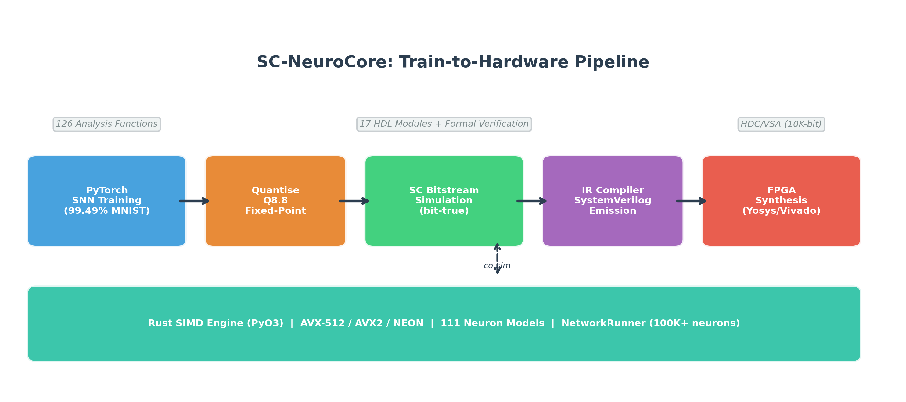

# SC-NeuroCore

**Stochastic computing and neuromorphic hardware co-design toolkit**

**Version 3.16.0** | 180 lazy-loaded Python model classes | 207 Rust PyO3 model wrappers | HDL generation + hardware guides | [PyPI](https://pypi.org/project/sc-neurocore/) | [GitHub](https://github.com/anulum/sc-neurocore)

SC-NeuroCore helps research and engineering teams build spiking and stochastic neural systems, validate their numerical behaviour, and move selected workflows toward hardware evidence. It is designed for people who need more than a simulator: bounded stochastic arithmetic, reproducible benchmark artefacts, generated RTL, synthesis evidence, and explicit readiness gaps.

Start here if you need to understand what the software is for:

- [Product Overview](product_overview.md) explains the core workflow and evidence boundary.
- [Applications and Market](applications_and_market.md) maps the project to practical commercial and research lanes.
- [Learning Path](LEARNING_PATH.md) gives a staged route from stochastic-computing basics to FPGA deployment.
- [Getting Started](guides/getting-started.md) gives the first install and first working examples.
- [Benchmarks](benchmarks/BENCHMARKS.md) and [Cross-Framework Evidence](benchmarks/cross_framework.md) separate committed evidence from measurement gaps.

## Evaluation Map

| If you are... | Read first | Then validate |
| --- | --- | --- |
| New to stochastic computing | [Product Overview](product_overview.md) and [SC Fundamentals](tutorials/01_stochastic_computing_fundamentals.md) | Run the base quickstart and inspect the bitstream error bounds. |
| Comparing SNN frameworks | [Cross-Framework Evidence](benchmarks/cross_framework.md) | Check the raw artefact named beside every comparison row. |
| Planning FPGA or ASIC work | [FPGA in 20 Minutes](tutorials/fpga_in_20_minutes.md), [Hardware Guide](hardware/HARDWARE_GUIDE.md), and [FPGA Toolchain Guide](hardware/FPGA_TOOLCHAIN_GUIDE.md) | Re-run synthesis on the exact target and commit utilisation/timing/power reports before publishing claims. |
| Reviewing industrial potential | [Applications and Market](applications_and_market.md) and [Industrial Applications](api/industrial_applications.md) | Build an evidence bag and inspect missing evidence before any deployment claim. |
| Reviewing notebooks | [Notebook Guide](guides/notebook_guide.md) and [notebooks README](https://github.com/anulum/sc-neurocore/blob/main/notebooks/README.md) | Treat notebook output as explanatory unless the raw artefact is committed. |
| Consuming APIs | [API Reference Index](api/API_REFERENCE.md) | Prefer public package surfaces first; source-only research modules require a checkout. |

!!! note "v4.0 transition"
    Until v4.0, this repository intentionally keeps a broad research surface in one checkout while experimental verification campaigns determine which runtime, compiler, hardware, bridge, and research paths are promoted. The public package metadata therefore stays at beta maturity, not Production/Stable. v4.0 is planned as the stable public API freeze and the point where the source tree is split into several focused repositories.


*Train in PyTorch -> quantise to Q8.8 -> simulate with stochastic bitstreams -> compile to SystemVerilog -> synthesise for FPGA. The optional Rust engine accelerates selected stages when installed.*

## Key Features

- **180 lazy-loaded Python model classes** — 176 Python model source modules spanning McCulloch-Pitts (1943) through ArcaneNeuron (2026), hardware chip emulators, and AI-optimised research paths
- **207 Rust PyO3 model wrappers** — optional acceleration wrappers with a 178-model NetworkRunner dispatch list and Rayon parallelism
- **ArcaneNeuron** — primary self-referential cognition model with 3 coupled compartments (fast / working / deep) + attention gate + self-model predictor
- **Identity substrate** — persistent spiking network with checkpointing, trace encoding/decoding, L16 Director control
- **Network simulation** — Population-Projection-Network with 3 backends (Python, Rust, MPI)
- **MPI distributed** — billion-neuron scale via mpi4py
- **Model zoo** — 10 pre-built configs, 3 pre-trained weight sets (MNIST, SHD, DVS)
- **127-function analysis toolkit** — spike train stats, distance, correlation, causality, decoding (23 modules)
- **14 visualization plots** — raster, voltage, ISI, PSD, cross-correlogram, and more
- **13 advanced plasticity rules** — pair/triplet/voltage STDP, BCM, BPTT, TBPTT, EWC, e-prop, R-STDP, MAML, homeostatic, STP, structural
- **7 biological circuits** — gap junctions, tripartite synapse (astrocyte), Rall dendrite, cortical column, lateral inhibition, WTA, gamma oscillation
- **Packed bitwise layers** — 64-bit vectorised AND/MUX/XNOR/NOT/CORDIV for high throughput
- **Rust SIMD engine** — Rust-backed execution paths with SIMD dispatch and committed benchmark harnesses
- **GPU acceleration** — PyTorch CUDA + CuPy backend + JAX JIT training
- **SNN training** — 6 surrogate gradients, 12 differentiable neuron cells/nets (`nn.Module`), SpikingNet + ConvSpikingNet, `to_sc_weights()` bridge to bitstreams
- **SCPN layer stack** — 16-layer holonomic model (L1 Quantum → L16 Meta) with JAX acceleration
- **Equation → Verilog compiler** — arbitrary ODE string to synthesizable Q8.8 fixed-point RTL in one function call
- **Verilog RTL** — synthesis-oriented modules, formal-verification collateral, and targeted co-simulation/parity paths
- **HDC/VSA** — Hyper-dimensional computing for symbolic AI workloads
- **[NIR bridge](guides/nir_integration.md)** — FPGA backend for [NIR](https://neuroir.org/) (18/18 primitives, recurrent edges, multi-port subgraphs)
- **SC→quantum compiler** — compile SC operations to quantum circuits, statevector + noisy simulation
- **Predictive coding** — zero-multiplication SC layer (XOR=error, popcount=magnitude)
- **Topological observables** — winding number, Ollivier-Ricci curvature, sheaf defect
- **Phi* (IIT)** — integrated information estimation for spiking networks
- **Fault tolerance** — SC vs fixed-point degradation benchmark, hardware-aware training
- **SpikeInterface adapter** — import experimental spike data (spike trains, sorting results)
- **Adaptive bitstream length** — Hoeffding/Chebyshev bounds for precision-speed tradeoff
- **AXI-Stream + DMA** — hardware interface modules (stream, DMA, parameterised registers, CDC)
- **ANN-to-SNN conversion** — `convert()` turns trained PyTorch ANNs into rate-coded SNNs with QCFS activation
- **Learnable delays** — `DelayLinear` with trainable per-synapse delays via differentiable interpolation
- **Deploy helper** — `sc-neurocore deploy model.nir --target artix7` scaffolds a project or FPGA flow invocation when the required toolchain is installed
- **Mixed-precision SC** — per-layer adaptive bitstream length (Hoeffding/sensitivity-based)
- **Event-driven FPGA** — AER encoder, event neuron, spike router (power proportional to spike rate)
- **Neural data compression** — waveform and spike-raster codecs, learnable predictors, Rust acceleration, and benchmark artefacts
- **conda-forge recipe draft** — prepared for staged-recipes submission; not
  yet published on conda-forge

The default `pip install sc-neurocore` wheel ships the public
core/simulation/domain-bridge package surface under the `sc-neurocore`
product name. Extended source modules such as `analysis`, `viz`, `audio`,
`dashboard`, and `swarm` remain source-checkout features.

## Quick Start

```bash
pip install sc-neurocore
```

When the optional Rust engine is available in the environment, SC-NeuroCore
automatically uses it for NetworkRunner, E-I network simulation, batch model
dispatch, and SIMD bitstream ops. Everything works without it: NumPy fallbacks
are used. See [Install Profiles](guides/install_profiles.md) for the base
install, optional extras, and source-build path for acceleration.

```python
from sc_neurocore import VectorizedSCLayer, BitstreamEncoder

layer = VectorizedSCLayer(n_inputs=8, n_neurons=4, length=1024)
output = layer.forward([0.3, 0.5, 0.7, 0.2, 0.8, 0.1, 0.6, 0.4])
print(output)  # array of firing-rate probabilities
```

## Architecture

| Tier | Modules | Ships in wheel |
|------|---------|:--------------:|
| **Core** | neurons, synapses, layers, sources, utils, recorders, accel, compiler, hdl_gen, hardware | Yes |
| **Simulation** | hdc, solvers, transformers, learning, graphs, ensembles, export, pipeline, training | Yes |
| **Domain bridges** | quantum API guards, adapters/holonomic, scpn | API guards ship; Qiskit/PennyLane/JAX extras are research-grade opt-ins |
| **Research** | robotics, physics, bio, optics, chaos, sleep, interfaces | Source only |
| **Frontier** | analysis, viz, audio, dashboard, generative, world_model, swarm | Source only |

See [Architecture](architecture/architecture.md) for the full package map and
[Package Boundary Decision](architecture/package_boundary_decision.md) for the
current optional-extra, source-checkout, and Rust workspace decisions.

## Tutorials

| Tutorial | Topic |
|----------|-------|
| [SC Fundamentals](tutorials/01_stochastic_computing_fundamentals.md) | Bitstream encoding, arithmetic, noise analysis |
| [Building Your First SNN](tutorials/02_building_your_first_snn.md) | Neurons, synapses, layers, simulation |
| [Surrogate Gradient Training](tutorials/03_surrogate_gradient_training.md) | Train SNNs with backpropagation |
| [Hyper-Dimensional Computing](tutorials/04_hyperdimensional_computing.md) | Symbolic AI with high-dimensional vectors |
| [FPGA in 20 Minutes](tutorials/fpga_in_20_minutes.md) | Train → quantise → synthesise → deploy |
| [FPGA Deploy Cookbook](tutorials/fpga_deploy_cookbook.md) | Five-minute scaffold, optional synthesis, report-to-optimiser handoff |
| [Rust Engine & Performance](tutorials/05_rust_engine_performance.md) | SIMD tiers, GPU, benchmarking |
| [Brunel Network Translation](tutorials/06_brunel_network_translation.md) | Brian2 → SC conversion workflow |
| [Spike Codec Library](tutorials/70_spike_codec.md) | 6 codecs for BCI, probes, neuromorphic, real-time |

## Documentation

- **[Getting Started](guides/getting-started.md)** — Installation and first steps
- **[Install Profiles](guides/install_profiles.md)** — Base install, optional extras, and research-only polyglot boundary
- **[Alternative Paths](guides/alternative_paths.md)** — Safe opt-in workflow for baseline vs candidate implementations
- **[Stable Engine Bridge Contracts](guides/engine_bridge_contracts.md)** — Maintained wrapper modules for Rust engine consumers
- **[Acceleration Mirror Authority](guides/accel_mirror_authority.md)** — Which Julia/Mojo acceleration files are authoritative today and which are mirrors only
- **[Neuron Integrator Paths](guides/neuron_integrator_paths.md)** — Explicit baseline vs higher-order integrator routes for selected neuron models
- **[Stochastic Source Emitters](guides/stochastic_source_emitters.md)** — Explicit standalone RTL emitters for LFSR-16 and Sobol-16
- **[Async AER HDL](guides/async_aer_hdl.md)** — Research-stage 4-phase AER wrapper around the stable synchronous HDL path
- **[Kuramoto Phase HDL](guides/kuramoto_phase_hdl.md)** — Research-stage fixed-point Kuramoto emitter for bounded synthesis experiments
- **[Surrogate Execution Paths](guides/surrogate_execution_paths.md)** — Explicit `custom_op` vs legacy autograd surrogate routes for PyTorch training
- **[Network To Torch Bridge](guides/network_to_torch_bridge.md)** — Explicit differentiable bridge from declarative `Network` graphs to torch execution
- **[JAX Surrogate Execution Paths](guides/jax_surrogate_paths.md)** — Explicit `custom_vjp` vs legacy `stop_gradient` routes for JAX training
- **[Equation Units](guides/equation_units.md)** — Opt-in strict dimensional validation for `EquationNeuron` and `from_equations(...)`
- **[SCPN NeuroCore Bridge API](api/scpn_neurocore.md)** — Canonical `scpn_neurocore` bridge artifacts and datastream packets for cross-repository SCPN workflows
- **[API Reference](api/API_REFERENCE.md)** — Python package API
- **[Studio Federation API](api/federation.md)** — optional Hub manifest, evidence bundle, and verifiable-honesty seal surface
- **[Rust Engine API](api/rust-engine.md)** — High-performance Rust engine docs
- **[Hardware Guide](hardware/HARDWARE_GUIDE.md)** — FPGA deployment workflow
- **[FPGA Deploy Cookbook](tutorials/fpga_deploy_cookbook.md)** — Five-minute scaffold, optional synthesis, report-to-optimiser handoff
- **[Benchmarks](benchmarks/BENCHMARKS.md)** — Performance measurements
- **[For Research Labs](guides/FOR_RESEARCH_LABS.md)** — Setup guide for neuroscience, hardware, and ML labs
- **[Pricing](pricing.md)** — Free for research, commercial licenses available

## Demo

See the [Neuron Explorer Notebook](https://github.com/anulum/sc-neurocore/blob/main/notebooks/04_neuron_explorer.ipynb)
for an interactive walkthrough of the generated model catalogue with voltage traces,
phase portraits, and F-I curves. The [NIR Bridge Notebook](https://github.com/anulum/sc-neurocore/blob/main/notebooks/05_nir_bridge.ipynb)
demonstrates importing NIR graphs and simulating spiking networks. Or try the
[Quickstart on Google Colab](https://colab.research.google.com/github/anulum/sc-neurocore/blob/main/notebooks/quickstart_colab.ipynb)
— no installation required.

## Community & Ecosystem

SC-NeuroCore integrates with the [NIR](https://neuroir.org/) (Neuromorphic Intermediate Representation)
ecosystem, connecting to Norse, snnTorch, Lava-DL, and hardware targets including
BrainScaleS-2, Loihi, and SpiNNaker2. SC-NeuroCore adds the missing FPGA deployment
backend via bit-true Verilog co-simulation.

**Contact:** [protoscience@anulum.li](mailto:protoscience@anulum.li) |
[GitHub Discussions](https://github.com/anulum/sc-neurocore/discussions) |
[www.anulum.li](https://www.anulum.li)

---

<p align="center">
  <a href="https://www.anulum.li">
    
  </a>
  &nbsp;&nbsp;&nbsp;&nbsp;
  <a href="https://www.anulum.li">
    
  </a>
  <br>
  <em>SC-NeuroCore is developed by <a href="https://www.anulum.li">ANULUM</a> / Fortis Studio</em>
</p>
