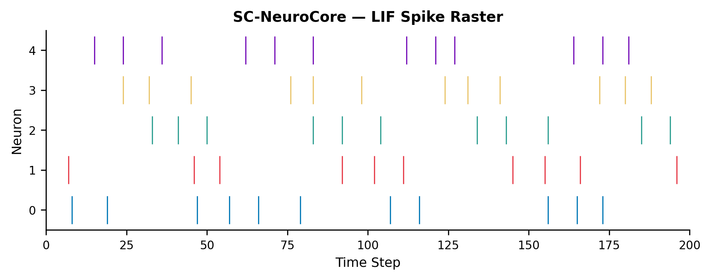

# SC-NeuroCore: Bit-True Stochastic Computing Simulation and FPGA Synthesis for Spiking Neural Networks

**Miroslav Šotek** · [ORCID 0009-0009-3560-0851](https://orcid.org/0009-0009-3560-0851)
· Anulum Research, Independent Researcher

**Date:** 17 March 2026

**Status:** JOSS preprint — formal submission planned for June 2026

**DOI (software):** [10.5281/zenodo.18906614](https://doi.org/10.5281/zenodo.18906614)

---

## Summary

SC-NeuroCore is an open-source framework for designing, simulating, and
deploying neuromorphic circuits based on stochastic computing (SC). It
provides bit-true Python simulation that matches synthesisable Verilog RTL
cycle-exactly, a high-performance Rust SIMD engine with PyO3 bindings, and
an IR compiler that emits SystemVerilog for FPGA targets. The framework
bridges GPU-based SNN training to hardware deployment: networks trained
with surrogate gradients in PyTorch are quantised to Q8.8 fixed-point and
exported to stochastic bitstream weights for FPGA synthesis.


## Statement of Need

Stochastic computing encodes values as random bit-streams and performs
arithmetic with single logic gates — an AND gate multiplies two
probabilities, a multiplexer adds them (Alaghi & Hayes, 2013). SC circuits are
area-efficient and fault-tolerant, attractive for edge neuromorphic
inference where power and silicon area are constrained (Smithson et al., 2019).

No existing open-source tool provides an integrated SC design flow.
Researchers must manually translate SC algorithms into HDL, write ad-hoc
testbenches, and hope the stochastic behaviour of their Python model
matches the hardware. SC-NeuroCore closes this gap with bit-true
simulation, SIMD-accelerated Rust kernels, an IR compiler targeting
Xilinx and Intel FPGAs, and a surrogate gradient training module
that exports directly to SC bitstream weights — a train-to-hardware path
that snnTorch (Eshraghian et al., 2023), Norse (Pehle & Pedersen, 2021), Brian2
(Stimberg et al., 2019), NEST (Gewaltig & Diesmann, 2007), and Lava (Intel, 2021) do not provide.

The target audience is (a) hardware designers prototyping neuromorphic
edge devices who need a bit-true simulation-to-synthesis path, and
(b) SNN researchers who want cycle-accurate hardware models rather than
abstract differential-equation solvers.

## State of the Field

Neuromorphic simulators — NEST, Brian2, and Lava — target event-driven
spiking network simulation at the differential-equation level. SNN
training libraries snnTorch and Norse provide gradient-based training on
GPU but operate on continuous-valued membrane potentials, not hardware
bit-streams. None model stochastic bitstream-level computation or emit
synthesisable RTL.

SC-NeuroCore operates at a different abstraction: individual AND/OR
gates on bit-streams with direct correspondence to synthesised hardware.
A Brunel balanced-network benchmark (Brunel, 2000) shows SC-NeuroCore's
Numba JIT backend completes a 1,000-neuron simulation in 0.35 s versus
Brian2's 1.38 s (4.0x speedup), with firing rates matching
within 1%. At 10,000 neurons Brian2 is
1.35x faster (5.9 s vs 4.4 s), as its compiled C++ codegen
scales better for large sparse networks. SC-NeuroCore targets
FPGA-scale networks (≤5K neurons) where bit-exact RTL
co-simulation matters.



For surrogate gradient training, SC-NeuroCore's `training` module
matches snnTorch on a standard FC-SNN benchmark (95.5% vs 95.8% MNIST,
identical 784→128→128→10 architecture, 10 epochs). With
learnable membrane time constants (Fang et al., 2021) the FC-SNN reaches 97.7%;
a convolutional SNN architecture reaches 99.49%. The `to_sc_weights()`
method exports trained float weights normalised to [0, 1] for SC
bitstream deployment.

## Software Design

SC-NeuroCore is structured in five layers, each independently usable:

**Python API** (`pip install sc-neurocore`): 38 public symbols including
`BitstreamEncoder`, `StochasticLIFNeuron`, `SCDenseLayer`, and
`VectorizedSCLayer`. All SC primitives use a 16-bit maximal-length LFSR
(polynomial x^16 + x^14 + x^13 + x^11 + 1, period 65,535) with
decorrelated seed assignment (Golomb, 1967). Fixed-point arithmetic
uses Q8.8 signed two's complement. An optional `training` subpackage
provides LIF, adaptive LIF (Bellec et al., 2020), and recurrent LIF cells with
surrogate gradient backward passes and learnable membrane parameters.
A library of 173 neuron models — from McCulloch-Pitts (1943)
through Hodgkin-Huxley (1952), Izhikevich (2003),
and 9 hardware chip emulators (Loihi, TrueNorth, BrainScaleS, SpiNNaker,
Akida) — covers 82 years of computational neuroscience.

**Rust Engine** (`sc_neurocore_engine`): A PyO3-bound Rust crate
providing SIMD-accelerated bitstream operations, 111 neuron model
implementations, and a `NetworkRunner` with CSR-sparse projections and
Rayon-parallel population stepping scaling to 100K+ neurons. Runtime
feature detection selects AVX-512, AVX2, or NEON paths. A Criterion
benchmark measures 41.3 Gbit/s bitstream packing on AVX-512.
Cross-compiled wheels target Linux, macOS, and Windows across
Python 3.10–3.14.

**Network Simulation** (`sc_neurocore.network`): A
Population-Projection-Network engine with three backends (Python/NumPy,
Rust NetworkRunner, MPI via mpi4py), six topology generators, a model
zoo with 10 pre-built configurations, 3 pre-trained weight sets, and
125 spike train analysis functions covering the combined scope of
Elephant (Denker et al., 2023) and PySpike.

**Verilog RTL** (`hdl/`): 19 synthesisable modules including
`sc_lif_neuron.v` (Q8.8 LIF), `sc_dense_matrix_layer.v`, and
`sc_neurocore_top.v` (AXI-Lite wrapper). Yosys synthesis of
`sc_neurocore_top` yields 3,673 LUTs on Xilinx 7-series. SymbiYosys
formal verification covers 67 properties across 7 modules.

**IR Compiler**: Parses a graph-based intermediate representation,
verifies structural invariants, and emits synthesisable SystemVerilog
targeting Xilinx and Intel FPGAs.

**NIR Bridge** (`sc_neurocore.nir_bridge`): Imports NIR
(Neuromorphic Intermediate Representation) graphs, mapping all 18
primitives (LIF, IF, LI, CubaLIF, CubaLI, Affine, Linear, Conv1d,
Conv2d, Scale, Threshold, Flatten, Delay, SumPool2d, AvgPool2d,
Integrator, Input, Output) to SC-NeuroCore equivalents with a
recursive graph parser and topological execution. To our knowledge,
SC-NeuroCore is the first NIR backend to combine 100% primitive
coverage with an FPGA synthesis path, enabling models from SpikingJelly,
snnTorch, and Norse to target reconfigurable hardware.

A minimal end-to-end example:

```python
from sc_neurocore import BitstreamEncoder, StochasticLIFNeuron
enc = BitstreamEncoder(data_width=16, fraction=8)
neuron = StochasticLIFNeuron()
for t in range(100):
    spike, v = neuron.step(leak_k=1, gain_k=256, i_t=50, noise_in=0)
```

The key design trade-off is determinism over speed: SC-NeuroCore
maintains bit-exact correspondence between Python simulation and Verilog
RTL at every timestep, enabling co-simulation workflows where a checker
script verifies bit-exact equivalence across all LFSR seeds and neuron
states.

## Availability

SC-NeuroCore is available on [PyPI](https://pypi.org/project/sc-neurocore/)
(`pip install sc-neurocore`) and
[GitHub](https://github.com/anulum/sc-neurocore) under
AGPL-3.0-or-later with a commercial license option.
[Documentation](https://anulum.github.io/sc-neurocore/) is hosted on
GitHub Pages. The repository includes a
[contributing guide](https://github.com/anulum/sc-neurocore/blob/main/CONTRIBUTING.md),
51 tutorials, 22 examples, and 8 Jupyter notebooks including an
interactive neuron model explorer and an NIR bridge walkthrough.
A Zenodo-archived DOI is available: [10.5281/zenodo.18906614](https://doi.org/10.5281/zenodo.18906614).

## Quality Assurance

SC-NeuroCore maintains 3,376 Python and 378 Rust tests with 100% line
coverage enforced by CI on every push. The test suite includes unit
tests, integration tests, property-based tests (Hypothesis),
cross-layer coupling tests, and hardware co-simulation checks.
Static analysis comprises Ruff linting, Bandit security scanning,
SPDX license header validation, and CodeQL. Thirteen CI workflows — all
with SHA-pinned GitHub Actions — guard every merge. OpenSSF Scorecard
monitors supply-chain security.

## AI Disclosure

This project uses LLMs for advanced control mechanisms and GitHub
handling. All output is reviewed, tested, and verified by the project
author.

## Acknowledgements

The SC primitives build on Alaghi and Hayes (2013) and Smithson
et al. (2019). Neuron models follow Gerstner et al.
(2014), Izhikevich (2003), Bellec et al.
(2020), and Fang et al. (2021). Benchmarks follow
NeuroBench methodology (Yik et al., 2023). This work was self-funded.

## References

- Alaghi, A. & Hayes, J.P. (2013). Survey of Stochastic Computing. *ACM TECS*, 12(2s), 1–19. [doi:10.1145/2465787.2465794](https://doi.org/10.1145/2465787.2465794)
- Bellec, G. et al. (2020). A Solution to the Learning Dilemma for Recurrent Networks of Spiking Neurons. *Nature Communications*, 11, 3625. [doi:10.1038/s41467-020-17236-y](https://doi.org/10.1038/s41467-020-17236-y)
- Brunel, N. (2000). Dynamics of Sparsely Connected Networks of Excitatory and Inhibitory Spiking Neurons. *J. Comput. Neurosci.*, 8(3), 183–208. [doi:10.1023/A:1008925309027](https://doi.org/10.1023/A:1008925309027)
- Denker, M., Yegenoglu, A. & Gruen, S. (2023). Elephant: Electrophysiology Analysis Toolkit. *Neuroinformatics*. [doi:10.12751/nncn.bc2018.0034](https://doi.org/10.12751/nncn.bc2018.0034)
- Eshraghian, J.K. et al. (2023). Training Spiking Neural Networks Using Lessons From Deep Learning. *Proc. IEEE*, 111(9), 1016–1054. [doi:10.1109/JPROC.2023.3308088](https://doi.org/10.1109/JPROC.2023.3308088)
- Fang, W. et al. (2021). Incorporating Learnable Membrane Time Constants to Enhance Learning of Spiking Neural Networks. *NeurIPS*, 34, 2661–2673. [doi:10.48550/arXiv.2007.05785](https://doi.org/10.48550/arXiv.2007.05785)
- Gerstner, W. et al. (2014). *Neuronal Dynamics*. Cambridge University Press. [doi:10.1017/CBO9781107447615](https://doi.org/10.1017/CBO9781107447615)
- Gewaltig, M.-O. & Diesmann, M. (2007). NEST (Neural Simulation Tool). *Scholarpedia*, 2(4), 1430. [doi:10.4249/scholarpedia.1430](https://doi.org/10.4249/scholarpedia.1430)
- Golomb, S.W. (1967). *Shift Register Sequences*. Holden-Day.
- Hodgkin, A.L. & Huxley, A.F. (1952). A Quantitative Description of Membrane Current. *J. Physiol.*, 117(4), 500–544. [doi:10.1113/jphysiol.1952.sp004764](https://doi.org/10.1113/jphysiol.1952.sp004764)
- Intel Corporation (2021). Lava: An Open-Source Software Framework for Neuromorphic Computing. [github.com/lava-nc/lava](https://github.com/lava-nc/lava)
- Izhikevich, E.M. (2003). Simple Model of Spiking Neurons. *IEEE Trans. Neural Netw.*, 14(6), 1569–1572. [doi:10.1109/TNN.2003.820440](https://doi.org/10.1109/TNN.2003.820440)
- McCulloch, W.S. & Pitts, W. (1943). A Logical Calculus of the Ideas Immanent in Nervous Activity. *Bull. Math. Biophys.*, 5(4), 115–133. [doi:10.1007/BF02478259](https://doi.org/10.1007/BF02478259)
- Pehle, C. & Pedersen, J.E. (2021). Norse — A Deep Learning Library for Spiking Neural Networks. [doi:10.5281/zenodo.4422025](https://doi.org/10.5281/zenodo.4422025)
- Smithson, S.C. et al. (2019). Neural Networks in Stochastic Computing: A Survey. *IEEE IoT Journal*, 6(3), 4463–4473. [doi:10.1109/JIOT.2018.2884863](https://doi.org/10.1109/JIOT.2018.2884863)
- Stimberg, M. et al. (2019). Brian 2, an Intuitive and Efficient Neural Simulator. *eLife*, 8, e47314. [doi:10.7554/eLife.47314](https://doi.org/10.7554/eLife.47314)
- Šotek, M. (2026). SC-NeuroCore: A Deterministic Stochastic Computing Framework for Neuromorphic Hardware Design. Zenodo. [doi:10.5281/zenodo.18906614](https://doi.org/10.5281/zenodo.18906614)
- Yik, J. et al. (2023). NeuroBench: A Framework for Benchmarking Neuromorphic Computing Algorithms and Systems. *IEEE ICRC*. [doi:10.48550/arXiv.2304.04640](https://doi.org/10.48550/arXiv.2304.04640)
