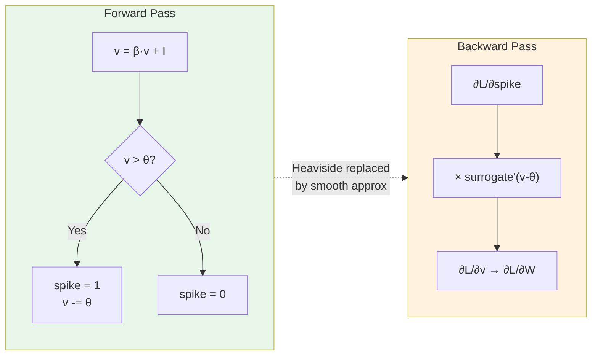
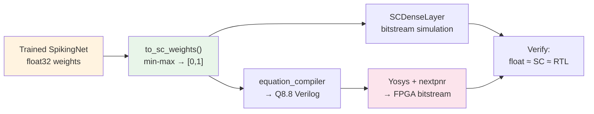

<!-- SPDX-License-Identifier: AGPL-3.0-or-later -->

# SNN Training with Surrogate Gradients

Spiking neurons fire when membrane voltage crosses a threshold — a Heaviside
step function, whose derivative is zero everywhere except at the discontinuity
(Dirac delta). Standard backpropagation cannot pass gradients through this.

Surrogate gradient methods replace the Heaviside derivative with a smooth
approximation during the backward pass while keeping the hard threshold in the
forward pass. The network learns with real spikes; only the gradient signal is
relaxed.

Reference: Neftci, Mostafa & Zenke, "Surrogate Gradient Learning in Spiking
Neural Networks", *IEEE Signal Processing Magazine* 36(6), 2019.

**Requires**: `pip install sc-neurocore[training]` (installs PyTorch)



## Surrogate functions

SC-NeuroCore provides seven surrogates. The three most commonly used:

| Function | Backward gradient | Default shape param | Citation |
|---|---|---|---|
| `atan_surrogate` | α / (2(1 + (παx/2)²)) | α=2.0 | Fang et al. 2021 |
| `fast_sigmoid` | slope / (1 + slope·\|x\|)² | slope=25.0 | Zenke & Ganguli 2018 |
| `superspike` | 1 / (1 + β·\|x\|)² | β=10.0 | Zenke & Vogels 2021 |

All accept `x = v - threshold` (pre-shifted). Forward pass returns `(x > 0).float()`.

```python
from sc_neurocore.training import atan_surrogate, fast_sigmoid, superspike
```

Also available: `sigmoid_surrogate`, `straight_through` (STE), `triangular`.

## Execution paths

The six surrogates now expose two explicit execution paths:

- `custom_op` — the modern `torch.library.custom_op` path
- `legacy_autograd` — the historical `torch.autograd.Function` path

The public functions default to `custom_op`, while explicit `_custom_op` and
`_legacy` variants remain available for direct comparison. See
[Surrogate Execution Paths](../guides/surrogate_execution_paths.md).

The custom-op path is the PyTorch compiler-facing path. Local warning-hygiene
tests use `torch.compile(..., backend="eager")` for the LIFCell custom-op
contract; that check is graph-capture evidence, not a throughput benchmark.

## Neuron model: LIFCell

```python
from sc_neurocore.training import LIFCell

lif = LIFCell(beta=0.9, threshold=1.0, surrogate_fn=atan_surrogate)
```

Single-step dynamics:

```
v[t] = beta * v[t-1] + I[t]
spike[t] = H(v[t] - threshold)     # Heaviside in forward, surrogate in backward
v[t] -= spike[t] * threshold       # subtract reset
```

`beta` controls membrane leak (higher = longer memory). Set `learn_beta=True`
or `learn_threshold=True` to make them trainable parameters.

### All neuron cells

| Cell | States | Key feature | Citation |
|---|---|---|---|
| `LIFCell` | v | Leaky integrate-and-fire (default) | Lapicque 1907 |
| `IFCell` | v | No leak (beta=1), simplest model | — |
| `SynapticCell` | i_syn, v | Dual-exponential synaptic current | — |
| `ALIFCell` | v, a | Adaptive threshold (spike-frequency adaptation) | Bellec et al. 2020 |
| `ExpIFCell` | v | Exponential upstroke near threshold | Fourcaud-Trocmé et al. 2003 |
| `AdExCell` | v, w | Adaptive exponential IF (tonic/bursting/adapting) | Brette & Gerstner 2005 |
| `LapicqueCell` | v | Explicit RC parameters (tau, R, dt) | Lapicque 1907 |
| `AlphaCell` | i_exc, i_inh, v | Separate excitatory/inhibitory synapses | Rall 1967 |
| `SecondOrderLIFCell` | a, v | Inertial acceleration term | Dayan & Abbott 2001 |
| `RecurrentLIFCell` | v, spike_prev | Trainable recurrent weights | — |

All cells support `learn_beta=True` and `learn_threshold=True` where
applicable. Import any cell from `sc_neurocore.training`.

## SpikingNet: full classifier

`SpikingNet` stacks `[Linear → LIFCell]` layers and accumulates output spikes
over T timesteps.

```python
from sc_neurocore.training import SpikingNet

model = SpikingNet(
    n_input=784,     # flattened image
    n_hidden=128,    # hidden layer width
    n_output=10,     # digit classes
    n_layers=2,      # hidden layers
    beta=0.9,
    surrogate_fn=atan_surrogate,
)
```

Forward signature: `x: (T, batch, n_input) → (spike_counts, membrane_acc)`.

Classification uses `spike_counts.argmax(dim=1)`.

## Spike encoding

Convert pixel intensities [0,1] to spike trains of shape `(T, *batch)`:

```python
from sc_neurocore.training import rate_encode, latency_encode, delta_encode
```

| Encoder | Method | When to use |
|---|---|---|
| `rate_encode(x, T)` | Poisson: P(spike) = x each timestep | Static images, general purpose |
| `latency_encode(x, T, tau=5)` | Time-to-first-spike: strong input → early spike | Low-latency inference |
| `delta_encode(x, threshold=0.1)` | Spike on temporal change | Temporal/event data |

## Loss functions

```python
from sc_neurocore.training import spike_count_loss, membrane_loss, spike_rate_loss
```

- `spike_count_loss(counts, targets)` — cross-entropy on spike counts (default)
- `membrane_loss(mem_acc, targets)` — cross-entropy on accumulated membrane
- `spike_rate_loss(counts, targets, T, target_rate=0.8)` — MSE on firing rates

Regularizers to encourage sparse firing:

```python
from sc_neurocore.training import spike_l1_loss, spike_l2_loss
```

## Training loop

`train_epoch` and `evaluate` handle the timestep expansion and accumulation:

```python
import torch
from torch.utils.data import DataLoader, TensorDataset
from sklearn.datasets import load_digits
from sklearn.model_selection import train_test_split
from sc_neurocore.training import (
    SpikingNet, atan_surrogate, auto_device,
    train_epoch, evaluate, spike_count_loss,
)

digits = load_digits()
X = torch.tensor(digits.data / 16.0, dtype=torch.float32)  # normalize to [0,1]
y = torch.tensor(digits.target, dtype=torch.long)
X_tr, X_te, y_tr, y_te = train_test_split(X, y, test_size=0.2, random_state=42)

train_loader = DataLoader(TensorDataset(X_tr, y_tr), batch_size=64, shuffle=True)
test_loader = DataLoader(TensorDataset(X_te, y_te), batch_size=64)

device = auto_device()
model = SpikingNet(n_input=64, n_hidden=128, n_output=10, beta=0.9).to(device)
optimizer = torch.optim.Adam(model.parameters(), lr=2e-3)

T = 25
for epoch in range(1, 11):
    loss, acc = train_epoch(model, train_loader, optimizer, T, device=device)
    val_loss, val_acc = evaluate(model, test_loader, T, device=device)
    print(f"Epoch {epoch:2d}  train {acc:.1%}  val {val_acc:.1%}")
```

Expected: ~95% validation accuracy within 10 epochs on sklearn digits (8x8, 10 classes).

`train_epoch` internally reshapes `(batch, features)` → `(T, batch, features)` by
repeating the input across timesteps. For rate-coded inputs, encode before the
DataLoader and pass `(T, batch, features)` tensors directly.

## Switching surrogate functions

```python
model_fs = SpikingNet(n_input=64, n_hidden=128, n_output=10,
                      surrogate_fn=fast_sigmoid)
model_ss = SpikingNet(n_input=64, n_hidden=128, n_output=10,
                      surrogate_fn=superspike)
```

Effect on training: `atan_surrogate` (wider gradient window) converges smoothly
on most tasks. `fast_sigmoid` trains faster on deep networks. `superspike` gives
sharper gradients near threshold — better for temporal coding but can be
unstable with high learning rates.

## Bridge to stochastic computing: `to_sc_weights()`



After training, export weight matrices normalized to [0,1] for SC bitstream
deployment:

```python
sc_weights = model.to_sc_weights()
for i, w in enumerate(sc_weights):
    print(f"Layer {i}: {tuple(w.shape)}, range [{w.min():.4f}, {w.max():.4f}]")
```

Each weight matrix is min-max scaled per layer. These [0,1] values map directly
to bitstream probabilities in `SCDenseLayer` and the Verilog RTL dot-product
units.

## Float vs SC inference comparison

Run the trained float model, then simulate the same weights through the SC
pipeline:

```python
import numpy as np
from sc_neurocore.layers.sc_dense_layer import SCDenseLayer

_, float_acc = evaluate(model, test_loader, T, device=device)
print(f"Float accuracy: {float_acc:.1%}")

sc_w = sc_weights[0].cpu().numpy()  # first layer weights [n_hidden, n_input]
sample = X_te[0].numpy()

layer = SCDenseLayer(
    n_neurons=sc_w.shape[0],
    x_inputs=sample.tolist(),
    weight_values=sc_w.tolist(),  # one SC dot-product source per output neuron
    x_min=0.0, x_max=1.0,
    w_min=0.0, w_max=1.0,
    length=2048,
    base_seed=42,
)
layer.run(T=500)
print(f"SC firing rates: {layer.summary()['avg_firing_rate_hz']:.1f} Hz")
```

The SC simulation uses bitstream arithmetic (XNOR + popcount) for the
dot-product and `StochasticLIFNeuron` for integration. Bitstream length controls
the precision/latency tradeoff: 2048 bits ≈ 11-bit effective precision.

Full end-to-end SC inference across all layers requires composing multiple
`SCDenseLayer` instances and routing output spike trains as input bitstreams to
the next layer. The `to_sc_weights()` bridge ensures weight compatibility.

## Full MNIST example

For 28x28 MNIST with torchvision (requires `pip install torchvision`):

```bash
python examples/mnist_surrogate/train.py --epochs 10 --device cuda
```

This trains a 784→128→128→10 `SpikingNet` and reports ~95% test accuracy.
`ConvSpikingNet` is available for higher accuracy on full MNIST (Conv2d → LIF →
pooling architecture).

## Summary

| Component | API |
|---|---|
| Surrogates | `atan_surrogate`, `fast_sigmoid`, `superspike`, `sigmoid_surrogate`, `straight_through`, `triangular` |
| Neurons | `LIFCell`, `IFCell`, `ALIFCell`, `SynapticCell`, `RecurrentLIFCell`, `ExpIFCell`, `AdExCell`, `LapicqueCell`, `AlphaCell`, `SecondOrderLIFCell` |
| Networks | `SpikingNet`, `ConvSpikingNet` |
| Encoding | `rate_encode`, `latency_encode`, `delta_encode` |
| Losses | `spike_count_loss`, `membrane_loss`, `spike_rate_loss`, `spike_l1_loss`, `spike_l2_loss` |
| Training | `train_epoch`, `evaluate`, `auto_device` |
| SC bridge | `model.to_sc_weights()` → `SCDenseLayer` / Verilog RTL |
