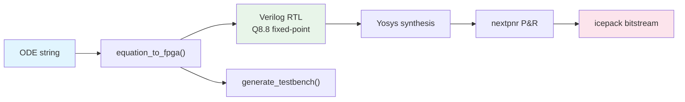

<!-- SPDX-License-Identifier: AGPL-3.0-or-later -->

# Tutorial 33: Equation-to-Verilog Compiler

SC-NeuroCore can compile arbitrary ODE strings into synthesizable Q8.8 fixed-point
Verilog RTL in a single function call. Write your neuron equations in Brian2-style
syntax, get both a Python simulation model and a Verilog module ready for FPGA.

## The Problem

Designing custom neuron models for FPGA requires:
1. Deriving fixed-point arithmetic for each equation
2. Writing Verilog with proper overflow handling
3. Verifying Python and Verilog produce identical results

The equation compiler automates all three steps.

## 1. One-Liner: ODE String to FPGA

```python
from sc_neurocore.compiler.equation_compiler import equation_to_fpga

# Define a simple LIF neuron as an ODE string
neuron, verilog = equation_to_fpga(
    "dv/dt = (-v + R*I) / tau",
    threshold="v > 1.0",
    reset="v = 0.0",
    params={"R": 1.0, "tau": 20.0},
    module_name="custom_lif",
)

# `neuron` is a Python EquationNeuron — simulate it
# I must exceed threshold (1.0) for the LIF to spike: steady state v = R*I
for t in range(200):
    spike = neuron.step(I=25.0)
    if spike:
        print(f"  Spike at t={t}")

# `verilog` is synthesizable Q8.8 SystemVerilog
with open("custom_lif.sv", "w") as f:
    f.write(verilog)
print(f"Generated {len(verilog)} chars of Verilog")
```

## 2. Multi-Variable ODEs

The compiler handles coupled differential equations:

```python
# FitzHugh-Nagumo (2 variables)
neuron, verilog = equation_to_fpga(
    "dv/dt = v - v**3/3 - w + I",
    "dw/dt = 0.08 * (v + 0.7 - 0.8*w)",
    threshold="v > 1.0",
    reset="v = -1.0",
    params={},
    module_name="fitzhugh_nagumo",
)

# Simulate and plot
import numpy as np
voltages = []
for t in range(1000):
    neuron.step(I=0.5)
    voltages.append(neuron.state["v"])
```

```python
# Izhikevich (fast spiking)
neuron, verilog = equation_to_fpga(
    "dv/dt = 0.04*v**2 + 5*v + 140 - u + I",
    "du/dt = a * (b*v - u)",
    threshold="v >= 30.0",
    reset="v = c; u = u + d",
    params={"a": 0.1, "b": 0.2, "c": -65.0, "d": 2.0},
    module_name="izhikevich_fs",
)
```

## 3. The EquationNeuron Class

Build custom neurons from equations without the Verilog step:

```python
from sc_neurocore.neurons.equation_builder import from_equations

neuron = from_equations(
    "dv/dt = (-v + I) / tau",
    threshold="v > 1.0",
    reset="v = 0.0",
    params={"tau": 10.0},
    dt=0.1,
)

# Same step()/reset() API as all 122 models
for t in range(500):
    spike = neuron.step(I=0.6)
```

## 4. Q8.8 Fixed-Point Arithmetic

The compiler converts floating-point equations to Q8.8 (16-bit signed,
8 fractional bits):

| Float value | Q8.8 representation | Range |
|-------------|---------------------|-------|
| 1.0 | 256 (0x0100) | |
| 0.5 | 128 (0x0080) | |
| -1.0 | -256 (0xFF00) | |
| Max | 127.996 | 32767 |
| Min | -128.0 | -32768 |
| Resolution | 1/256 = 0.00390625 | |

Multiplication: `(A * B) >> 8` with saturation.
The Verilog output includes explicit overflow clamping on every arithmetic operation.

## 5. AST-to-Verilog Expression Mapping

The compiler parses Python/Brian2 AST and emits Verilog:

| Python expression | Verilog output |
|---|---|
| `v + I` | `v_reg + I_in` |
| `v * 0.04` | `(v_reg * 16'd10) >>> 8` |
| `v ** 2` | `(v_reg * v_reg) >>> 8` |
| `v > 1.0` | `v_reg > 16'sd256` |
| `-v` | `(-v_reg)` |

## 6. Generate a Testbench

```python
from sc_neurocore.compiler.equation_compiler import equation_to_fpga, generate_testbench

# First create the neuron
neuron, verilog = equation_to_fpga(
    "dv/dt = (-v + R*I) / tau",
    threshold="v > 1.0", reset="v = 0.0",
    params={"R": 1.0, "tau": 20.0}, module_name="custom_lif",
)

# Generate testbench from the neuron
tb = generate_testbench(
    neuron,
    module_name="custom_lif",
    n_steps=200,
    input_current=0.8,
)
with open("tb_custom_lif.sv", "w") as f:
    f.write(tb)
```

## 7. CLI: One-Command Compile

The `sc-neurocore compile` command wraps the full pipeline into a single
invocation — ODE string to Verilog RTL to FPGA bitstream:

```bash
# Basic: ODE → Verilog
sc-neurocore compile "dv/dt = -(v - E_L)/tau_m + I/C" \
    --threshold "v > -50" --reset "v = -65" \
    --params "E_L=-65,tau_m=10,C=1" --init "v=-65" \
    -o build/my_lif

# With testbench
sc-neurocore compile "dv/dt = -(v - E_L)/tau_m + I/C" \
    --threshold "v > -50" --reset "v = -65" \
    --params "E_L=-65,tau_m=10,C=1" --init "v=-65" \
    --testbench -o build/my_lif

# Full pipeline: compile + synthesize (requires Yosys)
sc-neurocore compile "dv/dt = -(v - E_L)/tau_m + I/C" \
    --threshold "v > -50" --reset "v = -65" \
    --params "E_L=-65,tau_m=10,C=1" --init "v=-65" \
    --target ice40 --testbench --synthesize -o build/my_lif
```



Output:
```
[1/4] Parsing ODE: dv/dt = -(v - E_L)/tau_m + I/C
  State variables: ['v']
  Parameters: ['E_L', 'tau_m', 'C']
[2/4] Verilog written: build/my_lif/sc_equation_neuron.v
[3/4] Testbench written: build/my_lif/tb_sc_equation_neuron.v
[4/4] Synthesis complete
  Number of cells: 89
  Number of SB_LUT4: 73
  Synthesis JSON: build/my_lif/sc_equation_neuron.json
```

## 8. Transcendental Functions

The compiler supports transcendental functions via 16-entry Q8.8 lookup
tables. Each function is a piecewise constant indexed by the top 4 bits
of the unsigned input, covering the [-8, +8) range.

| Function | Python/Brian2 | Verilog | Accuracy |
|----------|--------------|---------|----------|
| `exp(x)` | `exp(v)` | 16-entry LUT | ~1-2% over [-3, 3] |
| `log(x)` | `log(v)` | 16-entry LUT | ~2-3% over [0.1, 8] |
| `sqrt(x)` | `sqrt(v)` | 16-entry LUT | ~1% over [0, 8] |
| `tanh(x)` | `tanh(v)` | 16-entry LUT | ~1% over [-3, 3] |
| `sigmoid(x)` | `sigmoid(v)` | 16-entry LUT | ~1% over [-4, 4] |
| `sin(x)` | `sin(v)` | 16-entry LUT | ~2% |
| `cos(x)` | `cos(v)` | 16-entry LUT | ~2% |
| `abs(x)` | `abs(v)` | ternary | exact |
| `clip(x, lo, hi)` | `clip(v, -1, 1)` | ternary | exact |
| `max(a, b)` | `max(v, 0)` | ternary | exact |
| `min(a, b)` | `min(v, 1)` | ternary | exact |

Example — Hodgkin-Huxley with exponentials:

```python
neuron, verilog = equation_to_fpga(
    "dv/dt = (I - g_Na*m**3*h*(v-E_Na) - g_K*n**4*(v-E_K) - g_L*(v-E_L)) / C_m",
    "dm/dt = alpha_m*(1-m) - beta_m*m",
    "dh/dt = alpha_h*(1-h) - beta_h*h",
    "dn/dt = alpha_n*(1-n) - beta_n*n",
    threshold="v > 0",
    reset="v = -65",
    params={"g_Na": 120, "g_K": 36, "g_L": 0.3,
            "E_Na": 50, "E_K": -77, "E_L": -54.4, "C_m": 1,
            "alpha_m": 0.1, "beta_m": 4.0,
            "alpha_h": 0.07, "beta_h": 1.0,
            "alpha_n": 0.01, "beta_n": 0.125},
    init={"v": -65, "m": 0.05, "h": 0.6, "n": 0.32},
    module_name="hh_neuron",
)
```

## 9. Saturating Arithmetic

All next-state updates include overflow protection:

```verilog
// Raw sum may exceed 16-bit range
wire signed [16:0] v_raw = v_reg + dv;
// Clamp to [-32768, 32767]
wire signed [15:0] v_next =
    (v_raw > 17'sd32767) ? 16'sd32767 :
    (v_raw < -17'sd32768) ? -16'sd32768 :
    v_raw[15:0];
```

Without saturation, integer overflow wraps around silently — a
neuron at +127 receiving +5 input would jump to -124 instead of
clamping at +127. The compiler prevents this automatically.

## Supported ODE Features

| Feature | Supported | Example |
|---------|-----------|---------|
| Linear terms | Yes | `-v / tau` |
| Polynomial (2-8) | Yes | `v**2`, `v**3`, `v**4` |
| Products | Yes | `a * b * v` |
| Addition/subtraction | Yes | `v - w + I` |
| Transcendentals | Yes | `exp(v)`, `tanh(v)`, `sigmoid(v)`, `sin(x)`, `cos(x)` |
| abs / clip / max / min | Yes | `abs(v)`, `clip(v, -1, 1)` |
| Threshold comparison | Yes | `v > 1.0`, `v >= 30` |
| Multi-variable reset | Yes | `v = c; u = u + d` |
| Named parameters | Yes | `tau`, `a`, `b`, `c`, `d` |
| External input | Yes | `I` (injected per step) |
| Saturating overflow | Yes | automatic on all additions |

## Further Reading

- [Tutorial 09: Hardware Co-simulation](09_hardware_cosimulation.md) — verify Python vs Verilog
- [Tutorial 13: Fixed-Point Arithmetic](13_fixed_point_design.md) — Q8.8 details
- [API: Compiler](../api/compiler.md) — auto-generated API docs
- [Hardware Guide](../hardware/HARDWARE_GUIDE.md) — FPGA deployment

## Interactive Notebook

Run the hands-on notebook: [`notebooks/08_equation_to_verilog.ipynb`](https://github.com/anulum/sc-neurocore/blob/main/notebooks/08_equation_to_verilog.ipynb)
