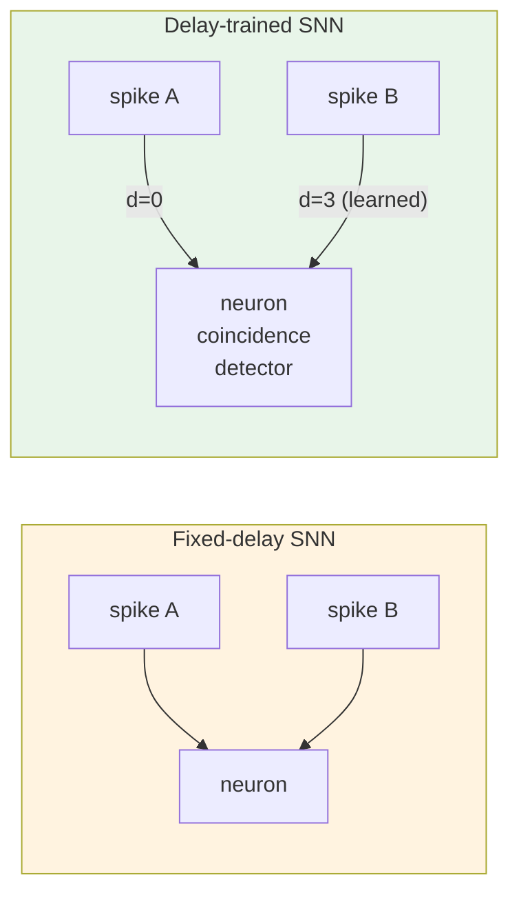

<!-- SPDX-License-Identifier: AGPL-3.0-or-later -->

# Tutorial 39: Learnable Delays — Train Temporal Structure

SC-NeuroCore supports trainable per-synapse delays in PyTorch surrogate
gradient training. Each connection has a weight AND a delay — both
optimized by backpropagation. Delays are differentiable via linear
interpolation between integer delay bins.

## Why Learnable Delays?

Standard SNNs have fixed delays (or none). Adding trainable delays lets
the network learn temporal structure: which input spikes should arrive
simultaneously (for coincidence detection) and which should be staggered
(for sequence recognition). Research shows delays can replace entire
layers — same accuracy with fewer parameters.

```
    Standard SNN (no delays)         With trainable delays
    ─────────────────────────         ───────────────────────
    input A ──┐                      input A ──[d=0]──┐
              ├──→ neuron                              ├──→ neuron
    input B ──┘                      input B ──[d=3]──┘

    A and B arrive simultaneously    B arrives 3 timesteps later
    → only rate matters              → timing encodes information
```



## 1. DelayLinear Module

```python
import torch
from sc_neurocore.training.delay_linear import DelayLinear

layer = DelayLinear(
    in_features=64,
    out_features=32,
    max_delay=16,      # delays in [0, 16) timesteps
    learn_delay=True,  # make delays trainable
    init_delay=2.0,    # initial delay for all synapses
)

print(f"Parameters: {sum(p.numel() for p in layer.parameters())}")
# Weight: 64*32 = 2048, Delay: 64*32 = 2048 → 4096 total
```

## 2. Training Loop

```python
import torch.nn as nn
from sc_neurocore.training.surrogate import atan_surrogate

# Simple delayed SNN: input → DelayLinear → LIF → output
delay_layer = DelayLinear(10, 5, max_delay=8, init_delay=1.5)
optimizer = torch.optim.Adam(delay_layer.parameters(), lr=0.01)

for epoch in range(100):
    delay_layer.reset()  # clear spike history between sequences
    v = torch.zeros(5)

    total_spikes = torch.zeros(5)
    for t in range(20):
        x = torch.randn(10) * (0.5 if t < 5 else 0.0)  # input burst
        current = delay_layer.step(x)
        v = 0.9 * v + current
        spike = atan_surrogate(v - 1.0)
        v = v - spike.detach()
        total_spikes = total_spikes + spike

    loss = -total_spikes[0]  # maximize first neuron's spikes
    optimizer.zero_grad()
    loss.backward()
    optimizer.step()
```

## 3. Export Trained Delays to Hardware

```python
import numpy as np

# Integer delays for Verilog deployment
int_delays = delay_layer.delays_int
print(f"Learned delays: {int_delays}")

# Flat array for Projection(delay=array)
delay_array = delay_layer.to_nir_delay_array()

# Use in network engine
from sc_neurocore.network.projection import Projection
proj = Projection(src_pop, tgt_pop, weight=0.1, delay=delay_array)
```

## 4. How Differentiable Delays Work

For each synapse connecting input i to output j with delay d:

```
delayed_input[j] = sum_i W[j,i] * interp(history, t - D[j,i])
```

Where `interp` linearly interpolates between integer delay bins:

```
interp(history, t - 2.3) = 0.7 * history[t-2] + 0.3 * history[t-3]
```

This makes the delay parameter D differentiable: the gradient tells
the optimizer whether to increase or decrease the delay.

## 5. Per-Synapse Delays in the Network Engine

The trained delays integrate with the simulation engine:

```python
from sc_neurocore.network.population import Population
from sc_neurocore.network.projection import Projection

pop_a = Population(HodgkinHuxleyNeuron, n=10, label="a")
pop_b = Population(HodgkinHuxleyNeuron, n=5, label="b")

# Per-synapse delays from training
delays = delay_layer.to_nir_delay_array()
proj = Projection(pop_a, pop_b, weight=0.1, delay=delays)

print(f"Delay mode: {proj.delay_mode}")   # "per_synapse"
print(f"Max delay: {proj.max_delay}")     # max of learned delays
```

## Further Reading

- [Tutorial 31: Network Simulation Engine](31_network_simulation_engine.md) — Projection API
- [Tutorial 30: NIR Bridge](30_nir_bridge.md) — export with delays
- [API: Delay Training](../api/delay_training.md) — auto-generated API docs
- Hammouamri et al. 2023 — "Learning Delays in SNNs using DCLS"
